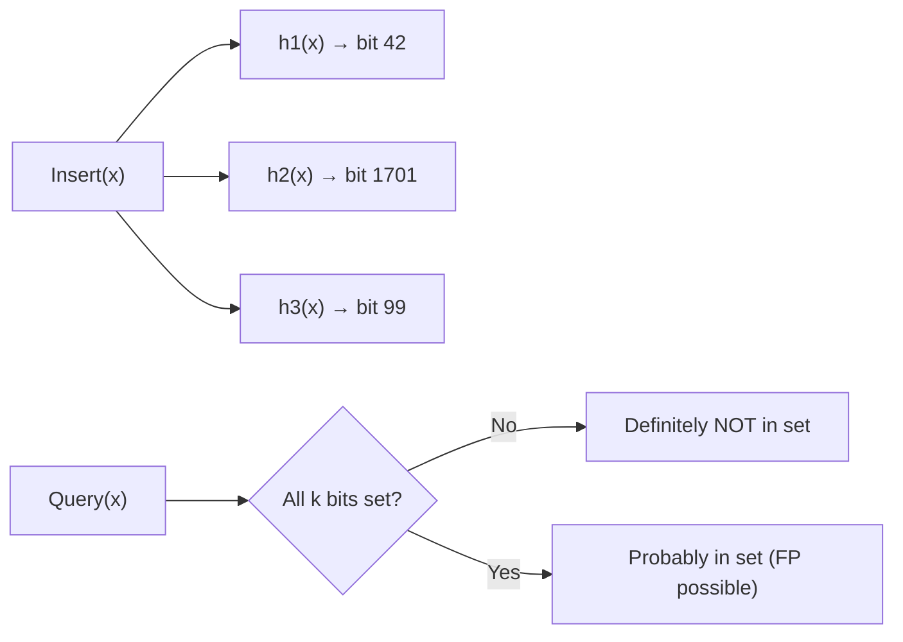

# Advanced Patterns

> **Core idea:** range-query structures and the techniques that show up in hard problems — the home for everything that does not fit the core topics.
> **Recognise it when:** "range sum / min / max with updates", "events at coordinates", "count inversions", "overlapping intervals", "offline queries on a static array".
> **Costs:** Fenwick `O(log n)` update/query · Segment tree `O(log n)` · Sparse table `O(1)` query (static only) · Sweep line `O(n log n)`.

---

## Mental Model

The core question is always: **what queries do I need, and does the data change?**

- If data is **static**, lean toward prefix sum (sum) or sparse table (min/max).
- If data has **point updates**, use Fenwick (sum/XOR) or segment tree (any aggregate).
- If data has **range updates**, use difference array (offline) or lazy segment tree (online).
- If **coordinates are huge**, compress them first; then use Fenwick or segment tree over compressed indices.
- If **events arrive in order**, sweep line collapses range problems into a single sorted scan.

---

## Range Query Decision Guide

| Scenario | Best tool | Build | Query | Update |
| -------- | --------- | ----- | ----- | ------ |
| Static array, range sum | **Prefix sum** | O(n) | **O(1)** | O(n) rebuild |
| Static array, range min/max | **Sparse table** | O(n log n) | **O(1)** | ❌ no updates |
| Point update + prefix sum | **Fenwick tree** | O(n) | O(log n) | O(log n) |
| Point update + any associative aggregate | **Segment tree** | O(n) | O(log n) | O(log n) |
| Range update + range query (online) | **Lazy segment tree** | O(n) | O(log n) | O(log n) |
| Range update + point query (offline) | **Difference array** | O(n) | O(n) scan | O(1) |
| Range update + point query (online) | **Fenwick on diffs** | O(n) | O(log n) | O(log n) |
| 2D range sum | **2D prefix sum** | O(mn) | O(1) | O(mn) rebuild |
| 2D point update + range sum | **2D Fenwick tree** | O(mn log mn) | O(log² n) | O(log² n) |

---

## Complexity Reference

| Structure | Build | Point Update | Range Update | Range Query | Space |
| --------- | ----- | ------------ | ------------ | ----------- | ----- |
| Prefix sum | O(n) | O(n) rebuild | O(n) rebuild | **O(1)** | O(n) |
| Difference array | O(n) | O(1) | O(1) | O(n) scan | O(n) |
| Fenwick tree | O(n) | O(log n) | O(log n) | O(log n) | O(n) |
| Segment tree | O(n) | O(log n) | O(n) naive | O(log n) | O(4n) |
| Segment tree + lazy | O(n) | O(log n) | **O(log n)** | O(log n) | O(8n) |
| Sparse table | O(n log n) | ❌ | ❌ | **O(1)** | O(n log n) |

---

## Templates

### Segment Tree — Build / Point Update / Range Query

Use when: point updates + any associative aggregate (sum, min, max, GCD).

```csharp
// Time: Build O(n), Query O(log n), Update O(log n). Space: O(4n).
class SegmentTree
{
    private readonly long[] _tree;
    private readonly int _n;

    public SegmentTree(int[] arr)
    {
        _n = arr.Length;
        _tree = new long[4 * _n];
        Build(arr, 0, 0, _n - 1);
    }

    private void Build(int[] arr, int node, int start, int end)
    {
        if (start == end) { _tree[node] = arr[start]; return; }
        int mid = (start + end) / 2;
        Build(arr, 2 * node + 1, start, mid);
        Build(arr, 2 * node + 2, mid + 1, end);
        _tree[node] = _tree[2 * node + 1] + _tree[2 * node + 2]; // swap for min/max/gcd
    }

    // Range sum [l, r] (0-indexed)
    public long Query(int l, int r) => Query(0, 0, _n - 1, l, r);

    private long Query(int node, int start, int end, int l, int r)
    {
        if (r < start || end < l) return 0;             // identity for sum; int.MaxValue for min
        if (l <= start && end <= r) return _tree[node]; // fully covered
        int mid = (start + end) / 2;
        return Query(2 * node + 1, start, mid, l, r)
             + Query(2 * node + 2, mid + 1, end, l, r);
    }

    // Point update: set arr[idx] = val
    public void Update(int idx, long val) => Update(0, 0, _n - 1, idx, val);

    private void Update(int node, int start, int end, int idx, long val)
    {
        if (start == end) { _tree[node] = val; return; }
        int mid = (start + end) / 2;
        if (idx <= mid) Update(2 * node + 1, start, mid, idx, val);
        else            Update(2 * node + 2, mid + 1, end, idx, val);
        _tree[node] = _tree[2 * node + 1] + _tree[2 * node + 2];
    }
}
```

> **Why it works:** each node covers exactly `[start, end]`; children split at `mid`. The tree has at most `4n` nodes for an array of size `n` (a safe upper bound). Array size `2n` fails for non-power-of-two inputs — always allocate `4n`.

**Swapping the merge function:**

| Aggregate | Merge line | Identity (out-of-range return) |
| --------- | ---------- | ------------------------------ |
| Sum | `_tree[node] = left + right` | `0` |
| Min | `_tree[node] = Math.Min(left, right)` | `int.MaxValue` |
| Max | `_tree[node] = Math.Max(left, right)` | `int.MinValue` |
| GCD | `_tree[node] = GCD(left, right)` | `0` |

**Iterative variant:** bottom-up iterative segment tree uses a `2n` array indexed from `n` (leaves at `[n..2n-1]`), avoids recursion overhead. Use when constant factor matters in competitive programming.

---

### Lazy Propagation — Range Add + Range Sum

Use when: range updates (add delta to all elements in `[l, r]`) plus range sum queries.

```csharp
// Time: Build O(n), Range Update O(log n), Range Query O(log n). Space: O(8n).
class LazySegTree
{
    private readonly long[] _tree, _lazy;
    private readonly int _n;

    public LazySegTree(int[] arr)
    {
        _n = arr.Length;
        _tree = new long[4 * _n];
        _lazy = new long[4 * _n];
        Build(arr, 0, 0, _n - 1);
    }

    private void Build(int[] arr, int node, int start, int end)
    {
        if (start == end) { _tree[node] = arr[start]; return; }
        int mid = (start + end) / 2;
        Build(arr, 2 * node + 1, start, mid);
        Build(arr, 2 * node + 2, mid + 1, end);
        _tree[node] = _tree[2 * node + 1] + _tree[2 * node + 2];
    }

    private void PushDown(int node, int start, int end)
    {
        if (_lazy[node] == 0) return;
        int mid = (start + end) / 2;
        int lc = 2 * node + 1, rc = 2 * node + 2;
        _tree[lc] += _lazy[node] * (mid - start + 1);
        _tree[rc] += _lazy[node] * (end - mid);
        _lazy[lc] += _lazy[node];
        _lazy[rc] += _lazy[node];
        _lazy[node] = 0;
    }

    // Add delta to every element in [l, r]
    public void RangeAdd(int l, int r, long delta) => RangeAdd(0, 0, _n - 1, l, r, delta);

    private void RangeAdd(int node, int start, int end, int l, int r, long delta)
    {
        if (r < start || end < l) return;
        if (l <= start && end <= r)
        {
            _tree[node] += delta * (end - start + 1);
            _lazy[node] += delta;
            return;
        }
        PushDown(node, start, end);
        int mid = (start + end) / 2;
        RangeAdd(2 * node + 1, start, mid, l, r, delta);
        RangeAdd(2 * node + 2, mid + 1, end, l, r, delta);
        _tree[node] = _tree[2 * node + 1] + _tree[2 * node + 2];
    }

    public long Query(int l, int r) => Query(0, 0, _n - 1, l, r);

    private long Query(int node, int start, int end, int l, int r)
    {
        if (r < start || end < l) return 0;
        if (l <= start && end <= r) return _tree[node];
        PushDown(node, start, end);
        int mid = (start + end) / 2;
        return Query(2 * node + 1, start, mid, l, r)
             + Query(2 * node + 2, mid + 1, end, l, r);
    }
}
```

> **Why it works:** `_tree[node]` stores the **actual** (already-applied) sum for its range. The `_lazy[node]` stores a **pending per-element delta** not yet distributed to children. Before descending into children we push down — this ensures children always see the correct value.

---

### Fenwick Tree (Binary Indexed Tree)

Use when: point updates + prefix sum (or range sum via `query(r) − query(l−1)`).

```csharp
// Time: Build O(n), Update O(log n), Query O(log n). Space: O(n).
class FenwickTree
{
    private readonly long[] _bit;
    private readonly int _n;

    // O(n) construction — faster than n individual updates
    public FenwickTree(int[] arr)
    {
        _n = arr.Length;
        _bit = new long[_n + 1];
        for (int i = 0; i < _n; i++)
        {
            _bit[i + 1] += arr[i];
            int parent = (i + 1) + ((i + 1) & -(i + 1));
            if (parent <= _n) _bit[parent] += _bit[i + 1];
        }
    }

    public FenwickTree(int n) { _n = n; _bit = new long[n + 1]; }

    // Add delta to index i (1-indexed externally; convert 0-indexed with i+1)
    public void Update(int i, long delta)           // i is 1-indexed
    {
        for (; i <= _n; i += i & -i) _bit[i] += delta;
    }

    // Prefix sum [1..i]
    public long Query(int i)                        // i is 1-indexed
    {
        long sum = 0;
        for (; i > 0; i -= i & -i) sum += _bit[i];
        return sum;
    }

    // Range sum [l..r] (1-indexed)
    public long RangeQuery(int l, int r) => Query(r) - Query(l - 1);
}
```

> **`x & -x` (lowest set bit):** isolates the rightmost set bit of `x`. Update walks *up* by adding it; query walks *down* by removing it. See [Bit and Maths](../BitAndMaths/BitAndMaths.md) for the two's complement explanation.

**Key requirements and variants:**

- **1-indexed only.** Always convert 0-indexed input with `i + 1`. Passing `i = 0` causes an infinite loop.
- **Range-update / point-query variant:** to add `delta` to `[l, r]` and later query a single point: call `Update(l, delta)` and `Update(r+1, -delta)`. Point value at position `i` = `Query(i)`.
- **2D Fenwick:** nest two BITs; update and query both loop on row then column. O(log² n) per operation.
- **O(n) construction** is faster than calling `Update` n times (O(n log n)).

---

### Sparse Table — Static Range Min/Max

Use when: many range min/max queries on a **static** (never updated) array.

```csharp
// Time: Build O(n log n), Query O(1). Space: O(n log n).
class SparseTable
{
    private readonly int[,] _table;
    private readonly int[] _log2;
    private readonly int _n;

    public SparseTable(int[] arr)
    {
        _n = arr.Length;
        int maxLog = (int)Math.Log2(_n) + 1;
        _table = new int[maxLog, _n];
        _log2 = new int[_n + 1];

        // Precompute log2
        for (int i = 2; i <= _n; i++) _log2[i] = _log2[i / 2] + 1;

        // Base case: window of size 1
        for (int i = 0; i < _n; i++) _table[0, i] = arr[i];

        // Fill: _table[j, i] = min of [i, i + 2^j - 1]
        for (int j = 1; j < maxLog; j++)
            for (int i = 0; i + (1 << j) <= _n; i++)
                _table[j, i] = Math.Min(_table[j - 1, i], _table[j - 1, i + (1 << (j - 1))]);
    }

    // Range minimum query [l, r] — O(1) via overlapping windows
    public int QueryMin(int l, int r)
    {
        int k = _log2[r - l + 1];
        return Math.Min(_table[k, l], _table[k, r - (1 << k) + 1]);
    }
}
```

> **Why O(1) works:** pick the largest power-of-two window `k` that fits in `[l, r]`. Two overlapping windows of size `2^k` always cover `[l, r]` exactly. Min is **idempotent** (min(a, a) = a), so overlap doesn't corrupt the answer. GCD is also idempotent; sum is not.

---

### Sweep Line / Event-Based Processing

Use when: intervals, coordinates, or events must be processed in sorted order — "max concurrent intervals", "rectangle union area", skyline.

**Core pattern:**

```text
For each interval [start, end]:
    events.Add((start, +1))   // open event
    events.Add((end,   -1))   // close event

Sort events by coordinate.
Tie-break: process CLOSE before OPEN at the same coordinate
            if intervals are half-open [start, end).
            Process OPEN before CLOSE if they are closed [start, end].

Scan events, maintaining running state (count, active set, multiset).
```

**Three standard applications:**

| Application | State maintained | Data structure |
| ----------- | ---------------- | -------------- |
| Max concurrent intervals | running count | integer |
| The Skyline Problem | active building heights | sorted multiset / max-heap |
| Rectangle area union | active x-segments | coordinate-compressed Fenwick |

```csharp
// Max concurrent intervals (Car Pooling / Meeting Rooms II)
// Time: O(n log n). Space: O(n).
public int MaxOverlap(int[][] intervals)
{
    var events = new List<(int pos, int delta)>();
    foreach (var iv in intervals)
    {
        events.Add((iv[0], +1));
        events.Add((iv[1], -1));   // half-open: passenger leaves at end
    }
    // Sort by position; for tie: close (-1) before open (+1)
    events.Sort((a, b) => a.pos != b.pos ? a.pos.CompareTo(b.pos) : a.delta.CompareTo(b.delta));

    int cur = 0, max = 0;
    foreach (var (_, delta) in events)
    {
        cur += delta;
        max = Math.Max(max, cur);
    }
    return max;
}
```

> **Tie-breaking rule:** if an interval ends and another starts at the same coordinate and they are **half-open** (`[start, end)`), sort close (−1) before open (+1) so the departing load is subtracted before the new load is added. For **closed** intervals `[start, end]`, invert the tie-break.

---

### Coordinate Compression

Use when: values span a large range (e.g. 1 to 10⁹) but only `n` distinct values appear. Compress to `[0, n)` indices before building a Fenwick or segment tree.

```csharp
// Time: O(n log n). Space: O(n).
public int[] Compress(int[] arr)
{
    int[] sorted = arr.Distinct().OrderBy(x => x).ToArray();
    var rank = new Dictionary<int, int>();
    for (int i = 0; i < sorted.Length; i++) rank[sorted[i]] = i + 1; // 1-indexed for Fenwick
    return arr.Select(x => rank[x]).ToArray();
}

// Alternative: binary search on sorted array
public int Rank(int[] sorted, int val) =>
    Array.BinarySearch(sorted, val) + 1; // 1-indexed
```

> **Trap:** compression removes gaps. If the problem cares about "are there values strictly between A and B", use the sorted array to count distinct compressed values in range rather than assuming index difference = value difference.

---

## Pattern Recognition

| Problem says… | Reach for | Why |
| ------------- | --------- | --- |
| "range sum query, no updates" | Prefix sum | O(1) query after O(n) build |
| "range sum query, point updates" | Fenwick tree | simpler than seg tree |
| "range min/max, no updates, many queries" | Sparse table | O(1) query |
| "range query with updates, non-sum aggregate" | Segment tree | flexible merge function |
| "range update + range query" | Lazy segment tree | O(log n) both |
| "range update, point query only" | Difference array | O(1) update |
| "max active intervals at any time" | Sweep line (events) | sort + scan |
| "skyline / rectangle union" | Sweep line + heap/multiset | process by x-coordinate |
| "count inversions" | Fenwick + coord compression | point updates + prefix queries |
| "LIS via Fenwick" | Fenwick + coord compression | O(n log n) alternative to DP |
| "values up to 10⁹ in a Fenwick/seg tree" | Coordinate compression | map to [1..n] first |
| "connected components / cycle detection" | DSU | see Graphs |
| "monotonic stack / sliding window max" | Monotonic structures | see [Stacks and Queues](../StacksAndQueues/StacksAndQueues.md) |

---

## Variants and Differences

### Prefix Sum vs Fenwick vs Segment Tree

| Aspect | Prefix Sum | Fenwick Tree | Segment Tree |
| ------ | ---------- | ------------ | ------------ |
| Build | O(n) | O(n) | O(n) |
| Point update | O(n) rebuild | **O(log n)** | **O(log n)** |
| Range query | **O(1)** | O(log n) | O(log n) |
| Range update | O(1) diff array | O(log n) | O(log n) lazy |
| Supported aggregates | Sum only | Sum, XOR | **Any (min, max, GCD, sum)** |
| Code complexity | ✅ Simple | Medium | Complex |
| Space | O(n) | O(n) | O(4n) |
| Best for | Static array, range sum | Point updates + prefix sum | Any dynamic range aggregate |

---

## DSU (Union-Find)

See [Graphs](../Graphs/Graphs.md) for the full C# implementation with path compression and union by rank.

Key applications:

| Application | How DSU is used |
| ----------- | --------------- |
| Connected components | Union nodes, count roots |
| Cycle detection | Union edge; returns false = cycle exists |
| Kruskal's MST | Union edge; skip if already same component |
| Accounts merge | Union same emails → same account |
| Redundant connection | First `Union` returning false |
| Smallest string with swaps | Same component = can permute freely |

DSU with path compression + union by rank: O(α(n)) ≈ O(1) amortised.

---

## LRU / LFU

See [Linked Lists](../LinkedLists/LinkedLists.md) — full implementations live there.

- **LRU**: `Dictionary<key,Node>` + doubly-linked list. O(1) all ops.
- **LFU**: two hash maps + frequency-bucketed linked lists. O(1) all ops.

---

## Matrix Exponentiation

Use when: computing the n-th term of a linear recurrence (Fibonacci, staircase) in O(log n).

```text
Fibonacci: [F(n+1), F(n)] = [[1,1],[1,0]]^n · [F(1), F(0)]

Matrix multiply two 2×2 matrices: 4 dot products → O(1) per level.
Repeated squaring: O(log n) multiplications.
Overall: O(k³ log n) where k = matrix dimension (k=2 for Fibonacci).
```

> **When to use:** n up to 10¹⁸ where standard DP O(n) is too slow. The recurrence must be **linear** (each term is a fixed linear combination of previous terms).

---

## Meet in the Middle

For subset-sum-style problems over n ≤ 40 where 2ⁿ is too slow but 2^(n/2) ≈ 10⁶ is fine: split the input in half, enumerate all subsets of each half, then combine.

See [Greedy and Backtracking](../GreedyAndBacktracking/GreedyAndBacktracking.md) for the full technique and template.

---

## Design-Round Crossover — Probabilistic and Large-Scale Structures

> These structures appear in system-design interviews and occasionally in hard LeetCode problems. They are **not** core LeetCode material.

### Bloom Filter

**Concept:** m-bit array + k hash functions. On insert: set k bits. On query: check all k bits — any 0 → definitely absent; all 1 → probably present (false positive possible, false negative impossible).

- **False positive rate:** `p ≈ (1 − e^(−kn/m))^k`
- **Optimal k:** `k = (m/n) · ln 2 ≈ 0.693 · m/n`
- **Sizing:** `m = −n · ln(p) / (ln 2)²` bits for desired FP rate p
- **Example:** 1 M items, 1% FP → `m ≈ 9.6 M bits ≈ 1.2 MB`



**Production uses:** Cassandra / RocksDB (skip SSTable disk reads for missing keys), CDN cache checks, Redis cache stampede protection, web-crawler URL deduplication.

### Count-Min Sketch

**Concept:** d × w integer array + d independent hash functions. Insert: increment `table[i][hᵢ(x)]` for each row. Query: return `min(table[i][hᵢ(x)])`.

- Never underestimates; overestimates by at most ε · N with probability 1 − δ.
- `w = ⌈e/ε⌉`, `d = ⌈ln(1/δ)⌉`. Space: O(ε⁻¹ · log(1/δ)).
- **Uses:** network flow analysis, top-k heavy hitters (with min-heap), Flink/Redis event counting.

### HyperLogLog

**Concept:** estimates cardinality (distinct count) using ≈ 12 KB regardless of data size. Error ≈ 1.04/√m where m = registers.

- Redis `PFADD` / `PFCOUNT`. 100 M unique items → 12 KB, ~0.8% error.

### Skip List

- Probabilistic linked list with express lanes. Expected O(log n) search / insert / delete.
- Redis `ZSET` uses a skip list. Simpler than balanced BST (no rotations).

### B+Tree vs LSM Tree

| Aspect | B+Tree | LSM Tree |
| ------ | ------ | -------- |
| Structure | Balanced, all data in leaves | In-memory buffer + immutable SSTables |
| Write | O(log n), in-place | **O(1) amortised** (append-only) |
| Read | **O(log n)** | O(log n) + compaction overhead |
| Write amplification | Low | High (compaction rewrites data) |
| Best for | Read-heavy (InnoDB, Postgres) | Write-heavy (Cassandra, RocksDB) |

---

## Pitfalls

- **Fenwick 1-indexing off-by-one:** the BIT is 1-indexed internally. Passing index `0` to `Update` or `Query` causes an infinite loop. Always offset: `Update(i + 1, delta)` when working with 0-indexed arrays.
- **Segment tree array size:** allocate `4 * n`, never `2 * n`. For non-power-of-two `n`, the implicit tree can spill into indices beyond `2n`.
- **Forgetting to push down lazy before recursing:** if you query or update a child node without calling `PushDown` first, the child's value is stale. Every internal visit must call `PushDown` before touching children.
- **Sweep-line tie-breaking:** when an interval ends exactly where another starts, the correct tie-break depends on whether intervals are open or closed at the endpoint. Getting this wrong causes off-by-one in max-overlap counts.
- **Coordinate compression losing gaps:** compression maps values to consecutive integers; the gap between two original values disappears. Problems that ask "how many integers strictly between A and B" require working in compressed + original space carefully.
- **`int` overflow in range sums:** with n = 10⁵ elements each up to 10⁹, a range sum can reach 10¹⁴ — use `long` in Fenwick and segment tree `_tree` arrays.
- **Sparse table for mutable arrays:** sparse table has no update operation. Any modification requires a full O(n log n) rebuild.
- **Lazy propagation identity element:** the "no pending update" sentinel must be the identity of the operation (0 for add, 1 for multiply, `int.MinValue` for set-max). Using 0 as sentinel for a "range set" lazy tree is wrong.

---

## Practice

See [Problems.md](Problems.md) for annotated solutions.

| # | Problem | Pattern | Difficulty |
| - | ------- | ------- | ---------- |
| 303 | Range Sum Query — Immutable | Prefix sum | Easy |
| 304 | Range Sum Query 2D — Immutable | 2D prefix sum | Medium |
| 307 | Range Sum Query — Mutable | Fenwick / Segment tree | Medium |
| 315 | Count of Smaller Numbers After Self | Fenwick + coord compress | Hard |
| 327 | Count of Range Sum | Fenwick + coord compress | Hard |
| 218 | The Skyline Problem | Sweep line + heap | Hard |
| 729 | My Calendar I | Binary search / sweep | Medium |
| 731 | My Calendar II | Sweep line | Medium |
| 732 | My Calendar III | Segment tree lazy | Hard |
| 253 | Meeting Rooms II | Sweep line | Medium |
| 1094 | Car Pooling | Difference array / sweep | Medium |
| 1109 | Corporate Flight Bookings | Difference array | Medium |
| 300 | LIS (Fenwick variant) | Fenwick + coord compress | Medium |
| 850 | Rectangle Area II | Sweep line + coord compress | Hard |
