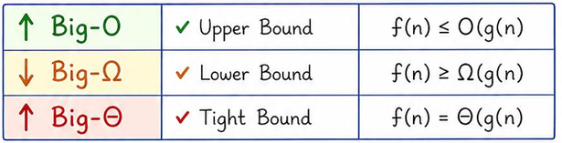

# Complexity Analysis

> **Core idea:** Complexity measures how resource usage grows with input size — it's the single most important tool for choosing and justifying algorithms in an interview.
> **Recognise it when:** interviewer asks "what's the complexity?", "can you do better?", "why is this efficient?", or constraints hint at an expected time budget.
> **Costs:** analysis itself is O(1) mental effort if you have the right mental models.

## Mental Model

Complexity is about **asymptotic growth**, not exact counts. Two truths drive everything:

1. **Big-O, Θ, Ω are bounds on a *function*, not on a case.** They describe how tight a bound is.
2. **Best/average/worst case describe *which input* you feed the algorithm.** They are orthogonal.

The common mis-statement "best case = Ω, worst case = O" is **wrong**. You can say O(n) for the best case, or Ω(n²) for the worst case — the notations are independent.

In practice, interviewers say "what's the complexity?" and mean **O of the worst case** because:
- O is an upper bound (safe guarantee).
- Worst case is the hardest input (honest guarantee).
Together they give a worst-case upper bound, which is what matters for correctness under adversarial inputs.



## Complexity Reference

### Asymptotic Notation

| Notation | Meaning | Formal definition | Interview use |
| -------- | ------- | ----------------- | ------------- |
| **O(f)** | Upper bound | ∃ c, n₀: T(n) ≤ c·f(n) for all n ≥ n₀ | "At most this fast in the worst case" |
| **Ω(f)** | Lower bound | ∃ c, n₀: T(n) ≥ c·f(n) for all n ≥ n₀ | "At least this fast / this is a lower bound on any algorithm" |
| **Θ(f)** | Tight bound | Both O(f) and Ω(f) hold | "Exactly this rate" — use when you know both bounds match |

> **Key insight:** When the interviewer asks "can you do better?", you answer by citing the **algorithmic lower bound** — e.g. comparison sorting is Ω(n log n), reading all input is Ω(n). If your algorithm matches the lower bound, it is optimal.

### Growth Rate Table

| Complexity | Name | n = 10 | n = 100 | n = 1 000 | n = 10⁶ |
| ---------- | ---- | ------ | ------- | --------- | ------- |
| O(1) | Constant | 1 | 1 | 1 | 1 |
| O(log n) | Logarithmic | 3 | 7 | 10 | 20 |
| O(n) | Linear | 10 | 100 | 1 000 | 10⁶ |
| O(n log n) | Linearithmic | 33 | 664 | 10 000 | 2×10⁷ |
| O(n²) | Quadratic | 100 | 10 000 | 10⁶ | 10¹² |
| O(2ⁿ) | Exponential | 1 024 | 10³⁰ | 10³⁰¹ | — |
| O(n!) | Factorial | 3.6×10⁶ | 9×10¹⁵⁷ | — | — |

> **Rule of thumb:** CPUs do ~10⁸ simple ops/sec. Budget 1–2 seconds → ~10⁸ ops.

### Constraint → Algorithm Budget

| Input size n | Target complexity | Reach for |
| ------------ | ----------------- | --------- |
| n ≤ 12 | O(n!) | Permutation backtracking |
| n ≤ 20 | O(2ⁿ) | Bitmask DP, meet-in-the-middle |
| n ≤ 400 | O(n³) | Floyd-Warshall, interval DP |
| n ≤ 3 000 | O(n²) | Two nested loops, O(n²) DP |
| n ≤ 10⁵ | O(n log n) | Sort, binary search, segment tree, heap |
| n ≤ 10⁶ | O(n) | Two pointers, sliding window, prefix sum |
| n ≤ 10⁷ | O(n) tight | Single linear scan, no extra log factor |
| n ≤ 10¹⁸ | O(log n) | Binary search on answer, fast exponentiation |

See [Pattern and Tricks](../PatternAndTricks/PatternAndTricks.md) for the cross-topic pattern map.

## Deriving Complexity

### Sequential and Branching Code

```text
statements in sequence   → add complexities, keep dominant term
if/else                  → take the max of the branches
function call            → substitute its complexity
```

### Loops

```csharp
// O(n)
for (int i = 0; i < n; i++) { /* O(1) body */ }

// O(log n) — loop variable multiplied/divided each iteration
for (int i = 1; i < n; i *= 2) { /* O(1) body */ }

// O(n²) — independent nested loops
for (int i = 0; i < n; i++)
    for (int j = 0; j < n; j++) { /* O(1) */ }

// O(n²) — dependent bounds: inner runs n-i times → sum = n(n-1)/2
for (int i = 0; i < n; i++)
    for (int j = i; j < n; j++) { /* O(1) */ }

// O(n log n) — outer O(n), inner O(log n)
for (int i = 0; i < n; i++)
    for (int j = 1; j < n; j *= 2) { /* O(1) */ }
```

### Recursion Trees

Write the recurrence, draw one level, then generalise:

```text
T(n) = 2·T(n/2) + O(n)          ← merge sort

Level 0: 1 node  × O(n)    = O(n)
Level 1: 2 nodes × O(n/2)  = O(n)
Level 2: 4 nodes × O(n/4)  = O(n)
...
Level k: 2^k nodes × O(n/2^k) = O(n)

Depth = log₂n → total = O(n log n)
```

When the work per level is **not constant**, sum the geometric series:
- Geometric series with ratio < 1 → O(bottom-level work) (e.g. Strassen, ratio 7/8 < 1 → dominated by top)
- Ratio > 1 → dominated by leaves
- Ratio = 1 → multiply by depth

### Master Theorem

For **`T(n) = a·T(n/b) + f(n)`** where a ≥ 1, b > 1:

Let **p = log_b(a)** (the "watershed exponent").

| Case | Condition | Result | Intuition |
| ---- | --------- | ------ | --------- |
| **1** | f(n) = O(nᵖ⁻ᵉ) for some ε > 0 | **T(n) = Θ(nᵖ)** | Subproblems dominate |
| **2** | f(n) = Θ(nᵖ · logᵏn), k ≥ 0 | **T(n) = Θ(nᵖ · logᵏ⁺¹n)** | Work evenly distributed |
| **3** | f(n) = Ω(nᵖ⁺ᵉ) AND a·f(n/b) ≤ c·f(n), c < 1 | **T(n) = Θ(f(n))** | Top level dominates |

> **Trap:** Case 3 requires the **regularity condition** `a·f(n/b) ≤ c·f(n)`. Most polynomial f(n) satisfy it; always verify for non-standard f.

> **When Master Theorem does not apply** (e.g. T(n) = T(n-1) + O(n), T(n) = T(√n) + …): use the **recursion tree method** — draw levels, count work per level, sum.

### Common Recurrences Cheat Table

| Algorithm | Recurrence | a, b, p | Case | Result |
| --------- | ---------- | ------- | ---- | ------ |
| Binary search | T(n) = T(n/2) + O(1) | 1, 2, 0 | 2 (k=0) | **O(log n)** |
| Merge sort | T(n) = 2T(n/2) + O(n) | 2, 2, 1 | 2 (k=0) | **O(n log n)** |
| Quicksort avg | T(n) = 2T(n/2) + O(n) | 2, 2, 1 | 2 | **O(n log n)** |
| Quicksort worst | T(n) = T(n-1) + O(n) | — | tree | **O(n²)** |
| DFS/BFS | T(n) = O(V + E) | — | — | **O(V + E)** |
| Fibonacci naive | T(n) = 2T(n-1) + O(1) | — | tree | **O(2ⁿ)** |
| Subsets | — | — | — | **O(2ⁿ)** |
| Permutations | — | — | — | **O(n·n!)** |
| Karatsuba multiply | T(n) = 3T(n/2) + O(n) | 3, 2, log₂3≈1.58 | 1 | **O(n^1.58)** |
| Strassen matrix | T(n) = 7T(n/2) + O(n²) | 7, 2, log₂7≈2.81 | 1 | **O(n^2.81)** |

See [Searching and Sorting](../SearchingAndSorting/SearchingAndSorting.md) for sorting algorithm internals, and [Dynamic Programming](../DynamicProgramming/DynamicProgramming.md) for DP recurrences.

## Space Complexity

| Term | Definition | Notes |
| ---- | ---------- | ----- |
| **Total space** | Input + auxiliary + output | Rarely what interviewers ask for |
| **Auxiliary space** | Extra space beyond input and output | The standard "space complexity" answer |
| **In-place** | O(1) auxiliary space | Allows O(log n) for call stack in some definitions |
| **Output space** | Space for the result | Convention: do not count it (you must return it anyway) |

### Recursion Stack Cost

- Each recursive call adds a **stack frame** (local variables + return address).
- Recursive depth d → O(d) stack space.
- Default .NET call stack: ~1 MB → ~10 000–50 000 frames (depends on frame size).
- O(n) recursion on n = 10⁵ → **stack overflow risk**. Mitigate with iteration or explicit stack.

```csharp
// Risky: O(n) depth on large n
int Sum(int n) => n == 0 ? 0 : n + Sum(n - 1);

// Safe: iterative, O(1) space
int Sum(int n) { int s = 0; for (int i = 1; i <= n; i++) s += i; return s; }
```

## Amortised Analysis

**Amortised ≠ average.** Key distinction:

| | Amortised | Average |
| - | --------- | ------- |
| **Guarantee** | Worst-case over a *sequence* of n ops | Expected over a *probability distribution* of inputs |
| **Adversary** | Holds even for adversarial sequences | May not hold for adversarial inputs |
| **Example** | Dynamic array push → O(1) amortised | Quicksort → O(n log n) average |

### Aggregate Method (most intuitive)

Total cost of n operations / n = amortised cost per op.

### Dynamic Array Doubling

```text
Sizes at doubling: 1, 2, 4, 8, … , n
Copy costs:        1, 2, 4, 8, … , n/2
Total copies = n/2 + n/4 + … + 1 < n
n pushes cost < 2n copies → O(1) amortised per push
```

### Stack with Two Queues / Two-Stack Queue

Each element is enqueued once and dequeued once → O(1) amortised per operation, O(n) worst-case single op. See [Stacks and Queues](../StacksAndQueues/StacksAndQueues.md).

### DSU Path Compression + Union by Rank

Each of n operations costs O(α(n)) amortised, where α is the inverse Ackermann function (≤ 4 for all practical n). See [Graphs](../Graphs/Graphs.md).

## Pattern Recognition

| You see this… | Complexity signal | Reach for |
| ------------- | ----------------- | --------- |
| Single loop over n elements | O(n) | Linear scan |
| Loop halving/doubling variable | O(log n) | Binary search |
| Two nested independent loops | O(n²) | Optimise with hash/sort |
| Inner loop `j = i..n` | O(n²) (triangular) | Still O(n²), same class |
| Recursion splitting into 2 halves + O(n) merge | O(n log n) | Merge sort structure |
| Recursion branching factor b, no work at nodes | O(bᵈ) where d = depth | Tree traversal |
| Generating all subsets | O(2ⁿ) | Bitmask / backtracking |
| Generating all permutations | O(n·n!) | Backtracking |

## Variants and Differences

### O vs Θ vs Ω — When to Use Each

| Use | When |
| --- | ---- |
| **O** | Upper bound — "this algorithm is *at most* this slow" (default in interviews) |
| **Θ** | Tight bound — you've proven both upper and lower bounds match |
| **Ω** | Lower bound — proving no algorithm can beat this (e.g. Ω(n log n) for comparison sort) |

### Best / Average / Worst — Three Separate Questions

| | Question | Example: Quicksort |
| - | -------- | ------------------ |
| **Best case** | Fastest possible input? | Already-partitioned pivot → O(n log n) |
| **Average case** | Expected over random inputs? | Random pivot → O(n log n) |
| **Worst case** | Slowest possible input? | Always-min pivot → O(n²) |

The notation O/Θ/Ω can be applied to *any* of the three cases. "Worst-case O(n²)" means the worst-case time is upper-bounded by cn².

## Pitfalls

- ❌ **"Best case = Ω, worst case = O"** — this conflates two independent dimensions. You can say Θ(n log n) worst case for merge sort (tight bound on the worst input).
- ❌ **Counting operations exactly** — O(3n + 7) is still O(n); constants and lower-order terms are dropped.
- ❌ **Missing the dominant term** — O(n² + n log n) = O(n²).
- ❌ **Off-by-one on log base** — changing base is a constant factor (log₂n = log₁₀n / log₁₀2), so base does not matter for O notation, but does matter in exact recurrence analysis.
- ❌ **Forgetting stack space in recursion** — always state "O(d) stack space where d = recursion depth".
- ❌ **Amortised ≠ average** — amortised is adversary-proof; state "amortised" only when you can justify it with aggregate/potential/accounting method.
- ❌ **Integer overflow** — if n ≤ 10⁵ and you multiply two values, result can reach 10¹⁰ → use `long`.
- ❌ **Uninitialized sentinel** — `int max = 0` fails when all values are negative; use `int.MinValue`.
- ❌ **Modifying a collection while iterating** — use a copy or index-based loop.
- ❌ **Quadratic disguised as linear** — `string +=` in a loop is O(n²) in C# (string is immutable); use `StringBuilder`.
- ❌ **Master Theorem applied when it doesn't fit** — T(n) = T(n-1) + O(n) has b=1, which violates b > 1; use recursion tree instead.

## How to Say It in an Interview

```text
1. State the complexity:
   "This runs in O(n log n) time and O(n) space."

2. Justify it:
   "The outer loop runs n times. Inside, we do a binary search which is O(log n).
    So overall O(n log n)."

3. Mention the case:
   "That's the worst case. The best case (already sorted, early exit) is O(n)."

4. Answer "can you do better?":
   "Each element must be examined at least once, so the time lower bound is Ω(n).
    My algorithm is already O(n), so it's optimal."
   OR for sorting:
   "Comparison-based sorting is Ω(n log n) — my merge sort matches that lower bound."

5. Mention amortised where relevant:
   "Each push is O(1) amortised — occasional doubling costs O(n) but spread over
    n operations gives O(1) per op."
```

## Practice — Self-Test Drills

State the time and space complexity, then check the answers below.

| # | Problem | Answer |
| - | ------- | ------ |
| 1 | Single for-loop over array | O(n) time, O(1) space |
| 2 | Two nested for-loops, both 0..n | O(n²) time, O(1) space |
| 3 | Binary search on sorted array | O(log n) time, O(1) space (iterative) / O(log n) stack (recursive) |
| 4 | Merge sort | O(n log n) time, O(n) auxiliary space |
| 5 | Quicksort average / worst | O(n log n) avg / O(n²) worst time, O(log n) avg stack space |
| 6 | BFS / DFS on graph (V vertices, E edges) | O(V + E) time, O(V) space |
| 7 | Recursive Fibonacci F(n) | O(2ⁿ) time, O(n) stack space |
| 8 | Memoised Fibonacci F(n) | O(n) time, O(n) space |
| 9 | Generating all subsets of n elements | O(2ⁿ) time, O(n) stack/recursion space |
| 10 | Generating all permutations of n elements | O(n·n!) time, O(n) stack space |
| 11 | `List<T>.Add` (dynamic array) amortised | O(1) amortised time |
| 12 | DSU Find with path compression + union by rank | O(α(n)) amortised per op |
| 13 | `string +=` inside loop of n iterations | O(n²) time (string is immutable in C#!) |
| 14 | Heapify n elements (`PriorityQueue`) | O(n) time — see [Heaps](../HeapsAndPriorityQueues/HeapsAndPriorityQueues.md) |
| 15 | Dijkstra with binary heap | O((V + E) log V) time, O(V) space |

### Loop Invariant Checklist

Before submitting any loop-based solution, verify:

- What is true at the **start** of each iteration?
- Is the invariant **maintained** after each step?
- Does it hold at **termination** and give the correct result?

### Input Edge Cases

- Empty collection / null input
- Single element
- All elements identical
- Already sorted (ascending and descending)
- Integer overflow: n up to 10⁵ and values multiplied → use `long`
- Negative numbers where the algorithm assumes positives
- Graph: disconnected components, self-loops, negative-weight edges

---

*Related topics:*
[Searching and Sorting](../SearchingAndSorting/SearchingAndSorting.md) ·
[Dynamic Programming](../DynamicProgramming/DynamicProgramming.md) ·
[Graphs](../Graphs/Graphs.md) ·
[Greedy and Backtracking](../GreedyAndBacktracking/GreedyAndBacktracking.md) ·
[Pattern and Tricks](../PatternAndTricks/PatternAndTricks.md) ·
[C# Cheat Sheet](../CSharp/CSharp.md)
