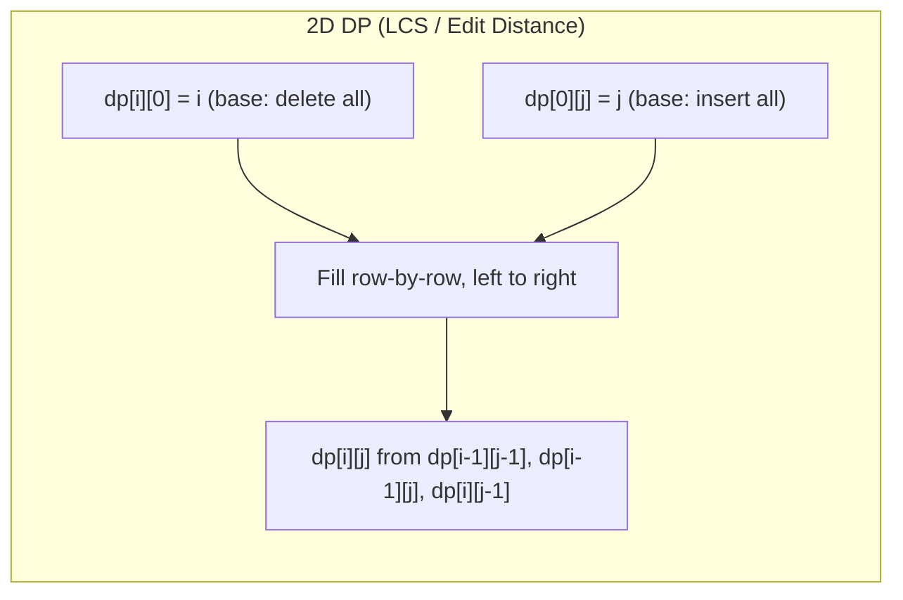

# Dynamic Programming

> **Core idea:** Break a hard decision problem into overlapping subproblems; cache answers so each subproblem is solved exactly once.
> **Recognise it when:** "optimal / count / feasible over all subsets / subsequences / partitions"; "minimum/maximum number of steps/coins/operations"; "in how many ways can you…"; "can you reach / partition / match".
> **Costs:** O(states × transitions) time, O(states) space (often reducible via rolling arrays).

## Mental Model

Two necessary conditions must both hold:

1. **Overlapping subproblems** — the same smaller problem recurs inside the recursion tree (contrast: divide & conquer has *independent* subproblems).
2. **Optimal substructure** — the optimal answer for a problem can be built from optimal answers of its subproblems.

The invariant: *after filling `dp[0..i]`, the value `dp[i]` is the correct answer for the sub-problem defined by `i`.*

---

## How to Find the DP — 5-Step Recipe

This is the hard part. Code is mechanical once you have the recurrence.

| Step | Question to answer | Output |
| ---- | ------------------ | ------ |
| 1 | What decision is made at each step? | Decision variable(s) |
| 2 | What is the *minimum* information needed to make that decision? | **The state** |
| 3 | How does the answer for state `s` relate to answers for strictly smaller states? | **The recurrence** |
| 4 | What states have trivially known answers? | **Base cases** |
| 5 | Trace a tiny example (n ≤ 4) to verify correctness | Confidence check |

### Worked example — Coin Change (LeetCode 322)

**Problem:** given coins `[1,2,5]` and `amount = 11`, return the minimum number of coins.

**Step 1 — decision:** at each remaining amount `a`, try every coin `c`.

**Step 2 — state:** `dp[a]` = minimum coins to make amount `a`. One integer is enough because coin denominations are fixed globally.

**Step 3 — recurrence:**

```text
dp[a] = min over c in coins where c ≤ a  of  (dp[a - c] + 1)
```

**Step 4 — base cases:** `dp[0] = 0` (zero coins for zero amount). Sentinel: `dp[a] = amount + 1` (safe "infinity"; adding 1 never overflows unlike `int.MaxValue + 1`).

**Step 5 — trace** (`amount = 5`, coins `[1,2,5]`):

| a | try 1 | try 2 | try 5 | dp[a] |
| - | ----- | ----- | ----- | ----- |
| 0 | — | — | — | 0 |
| 1 | dp[0]+1=1 | — | — | 1 |
| 2 | dp[1]+1=2 | dp[0]+1=1 | — | 1 |
| 3 | dp[2]+1=2 | dp[1]+1=2 | — | 2 |
| 4 | dp[3]+1=3 | dp[2]+1=2 | — | 2 |
| 5 | dp[4]+1=3 | dp[3]+1=3 | dp[0]+1=1 | **1** |

**Brute-force → memo → tabulation → space-optimised:**

```text
BRUTE FORCE | O(amount^coins) | O(amount)   [exponential — recomputes everything]

def coinChange(coins, amount):
    if amount == 0: return 0
    best = ∞
    for c in coins:
        if c <= amount:
            sub = coinChange(coins, amount - c)
            if sub != ∞: best = min(best, sub + 1)
    return best

------------------------------------------------------------------------------

MEMOISATION | O(amount × |coins|) | O(amount)

Add memo[amount] lookup/store — same recursion, no repeated work.

------------------------------------------------------------------------------

TABULATION | O(amount × |coins|) | O(amount)

dp[0..amount], fill left to right (each dp[a] depends only on dp[a-c] for c ≤ a).

------------------------------------------------------------------------------

SPACE-OPTIMISED | O(amount × |coins|) | O(amount)

Already O(amount) — 1-D array, no further reduction possible here.
```

```csharp
int CoinChange(int[] coins, int amount)
{
    int INF = amount + 1;
    var dp = new int[amount + 1];
    Array.Fill(dp, INF);
    dp[0] = 0;
    for (int a = 1; a <= amount; a++)
        foreach (int c in coins)
            if (c <= a && dp[a - c] + 1 < dp[a])
                dp[a] = dp[a - c] + 1;
    return dp[amount] == INF ? -1 : dp[amount];
}
```

---

## Memoisation vs Tabulation

| Aspect | Memoisation (top-down) | Tabulation (bottom-up) |
| ------ | ---------------------- | ---------------------- |
| Code style | Recursive, natural | Iterative, explicit order |
| Space | Call stack + cache | Table only |
| Computes | Only needed states | All states in dependency order |
| Overflow risk | Stack overflow for n = 10⁵ | None |
| Easier when | Recurrence is obvious; state space sparse | Iteration order is clear; dense problems |
| Space-optimise | Hard (need to know which states to keep) | Easy — rolling arrays |

---

## Memo Key Choice in C\#

| Method | Speed | Use when |
| ------ | ----- | -------- |
| `int[] dp` with sentinel `-1` | ✅ Fastest | State is a single bounded integer |
| `int[,] dp` with sentinel `-1` | ✅ Fast | Two bounded integer dimensions |
| `Dictionary<(int,int), int>` | Moderate | State space sparse / unbounded |
| `Dictionary<string, int>` | ❌ Slow (string alloc + hash) | Avoid — use tuple key instead |

> **Trap:** If `-1` is a valid answer (e.g. "return -1 if impossible"), use a different sentinel such as `int.MinValue` or a separate `bool[] visited`.

```csharp
// Array + sentinel pattern (fastest)
int[] memo = new int[n + 1];
Array.Fill(memo, -1);

int Solve(int i)
{
    if (i == 0) return 0;           // base case
    if (memo[i] != -1) return memo[i];
    return memo[i] = /* recurrence */;
}
```

---

## State Dimensionality Guide

| # dims | What varies between subproblems | Typical problems |
| ------ | ------------------------------- | ---------------- |
| 1-D | One index (position, amount, capacity) | Fibonacci, Coin Change, House Robber, Climbing Stairs |
| 2-D | Two indices (two strings, index + budget, start + end) | LCS, Edit Distance, Interval DP, Knapsack |
| 3-D | Three indices or one index + two constrained counts | Stock with at-most k transactions, Regex matching with backref |
| Bitmask | Subset of a small set (n ≤ 20) | TSP, Partition-to-K subsets |
| Tree | Node + subtree state | House Robber III, max independent set |

**Recognition heuristics:**

- One string/array, one running quantity → **1-D** (`dp[i]`).
- Two strings, or "first i from A and first j from B" → **2-D** (`dp[i][j]`).
- "At most k transactions / colors / segments" → extra dimension for k.
- "All nodes in some set visited" → bitmask.
- "On a tree / DAG" → tree DP, return a tuple.

---

## Subsequence vs Substring / Subarray

| Property | Technique | Key state | Examples |
| -------- | --------- | --------- | -------- |
| **Contiguous** (substring / subarray) | Kadane / sliding window / `dp[i]` ending at `i` | `dp[i]` = best ending exactly at `i` | Max Subarray (53), Maximal Square (221) |
| **Non-contiguous** (subsequence) | 2-D DP over two strings, or 1-D with scan | `dp[i][j]` for two-string problems; `dp[i]` for one-string | LCS (1143), LIS (300), Edit Distance (72) |

> **Trap:** "Subarray / substring" problems want a contiguous answer — do NOT use the 2-D LCS approach. "Subsequence" means elements may be skipped.

---

## Two dp\[i\] Conventions

| Convention | Meaning | When to use | Final answer |
| ---------- | ------- | ----------- | ------------ |
| `dp[i]` = answer for **prefix [0..i]** | Best you can achieve *using* the first i elements | When you can always extend the prefix | `dp[n-1]` or `dp[n]` |
| `dp[i]` = answer **ending exactly at i** | Best answer whose last element is i | When the answer must include element i (LIS, max subarray) | `max(dp[0..n-1])` |

**Example — LIS uses "ending exactly at i":**
`dp = [1,1,1,1]` for `nums = [3,2,1,4]`. Answer is `max(dp) = 2`, not `dp[3] = 2` by coincidence — you *must* scan all.

---

## Reconstructing the Solution

DP computes the *value*; to get the actual solution, store a `parent` / `choice` array.

### LCS — print the actual subsequence

```csharp
string LCSString(string s1, string s2)
{
    int m = s1.Length, n = s2.Length;
    var dp = new int[m + 1, n + 1];
    for (int i = 1; i <= m; i++)
        for (int j = 1; j <= n; j++)
            dp[i, j] = s1[i - 1] == s2[j - 1]
                ? dp[i - 1, j - 1] + 1
                : Math.Max(dp[i - 1, j], dp[i, j - 1]);

    // Backtrack
    var sb = new System.Text.StringBuilder();
    int r = m, c = n;
    while (r > 0 && c > 0)
    {
        if (s1[r - 1] == s2[c - 1]) { sb.Insert(0, s1[r - 1]); r--; c--; }
        else if (dp[r - 1, c] > dp[r, c - 1]) r--;
        else c--;
    }
    return sb.ToString();
}
```

### Coin Change — print the coins used

```csharp
List<int> CoinChangePath(int[] coins, int amount)
{
    int INF = amount + 1;
    var dp = new int[amount + 1];
    var from = new int[amount + 1]; // which coin was used
    Array.Fill(dp, INF);
    Array.Fill(from, -1);
    dp[0] = 0;
    for (int a = 1; a <= amount; a++)
        foreach (int c in coins)
            if (c <= a && dp[a - c] + 1 < dp[a])
            {
                dp[a] = dp[a - c] + 1;
                from[a] = c;
            }

    if (dp[amount] == INF) return new List<int> { -1 };
    var result = new List<int>();
    for (int a = amount; a > 0; a -= from[a])
        result.Add(from[a]);
    return result;
}
```

---

## Space Optimisation

**General rule:** if `dp[i]` depends only on `dp[i-1]` (and possibly `dp[i-2]`), keep only those rows.

### Why 0/1 Knapsack inner loop must go **backwards**

```text
Forward (wrong for 0/1):  dp[w] uses dp[w-wt] which was ALREADY UPDATED this item → item reused
Backward (correct):       dp[w] uses dp[w-wt] from the PREVIOUS item row → each item used ≤ once
```

**Trace** with `weights=[2]`, `values=[3]`, `capacity=4`:

| w | 0 | 1 | 2 | 3 | 4 |
| - | - | - | - | - | - |
| start | 0 | 0 | 0 | 0 | 0 |
| backward w=4 | 0 | 0 | 0 | 0 | 3 |
| backward w=3 | 0 | 0 | 0 | 3 | 3 |
| backward w=2 | 0 | 0 | 3 | 3 | 3 | ← correct: item used once |

With **forward** loop: `dp[2]=3`, then `dp[4] = dp[4-2]+3 = 6` — item counted twice. ❌

### Why Unbounded Knapsack inner loop goes **forwards**

Items *can* be reused, so using the updated `dp[w-c]` (from this same item's pass) is *correct*.

### 2-D → 1-D rolling array for LCS / Knapsack

For LCS, `dp[i][j]` depends only on `dp[i-1][j-1]`, `dp[i-1][j]`, `dp[i][j-1]` → keep two rows (prev, curr) or one row + a `diag` variable.

```csharp
// LCS O(min(m,n)) space
int LCS(string s1, string s2)
{
    if (s1.Length < s2.Length) (s1, s2) = (s2, s1);  // s2 is shorter
    int n = s2.Length;
    var prev = new int[n + 1];
    for (int i = 1; i <= s1.Length; i++)
    {
        var curr = new int[n + 1];
        for (int j = 1; j <= n; j++)
            curr[j] = s1[i - 1] == s2[j - 1]
                ? prev[j - 1] + 1
                : Math.Max(prev[j], curr[j - 1]);
        prev = curr;
    }
    return prev[n];
}
```

---

## DP Table Fill Order



---

## Counting DP vs Optimisation DP

| Goal | Recurrence operator | Sentinel | Example |
| ---- | ------------------- | -------- | ------- |
| Minimum / maximum | `min` / `max` | `+∞` or `amount+1` | Coin Change, Edit Distance |
| Count ways | `+` (sum) | 0 | Climbing Stairs, Coin Change II |
| Feasibility | `OR` | `false` | Partition Equal Subset Sum |

> **Trap:** counting DP can overflow `int` (e.g., LeetCode 91 with long strings). Use `long` or apply modulo `1_000_000_007`.

---

## Family 1 — Linear / Fibonacci-Style

**State:** `dp[i]` = answer for first `i` items.
**Recurrence:** `dp[i] = f(dp[i-1], dp[i-2], ...)`.
**Base case:** `dp[0]`, `dp[1]` (problem-specific).
**Order:** left to right.
**Answer:** `dp[n]`.

```csharp
// Climbing Stairs — O(n) time, O(1) space
int ClimbStairs(int n)
{
    if (n <= 2) return n;
    int a = 1, b = 2;
    for (int i = 3; i <= n; i++) (a, b) = (b, a + b);
    return b;
}
```

**Canonical problems:** LeetCode 70 (Climbing Stairs), 746 (Min Cost Climbing Stairs), 198/213 (House Robber I/II), 91 (Decode Ways).

---

## Family 2 — 0/1 Knapsack

**State:** `dp[w]` = max value using items seen so far with weight limit `w`.
**Recurrence:** `dp[w] = max(dp[w], dp[w - wt[i]] + val[i])` (only when `w >= wt[i]`).
**Base case:** `dp[0..W] = 0`.
**Order:** outer = items, inner = `w` from `W` down to `wt[i]` (backwards — prevents reuse).
**Answer:** `dp[W]`.

```csharp
int Knapsack01(int[] weights, int[] values, int capacity)
{
    var dp = new int[capacity + 1];
    for (int i = 0; i < weights.Length; i++)
        for (int w = capacity; w >= weights[i]; w--)
            dp[w] = Math.Max(dp[w], dp[w - weights[i]] + values[i]);
    return dp[capacity];
}
```

**Canonical problems:** LeetCode 416 (Partition Equal Subset Sum), 494 (Target Sum), 1049 (Last Stone Weight II).

---

## Family 3 — Unbounded Knapsack

**State:** `dp[a]` = min coins / max value for amount / capacity `a`.
**Recurrence:** `dp[a] = best(dp[a], dp[a - coin] + 1)`.
**Order:** inner loop **forwards** (allows item reuse).
**Answer:** `dp[amount]`.

```csharp
// Coin Change (min coins) — O(amount × |coins|) time, O(amount) space
int CoinChange(int[] coins, int amount)
{
    int INF = amount + 1;
    var dp = new int[amount + 1];
    Array.Fill(dp, INF);
    dp[0] = 0;
    for (int a = 1; a <= amount; a++)
        foreach (int c in coins)
            if (c <= a && dp[a - c] + 1 < dp[a])
                dp[a] = dp[a - c] + 1;
    return dp[amount] == INF ? -1 : dp[amount];
}

// Coin Change II (count ways) — dp[a] += dp[a - c]; iterate coins outer
int CoinChangeII(int[] coins, int amount)
{
    var dp = new int[amount + 1];
    dp[0] = 1;
    foreach (int c in coins)           // outer = coins → avoids counting permutations
        for (int a = c; a <= amount; a++)
            dp[a] += dp[a - c];
    return dp[amount];
}
```

> **Why coins-outer for combinations:** iterating coins in the outer loop ensures each combination is counted once. Swapping the loops counts ordered arrangements (permutations) instead.

**Canonical problems:** LeetCode 322 (Coin Change), 518 (Coin Change II), 279 (Perfect Squares), 377 (Combination Sum IV — permutations, so amount-outer).

---

## Family 4 — LIS (Longest Increasing Subsequence)

**State:** `dp[i]` = length of LIS ending exactly at index `i`.
**Recurrence:** `dp[i] = 1 + max(dp[j])` for all `j < i` where `nums[j] < nums[i]`.
**Answer:** `max(dp)`.

```csharp
// O(n²) DP
int LIS_N2(int[] nums)
{
    int n = nums.Length;
    var dp = new int[n];
    Array.Fill(dp, 1);
    int ans = 1;
    for (int i = 1; i < n; i++)
    {
        for (int j = 0; j < i; j++)
            if (nums[j] < nums[i])
                dp[i] = Math.Max(dp[i], dp[j] + 1);
        ans = Math.Max(ans, dp[i]);
    }
    return ans;
}

// O(n log n) — patience sorting (binary search on tails)
// See SearchingAndSorting.md for the binary-search template.
int LIS_NLogN(int[] nums)
{
    var tails = new List<int>();
    foreach (int x in nums)
    {
        int pos = tails.BinarySearch(x);
        if (pos < 0) pos = ~pos;
        if (pos == tails.Count) tails.Add(x);
        else tails[pos] = x;
    }
    return tails.Count;
}
```

> **Why patience sorting works:** `tails[i]` = smallest possible tail of an increasing subsequence of length `i+1`. Replacing `tails[pos]` with a smaller value keeps the tails array optimistic for future extensions without changing its length.

**Canonical problems:** LeetCode 300 (LIS), 354 (Russian Doll Envelopes — 2-D LIS), 673 (Number of LIS), 1027 (Longest Arithmetic Subsequence).

---

## Family 5 — LCS and String DP

**State:** `dp[i][j]` = LCS length of `s1[0..i-1]` and `s2[0..j-1]`.
**Recurrence:**
- If `s1[i-1] == s2[j-1]`: `dp[i][j] = dp[i-1][j-1] + 1`
- Else: `dp[i][j] = max(dp[i-1][j], dp[i][j-1])`

**Base case:** `dp[i][0] = dp[0][j] = 0`.
**Order:** row by row, left to right.
**Answer:** `dp[m][n]`.

```csharp
// LCS length — O(mn) time, O(mn) space
int LongestCommonSubsequence(string s1, string s2)
{
    int m = s1.Length, n = s2.Length;
    var dp = new int[m + 1, n + 1];
    for (int i = 1; i <= m; i++)
        for (int j = 1; j <= n; j++)
            dp[i, j] = s1[i - 1] == s2[j - 1]
                ? dp[i - 1, j - 1] + 1
                : Math.Max(dp[i - 1, j], dp[i, j - 1]);
    return dp[m, n];
}

// Edit Distance — O(mn) time, O(mn) space (LeetCode 72)
int EditDistance(string s, string t)
{
    int m = s.Length, n = t.Length;
    var dp = new int[m + 1, n + 1];
    for (int i = 0; i <= m; i++) dp[i, 0] = i;
    for (int j = 0; j <= n; j++) dp[0, j] = j;
    for (int i = 1; i <= m; i++)
        for (int j = 1; j <= n; j++)
            dp[i, j] = s[i - 1] == t[j - 1]
                ? dp[i - 1, j - 1]
                : 1 + Math.Min(dp[i - 1, j - 1], Math.Min(dp[i - 1, j], dp[i, j - 1]));
    return dp[m, n];
}
```

**Canonical problems:** LeetCode 1143 (LCS), 72 (Edit Distance), 115 (Distinct Subsequences), 97 (Interleaving String), 10 (Regex Matching), 44 (Wildcard Matching).

---

## Family 6 — Grid DP

**State:** `dp[r][c]` = answer at cell (r, c).
**Recurrence:** depends on allowed moves (usually `dp[r][c] = grid[r][c] + min(dp[r-1][c], dp[r][c-1])`).
**Base case:** first row/column from boundary conditions.
**Order:** row by row, left to right.
**Answer:** `dp[m-1][n-1]` (or aggregate).

```csharp
// Unique Paths — O(mn) time, O(n) space
int UniquePaths(int m, int n)
{
    var dp = new int[n];
    Array.Fill(dp, 1);
    for (int i = 1; i < m; i++)
        for (int j = 1; j < n; j++)
            dp[j] += dp[j - 1];
    return dp[n - 1];
}
```

**Canonical problems:** LeetCode 62/63 (Unique Paths), 64 (Min Path Sum), 120 (Triangle), 221 (Maximal Square), 174 (Dungeon Game — fill bottom-right to top-left).

---

## Family 7 — Partition / Subset Sum

Subset sum is 0/1 knapsack with boolean `dp`. `dp[s] |= dp[s - num]` (reverse iteration).

```csharp
// Partition Equal Subset Sum — O(n × sum) time, O(sum) space
bool CanPartition(int[] nums)
{
    int total = nums.Sum();
    if (total % 2 != 0) return false;
    int target = total / 2;
    var dp = new bool[target + 1];
    dp[0] = true;
    foreach (int num in nums)
        for (int s = target; s >= num; s--)
            dp[s] |= dp[s - num];
    return dp[target];
}
```

**Canonical problems:** LeetCode 416 (Partition Equal Subset Sum), 494 (Target Sum), 1049 (Last Stone Weight II), 698 (Partition to K Equal Sum Subsets — bitmask DP).

---

## Family 8 — Palindrome DP

Precompute `isPalin[i][j]` in O(n²), fill by increasing length.
`isPalin[i][j] = s[i] == s[j] && (j - i <= 2 || isPalin[i+1][j-1])`.

```csharp
// Longest Palindromic Subsequence (LeetCode 516)
int LongestPalindromeSubseq(string s)
{
    int n = s.Length;
    var dp = new int[n, n];
    for (int i = 0; i < n; i++) dp[i, i] = 1;
    for (int len = 2; len <= n; len++)
        for (int i = 0; i <= n - len; i++)
        {
            int j = i + len - 1;
            dp[i, j] = s[i] == s[j]
                ? (len == 2 ? 2 : dp[i + 1, j - 1] + 2)
                : Math.Max(dp[i + 1, j], dp[i, j - 1]);
        }
    return dp[0, n - 1];
}
```

**Canonical problems:** LeetCode 516 (Longest Palindromic Subsequence), 132 (Palindrome Partitioning II).

---

## Family 9 — Interval DP

**State:** `dp[i][j]` = optimal cost for interval `[i, j]`.
**Recurrence:** try all split points `k`: `dp[i][j] = opt over k in [i, j-1] of (dp[i][k] + dp[k+1][j] + merge_cost)`.
**Order:** increasing interval length (so sub-intervals are already filled).
**Answer:** `dp[0][n-1]`.

```csharp
// Burst Balloons skeleton — O(n³) time, O(n²) space
// Pad nums with 1s at both ends; dp[i][j] = max coins in open interval (i,j)
int MaxCoins(int[] nums)
{
    int n = nums.Length;
    var a = new int[n + 2];
    a[0] = a[n + 1] = 1;
    for (int i = 0; i < n; i++) a[i + 1] = nums[i];
    int N = n + 2;
    var dp = new int[N, N];
    for (int len = 2; len < N; len++)
        for (int i = 0; i + len < N; i++)
        {
            int j = i + len;
            for (int k = i + 1; k < j; k++)
                dp[i, j] = Math.Max(dp[i, j], dp[i, k] + dp[k, j] + a[i] * a[k] * a[j]);
        }
    return dp[0, N - 1];
}
```

**Canonical problems:** LeetCode 312 (Burst Balloons), 486 (Predict the Winner), 877 (Stone Game), Matrix Chain Multiplication.

---

## Family 10 — Bitmask DP

**State:** `dp[mask][i]` = optimal value having visited nodes in `mask`, currently at `i`.
**Recurrence:** `dp[mask | (1<<j)][j] = opt(dp[mask][i] + cost[i][j])`.
**Order:** iterate `mask` from 0 to `2^n - 1`.
**Feasibility:** n ≤ 20.

```csharp
// TSP skeleton — O(2^n × n²) time, O(2^n × n) space
int TSP(int n, int[,] dist)
{
    int FULL = (1 << n) - 1;
    var dp = new int[1 << n, n];
    foreach (var row in Enumerable.Range(0, 1 << n))
        for (int i = 0; i < n; i++) dp[row, i] = int.MaxValue / 2;
    dp[1, 0] = 0;
    for (int mask = 1; mask <= FULL; mask++)
        for (int u = 0; u < n; u++)
        {
            if ((mask & (1 << u)) == 0 || dp[mask, u] == int.MaxValue / 2) continue;
            for (int v = 0; v < n; v++)
                if ((mask & (1 << v)) == 0)
                    dp[mask | (1 << v), v] = Math.Min(
                        dp[mask | (1 << v), v], dp[mask, u] + dist[u, v]);
        }
    return dp[FULL, 0]; // adjust for open/closed tour
}
```

**Canonical problems:** LeetCode 847 (Shortest Path Visiting All Nodes), 943 (Find Shortest Superstring), 698 (Partition to K Equal Sum Subsets).

---

## Family 11 — Tree DP

Return a tuple of values from each subtree (post-order). Each node computes its state from its children's states.

```csharp
// House Robber III — O(n) time, O(h) space
(int rob, int skip) RobTree(TreeNode? node)
{
    if (node == null) return (0, 0);
    var (lr, ls) = RobTree(node.left);
    var (rr, rs) = RobTree(node.right);
    int rob = node.val + ls + rs;
    int skip = Math.Max(lr, ls) + Math.Max(rr, rs);
    return (rob, skip);
}
// Answer: var (r, s) = RobTree(root); return Math.Max(r, s);
```

**Canonical problems:** LeetCode 337 (House Robber III), LeetCode 543/124 (Diameter/Max Path Sum in Trees — see [Trees](../Trees/Trees.md)).

---

## Family 12 — State Machine DP (Stocks)

Model each day's state as a node in a finite state machine. Transition costs are the DP recurrences.

**LeetCode 121 — at most 1 transaction:**

```csharp
int MaxProfit121(int[] prices)
{
    int minBuy = int.MaxValue, maxProfit = 0;
    foreach (int p in prices)
    {
        minBuy = Math.Min(minBuy, p);
        maxProfit = Math.Max(maxProfit, p - minBuy);
    }
    return maxProfit;
}
```

**General state machine framing (used for 122 / 309 / 714):**

```text
States: hold (own a stock), sold (just sold today), rest (not holding, not just sold)
Transitions each day:
    hold  = max(hold,  rest  - price)   // buy or keep holding
    sold  = hold_prev + price            // sell today
    rest  = max(rest,  sold)             // cooldown ends or keep resting
Answer: max(sold, rest)
```

```csharp
// With Cooldown (LeetCode 309) — O(n) time, O(1) space
int MaxProfitCooldown(int[] prices)
{
    int hold = int.MinValue, sold = 0, rest = 0;
    foreach (int p in prices)
    {
        int prevHold = hold, prevSold = sold, prevRest = rest;
        hold = Math.Max(prevHold, prevRest - p);
        sold = prevHold + p;
        rest = Math.Max(prevRest, prevSold);
    }
    return Math.Max(sold, rest);
}

// With Transaction Fee (LeetCode 714)
int MaxProfitFee(int[] prices, int fee)
{
    int hold = int.MinValue, free = 0;
    foreach (int p in prices)
    {
        int prevHold = hold;
        hold = Math.Max(hold, free - p);
        free = Math.Max(free, prevHold + p - fee);
    }
    return free;
}

// At most k transactions (LeetCode 188) — O(nk) time, O(k) space
int MaxProfitK(int k, int[] prices)
{
    int n = prices.Length;
    if (k >= n / 2)   // unlimited effectively
    {
        int profit = 0;
        for (int i = 1; i < n; i++)
            if (prices[i] > prices[i - 1]) profit += prices[i] - prices[i - 1];
        return profit;
    }
    var buy = new int[k + 1];   // buy[i] = best profit in state "holding after i-th buy"
    var sell = new int[k + 1];  // sell[i] = best profit after i-th sell
    Array.Fill(buy, int.MinValue);
    for (int i = 0; i < n; i++)
        for (int j = k; j >= 1; j--)
        {
            buy[j]  = Math.Max(buy[j],  sell[j - 1] - prices[i]);
            sell[j] = Math.Max(sell[j], buy[j]      + prices[i]);
        }
    return sell[k];
}
```

**Canonical problems:** LeetCode 121, 122, 123 (at most 2 transactions = k=2 above), 188, 309, 714.

---

## Family 13 — Kadane / Max Subarray as DP

**State:** `dp[i]` = max subarray sum ending exactly at index `i`.
**Recurrence:** `dp[i] = max(nums[i], dp[i-1] + nums[i])` — either start fresh or extend.
**Answer:** `max(dp)`.
**Space-optimised:** single variable `cur`, global `best`.

> Kadane is owned by [Arrays and Strings](../ArraysAndStrings/ArraysAndStrings.md). Recognise the DP framing: `dp[i]` = max ending exactly at `i`.

---

## Family 14 — Digit DP

Count integers in `[0, R]` (or `[L, R]`) satisfying a digit-level property (e.g., digit sum divisible by k, no two adjacent same digits).

**State:** `(position, tight, leading_zero, accumulated_property)`.
- `tight` = true if current prefix still matches the upper bound digit-by-digit.
- `leading_zero` = true if no non-zero digit placed yet (handles "0" prefix edge cases).

**Recurrence:** for each digit `d` at `position`, recurse with updated `tight` and `accumulated_property`.
**Memoize** on `(pos, tight, …)` — state space is O(digits × 2 × property_range).

Rarely appears in standard interviews; common in competitive programming.

---

## Family 15 — Game Theory / Minimax DP

**State:** `dp[i][j]` = max score the *current player* can guarantee from subgame `[i, j]`.
**Recurrence:** `dp[i][j] = max(a[i] - dp[i+1][j], a[j] - dp[i][j-1])`.
- Current player picks left or right end; opponent then plays optimally on the remainder.
- The subtracted `dp[...]` term represents the opponent's future gain.

**Answer:** `dp[0][n-1] >= 0` → first player wins.

```csharp
// Predict the Winner (LeetCode 486) / Stone Game (LeetCode 877)
bool PredictTheWinner(int[] nums)
{
    int n = nums.Length;
    var dp = new int[n, n];
    for (int i = 0; i < n; i++) dp[i, i] = nums[i];
    for (int len = 2; len <= n; len++)
        for (int i = 0; i <= n - len; i++)
        {
            int j = i + len - 1;
            dp[i, j] = Math.Max(nums[i] - dp[i + 1, j], nums[j] - dp[i, j - 1]);
        }
    return dp[0, n - 1] >= 0;
}
```

---

## Pattern Recognition

| Problem says… | Family | Key state |
| ------------- | ------ | --------- |
| "Min/max coins / operations / edits" | Unbounded knapsack / Edit distance | `dp[amount]` / `dp[i][j]` |
| "In how many ways" | Counting DP (sum recurrence) | varies |
| "Can you partition / reach sum" | 0/1 knapsack, bool dp | `dp[target]` |
| "Longest subsequence (non-contiguous)" | LIS / LCS | `dp[i]` or `dp[i][j]` |
| "Longest subarray / substring (contiguous)" | Kadane / sliding window | `dp[i]` ending at i |
| "On a grid, move right/down" | Grid DP | `dp[r][c]` |
| "Intervals, merge, burst, split" | Interval DP | `dp[i][j]` by length |
| "Visit all nodes in small graph" | Bitmask DP | `dp[mask][node]` |
| "Tree, each subtree independent" | Tree DP | return tuple |
| "Stock buy/sell with constraints" | State machine DP | hold/sold/rest |
| "Digit property counting" | Digit DP | (pos, tight, acc) |
| "First player wins game theory" | Minimax / game DP | `dp[i][j]` score diff |

---

## Comparison: All DP Families

| Family | State | Inner loop direction | Classic problem |
| ------ | ----- | -------------------- | --------------- |
| 0/1 Knapsack | `dp[w]` | **Reverse** (no reuse) | Partition Equal Subset |
| Unbounded Knapsack | `dp[a]` | **Forward** (reuse OK) | Coin Change |
| LIS | `dp[i]` ending at i | j < i scan / binary search | LIS 300 |
| LCS / Edit | `dp[i][j]` 2-D | Row by row | LCS 1143, Edit 72 |
| House Robber | `dp[i]` prefix max | Left to right | 198 / 213 |
| Grid | `dp[r][c]` | Row by row | Unique Paths 62 |
| Bitmask | `dp[mask][i]` | mask 0 → 2^n | TSP, 847 |
| Palindrome | `dp[i][j]` by length | Increasing length | 516, 132 |
| Interval | `dp[i][j]` by length | Increasing length | Burst Balloons 312 |
| Tree DP | tuple per node | Post-order | House Robber III 337 |
| State machine | hold/sold/rest | Left to right | Stocks 121–714 |
| Counting | `dp[i]` sum | Left to right | Climbing Stairs 70 |
| Game theory | `dp[i][j]` | Increasing length | Predict Winner 486 |
| Digit | (pos, tight, acc) | Recursive | — |

---

## Pitfalls

- **Sentinel collision:** using `-1` as "uncomputed" but the answer can be `-1`. Use `int.MinValue` or a separate `bool[] computed` array.
- **Integer overflow in counting DP:** `dp[i] += dp[j]` can exceed `int.MaxValue` for large n. Use `long` or `% 1_000_000_007`.
- **`int.MaxValue + 1` overflow:** never do `dp[i] = int.MaxValue; dp[i] + 1`. Use `amount + 1` or `n + 1` as a safe sentinel.
- **Wrong iteration order:** 0/1 knapsack must iterate capacity backwards; LCS must fill `dp[i-1][j-1]` before `dp[i][j]`.
- **Forgetting `dp[0]` base case:** many recurrences silently break if `dp[0]` is not set (e.g., `dp[0] = 1` for counting "zero items = one way").
- **Off-by-one — 0-indexed strings with 1-indexed table:** `dp[i][j]` corresponds to `s1[i-1]` and `s2[j-1]`. Keep this consistent or use 0-indexed table with boundary guards.
- **Returning `dp[n-1]` instead of `max(dp)`:** "ending exactly at i" convention requires scanning all dp values.
- **Stack overflow for n = 10⁵ in top-down:** C# default stack is ~1 MB. Use tabulation or increase stack with `Thread`.
- **Recursion without base cases:** causes infinite loops or wrong answers — always handle the empty/zero state first.

---

## Practice

See [Problems.md](Problems.md) for worked solutions.

| LeetCode | Problem | Family |
| -------- | ------- | ------ |
| 70 | Climbing Stairs | Linear |
| 198 / 213 | House Robber I / II | Linear |
| 322 | Coin Change | Unbounded Knapsack |
| 518 | Coin Change II | Unbounded Knapsack |
| 300 | LIS | LIS |
| 1143 | LCS | LCS |
| 72 | Edit Distance | String DP |
| 416 | Partition Equal Subset Sum | 0/1 Knapsack |
| 62 | Unique Paths | Grid |
| 312 | Burst Balloons | Interval |
| 847 | Shortest Path Visiting All Nodes | Bitmask |
| 337 | House Robber III | Tree DP |
| 121–714 | Stock Series | State Machine |
| 486 | Predict the Winner | Game Theory |

---
