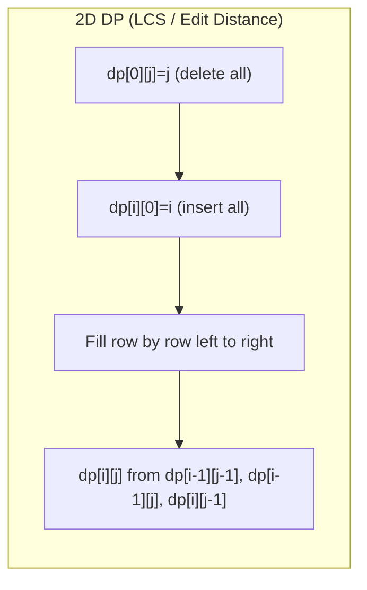

# Dynamic Programming

## Core Concepts

- **Overlapping subproblems** — same subproblem computed multiple times in naive recursion.
- **Optimal substructure** — optimal solution built from optimal solutions of subproblems.
- **State** — the minimum information needed to fully characterize a subproblem.
- **Recurrence** — how a state's value is computed from smaller states.
- **Memoization (top-down)** — recursive + `Dictionary` / array cache. Write naturally, add cache.
- **Tabulation (bottom-up)** — fill a table iteratively in dependency order. Usually faster (no call overhead, better cache).
- **Space optimization** — if current row depends only on previous row(s), drop earlier rows.

---

## Memoization vs Tabulation

| Aspect          | Memoization (top-down)          | Tabulation (bottom-up)        |
| --------------- | ------------------------------- | ----------------------------- |
| Code style      | Recursive, natural              | Iterative, explicit order     |
| Space           | Call stack + cache              | Table only                    |
| Computes        | Only needed states              | All states in order           |
| Cache           | `Dictionary` or array           | Array, exact size known       |
| Overflow risk   | Deep recursion (stack overflow) | None                          |
| Easier to write | When recurrence is obvious      | When iteration order is clear |
| Preferred when  | State space large but sparse    | Dense, all states needed      |

---

## Recurrence → Iterative Conversion Recipe

1. Write recursive function with clear parameters (the state).
2. Add `memo[state]` lookup and store.
3. Identify base cases and evaluation order (what must be computed first).
4. Create table of same dimensions; fill base cases.
5. Loop in correct order (often `i` from 0 or 1 to n); fill `dp[i]` from `dp[i-1]` etc.
6. Check if only last 1–2 rows/values are needed → reduce to O(1)/O(n) space.

---

## DP Table Fill Order



---

## Family 1 — 0/1 Knapsack

**State:** `dp[i][w]` = max value using first `i` items with weight limit `w`.
**Recurrence:** `dp[i][w] = max(dp[i-1][w], dp[i-1][w-wt[i]] + val[i])` if `w >= wt[i]`.

```csharp
int Knapsack(int[] weights, int[] values, int capacity)
{
    int n = weights.Length;
    var dp = new int[capacity + 1];
    for (int i = 0; i < n; i++)
        for (int w = capacity; w >= weights[i]; w--) // reverse to avoid reuse
            dp[w] = Math.Max(dp[w], dp[w - weights[i]] + values[i]);
    return dp[capacity];
}
```

Space: O(W). Time: O(nW). **LeetCode 416 (Partition Equal Subset Sum)**, **494 (Target Sum)**.

---

## Family 2 — Unbounded Knapsack / Coin Change

Items can be reused. Inner loop forward (not reversed).

```csharp
int CoinChange(int[] coins, int amount)
{
    var dp = new int[amount + 1]; Array.Fill(dp, amount + 1);
    dp[0] = 0;
    for (int a = 1; a <= amount; a++)
        foreach (var c in coins)
            if (c <= a) dp[a] = Math.Min(dp[a], dp[a - c] + 1);
    return dp[amount] > amount ? -1 : dp[amount];
}
```

**LeetCode 322 (Coin Change)**, **518 (Coin Change II — count ways)**.

---

## Family 3 — LIS (Longest Increasing Subsequence)

**O(n²):**

```csharp
int LIS_N2(int[] nums)
{
    int n = nums.Length;
    var dp = new int[n]; Array.Fill(dp, 1);
    for (int i = 1; i < n; i++)
        for (int j = 0; j < i; j++)
            if (nums[j] < nums[i]) dp[i] = Math.Max(dp[i], dp[j] + 1);
    return dp.Max();
}
```

**O(n log n) — patience sorting / binary search:**

```csharp
int LIS_NLogN(int[] nums)
{
    var tails = new List<int>();
    foreach (var x in nums)
    {
        int pos = tails.BinarySearch(x);
        if (pos < 0) pos = ~pos;
        if (pos == tails.Count) tails.Add(x);
        else tails[pos] = x;
    }
    return tails.Count;
}
```

**LeetCode 300, 354 (Russian Doll Envelopes — 2D LIS)**, **673 (Number of LIS)**.

---

## Family 4 — LCS and Edit Distance

**LCS Recurrence:** `dp[i][j] = dp[i-1][j-1]+1` if `s1[i]==s2[j]`, else `max(dp[i-1][j], dp[i][j-1])`.

**Edit Distance (LeetCode 72):**

```csharp
int EditDistance(string s, string t)
{
    int m = s.Length, n = t.Length;
    var dp = new int[m + 1, n + 1];
    for (int i = 0; i <= m; i++) dp[i, 0] = i;
    for (int j = 0; j <= n; j++) dp[0, j] = j;
    for (int i = 1; i <= m; i++)
        for (int j = 1; j <= n; j++)
            dp[i, j] = s[i-1] == t[j-1]
                ? dp[i-1, j-1]
                : 1 + Math.Min(dp[i-1, j-1], Math.Min(dp[i-1, j], dp[i, j-1]));
    return dp[m, n];
}
```

**LeetCode 1143 (LCS)**, **72 (Edit Distance)**, **583 (Delete Operations)**.

---

## Family 5 — House Robber / Linear DP

**LeetCode 198:** `dp[i] = max(dp[i-2] + nums[i], dp[i-1])`. Space O(1) with two variables.
**LeetCode 213 (Circular):** Run twice: [0..n-2] and [1..n-1], take max.
**LeetCode 337 (Tree):** DP on tree — return `(rob, skip)` pair per node.

---

## Family 6 — Grid Paths

```csharp
int UniquePaths(int m, int n)
{
    var dp = new int[n]; Array.Fill(dp, 1);
    for (int i = 1; i < m; i++)
        for (int j = 1; j < n; j++)
            dp[j] += dp[j - 1];
    return dp[n - 1];
}
```

**LeetCode 62, 63 (obstacles), 64 (min path sum), 931 (falling path).**

---

## Family 7 — Partition / Subset Sum

Subset sum = 0/1 knapsack with boolean dp.
**LeetCode 416:** Can we partition into two equal halves? Target = sum/2. `dp[w] |= dp[w - num]`.

---

## Family 8 — Palindrome DP

Precompute `isPalin[i][j]` in O(n²). Then use for partition (LeetCode 131, 132).
`isPalin[i][j] = s[i]==s[j] && isPalin[i+1][j-1]` (fill by length).

---

## Family 9 — Bitmask DP (TSP-style)

**State:** `dp[mask][i]` = min cost to visit nodes in `mask`, ending at `i`.
**Recurrence:** `dp[mask|(1<<j)][j] = min(dp[mask][i] + dist[i][j])`.
Time O(2^n · n²). Feasible for n ≤ 20.

```csharp
// TSP skeleton
int n = ...; int[,] dist = ...;
var dp = new int[1 << n, n]; // fill with INF
dp[1, 0] = 0; // start at node 0, mask=1
for (int mask = 1; mask < (1 << n); mask++)
    for (int u = 0; u < n; u++)
    {
        if ((mask & (1 << u)) == 0) continue;
        for (int v = 0; v < n; v++)
            if ((mask & (1 << v)) == 0)
                dp[mask | (1 << v), v] = Math.Min(dp[mask | (1 << v), v], dp[mask, u] + dist[u, v]);
    }
```

**LeetCode 847 (Shortest Path Visiting All Nodes)**, **943 (Find Shortest Superstring)**.

---

## Family 10 — DP on Trees

Return a tuple of values from each subtree. Classic: max independent set on tree = House Robber III.

```csharp
(int rob, int skip) RobTree(TreeNode? node)
{
    if (node == null) return (0, 0);
    var (lr, ls) = RobTree(node.left);
    var (rr, rs) = RobTree(node.right);
    int rob = node.val + ls + rs;
    int skip = Math.Max(lr, ls) + Math.Max(rr, rs);
    return (rob, skip);
}
```

---

## Digit DP (Mention)

Count integers in [L, R] satisfying a property (e.g., no two adjacent same digits). State: `(position, tight, leading_zero, accumulated_sum)`. Memoize by `(pos, tight, ...)`. Rarely appears in standard interviews but common in competitive programming.

---

## Comparison: Common DP Patterns

| Family             | Key state            | Transition              | Classic problem              |
| ------------------ | -------------------- | ----------------------- | ---------------------------- |
| 0/1 Knapsack       | `dp[w]`              | Reverse inner loop      | Partition Equal Subset       |
| Unbounded Knapsack | `dp[a]`              | Forward inner loop      | Coin Change                  |
| LIS                | `tails[]` or `dp[i]` | Binary search or O(n²)  | Longest Increasing Subseq    |
| LCS / Edit Dist    | `dp[i][j]`           | 2D table                | Edit Distance                |
| House Robber       | `dp[i]`              | Two prev values         | House Robber I/II/III        |
| Grid paths         | `dp[j]` rolling      | Accumulate left + above | Unique Paths                 |
| Bitmask            | `dp[mask][i]`        | Set bits iteration      | TSP, Shortest Superstring    |
| Palindrome         | `isPalin[i][j]`      | Expand by length        | Palindrome Partitioning      |
| Tree DP            | `(rob, skip)` pair   | Post-order merge        | Max Independent Set Tree     |
| Interval DP        | `dp[i][j]`           | Split at k              | Matrix Chain, Burst Balloons |

---

## Interval DP (Matrix Chain / Burst Balloons)

`dp[i][j]` = optimal cost for interval [i,j]. Fill by increasing interval length.

```
for len in 2..n:
  for i in 0..n-len:
    j = i + len - 1
    for k in i..j-1:
      dp[i][j] = min/max over split at k
```

## Trade-offs & When to Use

- **Memoization**: prefer when subproblems are sparse or state space is large/irregular.
- **Tabulation**: prefer for dense problems; easier to optimize space.
- **Space optimization**: always ask "does row i depend on row i-2 or earlier?" — if only i-1, use rolling arrays.
- **Bitmask DP**: feasible only for n ≤ 20–22 due to exponential state space.
