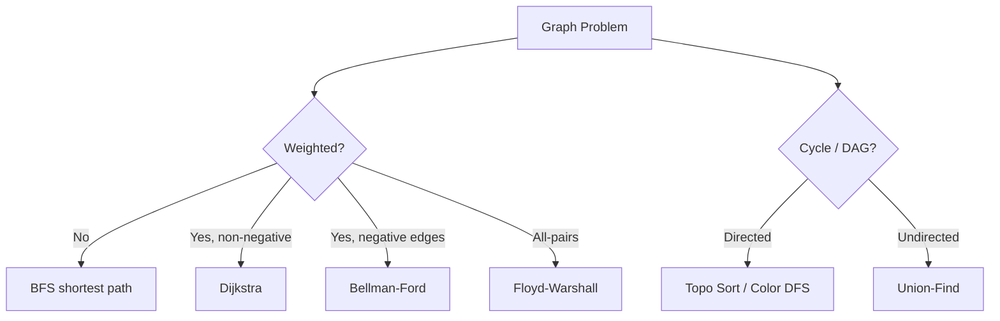

# Graphs

A graph is a non-linear data structure consisting of nodes (vertices) and the edges that connect them.

- $G = (V, E)$, where $V$ is the set of vertices and $E$ is the set of edges.
- A graph may be directed or undirected, weighted or unweighted, and cyclic or acyclic.
- Applications include social networks, web graphs, transportation networks, network routing, and dependency graphs.

## Terminology

- **Vertex:** A node in the graph.
- **Edge:** A connection between two vertices.
- **Degree:** The number of edges connected to a vertex.
- **Weight:** A value associated with an edge, representing cost, distance, or capacity.
- **In-degree:** The number of edges entering a vertex in a directed graph.
- **Out-degree:** The number of edges leaving a vertex in a directed graph.
- **Path:** A sequence of edges connecting a sequence of vertices.
- **Cycle:** A path that starts and ends at the same vertex.

## Types of Graphs


- **Undirected graph:** Edges have no direction and can be traversed in both directions.
- **Directed graph (digraph):** Edges have a direction, going from one vertex to another.
- **Weighted graph:** Edges have associated weights or costs.
- **Unweighted graph:** Edges do not have associated weights or costs.
- **Connected graph:** A path exists between every pair of vertices.
- **Disconnected graph:** At least two vertices are not connected by a path.

## Graph Representation


| Property             | **Adjacency Matrix**                               | **Adjacency List**                             |
| -------------------- | -------------------------------------------------- | ---------------------------------------------- |
| **Structure**        | `V × V` 2D array                                   | Array / HashMap of size `V`                    |
| **Edge Storage**     | `matrix[i][j] = 1/weight` if edge exists, else `0` | Each vertex stores a list of adjacent vertices |
| **Undirected Graph** | Symmetric                                          | Store both directions                          |
| **Directed Graph**   | Generally asymmetric                               | Store outgoing edges                           |
| **Weighted Graph**   | Cell stores edge weight                            | Store `(neighbor, weight)`                     |
| **Check Edge**       | **O(1)**                                           | O(degree)                                      |
| **Find Neighbors**   | O(V)                                               | **O(degree)**                                  |
| **Add Edge**         | **O(1)**                                           | **O(1)**                                       |
| **Remove Edge**      | **O(1)**                                           | O(degree)                                      |
| **Best For**         | **Dense graphs**                                   | **Sparse graphs**                              |
| **Space Complexity** | **O(V²)**                                          | **O(V + E)**                                   |
| **Key Advantage**    | Fast edge existence check                          | Memory efficient & fast neighbor traversal     |

| Operation     | Matrix                            | List                                    |
| ------------- | --------------------------------- | --------------------------------------- |
| Create        | `V × V` array <br> `new int[v][]` | `V` empty lists <br> `new List<int>[v]` |
| Add edge      | `matrix[u][v] = 1`                | `graph[u].add(v)`                       |
| Remove edge   | `matrix[u][v] = 0`                | `graph[u].remove(v)`                    |
| Check edge    | `matrix[u][v] != 0`               | `v in graph[u]`                         |
| Get neighbors | Scan row `u`                      | `graph[u]`                              |

## Graph Traversal

Traversal is the process of systematically visiting the vertices and edges of a graph.

| Property             | **Depth-First Search (DFS)**                                     | **Breadth-First Search (BFS)**                                                                 |
| -------------------- | ---------------------------------------------------------------- | ---------------------------------------------------------------------------------------------- |
| **Approach**         | Explore as far as possible along each branch before backtracking | Explore all neighbors at the present depth prior to moving on to nodes at the next depth level |
| **Data Structure**   | Stack (recursion or explicit)                                    | Queue                                                                                          |
| **Time Complexity**  | O(V + E)                                                         | O(V + E)                                                                                       |
| **Space Complexity** | O(V)                                                             | O(V)                                                                                           |
| **Use Cases**        | Topological sorting, cycle detection, pathfinding in mazes       | Shortest path in unweighted graphs, level order traversal                                      |

> BFS goes wide and DFS goes deep.

### Depth-First Search (DFS)

```text
DFS(node):
    mark node visited
    for every neighbor of node:
        if neighbor is not visited:
            DFS(neighbor)
```

```cs
void DFS(
    int node,
    List<int>[] graph,
    bool[] visited)
{
    visited[node] = true;

    foreach (int neighbor in graph[node])
    {
        if (!visited[neighbor])
        {
            DFS(neighbor, graph, visited);
        }
    }
}
DFS(0, graph, visited);
```

### Breadth-First Search (BFS)

```text
BFS(start):
    queue = empty queue
    visited[start] = true
    queue.push(start)

    while queue is not empty:
        node = queue.pop()
        for each neighbor:
            if neighbor not visited:
                visited[neighbor] = true
                queue.push(neighbor)
```

```cs
void BFS(int start, List<int>[] graph)
{
    bool[] visited = new bool[graph.Length];

    Queue<int> queue = new Queue<int>();

    queue.Enqueue(start);
    visited[start] = true;

    while (queue.Count > 0)
    {
        int node = queue.Dequeue();

        foreach (int neighbor in graph[node])
        {
            if (!visited[neighbor])
            {
                visited[neighbor] = true;
                queue.Enqueue(neighbor);
            }
        }
    }
}
```

### Iterative DFS

Iterative DFS follows the same general structure as BFS, but uses a stack instead of a queue.

```text
DFS:
    stack = empty
    push starting node
    mark starting node visited
    while stack is not empty:
        node = pop stack
        for each neighbor:
            if not visited:
                mark visited
                push neighbor
```

```cs
void DFS(int start, List<int>[] graph)
{
    bool[] visited = new bool[graph.Length];

    Stack<int> stack = new Stack<int>();

    stack.Push(start);
    visited[start] = true;

    while (stack.Count > 0)
    {
        int node = stack.Pop();

        foreach (int neighbor in graph[node])
        {
            if (!visited[neighbor])
            {
                visited[neighbor] = true;
                stack.Push(neighbor);
            }
        }
    }
}
```

## Connected Components

```text
count = 0
for every node:
    if node is not visited:
        DFS(node)
        count++
```

```cs
int CountComponents(List<int>[] graph)
{
    int n = graph.Length;
    bool[] visited = new bool[n];

    int count = 0;

    for (int i = 0; i < n; i++)
    {
        if (!visited[i])
        {
            DFS(i, graph, visited);
            count++;
        }
    }

    return count;
}

void DFS(int node, List<int>[] graph, bool[] visited)
{
    visited[node] = true;

    foreach (int neighbor in graph[node])
    {
        if (!visited[neighbor])
        {
            DFS(neighbor, graph, visited);
        }
    }
}
```

## Cycle Detection

### Undirected Graph: DFS

```text
DFS(node, parent):
    visited[node] = true
    for neighbor:
        if neighbor not visited:
            if DFS(neighbor, node):
                return true
        else if neighbor != parent:
            return true
    return false
```

```cs
bool HasCycle(List<int>[] graph)
{
    bool[] visited = new bool[graph.Length];

    for (int i = 0; i < graph.Length; i++)
    {
        if (!visited[i])
        {
            if (DFS(i, -1, graph, visited))
                return true;
        }
    }

    return false;
}

bool DFS(
    int node,
    int parent,
    List<int>[] graph,
    bool[] visited)
{
    visited[node] = true;

    foreach (int neighbor in graph[node])
    {
        if (!visited[neighbor])
        {
            if (DFS(neighbor, node, graph, visited))
                return true;
        }
        else if (neighbor != parent)
        {
            return true;
        }
    }

    return false;
}
```

### Directed Graph: Three-State DFS

```text
DFS(node):
    state[node] = CURRENT_PATH
    for neighbor:
        if state[neighbor] == CURRENT_PATH:
            cycle found
        if state[neighbor] == NOT_VISITED:
            if DFS(neighbor):
                cycle found
    state[node] = COMPLETED
    return false
```

```cs
bool HasCycleDirected(List<int>[] graph)
{
    int n = graph.Length;

    // 0 = unvisited
    // 1 = currently in DFS path
    // 2 = completed

    int[] state = new int[n];

    for (int i = 0; i < n; i++)
    {
        if (state[i] == 0)
        {
            if (DFS(i, graph, state))
                return true;
        }
    }

    return false;
}

bool DFS(
    int node,
    List<int>[] graph,
    int[] state)
{
    state[node] = 1;

    foreach (int neighbor in graph[node])
    {
        if (state[neighbor] == 1)
            return true;

        if (state[neighbor] == 0)
        {
            if (DFS(neighbor, graph, state))
                return true;
        }
    }

    state[node] = 2;

    return false;
}
```

## Topological Sort: Kahn's Algorithm

```text
calculate indegree for every node
queue = all nodes with indegree 0
while queue not empty:
    node = dequeue
    add node to answer
    for neighbor:
        indegree[neighbor]--
        if indegree[neighbor] == 0:
            enqueue neighbor
```

```cs
List<int> TopologicalSort(List<int>[] graph)
{
    int n = graph.Length;

    int[] indegree = new int[n];

    // Calculate indegree
    for (int u = 0; u < n; u++)
    {
        foreach (int v in graph[u])
        {
            indegree[v]++;
        }
    }

    Queue<int> queue = new Queue<int>();

    for (int i = 0; i < n; i++)
    {
        if (indegree[i] == 0)
            queue.Enqueue(i);
    }

    List<int> result = new List<int>();

    while (queue.Count > 0)
    {
        int node = queue.Dequeue();

        result.Add(node);

        foreach (int neighbor in graph[node])
        {
            indegree[neighbor]--;

            if (indegree[neighbor] == 0)
            {
                queue.Enqueue(neighbor);
            }
        }
    }

    // Cycle exists
    if (result.Count != n)
        return new List<int>();

    return result;
}
```

## Shortest Paths

### Unweighted Graph: BFS

```text
distance[start] = 0
queue.push(start)
while queue not empty:
    node = queue.pop()
    for neighbor:
        if distance[neighbor] not assigned:
            distance[neighbor] = distance[node] + 1
            queue.push(neighbor)
```

```cs
int[] ShortestPath(
    List<int>[] graph,
    int start)
{
    int n = graph.Length;

    int[] distance = new int[n];

    Array.Fill(distance, -1);

    Queue<int> queue = new Queue<int>();

    queue.Enqueue(start);
    distance[start] = 0;

    while (queue.Count > 0)
    {
        int node = queue.Dequeue();

        foreach (int neighbor in graph[node])
        {
            if (distance[neighbor] == -1)
            {
                distance[neighbor] =
                    distance[node] + 1;

                queue.Enqueue(neighbor);
            }
        }
    }

    return distance;
}
```

### Non-Negative Weighted Graph: Dijkstra's Algorithm

```text
distance[start] = 0
priorityQueue.push(start, 0)
while priorityQueue not empty:
    node = remove node with smallest distance
    for each edge node → neighbor with weight:
        newDistance = distance[node] + weight
        if newDistance < distance[neighbor]:
            distance[neighbor] = newDistance
            push neighbor into priorityQueue
```

```cs
int[] Dijkstra(
    List<(int to, int weight)>[] graph,
    int start)
{
    int n = graph.Length;

    int[] distance = new int[n];

    Array.Fill(distance, int.MaxValue);

    PriorityQueue<int, int> pq =
        new PriorityQueue<int, int>();

    distance[start] = 0;

    pq.Enqueue(start, 0);

    while (pq.Count > 0)
    {
        pq.TryDequeue(
            out int node,
            out int currentDistance);

        // Ignore stale entry
        if (currentDistance != distance[node])
            continue;

        foreach (var edge in graph[node])
        {
            int newDistance =
                currentDistance + edge.weight;

            if (newDistance < distance[edge.to])
            {
                distance[edge.to] = newDistance;

                pq.Enqueue(
                    edge.to,
                    newDistance);
            }
        }
    }

    return distance;
}
```

### Negative-Weight Graph: Bellman-Ford Algorithm

Relax all edges $V - 1$ times.

```text
BellmanFord(V, edges, source):
    distance = array of size V
    fill distance with INF
    distance[source] = 0
    repeat V - 1 times:
        changed = false
        for each edge (u, v, weight):
            if distance[u] != INF
               AND distance[u] + weight < distance[v]:
                distance[v] = distance[u] + weight
                changed = true
        if changed == false:
            break
    return distance
```

```cs
int[] BellmanFord(
    int n,
    List<Edge> edges,
    int source)
{
    int INF = int.MaxValue;

    int[] distance = new int[n];

    Array.Fill(distance, INF);

    distance[source] = 0;

    // Relax edges V - 1 times
    for (int i = 0; i < n - 1; i++)
    {
        bool changed = false;

        foreach (Edge edge in edges)
        {
            if (distance[edge.From] == INF)
                continue;

            int newDistance =
                distance[edge.From] + edge.Weight;

            if (newDistance < distance[edge.To])
            {
                distance[edge.To] = newDistance;
                changed = true;
            }
        }

        if (!changed)
            break;
    }

    return distance;
}
```

Bellman-Ford can detect a negative-weight cycle: one exists if any edge can still be relaxed after $V - 1$ iterations.

## Disjoint Set Union (Union-Find)

```text
Find  — Find the parent recursively.
Union — Merge two components based on rank.
```

```cs
class DSU
{
    private int[] parent;
    private int[] rank;

    public DSU(int n)
    {
        parent = new int[n];
        rank = new int[n];

        for (int i = 0; i < n; i++)
            parent[i] = i;
    }

    public int Find(int x)
    {
        if (parent[x] != x)
        {
            parent[x] = Find(parent[x]);
        }

        return parent[x];
    }

    public bool Union(int a, int b)
    {
        int rootA = Find(a);
        int rootB = Find(b);

        if (rootA == rootB)
            return false;

        if (rank[rootA] < rank[rootB])
        {
            parent[rootA] = rootB;
        }
        else if (rank[rootA] > rank[rootB])
        {
            parent[rootB] = rootA;
        }
        else
        {
            parent[rootB] = rootA;
            rank[rootA]++;
        }

        return true;
    }
}
```

> This can also help to detect cycle, check Graph a tree

```
if edges.Length != n - 1:
    return false

for each edge:
    if Find(u) == Find(v):
        return false       // cycle
    Union(u, v)

return true
```

## Minimum Spanning Tree: Kruskal's Algorithm

```text
DSU = new DSU(V)
totalCost = 0
edgesUsed = 0
for each edge (u, v, weight):
    if DSU.Find(u) != DSU.Find(v):
        DSU.Union(u, v)
        totalCost += weight
        edgesUsed++
        if edgesUsed == V - 1:
            break
```

```cs
int Kruskal(int n, List<Edge> edges)
{
    // 1. Sort edges by increasing weight
    edges.Sort((a, b) => a.Weight.CompareTo(b.Weight));

    // 2. Initially every node is separate
    DSU dsu = new DSU(n);

    int totalCost = 0;
    int edgesUsed = 0;

    // 3. Process cheapest edges first
    foreach (Edge edge in edges)
    {
        // If they are already connected,
        // this edge would create a cycle.
        if (!dsu.Union(edge.U, edge.V))
            continue;

        // Take this edge
        totalCost += edge.Weight;
        edgesUsed++;

        // MST is complete
        if (edgesUsed == n - 1)
            break;
    }

    // Graph was disconnected
    if (edgesUsed != n - 1)
        return -1;

    return totalCost;
}
```

## Bipartite Graph

A graph is bipartite if its vertices can be divided into two sets such that no edge connects vertices in the same set. This is also known as two-coloring.

```text
for every uncolored node:
    color[node] = 0
    BFS(node)
        for neighbor:
            if neighbor uncolored:
                color[neighbor] = opposite color
            else if color[neighbor] == color[node]:
                return false
return true
```

```cs
bool IsBipartite(List<int>[] graph)
{
    int n = graph.Length;

    int[] color = new int[n];

    Array.Fill(color, -1);

    for (int i = 0; i < n; i++)
    {
        if (color[i] != -1)
            continue;

        Queue<int> queue = new Queue<int>();

        queue.Enqueue(i);
        color[i] = 0;

        while (queue.Count > 0)
        {
            int node = queue.Dequeue();

            foreach (int neighbor in graph[node])
            {
                if (color[neighbor] == -1)
                {
                    color[neighbor] = 1 - color[node];

                    queue.Enqueue(neighbor);
                }
                else if (color[neighbor] == color[node])
                {
                    return false;
                }
            }
        }
    }

    return true;
}
```

## Algorithm Selection Guide

```text
                 GRAPH PROBLEM
                       │
              ┌────────┴────────┐
              │                 │
         Need traversal?    Need shortest path?
              │                 │
          DFS / BFS             │
                                ↓
                         Weighted edges?
                         /            \
                       No              Yes
                       ↓                ↓
                      BFS        Negative weights?
                                  /           \
                                No             Yes
                                ↓               ↓
                           Dijkstra      Bellman-Ford
                                                 │
                                      Negative cycle?
                                                 ↓
                                      Bellman-Ford detects
```

## Graph Overview



## Shortest Path Algorithms

| Algorithm      | Weights           | Negative           | SSSP/APSP | Complexity     | Notes                             |
| -------------- | ----------------- | ------------------ | --------- | -------------- | --------------------------------- |
| BFS            | Unweighted (unit) | N/A                | SSSP      | O(V+E)         | Exact for unweighted              |
| 0-1 BFS        | 0 or 1 only       | No                 | SSSP      | O(V+E)         | Deque; 0-cost→front, 1-cost→back  |
| Dijkstra       | Non-negative      | No                 | SSSP      | O((V+E) log V) | Min-heap; greedy extraction       |
| Bellman-Ford   | Any               | **Yes**            | SSSP      | O(VE)          | Detects negative cycles           |
| Floyd-Warshall | Any               | Yes (no neg cycle) | **APSP**  | O(V³)          | Simple DP; dense graphs           |
| SPFA           | Any               | Yes                | SSSP      | O(VE) worst    | Bellman-Ford + queue optimization |
