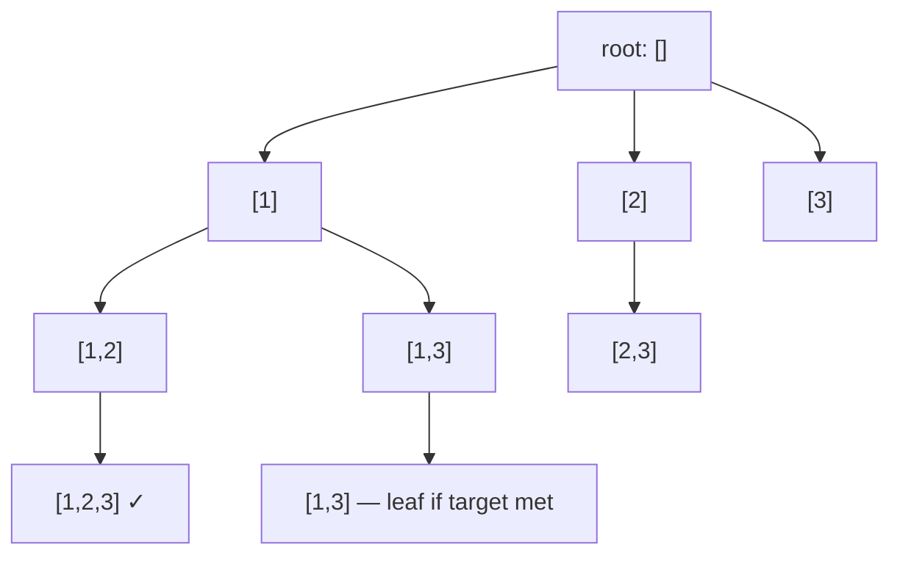

# Greedy and Backtracking

## Core Concepts

- **Greedy** — at each step, pick the choice that looks best locally. Requires proof of correctness.
- **Exchange argument** — assume an optimal solution differs from greedy; show swapping the differing choice to greedy's choice doesn't make things worse → greedy optimal.
- **Matroid** — algebraic structure guaranteeing greedy correctness (interval scheduling, Kruskal's MST). Not always testable, but good vocabulary.
- **Backtracking** — DFS over decision tree; undo choices (backtrack) when a path fails a constraint.
- **Pruning** — cut branches of the decision tree early to reduce search space.
- **Divide & Conquer** — split problem into independent subproblems, solve each, combine. No overlapping subproblems (otherwise use DP).

---

## Greedy vs DP

| Aspect            | Greedy                             | Dynamic Programming                   |
| ----------------- | ---------------------------------- | ------------------------------------- |
| Subproblems       | Independent after choice           | Overlapping                           |
| Choice            | Local optimum                      | All possibilities explored            |
| Correctness       | Needs exchange argument            | Always correct if recurrence is right |
| Complexity        | Usually O(n log n) or O(n)         | O(n²) to O(n³) or higher              |
| Examples          | Interval scheduling, Huffman       | Knapsack, LCS, TSP                    |
| When greedy fails | 0/1 Knapsack (items not divisible) | Use DP instead                        |

---

## Classic Greedy Problems

### Interval Scheduling (Activity Selection)

Sort by **end time**. Greedily pick each interval that starts ≥ last selected end.

```csharp
int MaxIntervals(int[][] intervals)
{
    Array.Sort(intervals, (a, b) => a[1] - b[1]); // sort by end time
    int count = 1, end = intervals[0][1];
    for (int i = 1; i < intervals.Length; i++)
        if (intervals[i][0] >= end) { count++; end = intervals[i][1]; }
    return count;
}
```

**LeetCode 435 (Non-overlapping Intervals)**, **452 (Minimum Arrows)**, **56 (Merge Intervals — sort by start)**.

### Jump Game (LeetCode 55)

Track the farthest reachable index. If current index > farthest → impossible.

```csharp
bool CanJump(int[] nums)
{
    int reach = 0;
    for (int i = 0; i < nums.Length; i++)
    {
        if (i > reach) return false;
        reach = Math.Max(reach, i + nums[i]);
    }
    return true;
}
```

### Gas Station (LeetCode 134)

If total gas ≥ total cost, a solution always exists. Start from any point where running sum drops below 0 → reset start to next index.

### Huffman Coding (Greedy + Min-Heap)

Build frequency min-heap. Repeatedly extract two minimum-frequency nodes, combine into parent, reinsert. O(n log n). Produces optimal prefix-free encoding.

### Other Canonical Greedy

| Problem          | LeetCode | Key greedy insight                                        |
| ---------------- | -------- | --------------------------------------------------------- |
| Jump Game II     | 45       | Track current level's farthest reach (BFS-like)           |
| Assign Cookies   | 455      | Sort both; greedily match smallest sufficient cookie      |
| Partition Labels | 763      | Extend partition end to last occurrence of all chars seen |
| Task Scheduler   | 621      | Always schedule most-frequent available task              |
| Meeting Rooms II | 253      | Min-heap of end times; add room if no overlap             |

---

## Greedy Fails — Use DP Instead

| Problem                         | Why greedy fails                                                 | Use          |
| ------------------------------- | ---------------------------------------------------------------- | ------------ |
| 0/1 Knapsack                    | Can't take partial item; local best ≠ global                     | DP           |
| Coin Change                     | Min coins: greedy picks largest coin → may miss smaller combo    | DP           |
| LCS                             | "Locally matching" characters may skip globally better alignment | DP           |
| Matrix chain mult               | Greedy bracket order ≠ minimum operations                        | Interval DP  |
| Shortest path w/ negative edges | Local minimum edge ≠ global shortest path                        | Bellman-Ford |

---

## Backtracking Template

```csharp
void Backtrack(List<int> current, /* other params */)
{
    if (IsSolution(current))
    {
        result.Add(new List<int>(current));
        return;
    }
    foreach (var choice in GetChoices(current))
    {
        if (!IsValid(current, choice)) continue; // pruning
        current.Add(choice);
        Backtrack(current, /* updated params */);
        current.RemoveAt(current.Count - 1); // undo
    }
}
```

### Subsets (LeetCode 78)

```csharp
void Subsets(int[] nums, int start, List<int> cur, List<List<int>> res)
{
    res.Add(new List<int>(cur));
    for (int i = start; i < nums.Length; i++)
    {
        cur.Add(nums[i]);
        Subsets(nums, i + 1, cur, res);
        cur.RemoveAt(cur.Count - 1);
    }
}
```

### Permutations (LeetCode 46)

```csharp
void Permute(int[] nums, bool[] used, List<int> cur, List<List<int>> res)
{
    if (cur.Count == nums.Length) { res.Add(new List<int>(cur)); return; }
    for (int i = 0; i < nums.Length; i++)
    {
        if (used[i]) continue;
        used[i] = true; cur.Add(nums[i]);
        Permute(nums, used, cur, res);
        used[i] = false; cur.RemoveAt(cur.Count - 1);
    }
}
```

### Combination Sum (LeetCode 39)

Allow reuse: `Backtrack(i, ...)` not `Backtrack(i+1, ...)`. Prune when `remaining < 0`.

### N-Queens (LeetCode 51)

Track which columns and diagonals are occupied. `colUsed`, `diag1[r-c+n]`, `diag2[r+c]`.

```csharp
void Solve(int row, int n, bool[] col, bool[] d1, bool[] d2, char[][] board, List<IList<string>> res)
{
    if (row == n) { res.Add(board.Select(r => new string(r)).ToList()); return; }
    for (int c = 0; c < n; c++)
    {
        if (col[c] || d1[row-c+n] || d2[row+c]) continue;
        col[c] = d1[row-c+n] = d2[row+c] = true; board[row][c] = 'Q';
        Solve(row+1, n, col, d1, d2, board, res);
        col[c] = d1[row-c+n] = d2[row+c] = false; board[row][c] = '.';
    }
}
```

### Sudoku Solver (LeetCode 37)

For each empty cell, try digits 1–9 with row/col/box validity checks. Prune immediately on conflict.

### Word Search (LeetCode 79)

DFS on grid, mark visited by XOR with a sentinel, unmark on backtrack.

---

## Backtracking Decision Tree



Each node = partial solution; leaf = complete solution or dead end.

---

## Divide & Conquer

**Pattern:** `solve(problem) = combine(solve(left), solve(right))`.

### Merge Sort

```csharp
void MergeSort(int[] arr, int l, int r)
{
    if (l >= r) return;
    int mid = (l + r) / 2;
    MergeSort(arr, l, mid); MergeSort(arr, mid+1, r);
    Merge(arr, l, mid, r);
}
```

**LeetCode 315: Count of Smaller Numbers After Self** — augment merge sort to count inversions.

### Quickselect (Kth Smallest in O(n) average)

```csharp
int QuickSelect(int[] nums, int l, int r, int k)
{
    if (l == r) return nums[l];
    int pivot = Partition(nums, l, r);
    if (k == pivot) return nums[k];
    return k < pivot ? QuickSelect(nums, l, pivot-1, k) : QuickSelect(nums, pivot+1, r, k);
}
```

Average O(n), worst O(n²). **LeetCode 215: Kth Largest Element.**

### Closest Pair of Points

1. Sort by x. Split at median.
2. Recurse on both halves → `d = min(d_left, d_right)`.
3. Check strip of width `2d` around the split line.
   Time O(n log n).

### Meet-in-the-Middle

Split problem in half; solve each half exhaustively; combine. Reduces O(2^n) to O(2^(n/2) · log(2^(n/2))) = O(2^(n/2) · n). **LeetCode 805 (Split Array Same Average)**, subset sum with large n.

---

## Recursion to Iteration Patterns

| Recursive pattern | Iterative equivalent                       |
| ----------------- | ------------------------------------------ |
| DFS on tree       | `Stack<TreeNode>`                          |
| Merge sort        | Bottom-up merge passes                     |
| Backtracking      | Explicit `Stack<State>` + undo log         |
| Fibonacci DP      | Loop with prev/curr variables              |
| Tail recursion    | Direct loop (compiler may optimize anyway) |

---

## Trade-offs & When to Use

- **Greedy**: fast O(n log n); verify correctness with exchange argument before trusting.
- **Backtracking**: exponential worst case — always add pruning. Constraint propagation (Sudoku) dramatically reduces search space.
- **Divide & conquer**: works when subproblems are **independent**. If overlapping → DP. If order matters → backtracking.
- **Meet-in-the-middle**: when n ≤ 40 and brute-force 2^n is too slow but 2^20 is fine.
