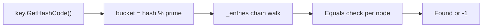

# Hashing

## Core Concepts

- **Hash function** — maps key to bucket index. Good properties: uniform distribution, deterministic, fast to compute, avalanche effect (small key change → large hash change).
- **Collision** — two distinct keys map to the same bucket. Unavoidable by pigeonhole; must be resolved.
- **Load factor (α)** — `count / capacity`. As α → 1, collision probability rises; C# `Dictionary` resizes (doubles) when α exceeds ~0.72 (prime bucket count keeps distribution uniform).
- **Chaining** — each bucket is a linked list of colliding entries. O(1+α) average lookup; O(n) worst.
- **Open addressing** — on collision, probe for next empty slot. Probing strategies: linear, quadratic, double hashing.

---

## Collision Resolution Comparison

| Strategy           | Lookup avg | Lookup worst      | Cache friendliness     | Delete complexity        |
| ------------------ | ---------- | ----------------- | ---------------------- | ------------------------ |
| Chaining           | O(1+α)     | O(n)              | Poor (pointer chase)   | Easy (remove from list)  |
| Linear probing     | O(1/(1-α)) | O(n)              | Excellent (sequential) | Needs tombstone          |
| Quadratic probing  | O(1/(1-α)) | O(n)              | Medium                 | Needs tombstone          |
| Robin Hood hashing | O(1) avg   | O(log n) expected | Good                   | Complex (backward shift) |

**Robin Hood** — on collision, steal slot from the richer entry (smaller probe distance) for the poorer (larger probe distance). Evens out probe sequences; used in Rust's `HashMap`.

---

## C# `Dictionary<K,V>` Internals

`Dictionary<K,V>` uses **chaining with open-addressing-style arrays** (not pointer-linked lists):

- `int[] _buckets` — length = prime ≥ capacity; stores index into `_entries` of the head of a chain.
- `Entry[] _entries` — struct array; each `Entry` = `{ hashCode, next (chain index), key, value }`.
- On `Add(key, val)`: compute `hash = key.GetHashCode()`, bucket = `hash % _buckets.Length`; walk chain to detect duplicate; prepend new entry to chain.
- On resize: double to next prime; rehash all entries.
- `GetHashCode` is called once per operation; `Equals` is called for each chain element with matching `hashCode`.



---

## `GetHashCode` / `Equals` Contract

**Contract (must satisfy both or `Dictionary` breaks):**

1. If `a.Equals(b)` then `a.GetHashCode() == b.GetHashCode()`.
2. `GetHashCode()` must be stable during the object's lifetime as a dictionary key — do NOT use mutable fields.
3. `Equals` must be reflexive, symmetric, transitive, consistent.

**Why mutable keys break dictionaries:**
When a key's hash changes after insertion, the lookup bucket index changes — the entry is "lost" (it's in bucket `oldHash % size` but lookups probe `newHash % size`).

```csharp
// Good immutable value-based key
public sealed class Point
{
    public int X { get; }
    public int Y { get; }
    public Point(int x, int y) { X = x; Y = y; }
    public override bool Equals(object obj) => obj is Point p && p.X == X && p.Y == Y;
    public override int  GetHashCode() => HashCode.Combine(X, Y);
}
```

---

## HashSet

`HashSet<T>` is a `Dictionary<T, bool>` without the value. Same O(1) avg ops: `Add`, `Remove`, `Contains`.

```csharp
var set = new HashSet<int>();
set.Add(1); set.Add(2); set.Add(1); // set = {1, 2}
set.Contains(2); // true — O(1)
set.ExceptWith(other);     // A \ B
set.IntersectWith(other);  // A ∩ B
set.UnionWith(other);      // A ∪ B
```

---

## Frequency Counting Patterns

```csharp
// Count frequencies
var freq = new Dictionary<int, int>();
foreach (int x in nums)
    freq[x] = freq.GetValueOrDefault(x) + 1;

// Top-k most frequent (use min-heap of size k)
var pq = new PriorityQueue<int, int>();
foreach (var (val, cnt) in freq)
{
    pq.Enqueue(val, cnt);
    if (pq.Count > k) pq.Dequeue(); // evict least frequent
}
// LeetCode 347 — Top K Frequent Elements
```

---

## Two-Sum Family

```csharp
// Two Sum (LeetCode 1) — O(n) time, O(n) space
int[] TwoSum(int[] nums, int target)
{
    var map = new Dictionary<int, int>(); // value → index
    for (int i = 0; i < nums.Length; i++)
    {
        int complement = target - nums[i];
        if (map.TryGetValue(complement, out int j)) return [j, i];
        map[nums[i]] = i;
    }
    return [];
}

// Four Sum Count (LeetCode 454) — O(n²)
int FourSumCount(int[] A, int[] B, int[] C, int[] D)
{
    var map = new Dictionary<int, int>();
    foreach (int a in A) foreach (int b in B)
        map[a + b] = map.GetValueOrDefault(a + b) + 1;
    int count = 0;
    foreach (int c in C) foreach (int d in D)
        count += map.GetValueOrDefault(-(c + d));
    return count;
}
```

---

## Group Anagrams

```csharp
// LeetCode 49 — O(n * k log k) where k = max word length
IList<IList<string>> GroupAnagrams(string[] strs)
{
    var map = new Dictionary<string, List<string>>();
    foreach (var s in strs)
    {
        var key = string.Concat(s.OrderBy(c => c)); // sorted chars as key
        if (!map.ContainsKey(key)) map[key] = new List<string>();
        map[key].Add(s);
    }
    return new List<IList<string>>(map.Values);
}
// Alternative key: 26-char frequency string — avoids sort, O(n*k)
```

---

## Subarray Sum Equals K (Prefix Sum + HashMap)

```csharp
// LeetCode 560 — O(n) time, O(n) space
int SubarraySum(int[] nums, int k)
{
    var prefixCount = new Dictionary<int, int> { [0] = 1 };
    int sum = 0, count = 0;
    foreach (int x in nums)
    {
        sum += x;
        count += prefixCount.GetValueOrDefault(sum - k);
        prefixCount[sum] = prefixCount.GetValueOrDefault(sum) + 1;
    }
    return count;
}
// Key insight: subarray[i+1..j] sums to k iff prefix[j] - prefix[i] = k
//              iff prefix[i] = prefix[j] - k was seen before.
```

**Canonical problems:**

- LeetCode 1 — Two Sum
- LeetCode 49 — Group Anagrams
- LeetCode 347 — Top K Frequent Elements
- LeetCode 560 — Subarray Sum Equals K
- LeetCode 128 — Longest Consecutive Sequence (O(n) with HashSet)
- LeetCode 454 — 4Sum II

---

## Longest Consecutive Sequence

```csharp
// LeetCode 128 — O(n) with HashSet
int LongestConsecutive(int[] nums)
{
    var set = new HashSet<int>(nums);
    int best = 0;
    foreach (int n in set)
    {
        if (set.Contains(n - 1)) continue; // only start from sequence beginning
        int len = 1;
        while (set.Contains(n + len)) len++;
        best = Math.Max(best, len);
    }
    return best;
}
```

---

## Consistent Hashing (Pointer)

Consistent hashing distributes keys across nodes so that when a node is added/removed, only `n/k` keys need remapping (not all). Uses a virtual ring of hash slots. Each physical node owns multiple virtual nodes for even distribution.
See [System Design — Consistent Hashing](../05-System-Design-HLD/08-Consistent-Hashing-Sharding-and-Rate-Limiting.md) for full treatment.

---

## Designing a Good `GetHashCode`

```csharp
// Combine multiple fields: use HashCode.Combine (crypto-quality mixing)
public override int GetHashCode()
    => HashCode.Combine(Field1, Field2, Field3);

// For collections as keys (rare — prefer value-type wrappers):
public override int GetHashCode()
{
    var hash = new HashCode();
    foreach (var item in _items) hash.Add(item);
    return hash.ToHashCode();
}
// Never use: XOR alone (commutative → {1,2} same hash as {2,1})
// Never use: mutable fields
// C# randomises seed per-process (ASLR) — HashCode.Combine is not stable across processes.
```
