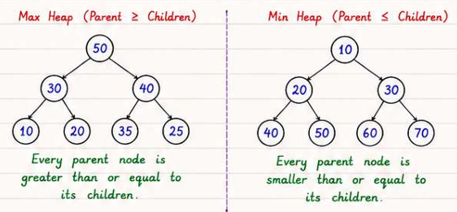

# Heaps and Priority Queues

> **Core idea:** A heap is a complete binary tree stored as an array; it gives O(1) min/max peek and O(log n) insert/extract. Use it whenever you need to repeatedly ask "what is the current minimum/maximum?" without sorting everything.
> **Recognise it when:** "kth largest/smallest", "top K", "median of a stream", "merge K sorted …", "schedule tasks with cooldown", "minimum cost to connect".
> **Costs:** Insert O(log n) · Extract O(log n) · Peek O(1) · Build O(n).

## Mental Model

A **binary heap** is a **complete binary tree** — every level is fully filled except possibly the last, which fills left-to-right — stored compactly in an array via level-order traversal.

**Invariant (min-heap):** every node's value ≤ both its children's values. The minimum is always at the root.



Array: `[1, 3, 5, 7, 9, 6]` — index 0 is root; each level reads left-to-right.

**Index arithmetic (0-indexed):**

| Relation | Formula |
| -------- | ------- |
| Left child of `i` | `2i + 1` |
| Right child of `i` | `2i + 2` |
| Parent of `i` | `(i - 1) / 2` |
| First leaf | `n / 2` (nodes `n/2 … n-1` are leaves) |

**1-indexed variant** (common in competitive programming): left = `2i`, right = `2i+1`, parent = `i/2`. Preferred when bit-shifting is used (`i << 1`, `i >> 1`) because it avoids the off-by-one in 0-indexed arithmetic.

### Core Operations

| Operation | Description | Time |
| --------- | ----------- | ---- |
| **Insert** | Append at end → sift-up (swap with parent while parent > child) | O(log n) |
| **Extract-min** | Swap root ↔ last → remove last → sift-down (swap with smaller child) | O(log n) |
| **Peek** | Read `arr[0]` | O(1) |
| **Delete arbitrary** | Decrease-key to −∞ → extract-min | O(log n) |
| **Decrease-key** | Update value → sift-up | O(log n) with index map |
| **Build-heap** | Sift-down all internal nodes `n/2-1 … 0` | **O(n)** |

### Build-Heap in O(n) — Proof Sketch

> **Why it works:** At height h there are at most ⌈n / 2^(h+1)⌉ nodes, each costing O(h) to sift-down. Total work = Σ_{h=0}^{log n} h · n/2^(h+1) = n · Σ h/2^h. The series Σ h/2^h converges to 2, so total = O(n). Contrast with inserting one-by-one: that is O(n log n).

### Sift-down (sift-up is symmetric)

```text
SIFT_DOWN(arr, n, i):             // min-heap
    smallest = i
    left  = 2*i + 1
    right = 2*i + 2
    if left < n and arr[left] < arr[smallest]:  smallest = left
    if right < n and arr[right] < arr[smallest]: smallest = right
    if smallest != i:
        swap(arr[i], arr[smallest])
        SIFT_DOWN(arr, n, smallest)
```

---

## Implement a Heap from Scratch

Interviewers occasionally ask you to hand-roll one. Keep it to ~30 lines.

```csharp
// Min-heap over int. Extend with generics / IComparer for production use.
public class MinHeap
{
    private readonly List<int> _data = new();

    public int Count => _data.Count;
    public int Peek() => _data[0]; // caller must check Count > 0

    public void Push(int val)
    {
        _data.Add(val);
        SiftUp(_data.Count - 1);
    }

    public int Pop()
    {
        int top = _data[0];
        int last = _data.Count - 1;
        _data[0] = _data[last];
        _data.RemoveAt(last);
        if (_data.Count > 0) SiftDown(0);
        return top;
    }

    private void SiftUp(int i)
    {
        while (i > 0)
        {
            int parent = (i - 1) / 2;
            if (_data[parent] <= _data[i]) break;
            (_data[parent], _data[i]) = (_data[i], _data[parent]);
            i = parent;
        }
    }

    private void SiftDown(int i)
    {
        int n = _data.Count;
        while (true)
        {
            int smallest = i, l = 2 * i + 1, r = 2 * i + 2;
            if (l < n && _data[l] < _data[smallest]) smallest = l;
            if (r < n && _data[r] < _data[smallest]) smallest = r;
            if (smallest == i) break;
            (_data[smallest], _data[i]) = (_data[i], _data[smallest]);
            i = smallest;
        }
    }
}
```

**Time:** Push O(log n) · Pop O(log n) · Peek O(1) · Build by repeated push O(n log n), or heapify loop O(n).

---

## Complexity Reference

| Operation | Binary heap | d-ary heap | Fibonacci heap |
| --------- | ----------- | ---------- | -------------- |
| Insert | O(log n) | O(log_d n) | O(1) amortised |
| Extract-min | O(log n) | O(d log_d n) | O(log n) amortised |
| Decrease-key | O(log n) | O(log_d n) | **O(1) amortised** |
| Build | **O(n)** | O(n) | O(n) |
| Peek | O(1) | O(1) | O(1) |

**d-ary heap:** setting d = 4 reduces tree height and improves cache performance during extract; common in Dijkstra implementations.

**Fibonacci heap:** theoretical Dijkstra bound O((V + E) log V) → O(V log V + E) via O(1) decrease-key. Rarely implemented in practice due to constant factors.

---

## C# `PriorityQueue<TElement,TPriority>` (.NET 6+)

**Min-heap by default** — lower priority value is dequeued first.

```csharp
var pq = new PriorityQueue<string, int>();

// Enqueue / Dequeue
pq.Enqueue("task-A", 3);
pq.Enqueue("task-B", 1);
pq.Enqueue("task-C", 2);
pq.EnqueueRange(new[] { ("task-D", 5), ("task-E", 0) }); // batch enqueue

string item = pq.Dequeue();                               // "task-E" (priority 0) — throws if empty
bool ok = pq.TryDequeue(out string? el, out int pri);     // safe version

// Peek (does NOT remove)
pq.TryPeek(out string? top, out int topPri);

// Combined atomic ops (useful in hot loops)
pq.EnqueueDequeue("new-item", 2);  // enqueue then dequeue min — more efficient than two calls
pq.DequeueEnqueue("new-item", 2);  // dequeue min then enqueue — useful in replacement scenarios

// Iterate without removing (unordered!)
foreach (var (element, priority) in pq.UnorderedItems) { ... }

// Max-heap via custom comparer
var maxHeap = new PriorityQueue<int, int>(Comparer<int>.Create((a, b) => b.CompareTo(a)));

// Max-heap via negation (simpler, works for int/long)
pq.Enqueue(value, -value);

// Tuple priorities for tie-breaking (lexicographic comparison)
// (primaryPriority, insertionOrder) ensures stable FIFO within same priority
int seq = 0;
var stable = new PriorityQueue<string, (int, int)>();
stable.Enqueue("x", (priority, seq++));

// No DecreaseKey — use lazy deletion instead (see Dijkstra pattern below)
```

### Lazy Deletion / Stale-Entry Pattern

`PriorityQueue` has no `DecreaseKey`. The standard workaround: re-enqueue with a new priority and skip stale entries when dequeuing.

```csharp
// Dijkstra-style lazy deletion
var dist = new int[n];
Array.Fill(dist, int.MaxValue);
dist[src] = 0;

var pq = new PriorityQueue<int, int>(); // (node, distance)
pq.Enqueue(src, 0);

while (pq.TryDequeue(out int u, out int d))
{
    if (d > dist[u]) continue; // stale entry — skip it

    foreach (var (v, w) in graph[u])
    {
        if (dist[u] + w < dist[v])
        {
            dist[v] = dist[u] + w;
            pq.Enqueue(v, dist[v]); // re-enqueue; old entry becomes stale
        }
    }
}
```

> **Why it works:** Dijkstra's correctness only requires that we process each node at its final (minimum) distance. When we encounter a stale entry (`d > dist[u]`), the node was already processed at a lower cost, so we discard it safely.

---

## Templates

### Top-K Pattern

**Use when:** "find K largest/smallest/most frequent/closest …"

**Counter-intuitive key:** to find K **largest**, keep a **min**-heap of size K. The min-heap evicts the *weakest candidate*, leaving only the strongest K. If you used a max-heap of size K you'd be evicting the best.

```csharp
// K largest elements — min-heap of size K
// Time: O(n log k)  Space: O(k)
int[] TopKLargest(int[] nums, int k)
{
    var minHeap = new PriorityQueue<int, int>();
    foreach (int num in nums)
    {
        minHeap.Enqueue(num, num);
        if (minHeap.Count > k)
            minHeap.Dequeue(); // evict the current smallest
    }
    // UnorderedItems is NOT sorted — sort if order matters
    return minHeap.UnorderedItems
                  .OrderByDescending(x => x.Element)
                  .Select(x => x.Element)
                  .ToArray();
}
```

**Complexity comparison for "top-K" queries:**

| Approach | Time | Space | Best when |
| -------- | ---- | ----- | --------- |
| Full sort | O(n log n) | O(1) | **k ≈ n**, need sorted output |
| **Min-heap size K** | **O(n log k)** | O(k) | **k ≪ n**, streaming data |
| Quickselect | O(n) average, O(n²) worst | O(1) | k ≪ n, array fits in memory, no sort needed — see [Searching and Sorting](../SearchingAndSorting/SearchingAndSorting.md) |

---

### Two-Heaps / Running Median Pattern

**Use when:** dynamic median, partitioning a stream into two halves.

Invariant: `_lower` (max-heap) holds the smaller half; `_upper` (min-heap) holds the larger half. Sizes differ by at most 1. `_lower` always has ≥ as many elements as `_upper`.

```csharp
// Time: AddNum O(log n)  FindMedian O(1)  Space: O(n)
class MedianFinder
{
    // max-heap: negate priority so PriorityQueue behaves as max-heap
    private readonly PriorityQueue<int, int> _lower = new();
    // min-heap
    private readonly PriorityQueue<int, int> _upper = new();

    public void AddNum(int num)
    {
        // Step 1: always push to lower first
        _lower.Enqueue(num, -num);

        // Step 2: ensure every element in lower ≤ every element in upper
        _lower.TryPeek(out int loMax, out _);
        if (_upper.Count > 0)
        {
            _upper.TryPeek(out int upMin, out _);
            if (loMax > upMin)
            {
                _lower.Dequeue();
                _upper.Enqueue(loMax, loMax);
            }
        }

        // Step 3: rebalance sizes so lower.Count == upper.Count or lower.Count == upper.Count + 1
        if (_lower.Count > _upper.Count + 1)
        {
            int v = _lower.Dequeue();
            _upper.Enqueue(v, v);
        }
        else if (_upper.Count > _lower.Count)
        {
            int v = _upper.Dequeue();
            _lower.Enqueue(v, -v);
        }
    }

    public double FindMedian()
    {
        if (_lower.Count > _upper.Count)
        {
            _lower.TryPeek(out int m, out _);
            return m;
        }
        _lower.TryPeek(out int a, out _);
        _upper.TryPeek(out int b, out _);
        return (a + b) / 2.0;
    }
}
```

**Trace on `[1, 2, 3, 4]`:**

| Call | lower (max-heap) | upper (min-heap) | Median |
| ---- | ---------------- | ---------------- | ------ |
| AddNum(1) | [1] | [] | — |
| AddNum(2) | [1] | [2] | 1.5 |
| AddNum(3) | [1,2] → rebalance → [1] | [2] → [2,3] | wait… after add(3): lower=[1,2]→rebalance→[2] upper=[3]? No — let's trace carefully |

Detailed trace:

- **Add(1):** push 1 to lower → lower=[1]. No upper → no cross-check. Sizes: lower=1, upper=0 ✅
- **Add(2):** push 2 to lower → lower=[2,1] (max-heap, top=2). loMax=2, upMin=∞ → no cross-swap. lower.Count(2) > upper.Count(0)+1 → move top(2) to upper → lower=[1], upper=[2]. ✅
- **Add(3):** push 3 to lower → lower=[3,1] (top=3). upMin=2. 3>2 → swap: move 3 to upper → lower=[1], upper=[2,3]. lower.Count(1) < upper.Count(2) → move upMin(2) to lower → lower=[2,1], upper=[3]. ✅
- **Add(4):** push 4 to lower → lower=[4,2,1] (top=4). upMin=3. 4>3 → swap: move 4 to upper → lower=[2,1], upper=[3,4]. Sizes 2==2. ✅ Median = (2+3)/2 = **2.5** ✅

---

### K-Way Merge Pattern

**Use when:** merging K sorted sequences, Kth smallest in a matrix, smallest range covering K lists.

```csharp
// Merge K sorted arrays — Time: O(N log K)  Space: O(K)
// N = total elements, K = number of sequences
IList<int> MergeKSorted(int[][] arrays)
{
    // heap item: (value, arrayIndex, posInArray)
    var heap = new PriorityQueue<(int val, int ai, int pi), int>();
    for (int i = 0; i < arrays.Length; i++)
    {
        if (arrays[i].Length > 0)
            heap.Enqueue((arrays[i][0], i, 0), arrays[i][0]);
    }

    var result = new List<int>();
    while (heap.TryDequeue(out var item, out _))
    {
        result.Add(item.val);
        int next = item.pi + 1;
        if (next < arrays[item.ai].Length)
            heap.Enqueue((arrays[item.ai][next], item.ai, next), arrays[item.ai][next]);
    }
    return result;
}
```

---

### Scheduling / Greedy with Heap Pattern

**Use when:** "minimum intervals/idle time", "task cooldown", "reorganise so no two same adjacent".

The greedy principle: **always pick the highest-frequency (or highest-priority) available item** at each step.

```csharp
// Task Scheduler (LeetCode 621) — corrected greedy simulation
// Time: O(n log n)  Space: O(n)
int LeastInterval(char[] tasks, int n)
{
    var freq = new int[26];
    foreach (char t in tasks) freq[t - 'A']++;

    // max-heap on frequency
    var maxHeap = new PriorityQueue<int, int>(Comparer<int>.Create((a, b) => b.CompareTo(a)));
    foreach (int f in freq)
        if (f > 0) maxHeap.Enqueue(f, f);

    int time = 0;
    // cooldown queue stores (remainingFreq, timeWhenAvailable)
    var cooldown = new Queue<(int freq, int available)>();

    while (maxHeap.Count > 0 || cooldown.Count > 0)
    {
        time++;
        // release tasks whose cooldown has expired
        if (cooldown.Count > 0 && cooldown.Peek().available == time)
        {
            var (f, _) = cooldown.Dequeue();
            maxHeap.Enqueue(f, f);
        }

        // execute the most-frequent available task
        if (maxHeap.Count > 0)
        {
            int f = maxHeap.Dequeue();
            if (f - 1 > 0)
                cooldown.Enqueue((f - 1, time + n + 1));
        }
        // else: CPU is idle this tick
    }
    return time;
}
```

**O(n) math formula alternative:**

```csharp
int LeastIntervalMath(char[] tasks, int n)
{
    var freq = new int[26];
    foreach (char t in tasks) freq[t - 'A']++;
    int maxFreq = freq.Max();
    int countMax = freq.Count(f => f == maxFreq);
    // (maxFreq-1) full frames of size (n+1), plus the last partial frame of countMax tasks
    int candidate = (maxFreq - 1) * (n + 1) + countMax;
    return Math.Max(tasks.Length, candidate);
}
```

> **Why the formula works:** Picture tasks laid out in frames of `n+1` slots. The most-frequent task appears `maxFreq` times; it creates `maxFreq-1` full frames. Each frame is `n+1` wide (task + n cooldown slots). The last position holds `countMax` tasks (all tasks tied for max frequency). If other tasks fill in all the cooldown slots, no idle time is needed and the answer is simply `tasks.Length`.

---

## Pattern Recognition

| Problem says… | Reach for | Complexity |
| ------------- | --------- | ---------- |
| "Kth largest / smallest" | Min-heap of size K | O(n log k) |
| "Top K frequent / closest" | Frequency map + min-heap size K | O(n log k) |
| "Median from stream / sliding window median" | Two heaps | O(n log n) |
| "Merge K sorted lists / arrays" | Min-heap on list heads | O(N log K) |
| "Kth smallest in sorted matrix" | K-way merge heap | O(k log k) … O(k log min(k,n)) |
| "Task cooldown / CPU scheduling" | Max-heap + cooldown queue | O(n log n) |
| "Minimum cost to connect / combine" | Min-heap + greedy | O(n log n) |
| "Reorganise / rearrange (no two same adjacent)" | Max-heap greedy | O(n log n) |
| "Scheduling with deadlines, maximise profit" | Max-heap on profit | O(n log n) |
| "Ugly numbers / next element from 2–3 sets" | Min-heap dedup | O(k log k) |
| "Sliding window min/max" | Monotonic deque — see [Stacks and Queues](../StacksAndQueues/StacksAndQueues.md) | O(n) |

---

## Variants and Differences

### Heap vs BST / SortedSet vs Sorted Array

| Feature | **Heap** | `SortedSet<T>` (Red-Black BST) | Sorted array |
| ------- | -------- | ------------------------------ | ------------ |
| Min/Max peek | **O(1)** | O(log n) (`Min`/`Max`) | O(1) |
| Insert | **O(log n)** | O(log n) | O(n) |
| Delete arbitrary | O(log n) with index | **O(log n)** | O(n) |
| In-order iteration | ❌ | **✅** | ✅ |
| Predecessor/successor | ❌ | **✅** | ✅ (binary search) |
| Range queries | ❌ | **✅** | ✅ |
| Decrease-key | O(log n) with index map | O(log n) delete+insert | O(n) |
| Space | **O(n) compact array** | O(n) + pointer overhead | O(n) |

**Choose heap** when you only need repeated min/max extraction and inserts (Dijkstra, top-K, median).

**Choose `SortedSet`** when you need predecessor/successor queries, range queries, or ordered iteration (sliding window problems where you delete by value).

---

## Pitfalls

- **Min vs max heap direction for top-K:** to find K *largest*, use a *min*-heap of size K (evict the smallest). Using a max-heap of size K is wrong — you'd evict the largest.
- **`PriorityQueue` is not stable:** equal-priority items are dequeued in unspecified order. If you need determinism, use a tuple priority `(primaryPriority, insertionCounter)`.
- **Mutating a key after enqueue:** changing a value that was used as a priority after it is inside the queue silently corrupts the heap. Re-enqueue with the new priority instead and skip stale entries.
- **`Dequeue()` on empty throws `InvalidOperationException`:** always check `Count > 0` or use `TryDequeue`.
- **Negating `int.MinValue` overflows:** `-(int.MinValue) == int.MinValue` in C# (two's complement overflow). When faking a max-heap by negating, use `long` or add a guard: `checked { pq.Enqueue(v, -v); }`.
- **Forgetting the stale-entry check in Dijkstra:** omitting `if (d > dist[u]) continue;` causes nodes to be processed multiple times, silently producing wrong results for non-trivial graphs.
- **`UnorderedItems` is not sorted:** iterating `pq.UnorderedItems` gives elements in internal heap array order, not priority order. Call `.OrderBy(x => x.Priority)` or drain the heap with repeated `Dequeue()` if sorted output is required.
- **`EnqueueDequeue` vs separate calls:** `EnqueueDequeue` is faster (one sift instead of two) and should be preferred in hot loops.

---

## Practice

→ Full solutions in [Problems.md](Problems.md)

| # | Problem | LeetCode | Pattern |
| - | ------- | -------- | ------- |
| 1 | Last Stone Weight | 1046 | Max-heap simulation |
| 2 | Kth Largest Element in an Array | 215 | Top-K |
| 3 | K Closest Points to Origin | 973 | Top-K |
| 4 | Top K Frequent Elements | 347 | Top-K + frequency map |
| 5 | Kth Largest Element in a Stream | 703 | Top-K stream |
| 6 | Find Median from Data Stream | 295 | Two heaps |
| 7 | Sliding Window Median | 480 | Two heaps + lazy deletion |
| 8 | Merge k Sorted Lists | 23 | K-way merge |
| 9 | Kth Smallest in Sorted Matrix | 378 | K-way merge |
| 10 | Smallest Range Covering K Lists | 632 | K-way merge |
| 11 | Task Scheduler | 621 | Scheduling + heap |
| 12 | Meeting Rooms II | 253 | Scheduling + heap |
| 13 | Reorganize String | 767 | Greedy + heap |
| 14 | Minimum Cost to Connect Sticks | 1167 | Greedy + heap |
| 15 | IPO | 502 | Greedy + heap |
| 16 | Ugly Number II | 264 | Min-heap dedup |
| 17 | Design Twitter | 355 | K-way merge design |
| 18 | Top K Frequent Words | 692 | Top-K + tie-breaking |
| 19 | Meeting Rooms III | 2402 | Dual-heap scheduling |
