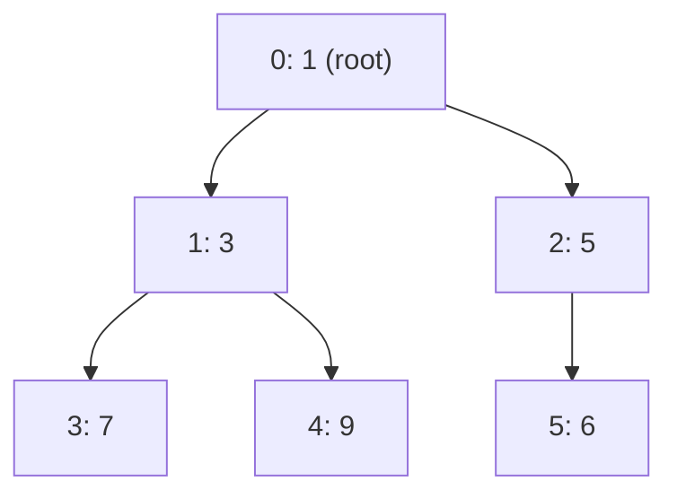

# Heaps and Priority Queues

- Complete Binary Tree
- Max Heap: Parent node >= Child nodes
- Min Heap: Parent node <= Child nodes
- Applications: Priority Queue, Heap Sort, Graph Algorithms (Dijkstra's, Prim's)


**Array representation of Heap:**

- For node at index i:
  - Left child index = 2 \* i + 1
  - Right child index = 2 \* i + 2
  - Parent index = (i - 1) / 2
  - Root node is at index 0
  - Leaf nodes are at indices n/2 to n-1 (0-based indexing)

**Operations on Heap:**

- Insert
  - Insert at end > Heapify up (compare with parent and swap if necessary)
- Delete
  - Replace root with last element > Heapify down (compare with children and swap if necessary)
- Build Heap
  - Assume all elements are in the array, leaf nodes are already heaps
  - Operate on all non-leaf nodes from bottom to top and heapify each node

```cs
INSERT_HEAP(arr, key):
    arr.append(key)
    i = length(arr) - 1
    while i != 0 and arr[PARENT(i)] < arr[i]:
        swap(arr[i], arr[PARENT(i)])
        i = PARENT(i)

DELETE_HEAP(arr, key):
    index = FIND_INDEX(arr, key)
    if index == -1:
        return
    arr[index] = arr[length(arr) - 1]
    arr.pop()
    HEAPIFY(arr, length(arr), index)

HEAPIFY(arr, n, i):
    largest = i
    left = 2 * i + 1
    right = 2 * i + 2

    if left < n and arr[left] > arr[largest]:
        largest = left

    if right < n and arr[right] > arr[largest]:
        largest = right

    if largest != i:
        swap(arr[i], arr[largest])
        HEAPIFY(arr, n, largest)
```

## Core Concepts

- **Binary heap** — complete binary tree satisfying the heap property (min-heap: parent ≤ children; max-heap: parent ≥ children).
- **Array representation** — for 0-indexed node `i`: left = `2i+1`, right = `2i+2`, parent = `(i-1)/2`.
- **Sift-up (bubble-up)** — after insert at end, swap with parent while heap property violated. O(log n).
- **Sift-down (heapify-down)** — after extract-min (replace root with last element), swap with smaller child repeatedly. O(log n).
- **Build-heap (heapify)** — call sift-down on all internal nodes from `n/2-1` down to 0. **O(n)** — not O(n log n); the sum of heights converges to O(n).
- **Extract-min** — O(log n). **Peek** — O(1). **Decrease-key** — O(log n) with index map.
- **d-ary heap** — reduces height to log_d(n), better cache on extract when d=4; used in Dijkstra.

### O(n) Heapify — Proof Sketch

At height h there are at most ⌈n/2^(h+1)⌉ nodes, each costing O(h). Total = Σ h·n/2^(h+1) = n·Σ h/2^h = O(n) (geometric series converges to 2).

---

## Heap Array / Tree Mapping



Array: `[1, 3, 5, 7, 9, 6]` — level-order traversal.

---

## C# `PriorityQueue<TElement,TPriority>` (.NET 6+)

```csharp
// Min-heap by default (lower priority value = dequeued first)
var pq = new PriorityQueue<string, int>();
pq.Enqueue("task-A", 3);
pq.Enqueue("task-B", 1);
pq.Enqueue("task-C", 2);

while (pq.Count > 0)
{
    pq.TryDequeue(out var item, out var priority); // "task-B"(1), "task-C"(2), "task-A"(3)
    Console.WriteLine($"{item} pri={priority}");
}

// Max-heap: negate priority
pq.Enqueue("item", -score);

// Peek without removing
pq.TryPeek(out var top, out var topPri);
```

- **No `DecreaseKey`** in BCL — use lazy deletion (re-enqueue + skip stale entries).
- For max-heap: pass `Comparer<int>.Create((a,b) => b-a)` or negate priority.

---

## Top-K Pattern

**Goal:** Find K largest (or smallest) elements from a stream/array in O(n log K).

```csharp
// K largest elements — maintain a min-heap of size K
int[] TopK(int[] nums, int k)
{
    var minHeap = new PriorityQueue<int, int>();
    foreach (var n in nums)
    {
        minHeap.Enqueue(n, n);
        if (minHeap.Count > k)
            minHeap.Dequeue(); // evict the smallest
    }
    return minHeap.UnorderedItems.Select(x => x.Element).ToArray();
}
```

- **LeetCode 215: Kth Largest Element** — same pattern, return heap.Peek().
- **LeetCode 347: Top K Frequent Elements** — frequency map + min-heap on frequency.
- **LeetCode 973: K Closest Points to Origin** — max-heap on distance, size K.

---

## Two-Heaps: Running Median

Keep lower half in a **max-heap**, upper half in a **min-heap**. Balance sizes ±1.

```csharp
class MedianFinder
{
    // lower half max-heap (negate priority)
    private PriorityQueue<int, int> _lower = new();
    // upper half min-heap
    private PriorityQueue<int, int> _upper = new();

    public void AddNum(int num)
    {
        _lower.Enqueue(num, -num);          // push to lower
        // ensure lower.max <= upper.min
        _lower.TryPeek(out var lo, out _);
        _upper.TryPeek(out var hi, out _);
        if (_upper.Count > 0 && lo > hi)
        {
            _lower.Dequeue();
            _upper.Enqueue(lo, lo);
        }
        // balance sizes
        if (_lower.Count > _upper.Count + 1) { var v = _lower.Dequeue(); _upper.Enqueue(v, v); }
        if (_upper.Count > _lower.Count)     { var v = _upper.Dequeue(); _lower.Enqueue(v, -v); }
    }

    public double FindMedian()
    {
        if (_lower.Count == _upper.Count)
        {
            _lower.TryPeek(out var a, out _); _upper.TryPeek(out var b, out _);
            return (a + b) / 2.0;
        }
        _lower.TryPeek(out var m, out _);
        return m;
    }
}
```

**LeetCode 295: Find Median from Data Stream.**

---

## Merge K Sorted Lists

**LeetCode 23.** Push head of each list into min-heap keyed by node value. Extract min, advance that list's pointer.

```csharp
ListNode MergeKLists(ListNode[] lists)
{
    var heap = new PriorityQueue<ListNode, int>();
    foreach (var h in lists) if (h != null) heap.Enqueue(h, h.val);
    var dummy = new ListNode(0); var cur = dummy;
    while (heap.Count > 0)
    {
        var node = heap.Dequeue();
        cur.next = node; cur = cur.next;
        if (node.next != null) heap.Enqueue(node.next, node.next.val);
    }
    return dummy.next;
}
```

Time: O(N log K) where N = total nodes, K = number of lists.

---

## Task Scheduler (LeetCode 621)

Greedy + max-heap: always execute the most-frequent remaining task. Track cooldown with a queue.

```csharp
int LeastInterval(char[] tasks, int n)
{
    var freq = new int[26];
    foreach (var t in tasks) freq[t - 'A']++;
    var maxHeap = new PriorityQueue<int, int>(Comparer<int>.Create((a, b) => b - a));
    foreach (var f in freq) if (f > 0) maxHeap.Enqueue(f, f); // max-heap
    int time = 0;
    var cooldown = new Queue<(int freq, int available)>();
    while (maxHeap.Count > 0 || cooldown.Count > 0)
    {
        time++;
        if (maxHeap.Count > 0) { var f = maxHeap.Dequeue(); if (f - 1 > 0) cooldown.Enqueue((f - 1, time + n)); }
        if (cooldown.Count > 0 && cooldown.Peek().available == time) maxHeap.Enqueue(cooldown.Dequeue().freq, cooldown.Peek().freq); // re-enqueue
    }
    return time;
}
```

---

## Canonical Problems

| Problem                 | LeetCode | Pattern         | Approach hint                       |
| ----------------------- | -------- | --------------- | ----------------------------------- |
| Kth Largest Element     | 215      | Top-K           | Min-heap size K; peek = answer      |
| Top K Frequent          | 347      | Top-K freq      | Frequency map + min-heap            |
| Find Median from Stream | 295      | Two-heaps       | Lower max-heap + upper min-heap     |
| Merge K Sorted Lists    | 23       | K-way merge     | Min-heap on list heads              |
| Task Scheduler          | 621      | Heap + cooldown | Max-heap + cooldown queue           |
| Ugly Number II          | 264      | Min-heap dedup  | Push multiples of 2,3,5; track seen |
| K Closest Points        | 973      | Top-K           | Max-heap on distance, size K        |
| Reorganize String       | 767      | Greedy + heap   | Max-heap; alternate most-frequent   |

---
