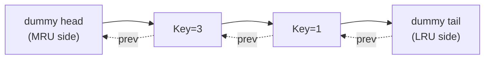

# Linked Lists

> **Core idea:** chain of nodes connected by pointers — O(1) insert/delete at a known pointer, O(n) access.
> **Recognise it when:** "rearrange in-place", "detect cycle", "reverse a portion", "design cache with O(1) ops".
> **Costs:** O(n) traversal, O(1) node surgery (given a pointer), O(n) space for the list itself.

---

## Mental Model

A linked list is a sequence of nodes where each node owns its pointer to the next (and optionally previous) node.
The key invariant: **you always need a pointer to the node *before* the one you want to modify**.

**Node definition (used by all snippets below):**

```csharp
public class ListNode
{
    public int Val;
    public ListNode Next;
    public ListNode(int val = 0, ListNode next = null) { Val = val; Next = next; }
}
```

### Variants

| Variant | Extra pointer | Key use-case |
| ------- | ------------- | ------------ |
| Singly linked | `Next` only | Most LeetCode problems |
| **Doubly linked** | `Prev` + `Next` | **LRU/LFU cache** — O(1) delete of any node |
| Circular | `tail.Next → head` | Round-robin schedulers, Josephus problem |

### Array vs Linked List trade-off

| Operation | Array / `List<T>` | Linked List |
| --------- | ----------------- | ----------- |
| Index access | **O(1)** | O(n) |
| Insert/delete at head | O(n) shift | **O(1)** |
| Insert/delete at known pointer | O(n) shift | **O(1)** |
| Cache locality | **✅ contiguous** | ❌ pointer chasing |
| Memory overhead | None | 8–16 bytes per node |

> **Practical note:** `LinkedList<T>` in C# is almost never the right production choice — cache misses dominate. Use it in interview problems only when you specifically need O(1) node removal given a pointer (e.g., LRU cache).

### Sentinel / Dummy Head

A dummy node placed before the real head eliminates three classes of bugs:

1. **Empty-list special case** — the dummy is always non-null, so `dummy.Next` is the answer.
2. **Deleting the head** — the node before head always exists (it's the dummy).
3. **Building a list by appending** — start `cur = dummy`, append `cur.Next = node`, advance `cur = cur.Next`.

```csharp
var dummy = new ListNode();   // sentinel
var cur = dummy;
// ... build the list ...
return dummy.Next;            // real head
```

---

## How to Not Get Lost — The Three-Variable Dance

> This is the #1 source of bugs in reversal and pointer-manipulation problems.

**Rule: always save `next` before you overwrite `cur.Next`.**

The three variables `prev`, `cur`, `next` represent a sliding window of three consecutive nodes.

```text
State before step:   ... → [prev] → [cur] → [next] → ...

Step:
  1. next = cur.Next        // save the forward pointer FIRST
  2. cur.Next = prev        // redirect cur backwards
  3. prev = cur             // slide prev forward
  4. cur = next             // slide cur forward
```

**Trace on `1 → 2 → 3 → null`:**

```text
Initial:  prev=null  cur=1   next=?

Step 1: next=2,  cur.Next=null,  prev=1,  cur=2     →  null ← 1   2 → 3
Step 2: next=3,  cur.Next=1,     prev=2,  cur=3     →  null ← 1 ← 2   3
Step 3: next=null, cur.Next=2,   prev=3,  cur=null  →  null ← 1 ← 2 ← 3

Return prev = 3  (new head)
```

If you skip step 1 and write `cur.Next = prev` first, `cur.Next` (the only reference to the rest of the list) is lost forever.

---

## Complexity Reference

| Operation | Time | Space | Notes |
| --------- | ---- | ----- | ----- |
| Traversal | O(n) | O(1) | |
| Insert/delete at known node | O(1) | O(1) | Requires pointer to *predecessor* for singly linked |
| Find middle | O(n) | O(1) | Fast/slow pointers |
| Reverse entire list | O(n) | O(1) iterative / O(n) recursive | |
| Reverse k-group | O(n) | O(1) | |
| Detect cycle | O(n) | O(1) | Floyd's |
| Find cycle entry | O(n) | O(1) | Floyd's phase 2 |
| Cycle length | O(n) | O(1) | One extra loop after detection |
| Merge two sorted lists | O(m+n) | O(1) | |
| Sort list (merge sort) | O(n log n) | O(log n) stack | Bottom-up: O(1) space |
| LRU Get / Put | O(1) | O(capacity) | HashMap + DLL |
| LFU Get / Put | O(1) | O(capacity) | HashMap + freq-bucket DLL |

---

## Templates

### 1. Iterative Reversal

Use when: reverse a whole list or a sublist.

```csharp
// O(n) time, O(1) space
ListNode Reverse(ListNode head)
{
    ListNode prev = null, cur = head;
    while (cur != null)
    {
        var next = cur.Next;   // SAVE FIRST
        cur.Next = prev;
        prev = cur;
        cur = next;
    }
    return prev;
}
```

### 2. Recursive Reversal

Use when: recursion is permitted; note O(n) stack space.

```csharp
// O(n) time, O(n) space
ListNode ReverseRec(ListNode head)
{
    if (head?.Next == null) return head;
    var newHead = ReverseRec(head.Next);
    head.Next.Next = head;   // node after head now points back
    head.Next = null;        // head becomes new tail — must null-terminate!
    return newHead;
}
```

### 3. Reverse a Sublist (positions left..right, 1-indexed)

Use when: LeetCode 92 — Reverse Linked List II.

```csharp
// O(n) time, O(1) space
ListNode ReverseBetween(ListNode head, int left, int right)
{
    var dummy = new ListNode(0, head);
    var pre = dummy;
    for (int i = 1; i < left; i++) pre = pre.Next;   // stop just before sublist

    var cur = pre.Next;
    for (int i = 0; i < right - left; i++)
    {
        var next = cur.Next;
        cur.Next = next.Next;
        next.Next = pre.Next;
        pre.Next = next;        // insert 'next' right after 'pre' each iteration
    }
    return dummy.Next;
}
```

### 4. Reverse in K-Groups

Use when: LeetCode 25 — Reverse Nodes in k-Group.

```csharp
// O(n) time, O(1) space
ListNode ReverseKGroup(ListNode head, int k)
{
    var dummy = new ListNode(0, head);
    var groupPrev = dummy;

    while (true)
    {
        var kth = GetKth(groupPrev, k);
        if (kth == null) break;

        var groupNext = kth.Next;
        // Reverse the group
        ListNode prev = groupNext, cur = groupPrev.Next;
        while (cur != groupNext)
        {
            var next = cur.Next;
            cur.Next = prev;
            prev = cur;
            cur = next;
        }
        var tmp = groupPrev.Next;   // old head of group, now tail
        groupPrev.Next = kth;       // connect to new group head
        groupPrev = tmp;            // advance groupPrev to new tail
    }
    return dummy.Next;
}

private ListNode GetKth(ListNode cur, int k)
{
    while (cur != null && k > 0) { cur = cur.Next; k--; }
    return cur;
}
```

**Trace on `1→2→3→4→5`, k=2:**

```text
Group 1: groupPrev=dummy, kth=2, groupNext=3
  Reverse 1→2 with tail=3 → 2→1→3
  groupPrev moves to node 1 (new tail of group)

Group 2: groupPrev=1, kth=4, groupNext=5
  Reverse 3→4 with tail=5 → 4→3→5
  groupPrev moves to node 3

Group 3: kth=null (only node 5 left, k=2 not available) → break

Result: dummy→2→1→4→3→5
```

### 5. Fast / Slow Pointers

```csharp
// Find middle — O(n) time, O(1) space
// Convention A: while (fast != null && fast.Next != null)
//   → slow lands on RIGHT middle for even length (e.g., length 4 → index 2)
// Convention B: while (fast.Next != null && fast.Next.Next != null)
//   → slow lands on LEFT middle for even length (e.g., length 4 → index 1)
// Use Convention B when you need to split the list (slow.Next = second half start).

ListNode FindMiddle(ListNode head)
{
    var slow = head; var fast = head;
    while (fast != null && fast.Next != null)
    {
        slow = slow.Next;
        fast = fast.Next.Next;
    }
    return slow;
}
```

### 6. Floyd's Cycle Detection

```csharp
// Detect cycle entry — O(n) time, O(1) space
ListNode DetectCycleEntry(ListNode head)
{
    var slow = head; var fast = head;
    while (fast?.Next != null)
    {
        slow = slow.Next;
        fast = fast.Next.Next;
        if (slow == fast)
        {
            slow = head;
            while (slow != fast) { slow = slow.Next; fast = fast.Next; }
            return slow;   // cycle entry node
        }
    }
    return null;   // no cycle
}
```

**Proof of Phase 2:** Let F = distance head→entry, C = cycle length, a = steps into cycle at meeting point.
At meeting: slow traveled F+a, fast traveled F+a+nC. Since fast = 2×slow: F+a = nC → **F = nC − a**.
After resetting slow to head: slow needs F steps; fast (from meeting point) needs nC−a = F steps to reach entry. They meet exactly at the cycle entry.

**Cycle length:** once slow == fast, advance one pointer counting steps until it laps back to the meeting point.

### 7. Merge Two Sorted Lists

```csharp
// O(m+n) time, O(1) space
ListNode MergeTwoLists(ListNode l1, ListNode l2)
{
    var dummy = new ListNode();
    var cur = dummy;
    while (l1 != null && l2 != null)
    {
        if (l1.Val <= l2.Val) { cur.Next = l1; l1 = l1.Next; }
        else                  { cur.Next = l2; l2 = l2.Next; }
        cur = cur.Next;
    }
    cur.Next = l1 ?? l2;
    return dummy.Next;
}
```

### 8. Copy List with Random Pointer

```csharp
// HashMap approach — O(n) time, O(n) space
public class Node { public int Val; public Node Next, Random; public Node(int v) { Val = v; } }

Node CopyRandomList(Node head)
{
    if (head == null) return null;
    var map = new Dictionary<Node, Node>();
    for (var cur = head; cur != null; cur = cur.Next)
        map[cur] = new Node(cur.Val);
    for (var cur = head; cur != null; cur = cur.Next)
    {
        map[cur].Next   = cur.Next   != null ? map[cur.Next]   : null;
        map[cur].Random = cur.Random != null ? map[cur.Random] : null;
    }
    return map[head];
}
```

**O(1)-space interleaving approach:**

1. Weave: insert copy of each node right after original (`A → A' → B → B' → ...`).
2. Set `copy.Random = original.Random.Next` (the copy of random's target).
3. Separate: restore original list, extract copy list.

### 9. Doubly-Linked-List Surgery Helpers

```csharp
// Used by LRU/LFU — reusable O(1) helpers
void Remove(DllNode n)
{
    n.Prev.Next = n.Next;
    n.Next.Prev = n.Prev;
}

void InsertAfter(DllNode anchor, DllNode n)
{
    n.Next = anchor.Next;
    n.Prev = anchor;
    anchor.Next.Prev = n;
    anchor.Next = n;
}
```

---

## LRU Cache — Full Implementation

**Structure:** `Dictionary<int, Node>` for O(1) lookup + doubly linked list for O(1) move-to-front (MRU) and O(1) evict-from-back (LRU). Two sentinel nodes eliminate all boundary checks.



```csharp
// O(1) Get and Put. O(capacity) space.
public class LRUCache
{
    private class Node
    {
        public int Key, Val;
        public Node Prev, Next;
        public Node(int k = 0, int v = 0) { Key = k; Val = v; }
    }

    private readonly int _cap;
    private readonly Dictionary<int, Node> _map;
    private readonly Node _head, _tail;   // sentinels: head=MRU side, tail=LRU side

    public LRUCache(int capacity)
    {
        _cap = capacity;
        _map = new Dictionary<int, Node>(capacity);
        _head = new Node(); _tail = new Node();
        _head.Next = _tail; _tail.Prev = _head;
    }

    public int Get(int key)
    {
        if (!_map.TryGetValue(key, out var node)) return -1;
        MoveToFront(node);
        return node.Val;
    }

    public void Put(int key, int value)
    {
        if (_map.TryGetValue(key, out var node))
        {
            node.Val = value;
            MoveToFront(node);
            return;
        }
        if (_map.Count == _cap)
        {
            var lru = _tail.Prev;
            Remove(lru);
            _map.Remove(lru.Key);   // must remove from map too!
        }
        var fresh = new Node(key, value);
        InsertFront(fresh);
        _map[key] = fresh;
    }

    private void Remove(Node n) { n.Prev.Next = n.Next; n.Next.Prev = n.Prev; }
    private void InsertFront(Node n)
    {
        n.Next = _head.Next; n.Prev = _head;
        _head.Next.Prev = n; _head.Next = n;
    }
    private void MoveToFront(Node n) { Remove(n); InsertFront(n); }
}
```

---

## LFU Cache Design

**Concept:** Evict the least-frequently-used key; on frequency tie, evict the least-recently-used among them.

**Why O(1)?** Each frequency bucket is a doubly linked list (insertion order = LRU order within that frequency). `minFreq` tracks which bucket to evict from. All operations touch at most O(1) buckets.

**Data structures:**

- `Dictionary<int, (int val, int freq)> _keyMap` — key → (value, current frequency).
- `Dictionary<int, LinkedList<int>> _freqMap` — frequency → ordered list of keys (front = MRU).
- `Dictionary<int, LinkedListNode<int>> _nodeMap` — key → its `LinkedListNode` for O(1) removal.
- `int _minFreq` — current minimum frequency.

**Operations:**

- **Get(key):** look up value, call `Increment(key)`, return value.
- **Put(key, val):** if exists → update val + `Increment(key)`. If new → if at capacity, evict `_freqMap[_minFreq].Last`; add to `_freqMap[1]`; `_minFreq = 1`.
- **Increment(key):** remove from `_freqMap[freq]`; add to front of `_freqMap[freq+1]`; update `_minFreq` if old bucket is now empty and `_minFreq == freq`.

See [Problems.md](Problems.md) for the complete C# implementation.

---

## Merge K Sorted Lists

This is owned by [Heaps and Priority Queues](../HeapsAndPriorityQueues/HeapsAndPriorityQueues.md) (min-heap approach, O(n log k)).

The divide-and-conquer merge-pairs approach (O(n log k), O(1) space beyond recursion) is a pure linked-list technique — see [Problems.md](Problems.md) for the implementation.

---

## Pattern Recognition

| Problem says… | Reach for | Complexity |
| ------------- | --------- | ---------- |
| "Reverse the list" / "reverse a sublist" | Iterative reversal (`prev`/`cur`/`next` dance) | O(n) / O(1) |
| "Reverse in groups of k" | ReverseKGroup template | O(n) / O(1) |
| "Find middle" / "split into halves" | Fast/slow pointers | O(n) / O(1) |
| "Detect cycle" / "find where cycle begins" | Floyd's cycle detection | O(n) / O(1) |
| "nth node from end" | Two pointers with n-step gap | O(n) / O(1) |
| "Merge two sorted lists" | Dummy head + two pointers | O(m+n) / O(1) |
| "Sort a linked list" | Find-middle + merge sort | O(n log n) / O(log n) |
| "Palindrome list" | Find middle → reverse second half → compare | O(n) / O(1) |
| "Reorder / interleave" | Find middle → reverse second half → merge | O(n) / O(1) |
| "Deep copy with random pointer" | Hashmap OR interleave copies | O(n) / O(n) or O(1) |
| "O(1) get/put cache, evict LRU" | HashMap + DLL (LRU) | O(1) per op |
| "O(1) get/put cache, evict LFU" | HashMap + freq-bucket DLL (LFU) | O(1) per op |
| "Remove node / skip nodes" | Dummy head + pointer surgery | O(n) / O(1) |
| "Intersection of two lists" | Length difference / two-pointer reset | O(m+n) / O(1) |

---

## Variants and Differences

### Fast/Slow Middle Convention

| Loop condition | Even-length result | Use when |
| -------------- | ------------------ | -------- |
| `while (fast != null && fast.Next != null)` | `slow` = **right** middle (index n/2) | Just finding middle |
| `while (fast.Next != null && fast.Next.Next != null)` | `slow` = **left** middle (index n/2−1) | Need `slow.Next` = start of second half (Reorder List, Palindrome) |

### Cycle Detection vs nth-from-End

Both use two pointers but the setup differs:

| Problem | Setup |
| ------- | ----- |
| Detect cycle | Both start at head; fast moves 2× |
| Find cycle entry | Phase 2: reset one pointer to head, both move 1× |
| nth from end | Advance fast by n steps; then move both 1× until fast.Next == null |

---

## Pitfalls

- **Losing the head:** always save `next = cur.Next` before redirecting `cur.Next`. Without this, the rest of the list is unreachable.
- **Null-deref on `cur.Next.Next`:** check `cur.Next != null` before accessing `.Next.Next`.
- **Forgetting to null-terminate after reversal:** the old head is now the tail — its `Next` must be set to `null` or it creates a cycle / dangling pointer.
- **Even vs odd length:** the node `slow` lands on depends on the loop condition (see Variants table). Pick one convention and stick with it per problem.
- **Cycle making traversal infinite:** always guard with `fast?.Next != null`; never traverse an unknown list without a cycle check if the problem hints at cycles.
- **LRU eviction forgetting to remove from `_map`:** after `Remove(lru)` (from the DLL), you must also call `_map.Remove(lru.Key)` or the map grows unbounded and returns stale data.
- **Off-by-one in nth-from-end:** advance `fast` exactly `n` steps (not `n-1` or `n+1`) before starting the synchronized walk. Use a dummy head so `second` always has a valid predecessor.
- **k-group remainder:** when the remaining nodes are fewer than k, leave them as-is (do not reverse the partial group).

---

## Practice

→ See [Problems.md](Problems.md) for full worked solutions.

| # | Problem | Pattern |
| - | ------- | ------- |
| 206 | Reverse Linked List | Reversal |
| 92 | Reverse Linked List II | Reversal |
| 25 | Reverse Nodes in k-Group | Reversal |
| 876 | Middle of the Linked List | Fast/Slow |
| 141 | Linked List Cycle | Fast/Slow |
| 142 | Linked List Cycle II | Fast/Slow |
| 19 | Remove Nth Node From End | Fast/Slow |
| 234 | Palindrome Linked List | Fast/Slow + Reversal |
| 21 | Merge Two Sorted Lists | Merging |
| 148 | Sort List | Merging |
| 23 | Merge k Sorted Lists | Merging (→ Heaps) |
| 143 | Reorder List | Restructuring |
| 328 | Odd Even Linked List | Restructuring |
| 82 | Remove Duplicates from Sorted List II | Restructuring |
| 2 | Add Two Numbers | Restructuring |
| 160 | Intersection of Two Linked Lists | Two Pointers |
| 138 | Copy List with Random Pointer | Hashmap / Interleave |
| 146 | LRU Cache | Design |
| 460 | LFU Cache | Design |
