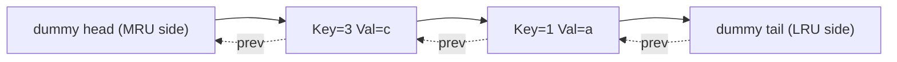

# Linked Lists

Linked Lists are a data structure that consists of a sequence of elements, where each element points to the next one.

- Non-contiguous memory allocation
- Dynamic size
- Ease of insertion and deletion

## Core Concepts

- **Singly linked list** — each node holds `value` + `next`. O(n) access; O(1) insert/delete at known pointer.
- **Doubly linked list** — `prev` + `next`; O(1) delete of a known node. Required for LRU.
- **Circular list** — tail.next → head. Used in round-robin schedulers.
- **Dummy head (sentinel)** — a fake node before head; eliminates special-casing of empty list or first-node deletions.

---

## Reverse — Iterative & Recursive

```csharp
// Iterative O(n) O(1)
ListNode Reverse(ListNode head)
{
    ListNode prev = null, cur = head;
    while (cur != null)
    {
        var next = cur.Next;
        cur.Next = prev;
        prev = cur;
        cur = next;
    }
    return prev;
}

// Recursive O(n) O(n) stack
ListNode ReverseRec(ListNode head)
{
    if (head?.Next == null) return head;
    var newHead = ReverseRec(head.Next);
    head.Next.Next = head;
    head.Next = null;
    return newHead;
}
```

---

## Floyd's Cycle Detection

**Phase 1 — Detect cycle:** slow moves 1 step, fast moves 2. If they meet, cycle exists.

**Phase 2 — Find entry:** reset slow to head; advance both 1 step. They meet at cycle entry.

**Proof of Phase 2:**
Let: `F` = distance from head to cycle entry, `C` = cycle length, meeting point is `a` steps into cycle.
At meeting: slow traveled `F+a`, fast traveled `F+a+nC`. Fast = 2×slow → `F+a = nC` → `F = nC - a`.
Reset slow to head: slow needs `F` steps to reach entry; fast needs `nC - a = F` steps from meeting point to reach entry. They arrive simultaneously.

```csharp
ListNode DetectCycleEntry(ListNode head)
{
    var slow = head; var fast = head;
    while (fast?.Next != null)
    {
        slow = slow.Next;
        fast = fast.Next.Next;
        if (slow == fast)
        {
            slow = head;
            while (slow != fast) { slow = slow.Next; fast = fast.Next; }
            return slow;  // cycle entry
        }
    }
    return null;  // no cycle
}
```

---

## Find Middle (Fast/Slow)

```csharp
ListNode FindMiddle(ListNode head)
{
    var slow = head; var fast = head;
    while (fast?.Next != null) { slow = slow.Next; fast = fast.Next.Next; }
    return slow;  // for even-length: returns second of two middles
}
```

---

## Merge Two Sorted Lists

```csharp
ListNode Merge(ListNode l1, ListNode l2)
{
    var dummy = new ListNode();
    var cur = dummy;
    while (l1 != null && l2 != null)
    {
        if (l1.Val <= l2.Val) { cur.Next = l1; l1 = l1.Next; }
        else                  { cur.Next = l2; l2 = l2.Next; }
        cur = cur.Next;
    }
    cur.Next = l1 ?? l2;
    return dummy.Next;
}
// O(m+n) time, O(1) space
```

---

## Merge K Sorted Lists

```csharp
ListNode MergeKLists(ListNode[] lists)
{
    // Use min-heap on (value, list-index)
    var pq = new PriorityQueue<ListNode, int>();
    foreach (var l in lists) if (l != null) pq.Enqueue(l, l.Val);
    var dummy = new ListNode(); var cur = dummy;
    while (pq.Count > 0)
    {
        var node = pq.Dequeue();
        cur.Next = node; cur = cur.Next;
        if (node.Next != null) pq.Enqueue(node.Next, node.Next.Val);
    }
    return dummy.Next;
}
// O(n log k) — n total nodes, k lists
```

---

## Reorder List (LeetCode 143)

> Reorder: L0→L1→…→Ln-1→Ln becomes L0→Ln→L1→Ln-1→…

1. Find middle (fast/slow).
2. Reverse second half.
3. Interleave two halves.

---

## Palindrome Linked List

1. Find middle. 2. Reverse second half. 3. Compare. 4. Restore (optional). O(n) O(1).

---

## Copy List with Random Pointer (LeetCode 138)

```csharp
// Dictionary<original, copy> — O(n) time and space
Node CopyRandomList(Node head)
{
    if (head == null) return null;
    var map = new Dictionary<Node, Node>();
    var cur = head;
    while (cur != null) { map[cur] = new Node(cur.Val); cur = cur.Next; }
    cur = head;
    while (cur != null)
    {
        map[cur].Next   = cur.Next   != null ? map[cur.Next]   : null;
        map[cur].Random = cur.Random != null ? map[cur.Random] : null;
        cur = cur.Next;
    }
    return map[head];
}
// O(1) space variant: weave copies into original list, set random, then separate.
```

---

## LRU Cache — Full Implementation

**Structure:** `Dictionary<int, DllNode>` for O(1) lookup + doubly linked list (DLL) for O(1) move-to-front and O(1) evict-from-tail.



```csharp
public class LRUCache
{
    private class Node
    {
        public int Key, Val;
        public Node Prev, Next;
        public Node(int k = 0, int v = 0) { Key = k; Val = v; }
    }

    private readonly int _cap;
    private readonly Dictionary<int, Node> _map;
    private readonly Node _head, _tail; // sentinels: head=MRU side, tail=LRU side

    public LRUCache(int capacity)
    {
        _cap = capacity;
        _map = new Dictionary<int, Node>(capacity);
        _head = new Node(); _tail = new Node();
        _head.Next = _tail; _tail.Prev = _head;
    }

    public int Get(int key)
    {
        if (!_map.TryGetValue(key, out var node)) return -1;
        MoveToFront(node);
        return node.Val;
    }

    public void Put(int key, int value)
    {
        if (_map.TryGetValue(key, out var node))
        {
            node.Val = value;
            MoveToFront(node);
            return;
        }
        if (_map.Count == _cap)
        {
            var lru = _tail.Prev;   // LRU node
            Remove(lru);
            _map.Remove(lru.Key);
        }
        var fresh = new Node(key, value);
        InsertFront(fresh);
        _map[key] = fresh;
    }

    private void Remove(Node n)
    {
        n.Prev.Next = n.Next;
        n.Next.Prev = n.Prev;
    }
    private void InsertFront(Node n)
    {
        n.Next = _head.Next; n.Prev = _head;
        _head.Next.Prev = n; _head.Next = n;
    }
    private void MoveToFront(Node n) { Remove(n); InsertFront(n); }
}
// All ops O(1). Space O(capacity).
```

---

## LFU Cache Design

**Concept:** Evict the least frequently used key. On frequency tie, evict LRU among them.

**Data structures:**

- `Dictionary<int, (int val, int freq)>` — key → (value, frequency).
- `Dictionary<int, LinkedList<int>>` — freq → doubly linked list of keys (insertion order = LRU order within frequency).
- `int minFreq` — track current minimum frequency.

**Operations (all O(1)):**

- `Get(key)`: look up value, increment freq, move key from `freqMap[freq]` to `freqMap[freq+1]`. Update `minFreq` if `freqMap[minFreq]` is now empty.
- `Put(key, val)`: if exists, same as get + update val. If new: evict `freqMap[minFreq]`'s tail if at capacity; insert key into `freqMap[1]`; set `minFreq = 1`.

---
