# Computer Networks

A computer network is a system that connects two or more computing devices so they can communicate, share resources, and exchange data with each other

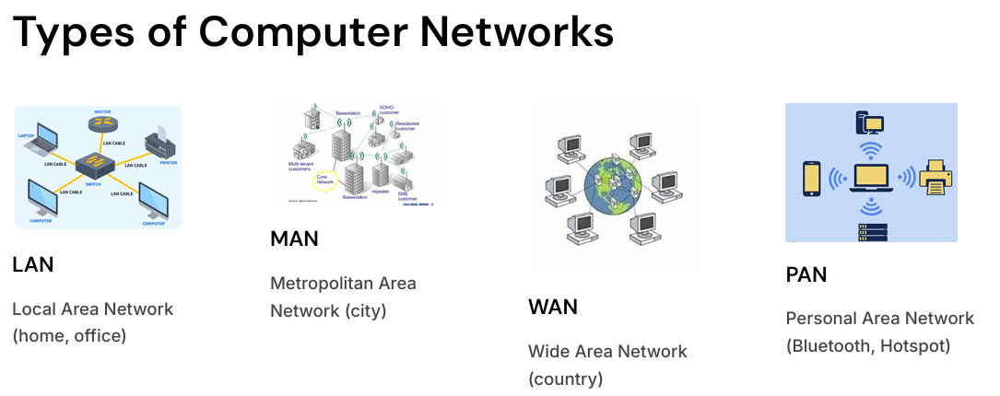

## Glossary

- _WWW (World Wide Web):_ A system of interlinked web pages accessible via the Internet
- _URL (Uniform Resource Locator):_ The address used to locate a resource on the web
- _Search Engine:_ A tool that helps users find information on the Internet (e.g., Google)
- _Protocols:_ Standard rules that define how data is transmitted over networks
- _Server:_ A computer that stores and provides resources or services to clients
- _Client:_ A device or software that requests and uses services from a server
- _ISP (Internet Service Provider):_ A company that provides users access to the Internet

## Internet

A global network connecting billions of devices : LAN + MAN + WAN
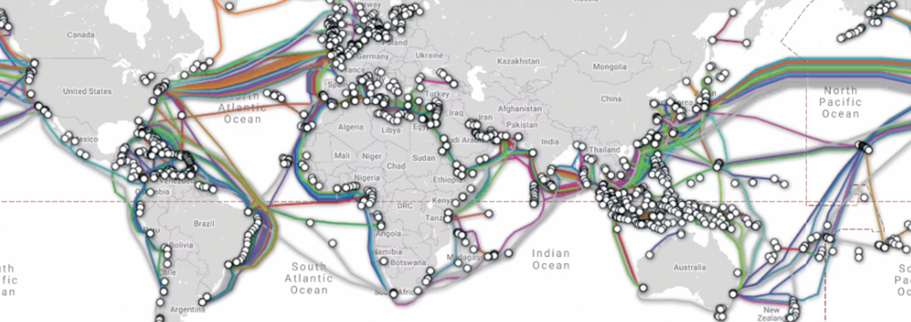

**History**

- 1960s: U.S. Department of Defense created ARPANET to connect research computers for communication during emergencies.
- 1983: Scientists adopted TCP/IP Standards
- 1991: Tim Berners-Lee introduced the World Wide Web

## Network Topologies

Network topology is the arrangement (physical or logical layout) of computers, devices, and connections in a network.
It shows how nodes are connected and how data flows between them.

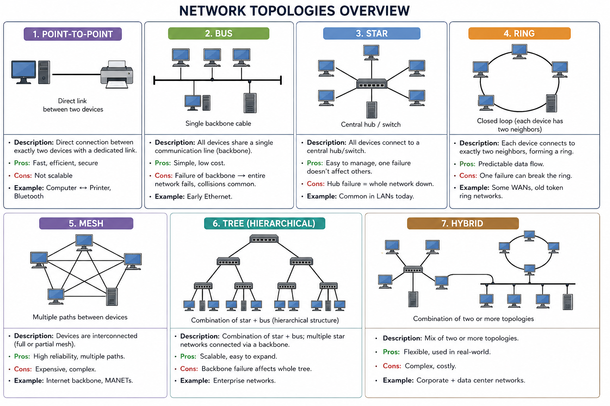

## Network Architecture Type

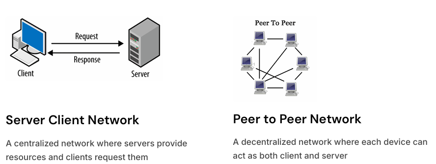

## Network Communication Types

- Unicast: 1 → 1
- Broadcast: 1 → All
- Multicast: 1 → Many
- Anycast: 1 → One of Many

## Network Parameters

- Latency: Time taken for a message to travel from source to destination. (ms).
- Bandwidth: Maximum data transfer capacity of a link (bps)
- Throughput: Actual data successfully transferred over network
  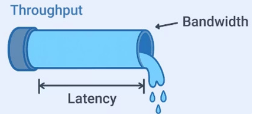
- Latency = Time delay | Bandwidth = Max capacity | Throughput = Achieved performance

## Network Models

Standard framework for communication. Explains how data flows end-to-end.
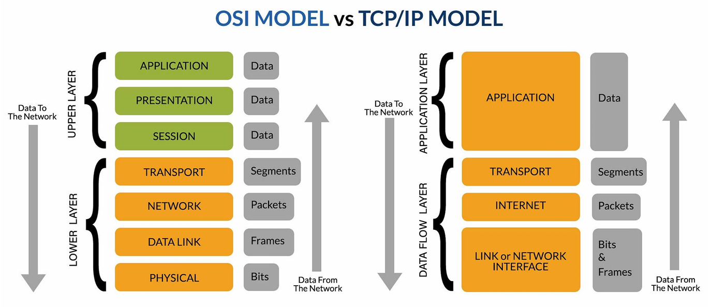

## OSI Model

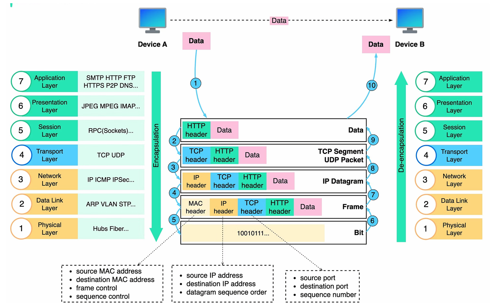

---

## Data Link Layer (Layer 2)

- Ensure hop to hop delivery

**Functions**

- _Framing:_ Converting raw bits into frames
  - Character Count, Character Stuffing, Bit Stuffing
- _Error Detection & Correction in Frames_
  - Parity Check, Checksum, CRC
- _Flow and Error Control between devices_
  - Stop and Wait, Sliding Window (Go Back N, Selective Repeat)
- _Medium Access Control_ determine how devices share link
  - ALOHA, CSMA/CD, CSMA/CA, Token Passing

### MAC Address (Physical Address)

- Medium Access Control Address
- Assigned to NIC
- 48 Bit, In Hexadecimal, 00:1A:2B:3C:4D:5E
- Used in LAN, switching

### Ethernet and Wi-Fi (Layer 1 and 2)

| Technology           | Definition                                                     | Key mechanisms / concepts                                                        |
| -------------------- | -------------------------------------------------------------- | -------------------------------------------------------------------------------- |
| **Ethernet (802.3)** | Wired LAN technology that transmits data over cables.          | **L1:** electrical/optical signals · **L2:** frames, MAC addressing, **CSMA/CD** |
| **Wi-Fi (802.11)**   | Wireless LAN technology that transmits data using radio waves. | **L1:** radio signals · **L2:** frames, MAC addressing, **CSMA/CA**              |

---

## Network Layer (Layer 3)

- Ensures end to end delivery

**Functions**

- Logical/IP Addressing
- Routing
- Packet Forwarding

### IP Addressing

Identifies every device on a network. Enables routing across networks

| Feature           | IPv4                                       | IPv6                                      |
| ----------------- | ------------------------------------------ | ----------------------------------------- |
| **Address size**  | 32-bit                                     | 128-bit                                   |
| **Format**        | Decimal, e.g. `192.168.1.10`               | Hexadecimal, e.g. `2001:db8::1`           |
| **Address space** | ~4.3 billion                               | ~3.4 × 10³⁸                               |
| **Header**        | Variable, 20–60 bytes                      | Fixed, 40 bytes                           |
| **Broadcast**     | ✅ Supported                               | ❌ No broadcast; uses multicast           |
| **Multicast**     | ✅ Supported                               | ✅ Supported                              |
| **Security**      | IPsec optional                             | IPsec support built into the standard     |
| **Fragmentation** | Routers + hosts can fragment               | Only source host fragments                |
| **Why needed**    | Widely deployed, but limited address space | Designed to solve IPv4 address exhaustion |

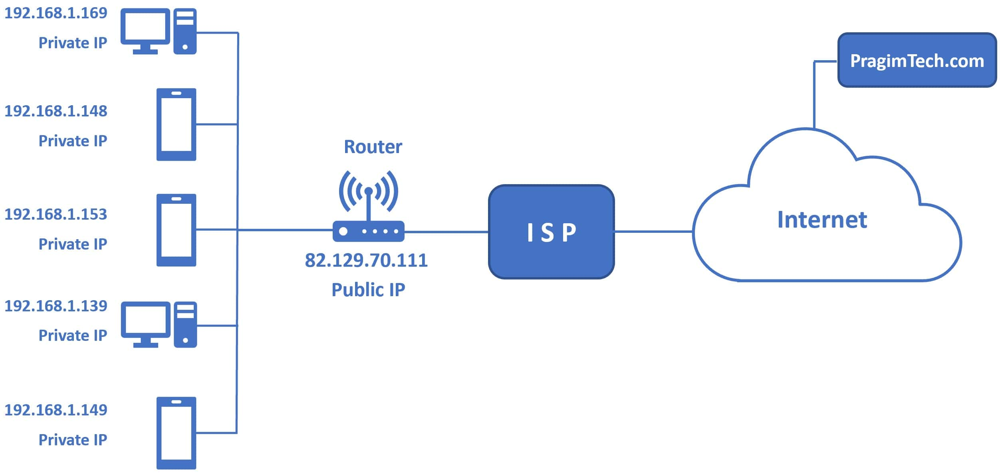

| Feature               | Public IP                                                        | Private IP                                          |
| --------------------- | ---------------------------------------------------------------- | --------------------------------------------------- |
| **Definition**        | Globally unique address used for communication over the Internet | Address used within a private/local network         |
| **Internet routable** | ✅ Yes                                                           | ❌ No                                               |
| **Uniqueness**        | Globally unique                                                  | Only needs to be unique within the local network    |
| **Assigned by**       | ISP / cloud provider / organization                              | Network administrator / DHCP                        |
| **NAT**               | Usually destination of NAT communication                         | Commonly translated to public IP using NAT          |
| **IPv4 ranges**       | Any globally routable IPv4 address                               | `10.0.0.0/8`<br>`172.16.0.0/12`<br>`192.168.0.0/16` |
| **Example**           | `8.8.8.8`                                                        | `192.168.1.10`                                      |
| **Typical use**       | Web servers, routers, public cloud endpoints                     | PCs, phones, printers inside LANs                   |

### Subnetting

Divides a network into smaller sub-networks

- Subnet mask determines network vs host bits

**Benefits:**

- Efficient IP usage
- Reduces broadcast traffic
- Improves security

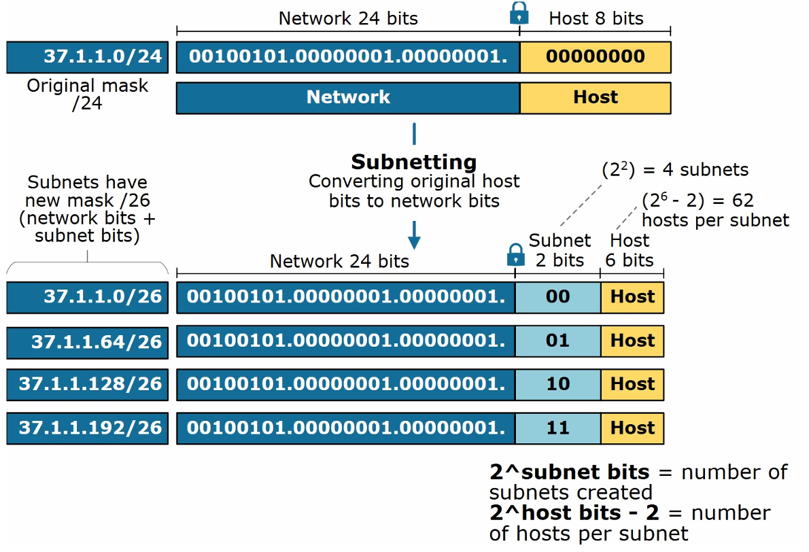

### Routing

Process of forwarding packets from source → destination across multiple networks

- Router makes decisions using routing tables
  - Destination network | Next hop | Interface | Metric / cost
- **Types**
  - Static Routing
  - Dynamic Routing
    - RIP, OSPF, BGP

| Protocol / Concept | Full Name                         | Purpose                                                     | Key Point                            |
| ------------------ | --------------------------------- | ----------------------------------------------------------- | ------------------------------------ |
| **IP (IPv4/IPv6)** | Internet Protocol                 | Addressing and packet delivery between networks             | **Core L3 protocol**                 |
| **ICMP**           | Internet Control Message Protocol | Error reporting and network diagnostics                     | `ping`, `traceroute`                 |
| **ARP**            | Address Resolution Protocol       | Maps IPv4 address → MAC address                             | L3 ↔ L2 resolution                   |
| **NAT**            | Network Address Translation       | Translates IP addresses between private and public networks | Commonly used with **PAT**           |
| **RIP**            | Routing Information Protocol      | Dynamic routing within an autonomous system                 | Uses **hop count**; max 15 hops      |
| **OSPF**           | Open Shortest Path First          | Dynamic routing within an autonomous system                 | **Link-state** routing               |
| **BGP**            | Border Gateway Protocol           | Routing between autonomous systems                          | **Routing protocol of the Internet** |

---

## Transport Layer (Layer 4)

- Ensures process to process delivery

**Functions**

- Data Segmentation
- Error Control
- Flow Control
- Connection Management

### Addressing

IP Address + Port Number
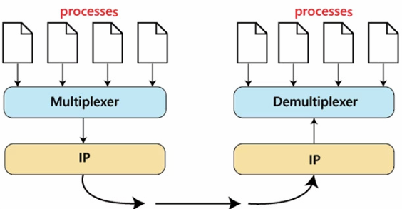

- _Multiplexing_: Combining data from multiple applications before sending
- _Demultiplexing_: Delivering received segments to the correct process

### Transport Layer Protocols

| TCP                                      | UDP                           |
| ---------------------------------------- | ----------------------------- |
| Connection-oriented                      | Connectionless                |
| 3 Way Handshake                          | No Handshake                  |
| Reliable and ordered                     | Unreliable and unordered      |
| Flow and congestion control              | No flow or congestion control |
| Slower                                   | Faster                        |
| Banking, Emails, Payments, File Transfer | Gaming, Streaming, VoIP       |

### User Datagram Protocol (UDP)

- Lightweight, simple protocol
- No connection establishment (Fire and forget)
- Data loss possible
- Suitable for time sensitive applications, broadcast, multicast, IoT

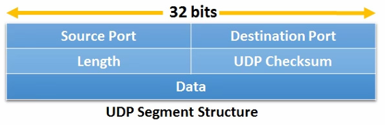

### Transmission Control Protocol (TCP)

- Reliable, ordered, and error-checked delivery

**Functions**

- Flow Control
  - Sliding Window Protocol
- Congestion control
  - Slow Start: Begin cautiously, then increase rate exponentially 1.
  - Congestion Avoidance: Gradually increase when network stable 2.
  - Congestion Detection: React to packet loss
- Error Control
  - Checksum, Ack, Retransmission, Sequence Number

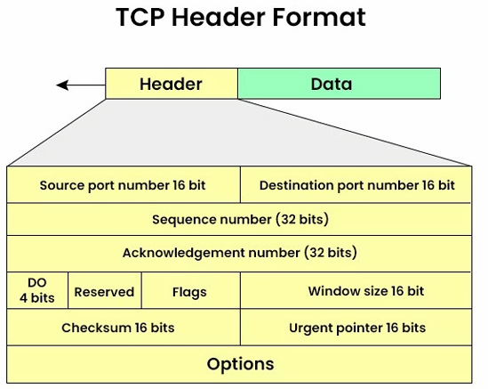

#### TCP Connection Lifecycle

1. Connection Establishment (3-Way Handshake)
2. Data Transfer
3. Connection Termination (4-Way Handshake)

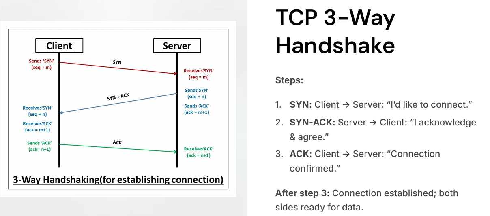

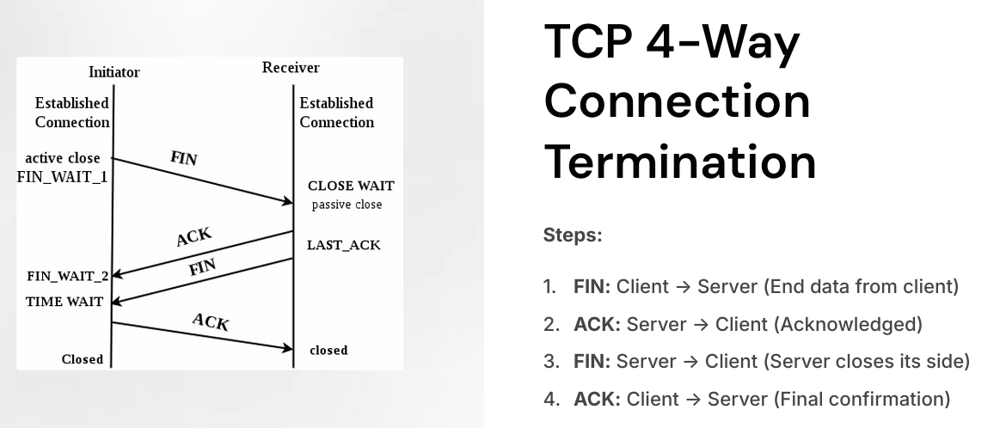

- _Silly Window Syndrome_ When small chunks of data are sent repeatedly causes inefficient usage of bandwidth.
  - Solution: Nagle Algorithm, Clark Solution
  - 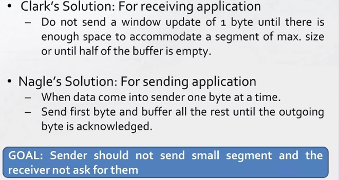
- _Half-Open Connection:_ When one side closes the connection while other is unaware
- _TCP Reset (RST):_ Used to abruptly terminate a connection
- _Congestion:_ When too much data overwhelms network capacity which results in packet loss, delay, retransmission
  - TCP assumes packet loss = congestion
- _Denial of Service (DoS)_ Malicious flooding of traffic to overwhelm a target servers. Solutions - Firewall, Rate Limit, Connection Limit

#### TCP Timers

_Retransmission Timeout (RTO):_ Resend unacknowledged data after timeout. Detects packet loss.
_Persistence Timer:_ Avoid deadlock during zero-window state
_Keep-Alive Timer:_ Check if connection still active.
_Time-Wait Timer:_ Wait before releasing connection resources to ensure delayed packets are discarded

---

## Application Layer (Layer 7)

- Provides interface to applications to connect to network

**Functions**

- File transfer
- Mail Services
- Name Resolution

### DHCP Dynamic Host Configuration Protocol

Automatically assigns IP, subnet mask, gateway, DNS

- Steps: Discover > Offer > Request > Acknowledge (DORA)
  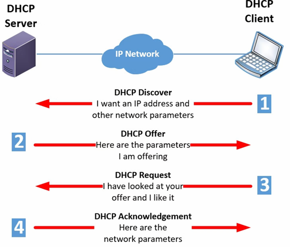

### DNS (Domain Name System)

Translates human-readable names > IP addresses

- _A Record:_ Maps a domain name to an IPv4 address
- _AAAA Record:_ Maps a domain name to an IPv6 address

### HTTP

A protocol for transferring web pages and data on the Internet

- _Stateless_
  - Dev implements stateful behaviour using session keys, cookies, etc
- _Client Server Model_ (Request-Response Model)
  - TCP Based, Connection Oriented, Client initiate requests

**HTTPS**

- HTTP + SSL/TLS
- Provides CIA (Confidentiality, Integrity, Authentication)
- Process: Handshake > Key Exchange > Encrypted > Data Transfer

### WebSockets

Full-duplex communication channels over a single TCP connection, allowing for real-time data transfer between a client and server.

- Chats, Real-time notifications, Online gaming, Collaborative editing


### AMQP - Advanced Message Queuing Protocol

An open standard for message-oriented middleware that enables reliable and secure communication between distributed systems, often used in enterprise applications

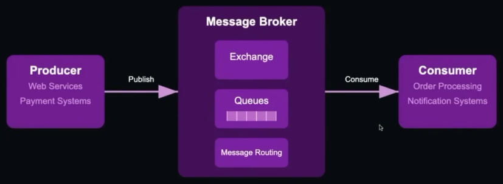

### Common Protocols and Ports

| Protocol      | Full Name                           | Purpose                                               |       Default Port |
| ------------- | ----------------------------------- | ----------------------------------------------------- | -----------------: |
| **HTTP**      | Hypertext Transfer Protocol         | Web communication                                     |             **80** |
| **HTTPS**     | HTTP Secure                         | Secure web communication using TLS                    |            **443** |
| **DNS**       | Domain Name System                  | Converts domain names → IP addresses                  |             **53** |
| **DHCP**      | Dynamic Host Configuration Protocol | Automatically assigns IP configuration                |          **67/68** |
| **FTP**       | File Transfer Protocol              | File transfer between client and server               |          **20/21** |
| **SMTP**      | Simple Mail Transfer Protocol       | Sending email                                         | **25 / 587 / 465** |
| **POP3**      | Post Office Protocol v3             | Downloads email from server                           |      **110 / 995** |
| **IMAP**      | Internet Message Access Protocol    | Accesses and synchronizes email on server             |      **143 / 993** |
| **SSH**       | Secure Shell                        | Secure remote login and command execution             |             **22** |
| **Telnet**    | Teletype Network                    | Remote login without encryption                       |             **23** |
| **SNMP**      | Simple Network Management Protocol  | Network/device monitoring and management              |        **161/162** |
| **NTP**       | Network Time Protocol               | Synchronizes system clocks                            |            **123** |
| **RPC**       | Remote Procedure Call               | Calls procedures/functions on a remote system         |         **Varies** |
| **WebSocket** | WebSocket Protocol                  | Persistent, bidirectional client-server communication |       **80 / 443** |
| **WebRTC**    | Web Real-Time Communication         | Real-time peer-to-peer audio, video and data          |        **Dynamic** |

---

## Network Devices

Hardware that enables communication between devices

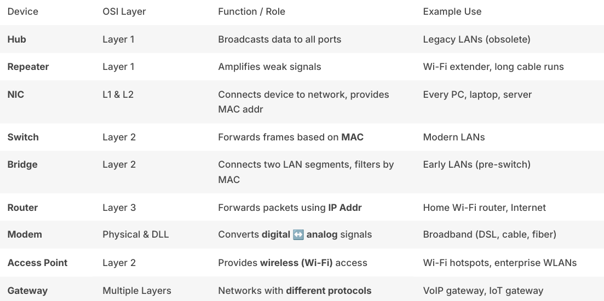

---

## Security in Networks

Protects data, devices, and communication from attacks

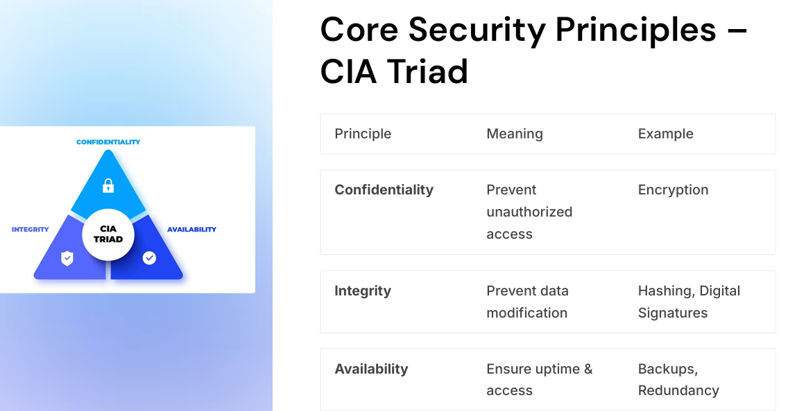

### HTTPS

HTTPS + SSL/TLS ensures secure communication between the client and server by encrypting data in transit.

### CORS (Cross-Origin Resource Sharing)

- Browser blocks different domain requests unless specified by server's policies

**Types**

1. _Simple Flow_
   - Request contains Host: X, Origin: Y.
   - If response has cors header for Y, Then browser allows
2. _Preflight Flow OPTIONS:_ Request asks server for allowed origin, method, headers
   If any of these condition are true then used:
   1. If method is not GET, POST, HEAD
   2. Request has non simple header like auth, custom headers, etc
   3. Content type is not text, form

```
REQUEST HEADERS
access-control-request-methods
access-control-request-headers

RESPONSE HEADERS
access-control-allow-origin
access-control-allow-method
access-control-allow-header
access-control-maxage
```

### Firewalls

Network security devices or software that monitor and control incoming and outgoing network traffic based on predetermined security rules.

**Types**

- Stateful Firewall (Layer 4)
- Application Gateway (Layer 7)
- Next Gen Firewall (All)

### VPNs

Encrypts all traffic between client <> VPN server
Masks user's IP address and location

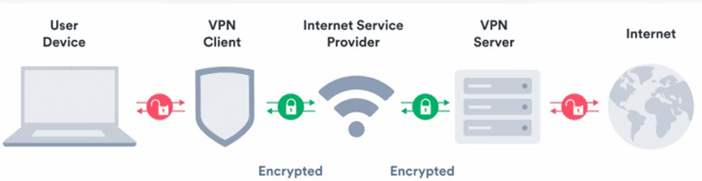

### Secure Communication - SSL/TLS

SSL (Secure Socket Layer) -> Predecessor of TLS (Transport Layer Security)

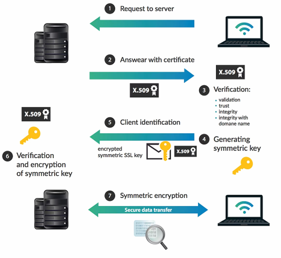

### CSRF (Cross-Site Request Forgery)

Security vulnerability that occurs when an attacker tricks a user into performing actions on a web application without their knowledge or consent, potentially leading to unauthorized access or data manipulation

### XSS (Cross-Site Scripting)

Security vulnerability that occurs when an attacker is able to inject malicious scripts into a web application

### Rate Limiting

Limits the number of requests a client can make to an API within a specified time frame to prevent abuse, ensure fair usage and system stability.

**Types**

- Per IP
- Per Account
- Global

### Public Key Infrastructure

Framework for managing public keys

_Certificate Authority (CA):_ Issues and verifies digital certificates and Binds a public key to an identity
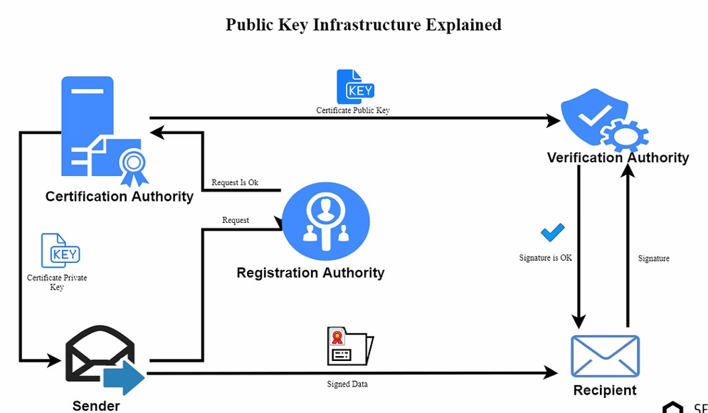

### Digital Signature

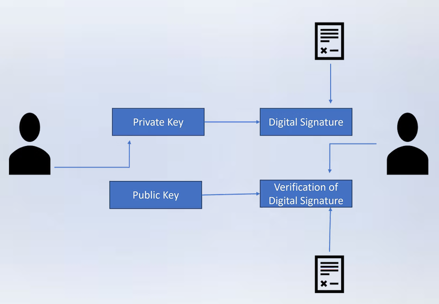

### Common Security Vulnerabilities

| Vulnerability / Attack              | Description                                                     | Mitigation                                        |
| ----------------------------------- | --------------------------------------------------------------- | ------------------------------------------------- |
| _SQL Injection_                     | Malicious SQL queries are executed                              | Use parameterized queries and ORM                 |
| _XSS (Cross-Site Scripting)_        | Malicious scripts executed in the browser                       | Sanitize and validate input                       |
| _CSRF (Cross-Site Request Forgery)_ | Unauthorized commands transmitted from a user                   | Use anti-CSRF tokens                              |
| _Insecure Direct Object References_ | Unauthorized access to objects                                  | Implement proper access controls                  |
| _Security Misconfiguration_         | Improperly configured security settings                         | Regularly review and update configurations        |
| _Eavesdropping / Sniffing_          | Capturing network packets                                       | Use encryption such as TLS/VPN                    |
| _Spoofing_                          | Faking IP/MAC or other identities                               | Use authentication and network filtering          |
| _Man-in-the-Middle (MITM)_          | Intercepting communication between parties                      | Use TLS, certificate validation, secure protocols |
| _Denial of Service (DoS)_           | Overloading a service with requests                             | Rate limiting, firewalls, traffic filtering       |
| _Malware / Ransomware_              | Damaging, stealing, or encrypting data                          | Antivirus/EDR, backups, patching, least privilege |
| _Phishing / Social Engineering_     | Tricking users into revealing information or performing actions | User awareness, MFA, email filtering              |

### Cryptography

Plain Text <> Ciphertext

**Types**

- Symmetric Encryption
  - DES, AES
- Asymmetric Encryption
  - RSA

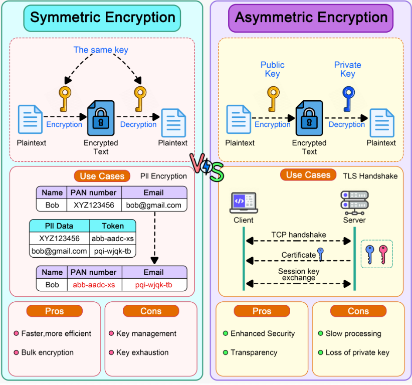

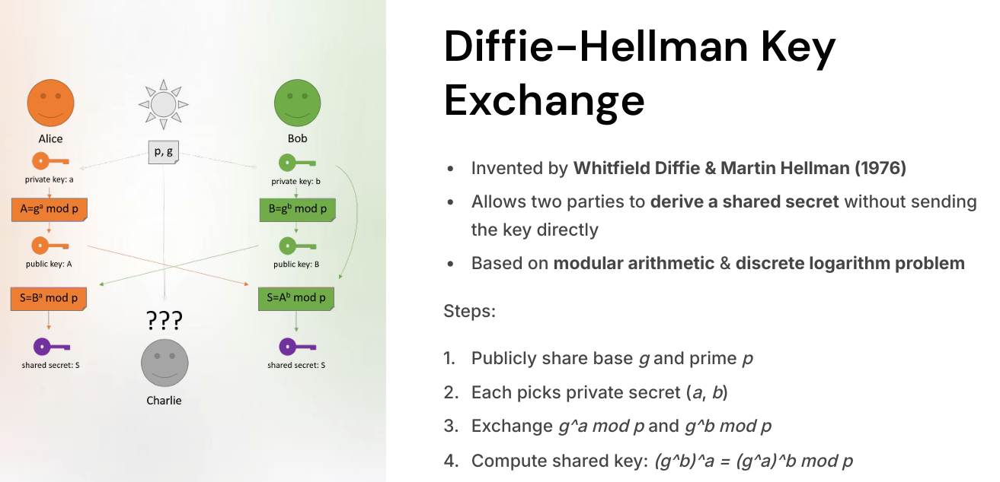
