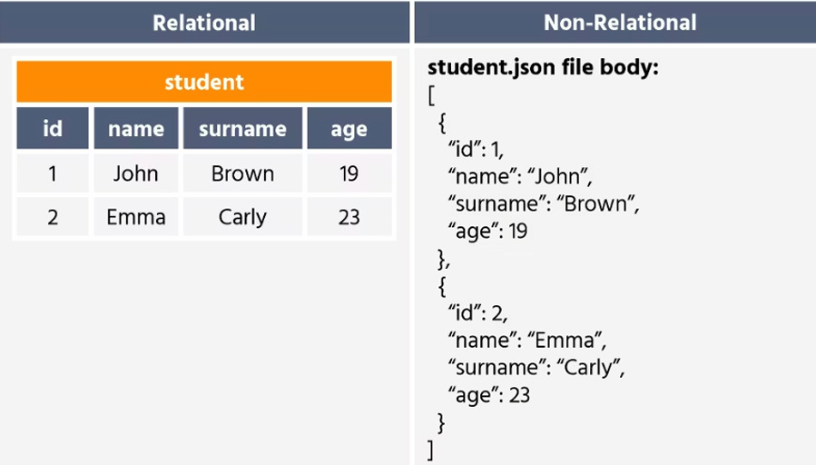
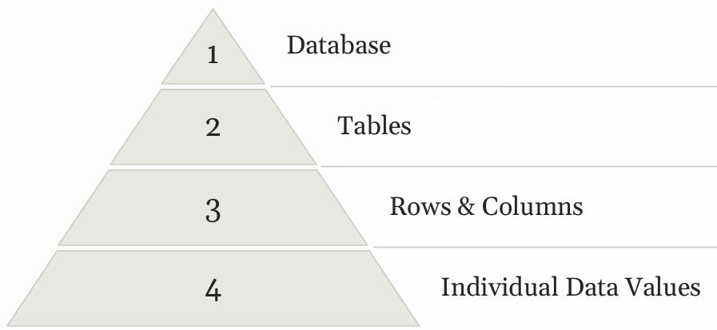
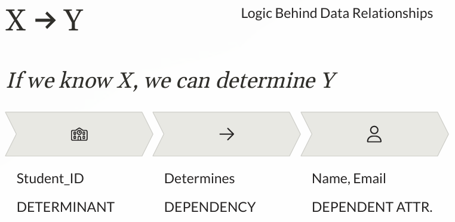
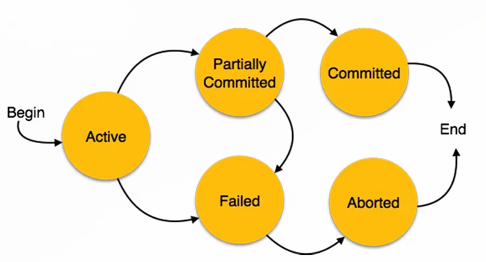
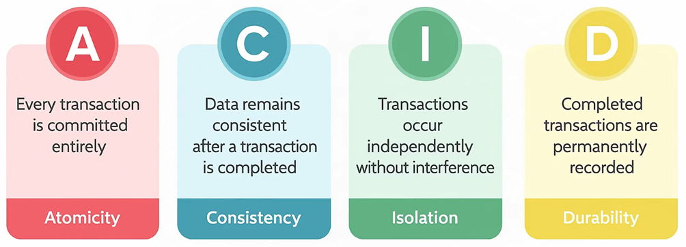

# DBMS

**Database** : A database is an **organized** collection of digital data stored in a structured format that allows easy access, management, and updates.

## DBMS - Database Management System

DBMS is the software application that helps us create, maintain, and interact with our databases efficiently.

- Organize Data
- Efficient Access / CRUD
- Integrity and Security

## Types

| Relational Database                                                   | Non-Relational Database                                                     |
| --------------------------------------------------------------------- | --------------------------------------------------------------------------- |
| Structured data, tables, rows, columns                                | Unstructured or semi-structured data, key-value pairs, documents, graphs    |
| Schema-based, predefined schema                                       | Schema-less, flexible schema                                                |
| Uses SQL                                                              | Uses various query languages                                                |
| ACID properties                                                       | BASE properties                                                             |
| Supports complex queries, joins, and transactions, strong consistency | Optimized for horizontal scaling, high availability, and distributed data   |
| Examples: MySQL, PostgreSQL, Oracle, SQL Server                       | Examples: MongoDB, Cassandra, Redis, DynamoDB                               |
| Use when structured data and strong consistency are required          | Use when flexible schema, high scalability, and distributed data are needed |



## Relational Database

### Structure

- Relations = Table
- Tuples = Rows = Record
  - Each row represents a complete set of related information about a single entity
- Attributes = Columns = Fields
  - Each column represents a specific attribute or property



### Key Types

| Key           | Meaning                                           |
| ------------- | ------------------------------------------------- |
| Super key     | Any column set that uniquely identifies a row.    |
| Candidate key | Minimal super key.                                |
| Primary key   | Chosen candidate key.                             |
| Alternate key | Candidate key not chosen as primary.              |
| Composite key | Key made of multiple columns.                     |
| Surrogate key | Artificial key such as an identity value or UUID. |

| PK                              | FK                      | CK            |
| ------------------------------- | ----------------------- | ------------- |
| Uniquely identifies each record | Ref PK of another table | Potential PK  |
| No Duplicates                   | Can have                | No Duplicates |
| NOT NULL                        | Can be NULL             | NOT NULL      |
| One per table                   | Multiple                | Multiple      |

## PostGreSQL

- Open Source
- SQL Based
- JSON Supported
- Extensible, Reliable, Scalable

## Functional Dependencies



## Database Normalization

**Normalization** reduces duplicate data and insertion, update, and deletion anomalies. Requires cross table operation to get data.
**Denormalization** intentionally duplicates data to improve read performance, trading simpler reads for more storage and update complexity.

| Form | Requirement                                                |                                                             |
| ---- | ---------------------------------------------------------- | ----------------------------------------------------------- |
| 1NF  | No repeating groups.                                       | All values are atomic (indivisible)                         |
| 2NF  | 1NF plus no partial dependency on part of a composite key. | Non-key attributes fully depend on primary key              |
| 3NF  | 2NF plus no transitive dependency on a non-key column.     | Non-key attributes don't depend on other non-key attributes |
| BCNF | Every determinant is a candidate key.                      |                                                             |

### Example: Student DB

```
UNF
┌───────┬──────────┬────────────┐
│Student│ Courses  │ Instructor │
├───────┼──────────┼────────────┤
│Alice  │DBMS, OS  │John, Mike  │
│Bob    │DBMS, CN  │John, David │
└───────┴──────────┴────────────┘
Violation: Non-atomic values

          ↓ 1NF

┌───────┬──────┬──────────┐
│Student│Course│Instructor│
├───────┼──────┼──────────┤
│Alice  │DBMS  │John      │
│Alice  │OS    │Mike      │
│Bob    │DBMS  │John      │
│Bob    │CN    │David     │
└───────┴──────┴──────────┘
PK = (Student, Course)
Violation: Student → Name (partial dependency)

          ↓ 2NF

┌───────┬──────┐  ┌───────┬──────┐
│Student│Name  │  │Student│Course│
├───────┼──────┤  ├───────┼──────┤
│S1     │Alice │  │S1     │DBMS  │
│S2     │Bob   │  │S1     │OS    │
└───────┴──────┘  │S2     │DBMS  │
                  │S2     │CN    │
                  └───────┴──────┘

┌──────┬──────────┬───────┐
│Course│Instructor│ Phone │
├──────┼──────────┼───────┤
│DBMS  │John      │1111   │
│OS    │Mike      │2222   │
│CN    │David     │3333   │
└──────┴──────────┴───────┘
Violation: Course → Instructor → Phone
           (transitive dependency)

          ↓ 3NF

┌──────┬──────────┐  ┌──────────┬──────┐
│Course│Instructor│  │Instructor│Phone │
├──────┼──────────┤  ├──────────┼──────┤
│DBMS  │John      │  │John      │1111  │
│OS    │Mike      │  │Mike      │2222  │
│CN    │David     │  │David     │3333  │
└──────┴──────────┘  └──────────┴──────┘

          ↓ BCNF

Example 3NF violation:
┌───────┬───────┬──────────┐
│Student│ Course│Instructor│
├───────┼───────┼──────────┤
│Alice  │DBMS   │John      │
│Bob    │DBMS   │John      │
│Alice  │OS     │Mike      │
│Bob    │OS     │Mike      │
└───────┴───────┴──────────┘
FD: Instructor → Course
Violation: Instructor is not a superkey

Decompose into BCNF:

┌──────────┬──────┐  ┌───────┬──────────┐
│Instructor│Course│  │Student│Instructor│
├──────────┼──────┤  ├───────┼──────────┤
│John      │DBMS  │  │Alice  │John      │
│Mike      │OS    │  │Bob    │John      │
└──────────┴──────┘  │Alice  │Mike      │
                     │Bob    │Mike      │
                     └───────┴──────────┘
```

### Isolation Levels

| Level            | Dirty Reads | Non-repeatable Reads | Phantom Reads      |
| ---------------- | ----------- | -------------------- | ------------------ |
| Read Uncommitted | Possible    | Possible             | Possible           |
| Read Committed   | Prevented   | Possible             | Possible           |
| Repeatable Read  | Prevented   | Prevented            | Database dependent |
| Serializable     | Prevented   | Prevented            | Prevented          |


> **Note:** Higher isolation reduces anomalies but can reduce concurrency. Defaults and exact behavior vary by database and MVCC implementation.

## Database Transaction

A database transaction is a sequence of operations performed as a single logical unit of work, which must either completely succeed or completely fail.


## ACID Properties



## DB Migration

- To do version controlled operations on DB.
- Contains SQL files in sequence. Only latest executed

**Types of migration commands**

- UP MIGRATION: Do some changes
- DOWN MIGRATION: Revert some changes

## DB Triggers

Execute some function on data updates

## DB Indexing

Hash Table on specified columns for fast lookups.

- Read Latency improves, write latency worsen

## In-Memory Databases

Databases that primarily rely on main memory for data storage, providing faster data access and processing compared to disk-based databases. Examples include Redis, Memcached, and SAP HANA.

## Non Relational Databases


| Type                  | Structure                  | Best For                    | Examples              |
| --------------------- | -------------------------- | --------------------------- | --------------------- |
| **Document Store**    | JSON/BSON documents        | Flexible, hierarchical data | MongoDB, CouchDB      |
| **Wide-Column Store** | Rows + dynamic columns     | Large-scale structured data | Cassandra, HBase      |
| **Key-Value Store**   | Key → Value pairs          | Fast lookups                | Redis, DynamoDB, Riak |
| **Graph Database**    | Nodes + edges + properties | Complex relationships       | Neo4j, Neptune        |

### BASE Properties

Basically Available, Soft state, Eventually consistent
