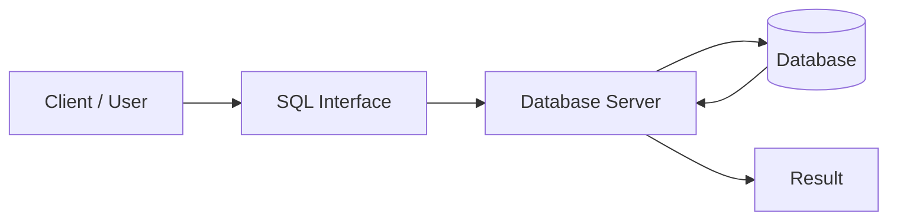

# SQL Interview Notes

SQL (Structured Query Language) is a standard programming language used to manage and manipulate relational databases.

## Table of Contents

- [SQL Overview and Architecture](#sql-overview-and-architecture)
- [Sample Database Used in All Examples](#sample-database-used-in-all-examples)
- [Database Management](#database-management)
- [Data Types](#data-types)
- [SQL Command Categories](#sql-command-categories)
- [Querying and Filtering](#querying-and-filtering)
- [SQL Functions](#sql-functions)
- [Grouping and Aggregation](#grouping-and-aggregation)
- [Joins](#joins)
- [Subqueries and Set Operations](#subqueries-and-set-operations)
- [Database Objects and Indexes](#database-objects-and-indexes)

---

## SQL Overview and Architecture



## Sample Database Used in All Examples

Every example in this sheet uses the following `company_db` database. Run this setup first if you want to try the queries.

```sql
CREATE DATABASE company_db;
USE company_db;

CREATE TABLE departments (
department_id INT PRIMARY KEY,
department_name VARCHAR(50) UNIQUE NOT NULL
);

CREATE TABLE employees (
employee_id INT PRIMARY KEY,
employee_name VARCHAR(50) NOT NULL,
email VARCHAR(100) UNIQUE,
department_id INT,
salary DECIMAL(10, 2),
age INT CHECK (age >= 18),
city VARCHAR(50),
joining_date DATE,
manager_id INT,
status VARCHAR(20) DEFAULT 'Active',
CONSTRAINT fk_employee_department
FOREIGN KEY (department_id) REFERENCES departments(department_id)
ON UPDATE CASCADE
ON DELETE SET NULL,
FOREIGN KEY (manager_id) REFERENCES employees(employee_id)
);

INSERT INTO departments (department_id, department_name) VALUES
(1, 'Engineering'),
(2, 'HR'),
(3, 'Sales');

INSERT INTO employees
(employee_id, employee_name, email, department_id, salary, age, city, joining_date, manager_id, status)
VALUES
(1, 'Aman', 'aman@example.com', 1, 80000, 28, 'Delhi', '2022-01-15', NULL, 'Active'),
(2, 'Anita', 'anita@example.com', 1, 65000, 30, 'Mumbai', '2021-03-10', 1, 'Active'),
(3, 'Ravi', 'ravi@example.com', 2, 55000, 26, 'Bengaluru', '2022-06-18', 1, 'Active'),
(4, 'Neha', NULL, NULL, 45000, 24, 'Pune', '2023-02-20', 2, 'Inactive');
```

### Sample Data

| employee_id | employee_name | department_id | salary | age | city      | joining_date | manager_id | status   |
| ----------- | ------------- | ------------- | ------ | --- | --------- | ------------ | ---------- | -------- |
| 1           | Aman          | 1             | 80000  | 28  | Delhi     | 2022-01-15   | `NULL`     | Active   |
| 2           | Anita         | 1             | 65000  | 30  | Mumbai    | 2021-03-10   | 1          | Active   |
| 3           | Ravi          | 2             | 55000  | 26  | Bengaluru | 2022-06-18   | 1          | Active   |
| 4           | Neha          | `NULL`        | 45000  | 24  | Pune      | 2023-02-20   | 2          | Inactive |

## Database Management

| Operation | Command           | Purpose                                      | Syntax                           | Example                       |
| --------- | ----------------- | -------------------------------------------- | -------------------------------- | ----------------------------- |
| Create    | `CREATE DATABASE` | Creates a new database.                      | `CREATE DATABASE database_name;` | `CREATE DATABASE company_db;` |
| Use       | `USE`             | Selects the database for subsequent queries. | `USE database_name;`             | `USE company_db;`             |
| Show      | `SHOW DATABASES`  | Lists available databases.                   | `SHOW DATABASES;`                | `SHOW DATABASES;`             |
| Delete    | `DROP DATABASE`   | Permanently deletes a database and its data. | `DROP DATABASE database_name;`   | `DROP DATABASE company_db;`   |

> **Warning:** `DROP DATABASE` permanently removes the database. `USE` and `SHOW DATABASES` are supported by MySQL; equivalent commands vary across database systems.

## Data Types

| Category               | Common Data Types                                                              |
| ---------------------- | ------------------------------------------------------------------------------ |
| **Numeric**            | `SMALLINT`, `INT`, `BIGINT`, `DECIMAL(p, s)`, `NUMERIC(p, s)`, `FLOAT`, `REAL` |
| **Character/String**   | `CHAR(n)`, `VARCHAR(n)`, `TEXT`                                                |
| **Date and Time**      | `DATE`, `TIME`, `DATETIME`, `TIMESTAMP`, `INTERVAL`                            |
| **Boolean**            | `BOOLEAN`, `BIT`                                                               |
| **Binary**             | `BINARY(n)`, `VARBINARY(n)`, `BLOB`                                            |
| **Structured/Special** | `JSON`, `XML`, `UUID`, `ARRAY`, `ENUM`                                         |

> **Note:** Available data types and their exact names, sizes, and ranges vary between database systems.
> Also, **Precision (`p`)** : total number of digits, **Scale (`s`)** : number of digits after the decimal point.

---

## SQL Command Categories

| Type    | Full Form                    | Purpose                                                                                      | Common Commands                                      |
| ------- | ---------------------------- | -------------------------------------------------------------------------------------------- | ---------------------------------------------------- |
| **DDL** | Data Definition Language     | Defines and modifies the structure of database objects such as tables, schemas, and indexes. | `CREATE`, `ALTER`, `DROP`, `TRUNCATE`, `RENAME`      |
| **DML** | Data Manipulation Language   | Adds, modifies, and removes data stored in database tables.                                  | `INSERT`, `UPDATE`, `DELETE`, `MERGE`                |
| **DQL** | Data Query Language          | Retrieves data from one or more database tables.                                             | `SELECT`                                             |
| **DCL** | Data Control Language        | Controls user access and permissions within the database.                                    | `GRANT`, `REVOKE`                                    |
| **TCL** | Transaction Control Language | Manages transactions and controls whether data changes are saved or undone.                  | `COMMIT`, `ROLLBACK`, `SAVEPOINT`, `SET TRANSACTION` |

### Data Definition Language (DDL)

| Command    | Syntax                                                  | Example                                                                |
| ---------- | ------------------------------------------------------- | ---------------------------------------------------------------------- |
| `CREATE`   | `CREATE TABLE table_name (column_name data_type, ...);` | `CREATE TABLE employees (employee_id INT, employee_name VARCHAR(50));` |
| `ALTER`    | `ALTER TABLE table_name ADD column_name data_type;`     | `ALTER TABLE employees ADD phone VARCHAR(20);`                         |
| `DROP`     | `DROP TABLE table_name;`                                | `DROP TABLE employees;`                                                |
| `TRUNCATE` | `TRUNCATE TABLE table_name;`                            | `TRUNCATE TABLE employees;`                                            |
| `RENAME`   | `ALTER TABLE old_name RENAME TO new_name;`              | `ALTER TABLE employees RENAME TO staff;`                               |

### Table Constraints and Defaults

Constraints are rules defined in DDL statements to enforce valid data and relationships.

| Constraint    | Purpose                                                        | Example                                                             |
| ------------- | -------------------------------------------------------------- | ------------------------------------------------------------------- |
| `PRIMARY KEY` | Uniquely identifies each row; implies `UNIQUE` and `NOT NULL`. | `employee_id INT PRIMARY KEY`                                       |
| `FOREIGN KEY` | Links a column to a primary or unique key in another table.    | `FOREIGN KEY (department_id) REFERENCES departments(department_id)` |
| `NOT NULL`    | Prevents null values.                                          | `employee_name VARCHAR(50) NOT NULL`                                |
| `UNIQUE`      | Prevents duplicate values.                                     | `email VARCHAR(100) UNIQUE`                                         |
| `CHECK`       | Allows only values satisfying a condition.                     | `age INT CHECK (age >= 18)`                                         |
| `DEFAULT`     | Supplies a default value when none is provided.                | `status VARCHAR(20) DEFAULT 'Active'`                               |

#### Primary Key vs Unique

| Aspect             | `PRIMARY KEY`                       | `UNIQUE`                            |
| ------------------ | ----------------------------------- | ----------------------------------- |
| Purpose            | Main row identifier                 | Prevents duplicate values           |
| Per table          | One primary key, possibly composite | Multiple unique constraints allowed |
| `NULL`             | Not allowed                         | Null handling varies by database    |
| Foreign-key target | Yes                                 | Usually yes                         |

#### Foreign Keys and Cascading Actions

```sql
CONSTRAINT fk_employee_department
FOREIGN KEY (department_id) REFERENCES departments(department_id)
ON UPDATE CASCADE
ON DELETE SET NULL
```

| Referential Action       | Effect                                                             |
| ------------------------ | ------------------------------------------------------------------ |
| `CASCADE`                | Updates or deletes matching child rows automatically.              |
| `SET NULL`               | Sets the child foreign key to `NULL`; the column must allow nulls. |
| `SET DEFAULT`            | Sets the child foreign key to its default value, where supported.  |
| `RESTRICT` / `NO ACTION` | Rejects the parent update or delete when child rows exist.         |

> **Note:** Constraints define data rules; clauses such as `WHERE`, `GROUP BY`, and `ORDER BY` control a statement. `ON DELETE CASCADE` automatically removes child rows, so use it only when those rows have no independent value.

### Data Manipulation Language (DML)

| Command  | Syntax                                                                               | Example                                                                                                                    |
| -------- | ------------------------------------------------------------------------------------ | -------------------------------------------------------------------------------------------------------------------------- |
| `INSERT` | `INSERT INTO table_name (column1, column2) VALUES (value1, value2);`                 | `INSERT INTO employees (employee_id, employee_name) VALUES (5, 'Kiran');`                                                  |
| `UPDATE` | `UPDATE table_name SET column = value WHERE condition;`                              | `UPDATE employees SET salary = 70000 WHERE employee_id = 2;`                                                               |
| `DELETE` | `DELETE FROM table_name WHERE condition;`                                            | `DELETE FROM employees WHERE employee_id = 4;`                                                                             |
| `MERGE`  | `MERGE INTO target USING source ON condition WHEN MATCHED ... WHEN NOT MATCHED ...;` | `MERGE INTO employees e USING (SELECT 5 AS employee_id, 'Kiran' AS employee_name) u ON e.employee_id = u.employee_id ...;` |

#### Delete vs Truncate vs Drop

| Aspect            | `DELETE`                       | `TRUNCATE`          | `DROP`                  |
| ----------------- | ------------------------------ | ------------------- | ----------------------- |
| Removes           | Selected or all rows           | All rows            | Entire database object  |
| `WHERE` support   | Yes                            | No                  | No                      |
| Structure remains | Yes                            | Yes                 | No                      |
| Command type      | DML                            | DDL                 | DDL                     |
| Typical speed     | Slower for all rows            | Faster for all rows | Fast object removal     |
| Identity reset    | Usually no                     | Database dependent  | Object no longer exists |
| Rollback          | Usually possible before commit | Database dependent  | Database dependent      |

> **Important:** Rollback, logging, identity reset, and trigger behavior vary by database. Do not rely on the simplified claim that DDL can never be rolled back.

#### Insert Forms

| Form            | Syntax                                                    | Example                                                                                                     |
| --------------- | --------------------------------------------------------- | ----------------------------------------------------------------------------------------------------------- |
| Single row      | `INSERT INTO table (columns) VALUES (values);`            | `INSERT INTO employees (employee_id, employee_name) VALUES (5, 'Kiran');`                                   |
| Multiple rows   | `INSERT INTO table (columns) VALUES (...), (...);`        | `INSERT INTO employees (employee_id, employee_name) VALUES (5, 'Kiran'), (6, 'Meera');`                     |
| From a query    | `INSERT INTO table (columns) SELECT columns FROM source;` | `INSERT INTO employees (employee_id, employee_name) SELECT employee_id + 10, employee_name FROM employees;` |
| Omitted columns | `INSERT INTO table (columns) VALUES (values);`            | `INSERT INTO employees (employee_id, employee_name) VALUES (5, 'Kiran');` uses the default `status`.        |

### Data Control Language (DCL)

| Command  | Syntax                                            | Example                                    |
| -------- | ------------------------------------------------- | ------------------------------------------ |
| `GRANT`  | `GRANT privilege ON object_name TO user_name;`    | `GRANT SELECT ON employees TO analyst;`    |
| `REVOKE` | `REVOKE privilege ON object_name FROM user_name;` | `REVOKE SELECT ON employees FROM analyst;` |

> **Security:** Use parameterized queries or prepared statements for user input. Never build SQL by concatenating untrusted values.

### Transaction Control Language (TCL)

| Command           | Syntax                              | Example                                                              |
| ----------------- | ----------------------------------- | -------------------------------------------------------------------- |
| `COMMIT`          | `COMMIT;`                           | `UPDATE employees SET salary = 70000 WHERE employee_id = 2; COMMIT;` |
| `ROLLBACK`        | `ROLLBACK;`                         | `DELETE FROM employees WHERE employee_id = 4; ROLLBACK;`             |
| `SAVEPOINT`       | `SAVEPOINT savepoint_name;`         | `SAVEPOINT before_update;`                                           |
| `SET TRANSACTION` | `SET TRANSACTION transaction_mode;` | `SET TRANSACTION READ ONLY;`                                         |

```sql
START TRANSACTION;
UPDATE employees SET salary = salary + 5000 WHERE employee_id = 2;
UPDATE employees SET salary = salary - 5000 WHERE employee_id = 1;
COMMIT;
```

> **Note:** Exact command syntax and supported options may vary between database systems.

---

## Querying and Filtering

| Keyword/Clause | Purpose                                                          | Syntax                                                      | Example                                                         |
| -------------- | ---------------------------------------------------------------- | ----------------------------------------------------------- | --------------------------------------------------------------- |
| `SELECT`       | Retrieves data from a table.                                     | `SELECT column1, column2 FROM table_name;`                  | `SELECT employee_id, employee_name FROM employees;`             |
| `WHERE`        | Filters rows based on a condition.                               | `SELECT columns FROM table_name WHERE condition;`           | `SELECT * FROM employees WHERE salary >= 60000;`                |
| `DISTINCT`     | Removes duplicate values from the result.                        | `SELECT DISTINCT column FROM table_name;`                   | `SELECT DISTINCT city FROM employees;`                          |
| `ORDER BY`     | Sorts results in ascending (`ASC`) or descending (`DESC`) order. | `SELECT columns FROM table_name ORDER BY column ASC\|DESC;` | `SELECT * FROM employees ORDER BY employee_name ASC;`           |
| `LIMIT`        | Restricts the number of returned rows.                           | `SELECT columns FROM table_name LIMIT count;`               | `SELECT * FROM employees LIMIT 5;`                              |
| `OFFSET`       | Skips a number of rows before returning results.                 | `LIMIT count OFFSET count`                                  | `SELECT * FROM employees LIMIT 5 OFFSET 2;`                     |
| `TOP`          | Restricts returned rows in SQL Server.                           | `SELECT TOP count columns FROM table_name;`                 | `SELECT TOP 5 * FROM employees;`                                |
| `BETWEEN`      | Filters values within an inclusive range.                        | `WHERE column BETWEEN value1 AND value2`                    | `SELECT * FROM employees WHERE salary BETWEEN 50000 AND 70000;` |
| `IN`           | Matches any value in a specified list.                           | `WHERE column IN (value1, value2, ...)`                     | `SELECT * FROM employees WHERE city IN ('Delhi', 'Pune');`      |
| `LIKE`         | Matches text against a pattern using wildcards.                  | `WHERE column LIKE pattern`                                 | `SELECT * FROM employees WHERE employee_name LIKE 'A%';`        |
| `IS NULL`      | Finds missing values.                                            | `WHERE column IS NULL`                                      | `SELECT * FROM employees WHERE department_id IS NULL;`          |

### Comparisons and Null Handling

| Concept            | Correct Usage                   | Key Point                                      |
| ------------------ | ------------------------------- | ---------------------------------------------- |
| Comparison         | `=`, `<>`, `>`, `<`, `>=`, `<=` | Compares non-null values.                      |
| Null check         | `IS NULL`, `IS NOT NULL`        | Never use `= NULL` or `<> NULL`.               |
| Replacement        | `COALESCE(value, fallback)`     | Returns the first non-null value.              |
| Three-valued logic | `TRUE`, `FALSE`, `UNKNOWN`      | Comparisons with `NULL` evaluate to `UNKNOWN`. |

### Conditional Logic and Type Conversion

| Feature | Syntax                                          | Example                                                                                                    |
| ------- | ----------------------------------------------- | ---------------------------------------------------------------------------------------------------------- |
| `CASE`  | `CASE WHEN condition THEN value ELSE value END` | `SELECT employee_name, CASE WHEN salary >= 60000 THEN 'Senior' ELSE 'Junior' END AS level FROM employees;` |
| `CAST`  | `CAST(value AS data_type)`                      | `SELECT CAST(salary AS DECIMAL(10, 2)) FROM employees;`                                                    |

> **Note:** `CONVERT` syntax is vendor-specific; `CAST` is the portable SQL form.

### Aliases

Aliases are query-scoped names for columns or tables; they do not change the schema.

| Type         | Syntax            | Example                                        |
| ------------ | ----------------- | ---------------------------------------------- |
| Column alias | `column AS alias` | `SELECT employee_name AS name FROM employees;` |
| Table alias  | `table AS alias`  | `SELECT e.employee_name FROM employees AS e;`  |

### Logical and Arithmetic Operators

| Category   | Operators               | Purpose                         | Example                                                  |
| ---------- | ----------------------- | ------------------------------- | -------------------------------------------------------- |
| Logical    | `AND`, `OR`, `NOT`      | Combines or negates conditions. | `WHERE age >= 18 AND status = 'Active'`                  |
| Arithmetic | `+`, `-`, `*`, `/`, `%` | Performs numeric calculations.  | `SELECT salary * 1.10 AS revised_salary FROM employees;` |

> **Note:** Use parentheses to make mixed expressions explicit. The remainder operator is `%` in many databases; Oracle uses `MOD`. MySQL/PostgreSQL use `LIMIT`, while SQL Server uses `TOP`. In `LIKE`, `%` matches any number of characters and `_` matches one.

## SQL Functions

String and date functions are scalar functions, separated here for quick reference.

### Aggregate Functions

| Function | Purpose                                   | Syntax                       | Example                              |
| -------- | ----------------------------------------- | ---------------------------- | ------------------------------------ |
| `COUNT`  | Counts rows or non-null values.           | `COUNT(*)` / `COUNT(column)` | `SELECT COUNT(*) FROM employees;`    |
| `SUM`    | Calculates the total of numeric values.   | `SUM(column)`                | `SELECT SUM(salary) FROM employees;` |
| `AVG`    | Calculates the average of numeric values. | `AVG(column)`                | `SELECT AVG(salary) FROM employees;` |
| `MIN`    | Returns the smallest value.               | `MIN(column)`                | `SELECT MIN(salary) FROM employees;` |
| `MAX`    | Returns the largest value.                | `MAX(column)`                | `SELECT MAX(salary) FROM employees;` |

> **Aggregate and NULL behavior:** `COUNT(*)` counts rows; `COUNT(column)` counts non-null values. `SUM`, `AVG`, `MIN`, and `MAX` ignore `NULL` values.

### Scalar Functions

| Function   | Purpose                                                  | Syntax                          | Example                                                   |
| ---------- | -------------------------------------------------------- | ------------------------------- | --------------------------------------------------------- |
| `ABS`      | Returns the absolute value of a number.                  | `ABS(number)`                   | `SELECT ABS(-25);`                                        |
| `ROUND`    | Rounds a number to a specified number of decimal places. | `ROUND(number, decimals)`       | `SELECT ROUND(85.476, 2);`                                |
| `CEILING`  | Rounds a number up to the nearest integer.               | `CEILING(number)`               | `SELECT CEILING(8.2);`                                    |
| `FLOOR`    | Rounds a number down to the nearest integer.             | `FLOOR(number)`                 | `SELECT FLOOR(8.9);`                                      |
| `COALESCE` | Returns the first non-null value in a list.              | `COALESCE(value1, value2, ...)` | `SELECT COALESCE(email, 'Not available') FROM employees;` |

### String Functions

| Function    | Purpose                                       | Syntax                                | Example                                                         |
| ----------- | --------------------------------------------- | ------------------------------------- | --------------------------------------------------------------- |
| `CONCAT`    | Joins two or more strings.                    | `CONCAT(string1, string2, ...)`       | `SELECT CONCAT(employee_name, ' - ', city) FROM employees;`     |
| `UPPER`     | Converts text to uppercase.                   | `UPPER(string)`                       | `SELECT UPPER(employee_name) FROM employees;`                   |
| `LOWER`     | Converts text to lowercase.                   | `LOWER(string)`                       | `SELECT LOWER(employee_name) FROM employees;`                   |
| `LENGTH`    | Returns the number of characters in a string. | `LENGTH(string)`                      | `SELECT LENGTH(employee_name) FROM employees;`                  |
| `SUBSTRING` | Extracts part of a string.                    | `SUBSTRING(string, start, length)`    | `SELECT SUBSTRING(employee_name, 1, 3) FROM employees;`         |
| `TRIM`      | Removes leading and trailing spaces.          | `TRIM(string)`                        | `SELECT TRIM(employee_name) FROM employees;`                    |
| `REPLACE`   | Replaces occurrences of text within a string. | `REPLACE(string, old_text, new_text)` | `SELECT REPLACE(employee_name, 'Aman', 'Amit') FROM employees;` |

> **Note:** Function names and syntax may vary between database systems. For example, SQL Server commonly uses `LEN` instead of `LENGTH`.

### Date and Time Functions

| Function            | Purpose                            | Example                                                  |
| ------------------- | ---------------------------------- | -------------------------------------------------------- |
| `CURRENT_DATE`      | Returns the current date.          | `SELECT CURRENT_DATE;`                                   |
| `CURRENT_TIMESTAMP` | Returns the current date and time. | `SELECT CURRENT_TIMESTAMP;`                              |
| `EXTRACT`           | Extracts a date part.              | `SELECT EXTRACT(YEAR FROM joining_date) FROM employees;` |

> Date arithmetic is vendor-specific; common forms include `DATEADD`, `DATEDIFF`, and interval expressions.

## Grouping and Aggregation

> **SQL Query Structure:** `SELECT columns FROM table_name WHERE row_condition GROUP BY group_columns HAVING group_condition ORDER BY sort_columns LIMIT count OFFSET count;`

### Logical Query Processing Order


| Difference           | `WHERE`                            | `GROUP BY`                                 | `HAVING`                        |
| -------------------- | ---------------------------------- | ------------------------------------------ | ------------------------------- |
| Purpose              | Filters rows by a condition.       | Creates groups for aggregate calculations. | Filters groups by a condition.  |
| Processing stage     | Before grouping.                   | After `WHERE` and before `HAVING`.         | After grouping.                 |
| Operates on          | Individual rows.                   | Columns used to form groups.               | Grouped or aggregate results.   |
| Aggregate conditions | Cannot directly filter aggregates. | Organizes rows for aggregate functions.    | Can directly filter aggregates. |
| Common statements    | `SELECT`, `UPDATE`, and `DELETE`.  | Aggregate `SELECT` queries.                | Aggregate `SELECT` queries.     |
| Example              | `WHERE salary > 50000`             | `GROUP BY department_id`                   | `HAVING COUNT(*) >= 2`          |

### Distinct vs Group By

| Aspect     | `DISTINCT`                             | `GROUP BY`                                            |
| ---------- | -------------------------------------- | ----------------------------------------------------- |
| Purpose    | Removes duplicate result rows.         | Forms groups, usually for aggregation.                |
| Aggregates | Not required.                          | Commonly used with aggregate functions.               |
| Example    | `SELECT DISTINCT city FROM employees;` | `SELECT city, COUNT(*) FROM employees GROUP BY city;` |

### Grouping Syntax

```sql
SELECT group_column, aggregate_function(column)
FROM table_name
WHERE row_condition
GROUP BY group_column
HAVING aggregate_condition;
```

### Grouping Example

```sql
SELECT department_id, COUNT(*) AS employee_count
FROM employees
GROUP BY department_id
HAVING COUNT(*) >= 2;
```

**Output:**

| department_id | employee_count |
| ------------- | -------------- |
| 1             | 2              |

> **Note:** Many database systems allow `HAVING` without `GROUP BY`, treating the result as a single group.

## Joins

SQL joins combine rows from two or more tables using a related column.


### Join Syntax

```sql
SELECT columns
FROM table1 AS t1
[INNER | LEFT | RIGHT | FULL OUTER | CROSS] JOIN table2 AS t2
[ON t1.column = t2.column];
```

Brackets show alternatives and optional parts; they are not literal SQL. `CROSS JOIN` omits `ON`. A self join uses the same table with different aliases.

| Join         | Example Query                                                                                                                    | Output                                                           |
| ------------ | -------------------------------------------------------------------------------------------------------------------------------- | ---------------------------------------------------------------- |
| `INNER`      | `SELECT e.employee_name, d.department_name FROM employees e INNER JOIN departments d ON e.department_id = d.department_id;`      | `(Aman, Engineering)`, `(Anita, Engineering)`, `(Ravi, HR)`      |
| `LEFT`       | `SELECT e.employee_name, d.department_name FROM employees e LEFT JOIN departments d ON e.department_id = d.department_id;`       | Inner rows + `(Neha, NULL)`                                      |
| `RIGHT`      | `SELECT e.employee_name, d.department_name FROM employees e RIGHT JOIN departments d ON e.department_id = d.department_id;`      | Inner rows + `(NULL, Sales)`                                     |
| `FULL OUTER` | `SELECT e.employee_name, d.department_name FROM employees e FULL OUTER JOIN departments d ON e.department_id = d.department_id;` | Inner rows + `(Neha, NULL)`, `(NULL, Sales)`                     |
| `CROSS`      | `SELECT e.employee_name, d.department_name FROM employees e CROSS JOIN departments d;`                                           | Every employee paired with every department: 12 rows (4 x 3)     |
| `SELF`       | `SELECT e.employee_name, m.employee_name FROM employees e LEFT JOIN employees m ON e.manager_id = m.employee_id;`                | `(Aman, NULL)`, `(Anita, Aman)`, `(Ravi, Aman)`, `(Neha, Anita)` |

> **Note:** `ON` matches rows; `WHERE` filters the result. MySQL does not directly support `FULL OUTER JOIN`. Output order requires `ORDER BY`.

---

## Subqueries and Set Operations

### Subqueries

A subquery is a query nested inside another SQL statement.

| Type             | Returns                                                                    | Common Operators                | Example                                                                                                                                              |
| ---------------- | -------------------------------------------------------------------------- | ------------------------------- | ---------------------------------------------------------------------------------------------------------------------------------------------------- |
| **Single-row**   | One row or value.                                                          | `=`, `>`, `<`, `>=`, `<=`, `<>` | `SELECT employee_name FROM employees WHERE department_id = (SELECT department_id FROM departments WHERE department_name = 'HR');`                    |
| **Multiple-row** | Multiple rows or values.                                                   | `IN`, `ANY`, `ALL`              | `SELECT employee_name FROM employees WHERE department_id IN (SELECT department_id FROM departments WHERE department_name IN ('Engineering', 'HR'));` |
| **Correlated**   | Depends on the current row of the outer query and runs once per outer row. | `EXISTS`, `NOT EXISTS`          | `SELECT e.employee_name FROM employees e WHERE EXISTS (SELECT 1 FROM departments d WHERE d.department_id = e.department_id);`                        |

#### Exists vs In

| `EXISTS`                                                       | `IN`                                                         |
| -------------------------------------------------------------- | ------------------------------------------------------------ |
| Tests whether a matching row exists.                           | Tests whether a value is in a result set or list.            |
| Often useful for correlated checks and large subquery results. | Clear for small lists and simple single-column subqueries.   |
| `NOT EXISTS` handles nulls predictably.                        | `NOT IN` can return no rows if its subquery contains `NULL`. |

#### Subquery Syntax

```sql
SELECT columns
FROM table_name
WHERE column operator (SELECT column FROM table_name WHERE condition);
```

> **Note:** A single-row subquery must not return more than one row when used with a single-value comparison operator.

### Set Operations

Set operations combine the results of two or more compatible `SELECT` queries.

| Operator           | Result                                       | Duplicates | Example                                                                                                                                           |
| ------------------ | -------------------------------------------- | ---------- | ------------------------------------------------------------------------------------------------------------------------------------------------- |
| `UNION`            | Rows present in either result.               | Removed    | `SELECT employee_name FROM employees WHERE department_id = 1 UNION SELECT employee_name FROM employees WHERE department_id = 2;`                  |
| `UNION ALL`        | Rows present in either result.               | Preserved  | `SELECT employee_name FROM employees WHERE department_id = 1 UNION ALL SELECT employee_name FROM employees WHERE department_id = 2;`              |
| `INTERSECT`        | Rows common to both results.                 | Removed    | `SELECT employee_name FROM employees WHERE department_id IS NOT NULL INTERSECT SELECT employee_name FROM employees WHERE manager_id IS NOT NULL;` |
| `EXCEPT` / `MINUS` | Rows in the first result but not the second. | Removed    | `SELECT employee_name FROM employees EXCEPT SELECT employee_name FROM employees WHERE department_id IS NULL;`                                     |

#### Set Operation Syntax

```sql
SELECT column1, column2 FROM table1
SET_OPERATOR
SELECT column1, column2 FROM table2;
```

> **Note:** Each query must return the same number of columns in the same order with compatible data types. SQL Server and PostgreSQL use `EXCEPT`; Oracle uses `MINUS`. Put `ORDER BY` at the end to sort the combined result.

| Set Operations                                 | Joins                                                          |
| ---------------------------------------------- | -------------------------------------------------------------- |
| Combine result sets vertically by adding rows. | Combine tables horizontally by adding columns.                 |
| Require compatible column counts and types.    | Require a relationship or join condition, except `CROSS JOIN`. |

---

## Database Objects and Indexes

### Views and Routines

```sql
CREATE VIEW active_employees AS
SELECT employee_id, employee_name FROM employees WHERE status = 'Active';
```

| Object            | Description                                                             |
| ----------------- | ----------------------------------------------------------------------- |
| View              | Stored query; normally stores no result data.                           |
| Materialized view | Stores query results and must be refreshed; support varies.             |
| Stored procedure  | Reusable database routine that can perform multiple operations.         |
| Function          | Routine that returns a value or table and can often be used in queries. |
| Trigger           | Runs automatically after or before a database event.                    |

### Indexes

```sql
CREATE INDEX idx_employees_department ON employees (department_id);
CREATE UNIQUE INDEX idx_employees_email ON employees (email);
```

| Type          | Use                                                                 |
| ------------- | ------------------------------------------------------------------- |
| Single-column | Speeds filtering or joining on one column.                          |
| Composite     | Indexes multiple columns; column order matters.                     |
| Unique        | Enforces uniqueness and speeds lookup.                              |
| Clustered     | Controls physical row order where supported; usually one per table. |
| Nonclustered  | Separate lookup structure; multiple are usually allowed.            |

> **Trade-off:** Indexes improve reads but consume storage and slow `INSERT`, `UPDATE`, and `DELETE`. In a composite index, leading-column order matters. Verify index use with `EXPLAIN` or the database execution plan.
