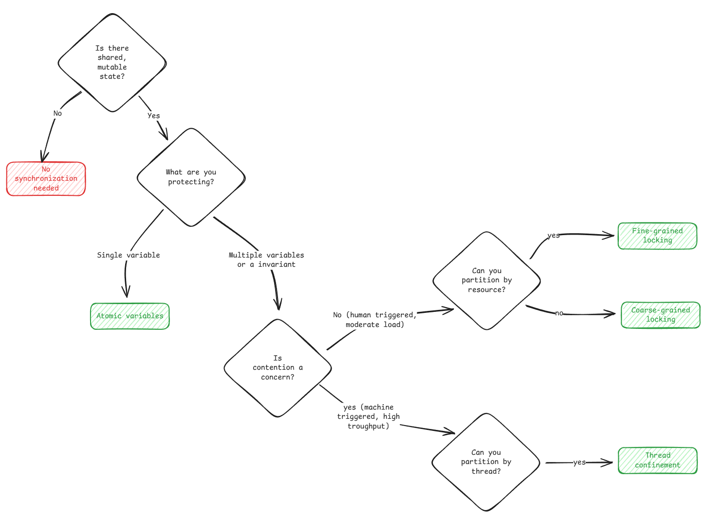
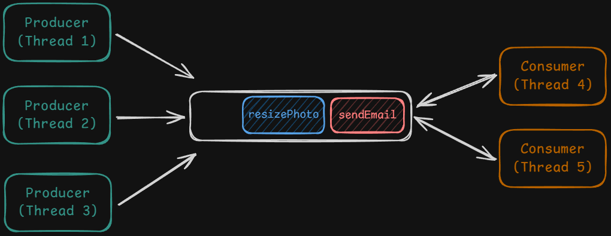
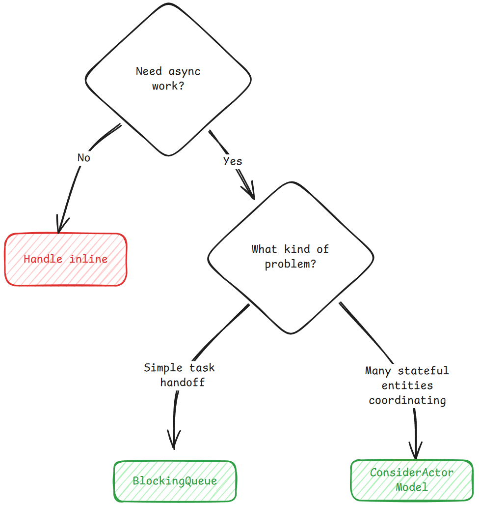
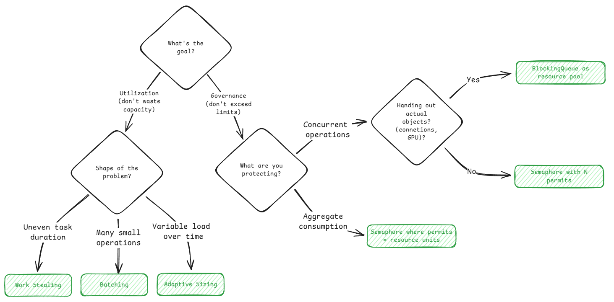

## Concurrency and Thread Safety

<!-- Race conditions
Deadlocks
Thread safety
Atomic operations
Critical sections
Producer-consumer
Thread-safe singleton -->

Concurrency occurs when 2 or more process/thread tries to change same resource

**Process** - An isolated container with its own address space and resources, to run a set of instructions.
**Thread** - Independent execution path inside a process

- Has its own program counter, registers, and stack
- But shares the heap, globals, and open resources with other threads in the same process

> Operation from different thread can interleave (Both in multiprocessor/single processor system)

## Atomics

Thread safe operation on single variable without locks

```cs
using System.Threading;

int counter = 0;
Interlocked.Increment(ref counter);  // Thread-safe increment
```

## Locks (Mutexes)

Provides mutual exclusion. Only one thread can execute until lock is held

```cs
private readonly object _lock = new object();

lock (_lock)
{
    // Only one thread can be here at a time
    balance += amount;
}
```

## Semaphores

Counting locks, N permits.

```cs
using System.Threading;

var permits = new SemaphoreSlim(5);  // Allow 5 concurrent operations
await permits.WaitAsync();  // Block if no permits available
try
{
    DoWork();
}
finally
{
    permits.Release();  // Always release, even on exception
}
```

## Condition Variables

Thread wait efficiently for a condition to become true, release lock and sleeps otherwise.

```cs
using System.Threading;

private readonly object _lock = new object();

lock (_lock)
{
    while (!condition)
    {
        Monitor.Wait(_lock);  // Release lock and sleep
    }
    // Condition is now true
}
```

## Blocking Queues

Thread safe producer consumer handoff.

```cs
using System.Collections.Concurrent;

var queue = new BlockingCollection<Task>(boundedCapacity: 100);
queue.Add(task);     // Blocks if queue is full
var t = queue.Take();  // Blocks if queue is empty
```

---

## Problem Types

| Problem Type     | What Breaks                          | Solutions                            | Common Problems                                          |
| ---------------- | ------------------------------------ | ------------------------------------ | -------------------------------------------------------- |
| **Correctness**  | Shared state is updated concurrently | Locks, atomics, thread confinement   | Check-then-act, read-modify-write                        |
| **Coordination** | Threads need ordering or handoff     | Blocking queues, actors, event loops | Async request processing, bursty traffic                 |
| **Scarcity**     | Resources are limited                | Semaphores, resource pools           | Concurrent op limits, resource consumption, object reuse |

## Correctness

Prevent data corruption when multiple thread access shared state.

**Solutions:**

1. _Coarse-grained locking_ protects all related state with one lock
2. _Fine-grained locking_ allows concurrent access to independent resources while protecting related ones
3. _Atomic variables_ work for single variables but fail for multi-field invariants
4. _Thread confinement_ eliminates concurrency entirely for related data

### Coarse-grained locking [Default in Interviews]

Using one lock to block all operation. Creates a critical section where only one thread can execute at a time

- Both check and update should happen in this block
- Use same lock object for set of operations that needs to happen atomically
- CONS - Throughput becomes less as everything is blocked, even if non interfering

Example - Ticket Booking

```cs
using System.Collections.Generic;

public class TicketBooking
{
    private readonly object _bookingLock = new object();
    private Dictionary<string, string> _seatOwners = new Dictionary<string, string>();

    public bool BookSeat(string seatId, string visitorId)
    {
        lock (_bookingLock)
        {
            if (_seatOwners.ContainsKey(seatId))
            {
                return false;
            }
            _seatOwners[seatId] = visitorId;
            return true;
        }
    }
}
```

C# Lock automatically releases lock on block end / exception

**Read-Write Lock / Shared-exclusive lock**
For read heavy data store, like cache/config

- 2 Modes: Read / Shared and Write / Exclusive
- Multiple readers can hold read lock simultaneously
- For write, once all read lock releaseed then block and writes

```cs
using System.Collections.Generic;
using System.Threading;

public class Cache
{
    private readonly ReaderWriterLockSlim _rwLock = new();
    private readonly Dictionary<string, string> _data = new();

    public string Get(string key)
    {
        _rwLock.EnterReadLock();
        try
        {
            return _data.TryGetValue(key, out var value) ? value : null;
        }
        finally
        {
            _rwLock.ExitReadLock();
        }
    }

    public void Put(string key, string value)
    {
        _rwLock.EnterWriteLock();
        try
        {
            _data[key] = value;
        }
        finally
        {
            _rwLock.ExitWriteLock();
        }
    }
}
```

### Fine Grain Locking

Multiple locks, each lock protects smaller piece of data

- This method used for traffic at scale
- CONS - Causes complexities, deadlocks, Overhead of many locks

Example - Ticket Booking - Lock per seat

```cs
using System.Collections.Concurrent;

public class TicketBookingFineGrained
{
    private readonly ConcurrentDictionary<string, object> _seatLocks =
        new ConcurrentDictionary<string, object>();
    private readonly ConcurrentDictionary<string, string> _seatOwners =
        new ConcurrentDictionary<string, string>();

    private object GetLock(string seatId)
    {
        return _seatLocks.GetOrAdd(seatId, _ => new object());
    }

    public bool BookSeat(string seatId, string visitorId)
    {
        lock (GetLock(seatId))
        {
            if (_seatOwners.ContainsKey(seatId))
            {
                return false;
            }
            _seatOwners[seatId] = visitorId;
            return true;
        }
    }
}
```

### Atomic Values

Uses CPU instruction to read-modify-write variable in single uninterruptible step

- Works only for single variable
- like counters, flags, or statistics

```cs
using System.Threading;

public class BookingStats
{
    private int _bookedCount = 0;

    public void OnSeatBooked()
    {
        Interlocked.Increment(ref _bookedCount);
    }

    public int GetBookedCount()
    {
        return Interlocked.CompareExchange(ref _bookedCount, 0, 0);
    }
}
```

- C# : Decrement(), Add(), Exchange(), and CompareExchange()
- Works on int, long, reference type

**Complex Updates**

- CAS Loop used.
- Optimistically assume no one else will interfere, do your work, and only retry if that assumption was wrong

```cs
using System.Threading;

public class ConcurrencyTracker
{
    private int _maxConcurrent = 0;

    public void UpdateMaxConcurrent(int current)
    {
        int observed;
        do
        {
            observed = _maxConcurrent;
            if (current <= observed)
            {
                return;
            }
        } while (Interlocked.CompareExchange(ref _maxConcurrent, current, observed) != observed);
    }
}
```

- Interlocked.CompareExchange(ref location, newValue, expected) returns the original value.

### Thread confinement (Shared Nothing)

Partition the data so each thread owns its slice

- CONS - Load Imbalance, Cross Partition Data Query Issues

## Bugs Pattern

### Check-Then-Act

Check a value, Act on it : Another thread work updates the condition in between
SOLUTION - Make Check and Act Atomic - Coarse Grain Locking

Examples

- Checking connection pool
- Checking cache size
- File downloading
- Parking lot

### Read-Modify-Write

Read a value, Process, Write : Another thread modifies
SOLUTION - Atomic Variable for single variable, Lock for multiple

Example

- Hit counter
- Bank Account
- Metrics
- Inventory System



---

## Coordination

Coordination is threads communicating with each other


### Issues

#### When consumers are faster

```cs
// Busy Waiting
while (true)
{
    if (queue.Count > 0)
    {
        var task = queue.Dequeue();
        Execute(task);
    }
}
```

- CPU cycle wasted for waiting for work

```cs
// Sleep Poling
while (true)
{
    if (queue.Count > 0)
    {
        var task = queue.Dequeue();
        Execute(task);
    }
    else
    {
        Thread.Sleep(100);
    }
}
```

- Latency increases to begin the work

#### When producers are faster

- Queue keeps on growing in size
- Everything crashes on Out of Memory Error

**Solution needed for**

- Efficient Waiting
- Backpressure
- Thread Safety

### Solution

- _Shared State Coordination_ - Shared data structure between threads
- _Message Passing Coordination_ - Each component independent and communicate via messages

#### Shared State Coordination

Queue - Shared State

**Wait/Notify**
Thread waits for condition to become true, otherwise sleeps

> Not used in interviews

**Blocking Queues**
Thread safe queue with special behavior when empty/full

- On trying to consume empty queue, thread waits, wakes when some item
- On trying to push to full queue, thread waits, wakes when slot

```cs
using System.Collections.Concurrent;

public class TaskScheduler
{
    private readonly BlockingCollection<Action> _queue =
        new BlockingCollection<Action>(boundedCapacity: 1000);

    public void SubmitTask(Action task)
    {
        _queue.Add(task);  // Blocks if queue is full
    }

    public void WorkerLoop()
    {
        while (true)
        {
            var task = _queue.Take();  // Blocks if queue is empty
            task();
        }
    }
}
```

- Sync handled so concurrent operation possible without corrupting data
- Efficient producer-consumer problems

Options on When queue fills up:

1. Block Producers
2. Timeout and Reject
3. Drop and Log

Graceful shutdown when threads in take() blocked mode

1. Interrupt the worker thread - Interrupt the thread, worker catches it and exits cleanly
2. Poll with timeout - Worker gets blocked with timeout, after which it checks for shutdown status
3. Poison Pill - Sentinel task "Shutdown", when requested poison pill submitted to workers. Worker exists its loop and shuts down

#### Message Passing Coordination

Threads independent (Actor), 3 properties each

- Mailbox - Queue of incomming message
- Process message one at a time - No internal concurrency issues
- Sends message to other actor

Queue handles concurrent accesses
In blocking queue, different thread can act on same data (Locks needed), but here, each thread owns its own data

```cs
using System.Collections.Concurrent;

public abstract class Actor<T>
{
    private readonly BlockingCollection<T> _mailbox = new();
    private readonly CancellationTokenSource _cts = new();

    protected Actor()
    {
        Task.Run(() => Run(_cts.Token));
    }

    public void Send(T message)
    {
        _mailbox.Add(message);
    }

    protected abstract void OnReceive(T message);

    public void Stop()
    {
        _cts.Cancel();
        _mailbox.CompleteAdding();
    }

    private void Run(CancellationToken token)
    {
        try
        {
            foreach (var message in _mailbox.GetConsumingEnumerable(token))
            {
                OnReceive(message);
            }
        }
        catch (OperationCanceledException) { }
    }
}
```

Email Service with Actors

```cs
public record EmailRequest(string To, string Subject, string Body);

public class EmailActor : Actor<EmailRequest>
{
    private readonly EmailClient _emailClient = new();

    protected override void OnReceive(EmailRequest request)
    {
        _emailClient.Send(request.To, request.Subject, request.Body);
    }
}

// Usage: no shared state, no locks needed
public class SignupHandler
{
    private readonly EmailActor _emailActor = new();
    private readonly UserRepository _userRepository;

    public void HandleSignup(SignupRequest request)
    {
        var user = _userRepository.Save(new User(request.Email));

        // Send message to actor - returns immediately
        _emailActor.Send(new EmailRequest(
            user.Email,
            "Welcome!",
            "Thanks for signing up..."
        ));
    }
}
```

**Challenges**

- Mailbox overflow
- Message ordering difficult to maintain at global state
- Debugging complex
- Async communication - Request response model

**When to use actors**

- Use Blocking Queue by default - Process tasks in background
- Use actor when many independent entities occasionally communicate
- Scales well
- Example - Game System, Trading System, Chat System

### COMMON PROBLEMS

**Process Request Async**

- Image Upload Service
- Payment Processing
- Report Generation

```cs
using System.Collections.Concurrent;

public record EmailTask(string Recipient, string Template, string Data);

public class EmailService
{
    private readonly BlockingCollection<EmailTask> _emailQueue =
        new BlockingCollection<EmailTask>(boundedCapacity: 10000);

    // API handler (producer)
    public void Signup(string email, string name)
    {
        // Fast: Save user to database
        _userRepository.Save(email, name);

        // Fast: Enqueue background work
        _emailQueue.Add(new EmailTask(email, "welcome", name));

        // Return immediately - user sees instant response
    }

    // Worker thread (consumer)
    public void EmailWorker()
    {
        while (true)
        {
            var task = _emailQueue.Take();
            // Slow: Connect to email server and send
            _emailClient.Send(task.Recipient, task.Template, task.Data);
        }
    }
}
```

**Handle Bursty Traffic**

- News site
- Email campaign
- Batch job completion
- Webhooks

```cs
using System.Collections.Concurrent;

public record PurchaseRequest(string UserId, string EventId, int Quantity);

public class TicketService
{
    // Sized for 10-second burst at 10,000 req/s
    private readonly BlockingCollection<PurchaseRequest> _purchaseQueue =
        new BlockingCollection<PurchaseRequest>(boundedCapacity: 100000);

    // API handler (producer) - handles bursts
    public void PurchaseTicket(string userId, string eventId, int quantity)
    {
        var request = new PurchaseRequest(userId, eventId, quantity);

        // Enqueue request - returns immediately even during spike
        if (!_purchaseQueue.TryAdd(request, TimeSpan.FromMilliseconds(100)))
        {
            throw new ServiceUnavailableException("Too many requests, try again");
        }
    }

    // Worker pool sized for normal load (100 workers)
    public void PurchaseWorker()
    {
        while (true)
        {
            var request = _purchaseQueue.Take();
            // Process at normal rate - database, payment, inventory
            ProcessPurchase(request);
        }
    }
}
```

### Conclusion



---

## Scarcity

Scarcity is about managing limited resources when demand exceeds supply

- Database connections, Memory for buffers, Expensive Resources

### Problem

- Limited resource, needs to be released properly by threads for efficient use

### Solution

- _Semaphores_ - Limit number of threads holding resources simul
- _Resource Pooling_- Gives actual resource objects not just permission

### Semaphores (Default Choice)

A semaphore is a counter that limits how many threads can do something at once

> OS premitives puts thread to sleep if permits unavailable, wakes them with permits are released

```cs
using System.Threading;

public class APIClient {
    private readonly SemaphoreSlim _requestPermits = new SemaphoreSlim(5);

    public async Task<Response> MakeRequestAsync(string endpoint) {
        await _requestPermits.WaitAsync();
        try {
            return await _httpClient.GetAsync(endpoint);
        } finally {
            _requestPermits.Release();
        }
    }
}
```

- Use `WaitAsync()` for async code or `Wait()` for synchronous
- If exception raised, finally block auto releases permission

### Resource Pooling (with Blocking Queue)

Connection pools needs to be handed out to threads instead of just keeping the count. Needs to be reused

- Queue holds the actual connection objects and dispense them
- When scarce resources has state, use blocking queue

```cs
using System.Collections.Concurrent;

public class ConnectionPool {
    private readonly BlockingCollection<Connection> _availableConnections;

    public ConnectionPool(int poolSize) {
        _availableConnections = new BlockingCollection<Connection>(poolSize);
        for (int i = 0; i < poolSize; i++) {
            _availableConnections.Add(CreateNewConnection());
        }
    }

    public Connection Acquire() {
        return _availableConnections.Take(); // Blocks if empty
    }

    public void Release(Connection conn) {
        _availableConnections.Add(conn);
    }

    public void ExecuteQuery(string query) {
        var conn = Acquire();
        try {
            conn.Execute(query);
        } finally {
            Release(conn);
        }
    }
}
```

**Challenge**

- All connection initialized in begining - Slow start
  - Solution - Lazy Initialization
  - In interview, create all upfront, in constructor - Simpler
- What if some connection broken
  - Check before handing out
- Connection blocked on slow queries, or thread blocks indefinetly
  - Solution - Use timeouts when take()
  - Exception thrown if not received a connection within timeout

Timeout based queueu

```cs
using System.Collections.Concurrent;

public class ConnectionPoolWithTimeout {
    private readonly BlockingCollection<Connection> _availableConnections;
    private readonly TimeSpan _timeout;

    public ConnectionPoolWithTimeout(int poolSize, TimeSpan timeout) {
        _availableConnections = new BlockingCollection<Connection>(poolSize);
        _timeout = timeout;
        for (int i = 0; i < poolSize; i++) {
            _availableConnections.Add(CreateNewConnection());
        }
    }

    public Connection Acquire() {
        if (_availableConnections.TryTake(out var conn, _timeout)) {
            return conn;
        }
        throw new TimeoutException($"No connection available within {_timeout.TotalMilliseconds}ms");
    }

    public void ExecuteQuery(string query) {
        var conn = Acquire();
        try {
            conn.Execute(query);
        } finally {
            _availableConnections.Add(conn);
        }
    }
}
```

### Common Problems

1. Limit concurrent operations (semaphore with N permits)
1. Limit aggregate consumption (semaphore with permits = resource units)
1. Reuse expensive objects (blocking queue of actual objects)

**Limit Concurrent Operations** - Semaphore

> Number of concurrent operations within limits

- Rate limited API Wrapper
- Image processing pipeline
- Video Transcoding Service

```cs
using System.Threading;
using System.IO;

public class DownloadManager {
    private readonly SemaphoreSlim _downloadSlots = new SemaphoreSlim(3);

    public async Task DownloadAsync(string url, string destination) {
        await _downloadSlots.WaitAsync();
        try {
            var data = await _httpClient.DownloadAsync(url);
            await File.WriteAllBytesAsync(destination, data);
        } finally {
            _downloadSlots.Release();
        }
    }
}
```

**Limit Aggregate Consumption** - Semaphore

> Resource utilization within limits. Variable resource consumption per operation

- In flight data limiter
- Memory Budget for buffer

```cs
using System.Threading;
using System.IO;

public class DiskWriter {
    private const int MB = 1024 * 1024;
    private readonly object _lock = new object();
    private int _available = 100; // 100 MB

    public async Task WriteFileAsync(byte[] data, string path) {
        int permits = Math.Max(1, (data.Length + MB - 1) / MB);

        lock (_lock) {
            while (_available < permits) {
                Monitor.Wait(_lock);
            }
            _available -= permits;
        }

        try {
            await File.WriteAllBytesAsync(path, data);
        } finally {
            lock (_lock) {
                _available += permits;
                Monitor.PulseAll(_lock);
            }
        }
    }
}
```

**Reuse Expensive Objects** - Blocking Queues

- Database connection pool
- GPU Task Scheduler

**Maximizing Utilization**

- Fast and slow processes inefficiently using the resource permits

SOLUTIONS

1. Work Stealing - Idle workers can steal tasks from another workers queues
2. Batching - Batch db writes together, hight throughput but high latency as well
3. Adaptive sizing - Pool capacity based on demand

### Conclusion


