## Design Patterns

### Types of Design Patterns

1. **Creational Patterns**
   1. Factory ⭐
   2. Builder ⭐
   3. Singleton
   4. OTHERS - Prototype, Abstract Factory
2. **Structural Patterns**
   1. Adapter ⭐
   2. Decorator ⭐
   3. Composite
   4. Facade
   5. Proxy
   6. OTHERS - Bridge, Flyweight
3. **Behavioral Patterns**
   1. Observer ⭐
   2. Strategy ⭐
   3. Command ⭐
   4. State ⭐
   5. Chain of Responsibility
   6. OTHERS - Mediator, Memento, Template Method, Visitor

| Pattern                     | Type       | Core Intent                       | Trigger / Smell                       | Typical LLD Example |
| --------------------------- | ---------- | --------------------------------- | ------------------------------------- | ------------------- |
| **Factory**                 | Creational | Centralize object creation        | Many concrete types                   | Payment creation    |
| **Builder**                 | Creational | Build complex object step-by-step | Too many constructor parameters       | User/Request        |
| **Singleton**               | Creational | One shared instance               | Exactly one instance needed           | Configuration       |
| **Adapter**                 | Structural | Convert interface                 | Incompatible APIs                     | Payment gateway     |
| **Decorator**               | Structural | Add behavior dynamically          | Too many feature combinations         | Logging/Coffee      |
| **Facade**                  | Structural | Simplify subsystem                | Complex subsystem                     | Checkout            |
| **Composite**               | Structural | Treat tree uniformly              | Hierarchical objects                  | File system         |
| **Proxy**                   | Structural | Control access                    | Need authorization/cache/lazy loading | File service        |
| **Strategy**                | Behavioral | Encapsulate algorithms            | Large behavior-based `if/else`        | Pricing             |
| **Observer**                | Behavioral | Notify many listeners             | One-to-many events                    | Order notifications |
| **State**                   | Behavioral | State-dependent behavior          | Large state-based `if/else`           | Order lifecycle     |
| **Command**                 | Behavioral | Encapsulate request               | Need queue/undo/log                   | Remote control      |
| **Chain of Responsibility** | Behavioral | Pass request through handlers     | Sequential processing                 | Approval workflow   |

### Factory Pattern

Provides an interface for creating objects in a superclass, but allows subclasses to alter the type of objects that will be created.
"Which object should I create?"
**When to use:**

- Object creation depends on dynamic input
- Avoid tight coupling between client and concrete classes
- Multiple implementations of an interface exist

**Typical Use Cases** - Payment gateway, Notification service, Database provider, Object creation based on configuration, etc.

**Key Points**

- Encapsulates object creation logic
- New types can be added without modifying existing code
- Promotes loose coupling between client and concrete classes

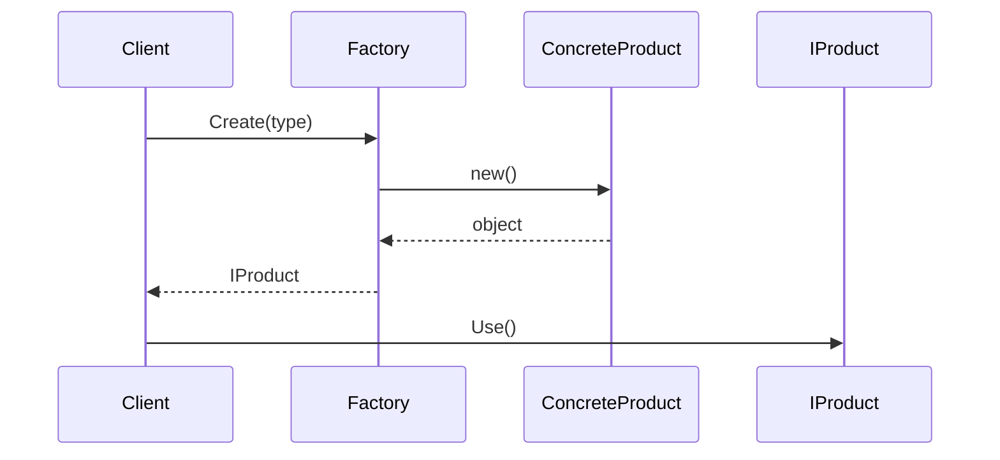
```mermaid
sequenceDiagram
    Client->>Factory: Create(type)
    Factory->>ConcreteProduct: new()
    ConcreteProduct-->>Factory: object
    Factory-->>Client: IProduct
    Client->>IProduct: Use()
```

#### Example - Payment Gateway

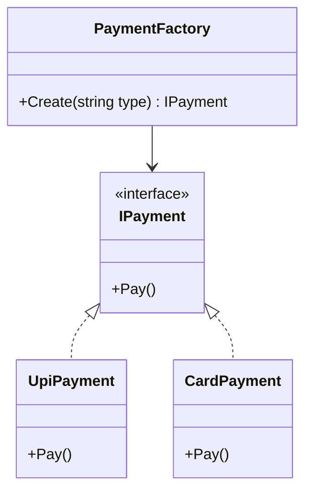
```mermaid
classDiagram
    IPayment <|.. UpiPayment
    IPayment <|.. CardPayment
    PaymentFactory --> IPayment
    class IPayment {
        <<interface>>
        +Pay()
    }
    class UpiPayment {
        +Pay()
    }
    class CardPayment {
        +Pay()
    }
    class PaymentFactory {
        +Create(string type) IPayment
    }
```

```cs
interface IPayment {
    void Pay();
}
class UpiPayment : IPayment {
    public void Pay() {
        Console.WriteLine("UPI Payment");
    }
}
class CardPayment : IPayment {
    public void Pay() {
        Console.WriteLine("Card Payment");
    }
}
class PaymentFactory {
    public static IPayment Create(string type) {
        return type switch {
            "UPI" => new UpiPayment(),
            "CARD" => new CardPayment(),
            _ => throw new ArgumentException("Invalid payment type")
        };
    }
}
class Client {
    public void Process() {
        IPayment payment = PaymentFactory.Create("UPI");
        payment.Pay();
    }
}
```

### Builder Pattern

Builds a complex object step-by-step instead of using a constructor with many parameters
"How do I construct this complex object?"
**When to use:**

- Object has many optional parameters
- Constructor becomes difficult to read.
- You want immutable/configurable objects.
- Different configurations of the same object are required.

**Typical Use Cases** - HTTP requests, SQL queries, Configuration objects, Reports, Complex domain objects

**Key Points**

- Encapsulates the construction logic of an object
- Improves code readability and maintainability
- Describes HOW an object is constructed

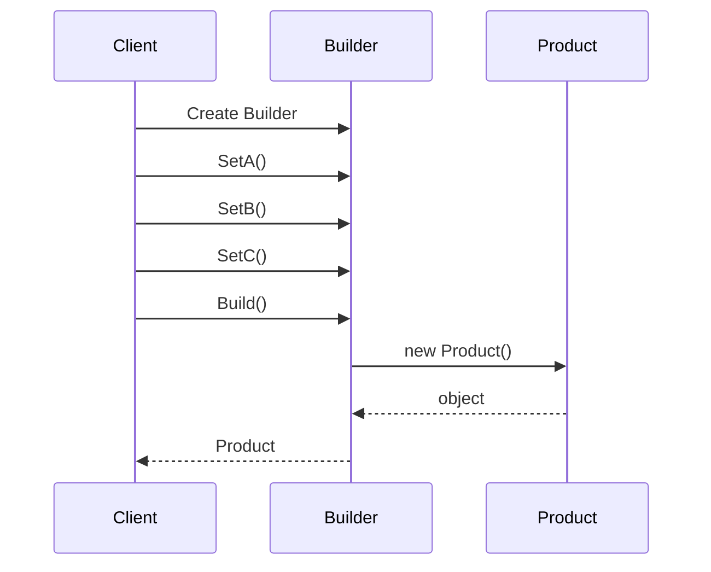
```mermaid
sequenceDiagram
    Client->>Builder: Create Builder
    Client->>Builder: SetA()
    Client->>Builder: SetB()
    Client->>Builder: SetC()
    Client->>Builder: Build()
    Builder->>Product: new Product()
    Product-->>Builder: object
    Builder-->>Client: Product
```

#### Example - User Builder

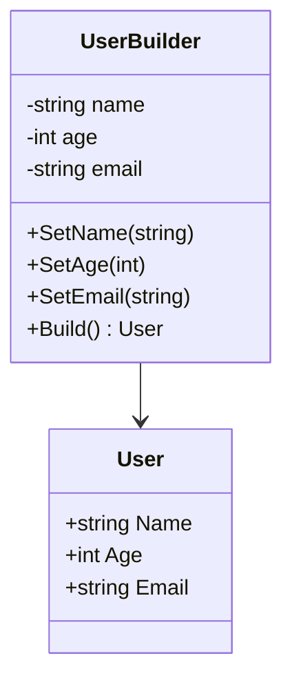
```mermaid
classDiagram
    UserBuilder --> User
    class UserBuilder {
        -string name
        -int age
        -string email
        +SetName(string)
        +SetAge(int)
        +SetEmail(string)
        +Build() User
    }
    class User {
        +string Name
        +int Age
        +string Email
    }
```

```cs
class User {
    public string Name { get; }
    public int Age { get; }
    public string Email { get; }
    public User(string name, int age, string email) {
        Name = name;
        Age = age;
        Email = email;
    }
}
class UserBuilder {
    private string _name;
    private int _age;
    private string _email;
    public UserBuilder SetName(string name) {
        _name = name;
        return this;
    }
    public UserBuilder SetAge(int age) {
        _age = age;
        return this;
    }
    public UserBuilder SetEmail(string email) {
        _email = email;
        return this;
    }
    public User Build() {
        return new User(_name, _age, _email);
    }
}
```

### Singleton Pattern

Ensures a class has only one instance and provides a global point of access to it.
"Give me the one shared instance."
**When to use:**

- One instance of a class is needed to coordinate actions across the system.

**Typical Use Cases** - Configuration manager, Logging service, Database connection pool, Thread pool, Cache manager

**Key Points**

- Private constuctor prevents instantiation from other classes
- Static method provides a global point of access to the instance
- Makes testing difficult due to global state and tight coupling
- Concurrency and Thread Safety should be considered
- Reduce memory usage, Provides a single point of access to shared resources

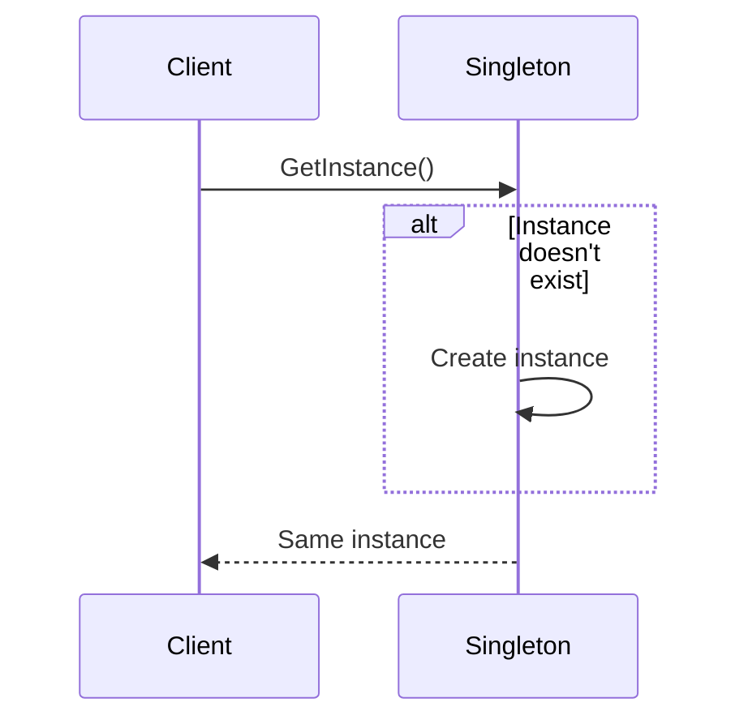
```mermaid
sequenceDiagram
    Client->>Singleton: GetInstance()
    alt Instance doesn't exist
        Singleton->>Singleton: Create instance
    end
    Singleton-->>Client: Same instance
```

#### Example - Logging Service

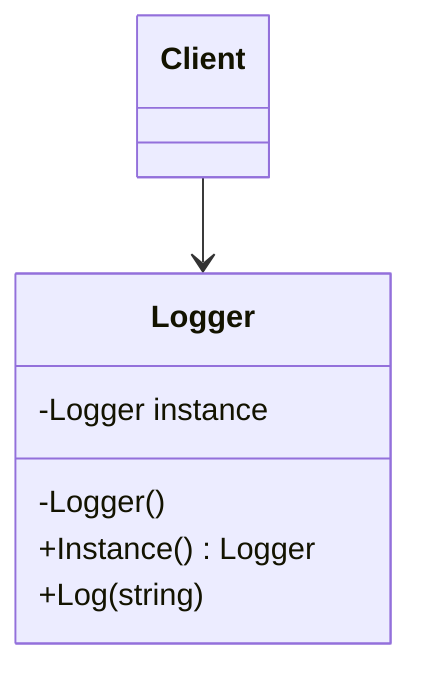
```mermaid
classDiagram
    Client --> Logger
    class Logger {
        -Logger instance
        -Logger()
        +Instance() Logger
        +Log(string)
    }
```

```cs
class Logger {
    private static readonly Lazy<Logger> _instance = new(() => new Logger());
    private Logger() {
    }
    public static Logger Instance => _instance.Value;
    public void Log(string message) {
        Console.WriteLine(message);
    }
}
```

### Adapter Pattern

Converts one interface to another interface that the client expects.
"Make this interface compatible by acting as a wrapper/bridge"

**When to use:**

- Integrating with third-party libraries or legacy code
- Existing code cannot be modified to match the new interface

**Typical Use Cases** - Payment gateway integration, File format conversion, API versioning, Legacy system integration

**Key Points**

- Adapter class changes the interface not the underlying implementation
- Promotes code reusability, compatibility and flexibility
- Prefer composition over inheritance for implementing adapters
- Acts as wrapper
- Follow Open/Closed Principle

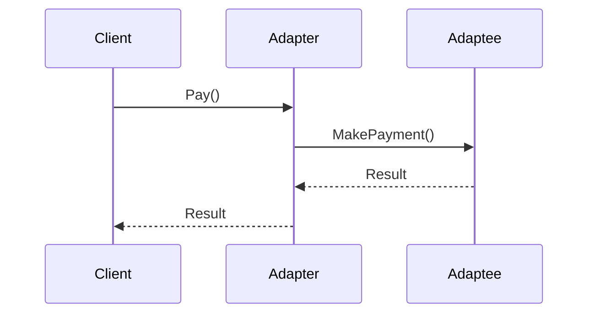
```mermaid
sequenceDiagram
    Client->>Adapter: Pay()
    Adapter->>Adaptee: MakePayment()
    Adaptee-->>Adapter: Result
    Adapter-->>Client: Result
```

#### Example - Payment Gateway Adapter

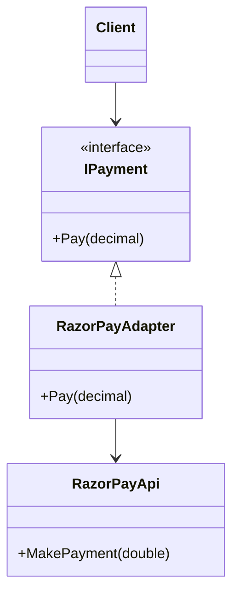
```mermaid
classDiagram
    Client --> IPayment
    IPayment <|.. RazorPayAdapter
    RazorPayAdapter --> RazorPayApi
    class IPayment {
        <<interface>>
        +Pay(decimal)
    }
    class RazorPayAdapter {
        +Pay(decimal)
    }
    class RazorPayApi {
        +MakePayment(double)
    }
```

```cs
interface IPayment {
    void Pay(decimal amount);
}
class RazorPayApi {
    public void MakePayment(double amount) {
        Console.WriteLine($"Paid {amount}");
    }
}
class RazorPayAdapter : IPayment {
    private readonly RazorPayApi _api;
    public RazorPayAdapter(RazorPayApi api) {
        _api = api;
    }
    public void Pay(decimal amount) {
        _api.MakePayment((double)amount);
    }
}
```

### Decorator Pattern

Dynamically adds behavior to an object without affecting the behavior of other objects from the same class.
"Add behavior around this object."

**When to use:**

- Need optional / additional features for an object
- Avoid subclassing for every combination of features
- Multiple combinations of features are required
- Need flexible and extensible design

**Typical Use Cases** - Logging, File I/O, GUI components, Data streams, Notifications, Encryption, Compression, Authorization, Middlewares

**Key Points**

- Follows Open/Closed Principle
- Implements the same interface as the original object
- Uses composition to wrap the original object
- Can add multiple decorators to the same object
- Adds behavior at runtime before or after the original method without modifying the original class
- _Adapter_ - Changes the interface, _Decorator_ - Adds behavior to the same interface

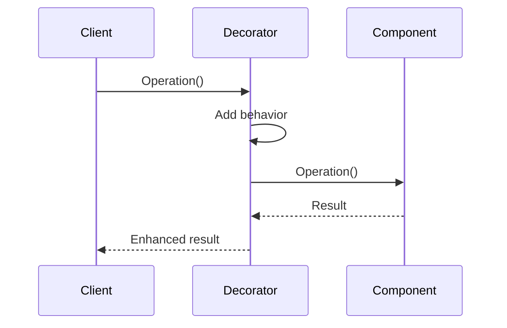
```mermaid
sequenceDiagram
    Client->>Decorator: Operation()
    Decorator->>Decorator: Add behavior
    Decorator->>Component: Operation()
    Component-->>Decorator: Result
    Decorator-->>Client: Enhanced result
```

#### Example - Coffee Shop

Base coffee can be decorated with milk and sugar to create different combinations of coffee.

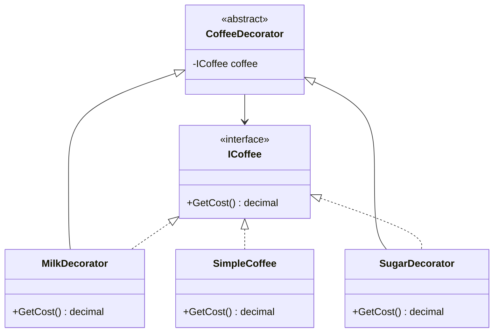
```mermaid
classDiagram
    ICoffee <|.. SimpleCoffee
    ICoffee <|.. MilkDecorator
    ICoffee <|.. SugarDecorator
    CoffeeDecorator <|-- MilkDecorator
    CoffeeDecorator <|-- SugarDecorator
    CoffeeDecorator --> ICoffee
    class ICoffee {
        <<interface>>
        +GetCost() decimal
    }
    class SimpleCoffee {
        +GetCost() decimal
    }
    class CoffeeDecorator {
        <<abstract>>
        -ICoffee coffee
    }
    class MilkDecorator {
        +GetCost() decimal
    }
    class SugarDecorator {
        +GetCost() decimal
    }
```

```cs
interface ICoffee {
    decimal GetCost();
}
class SimpleCoffee : ICoffee {
    public decimal GetCost() {
        return 100;
    }
}
abstract class CoffeeDecorator : ICoffee {
    protected readonly ICoffee _coffee;
    protected CoffeeDecorator(ICoffee coffee) {
        _coffee = coffee;
    }
    public abstract decimal GetCost();
}
class MilkDecorator : CoffeeDecorator {
    public MilkDecorator(ICoffee coffee) : base(coffee) {
    }
    public override decimal GetCost() {
        return _coffee.GetCost() + 20;
    }
}
class SugarDecorator : CoffeeDecorator {
    public SugarDecorator(ICoffee coffee) : base(coffee) {
    }
    public override decimal GetCost() {
        return _coffee.GetCost() + 10;
    }
}
// Usage
ICoffee coffee = new SimpleCoffee();
coffee = new MilkDecorator(coffee);
coffee = new SugarDecorator(coffee);
```

### Facade Pattern

Provides a simplified interface to a complex subsystem, making it easier for clients to interact with the system.
"Hide all this complexity behind one API."

**When to use:**

- Simplifying complex subsystems for clients
- Hiding the complexity of a system from clients
- Providing a unified interface to a set of interfaces in a subsystem

**Typical Use Cases**- Payment processing, File system operations, Database access, Network communication, API gateway, Video conversion, Home automation, Media player, Compiler design

**Key Points**

- Doesn't change the underlying subsystem, just provides a simpler interface
- Promotes loose coupling between clients and subsystems

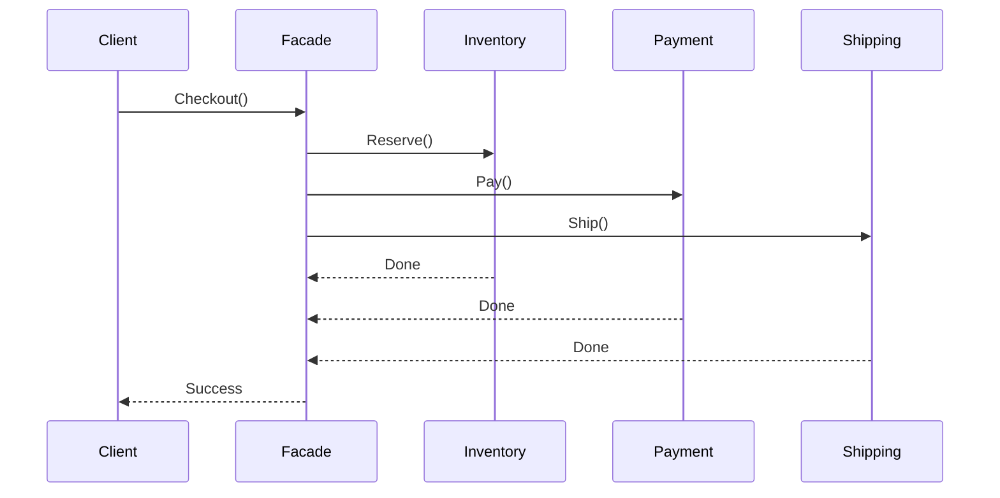
```mermaid
sequenceDiagram
    Client->>Facade: Checkout()
    Facade->>Inventory: Reserve()
    Facade->>Payment: Pay()
    Facade->>Shipping: Ship()
    Inventory-->>Facade: Done
    Payment-->>Facade: Done
    Shipping-->>Facade: Done
    Facade-->>Client: Success
```

#### Example - Checkout Process

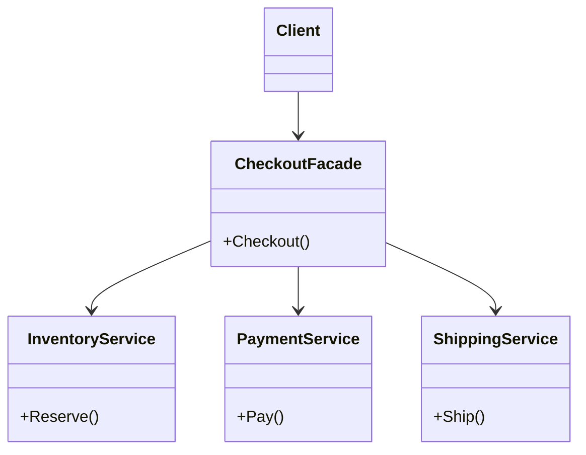
```mermaid
classDiagram
    Client --> CheckoutFacade
    CheckoutFacade --> InventoryService
    CheckoutFacade --> PaymentService
    CheckoutFacade --> ShippingService
    class CheckoutFacade {
        +Checkout()
    }
    class InventoryService {
        +Reserve()
    }
    class PaymentService {
        +Pay()
    }
    class ShippingService {
        +Ship()
    }
```

```cs
class InventoryService {
    public void Reserve() {
    }
}
class PaymentService {
    public void Pay() {
    }
}
class ShippingService {
    public void Ship() {
    }
}
class CheckoutFacade {
    private readonly InventoryService _inventory;
    private readonly PaymentService _payment;
    private readonly ShippingService _shipping;
    public CheckoutFacade(InventoryService inventory, PaymentService payment, ShippingService shipping) {
        _inventory = inventory;
        _payment = payment;
        _shipping = shipping;
    }
    public void Checkout() {
        _inventory.Reserve();
        _payment.Pay();
        _shipping.Ship();
    }
}
```

### Composite Pattern

Allows individual objects and groups of objects to be treated uniformly.
"Treat individual and groups uniformly."

**When to use:**

- Hierarchical tree structure of objects

**Typical Use Cases** - File system, Organization structure, Menu systems, Graphics rendering, UI components

**Key Points**

- Leaf - represents individual objects, Composite represents groups of objects
- Both implement the same interface, allowing clients to treat them uniformly
- Excellent for recursive structures and tree-like hierarchies

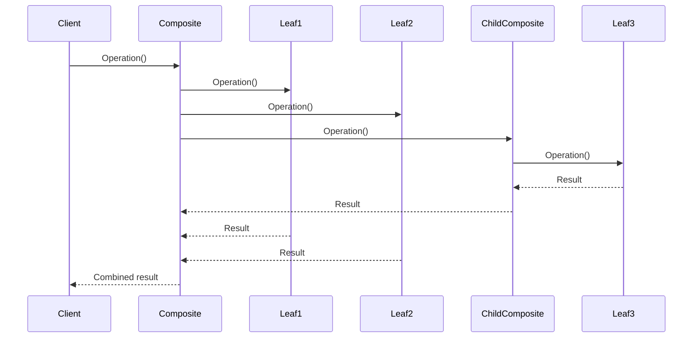
```mermaid
sequenceDiagram
    Client->>Composite: Operation()
    Composite->>Leaf1: Operation()
    Composite->>Leaf2: Operation()
    Composite->>ChildComposite: Operation()
    ChildComposite->>Leaf3: Operation()
    Leaf3-->>ChildComposite: Result
    ChildComposite-->>Composite: Result
    Leaf1-->>Composite: Result
    Leaf2-->>Composite: Result
    Composite-->>Client: Combined result
```

#### Example - File System

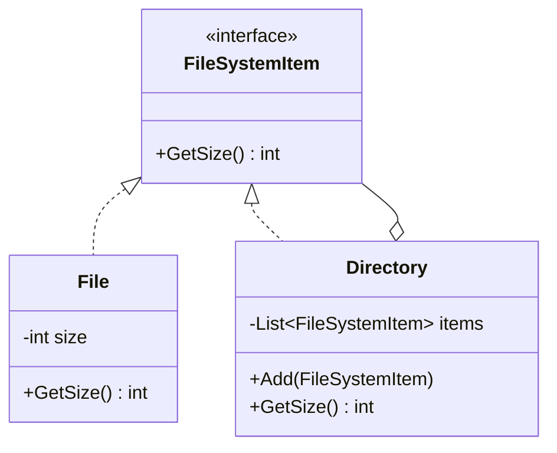
```mermaid
classDiagram
    FileSystemItem <|.. File
    FileSystemItem <|.. Directory
    Directory o-- FileSystemItem
    class FileSystemItem {
        <<interface>>
        +GetSize() int
    }
    class File {
        -int size
        +GetSize() int
    }
    class Directory {
        -List~FileSystemItem~ items
        +Add(FileSystemItem)
        +GetSize() int
    }
```

```cs
interface IFileSystemItem {
    int GetSize();
}
class File : IFileSystemItem {
    private readonly int _size;
    public File(int size) {
        _size = size;
    }
    public int GetSize() {
        return _size;
    }
}
class Directory : IFileSystemItem {
    private readonly List<IFileSystemItem> _items = new();
    public void Add(IFileSystemItem item) {
        _items.Add(item);
    }
    public int GetSize() {
        return _items.Sum(x => x.GetSize());
    }
}
```

### Proxy Pattern

Provides a substitute/representative for another object to control access to it.
"Put something in front of the real object."

**When to use:**

- Controlling access to an object
- Lazy initialization
- Logging, caching, or other additional functionality

**Typical Use Cases** - Lazy DB Objects, Remote proxy, Virtual proxy, Protection proxy, Smart reference proxy, Caching proxy, Logging proxy

**Key Points**

- Same interface as the real object, allowing clients to use the proxy transparently
- Controls access to the real object

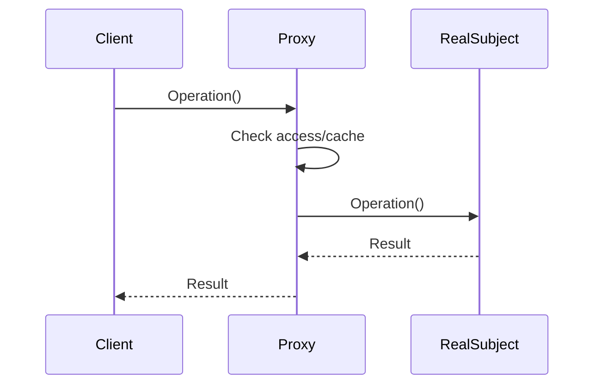
```mermaid
sequenceDiagram
    Client->>Proxy: Operation()
    Proxy->>Proxy: Check access/cache
    Proxy->>RealSubject: Operation()
    RealSubject-->>Proxy: Result
    Proxy-->>Client: Result
```

#### Example - Auth Proxy

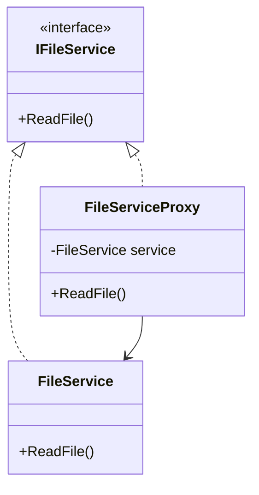
```mermaid
classDiagram
    IFileService <|.. FileService
    IFileService <|.. FileServiceProxy
    FileServiceProxy --> FileService
    class IFileService {
        <<interface>>
        +ReadFile()
    }
    class FileService {
        +ReadFile()
    }
    class FileServiceProxy {
        -FileService service
        +ReadFile()
    }
```

```cs
interface IFileService {
    void ReadFile();
}
class FileService : IFileService {
    public void ReadFile() {
        Console.WriteLine("Reading file");
    }
}
class FileServiceProxy : IFileService {
    private readonly FileService _service;
    private readonly bool _isAuthorized;
    public FileServiceProxy(FileService service, bool isAuthorized) {
        _service = service;
        _isAuthorized = isAuthorized;
    }
    public void ReadFile() {
        if (!_isAuthorized)
            throw new UnauthorizedAccessException();
        _service.ReadFile();
    }
}
```

### Strategy Pattern

Encapsulates interchangeable algorithms/behaviors behind a common interface.
"Which algorithm should I use?"

**When to use:**

- Multiple algorithms for a specific task
- Need to switch between algorithms at runtime, Many if/else or switch statements based on behavior

**Typical Use Cases** - Payment methods, Sorting algorithms, Compression algorithms, Authentication strategies, Pricing strategies, Tax calculation strategies

**Key Points**

- Composition over inheritance
- Behavior can be changed at runtime
- Clients independent of the concrete implementation of the algorithm
- Follows Open/Closed Principle
- New algorithms can be added without modifying existing code

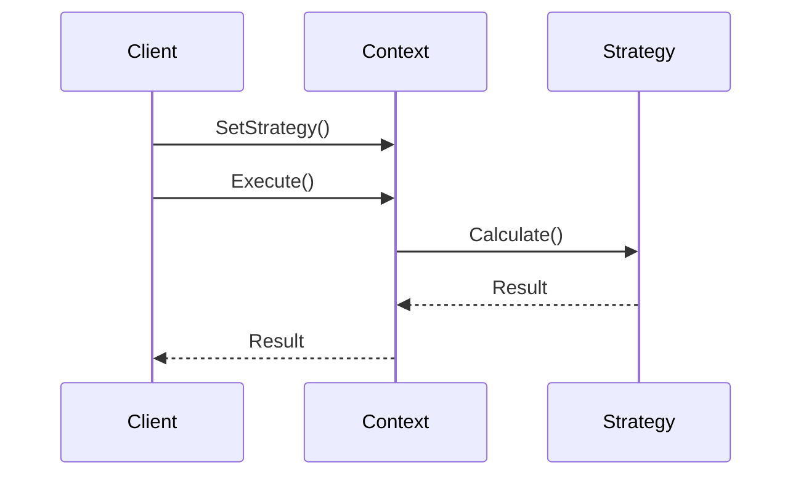
```mermaid
sequenceDiagram
    Client->>Context: SetStrategy()
    Client->>Context: Execute()
    Context->>Strategy: Calculate()
    Strategy-->>Context: Result
    Context-->>Client: Result
```

#### Example - Pricing Strategy

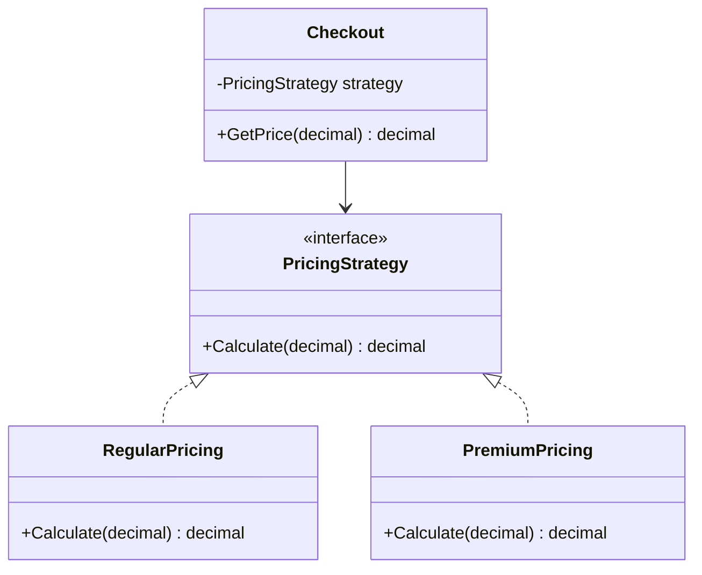
```mermaid
classDiagram
    PricingStrategy <|.. RegularPricing
    PricingStrategy <|.. PremiumPricing
    Checkout --> PricingStrategy
    class PricingStrategy {
        <<interface>>
        +Calculate(decimal) decimal
    }
    class RegularPricing {
        +Calculate(decimal) decimal
    }
    class PremiumPricing {
        +Calculate(decimal) decimal
    }
    class Checkout {
        -PricingStrategy strategy
        +GetPrice(decimal) decimal
    }
```

```cs
interface IPricingStrategy {
    decimal Calculate(decimal amount);
}
class RegularPricing : IPricingStrategy {
    public decimal Calculate(decimal amount) {
        return amount;
    }
}
class PremiumPricing : IPricingStrategy {
    public decimal Calculate(decimal amount) {
        return amount * 0.9m;
    }
}
class Checkout {
    private readonly IPricingStrategy _strategy;
    public Checkout(IPricingStrategy strategy) {
        _strategy = strategy;
    }
    public decimal GetPrice(decimal amount) {
        return _strategy.Calculate(amount);
    }
}
// Usage
IPricingStrategy strategy = new PremiumPricing();
Checkout checkout = new Checkout(strategy);
decimal price = checkout.GetPrice(100); // 90
```

### Observer Pattern

Creates one-to-many dependency between objects so that when one object changes state, all its dependents are notified and updated automatically.
"Tell everyone when something changes."

**When to use:**

- One event triggers updates to multiple objects or consumer of the event
- Publish-subscribe model is needed without tight coupling between the producer and consumers

**Typical Use Cases** - Event handling, Notification systems, Messaging systems, Logging systems, Stock price updates, Social media feeds

**Key Points**

- Promotes loose coupling between the subject and observers
- Producer should not be aware of the consumers
- Unsubscribe mechanism should be provided to avoid memory leaks

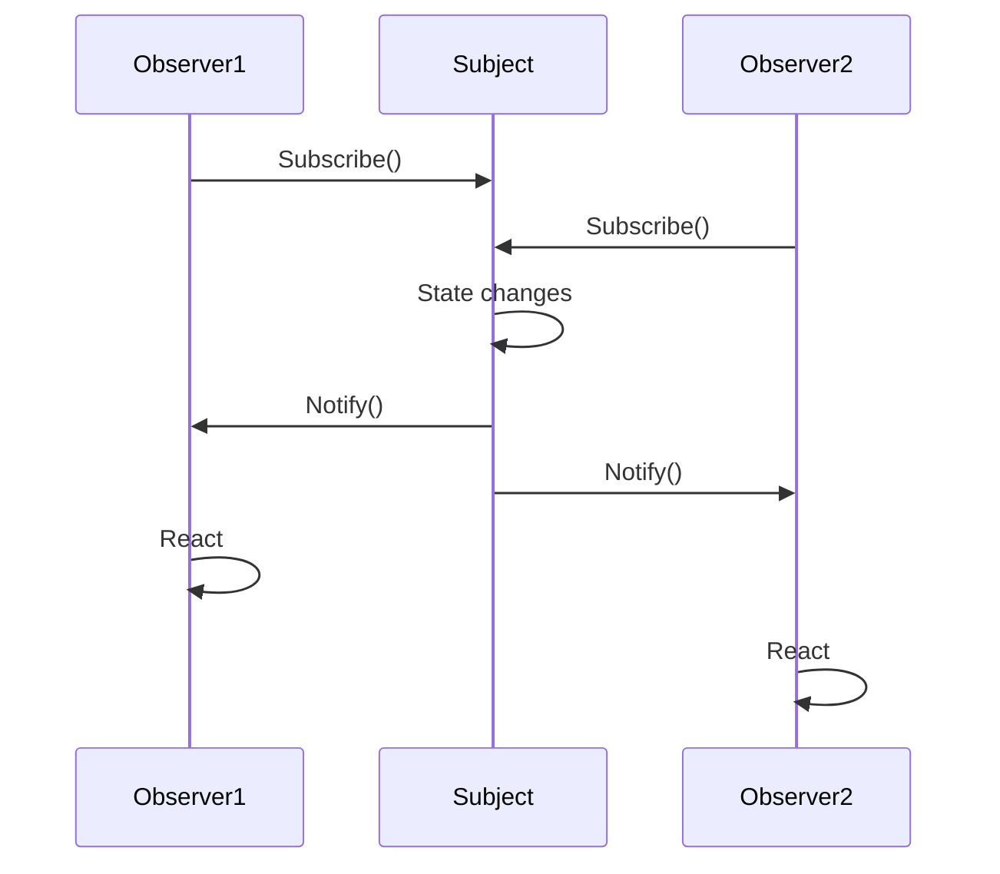
```mermaid
sequenceDiagram
    Observer1->>Subject: Subscribe()
    Observer2->>Subject: Subscribe()
    Subject->>Subject: State changes
    Subject->>Observer1: Notify()
    Subject->>Observer2: Notify()
    Observer1->>Observer1: React
    Observer2->>Observer2: React
```

#### Example - Order Notification

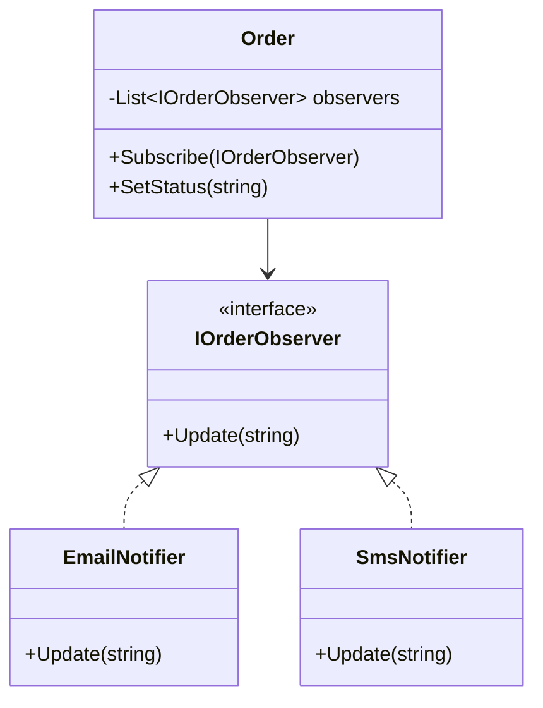
```mermaid
classDiagram
    Order --> IOrderObserver
    IOrderObserver <|.. EmailNotifier
    IOrderObserver <|.. SmsNotifier
    class Order {
        -List~IOrderObserver~ observers
        +Subscribe(IOrderObserver)
        +SetStatus(string)
    }
    class IOrderObserver {
        <<interface>>
        +Update(string)
    }
    class EmailNotifier {
        +Update(string)
    }
    class SmsNotifier {
        +Update(string)
    }
```

```cs
interface IOrderObserver {
    void Update(string status);
}
class EmailNotifier : IOrderObserver {
    public void Update(string status) {
        Console.WriteLine($"Email: {status}");
    }
}
class SmsNotifier : IOrderObserver {
    public void Update(string status) {
        Console.WriteLine($"SMS: {status}");
    }
}
class Order {
    private readonly List<IOrderObserver> _observers = new();
    public void Subscribe(IOrderObserver observer) {
        _observers.Add(observer);
    }
    public void SetStatus(string status) {
        foreach (var observer in _observers)
            observer.Update(status);
    }
}
```

### State Pattern

Allows an object's behavior to change when its internal state changes.
"Behavior depends on objects current state."

**When to use:**

- Object behavior depends on its state
- State based logic is complex and scattered across multiple methods

**Typical Use Cases** - Order lifecycle, Traffic light system, Document workflow, Vending machine, Media player

**Key Points**

- State controls behavior of the object, not the object itself
- Promotes encapsulation of state-specific behavior
- Useful for implementing finite state machines
- State transitions can be managed within the state classes, reducing complexity in the context class
- _Strategy_ - Encapsulates algorithms, _State_ - Encapsulates behavior based on state

```mermaid
sequenceDiagram
    Client->>Context: Process()
    Context->>CurrentState: Handle()
    CurrentState->>Context: ChangeState(NewState)
    Context-->>Client: Done
```

#### Example - Order Lifecycle

```mermaid
classDiagram
    Order --> IOrderState
    IOrderState <|.. NewState
    IOrderState <|.. PaidState
    IOrderState <|.. ShippedState
    class Order {
        -IOrderState state
        +SetState(IOrderState)
        +Process()
    }
    class IOrderState {
        <<interface>>
        +Process(Order)
    }
    class NewState {
        +Process(Order)
    }
    class PaidState {
        +Process(Order)
    }
    class ShippedState {
        +Process(Order)
    }
```

```cs
interface IOrderState {
    void Process(Order order);
}
class Order {
    private IOrderState _state;
    public Order(IOrderState state) {
        _state = state;
    }
    public void SetState(IOrderState state) {
        _state = state;
    }
    public void Process() {
        _state.Process(this);
    }
}
class NewState : IOrderState {
    public void Process(Order order) {
        Console.WriteLine("Processing new order");
        order.SetState(new PaidState());
    }
}
class PaidState : IOrderState {
    public void Process(Order order) {
        Console.WriteLine("Shipping order");
        order.SetState(new ShippedState());
    }
}
class ShippedState : IOrderState {
    public void Process(Order order) {
        Console.WriteLine("Already shipped");
    }
}
// Usage
Order order = new Order(new NewState());
order.Process(); // Processing new order
order.Process(); // Shipping order
order.Process(); // Already shipped
```

### Command Pattern

Encapsulates a request/action as an object.
"Turn this action into an object."

**When to use:**

- Undo/Redo functionality is needed
- Queueing or scheduling of operations is required
- Logging changes or actions
- Scheduling tasks for later execution

**Typical Use Cases** - Remote control, GUI buttons, Task scheduling, Undo/Redo functionality, Macro recording, Job queueing

**Key Points**

- Encapsulates an action.
- Decouples the sender of a request from the receiver.
- Can store commands for later execution.

```mermaid
sequenceDiagram
    Client->>Command: Create command
    Client->>Invoker: SetCommand()
    Invoker->>Command: Execute()
    Command->>Receiver: Action()
    Receiver-->>Command: Done
    Command-->>Invoker: Done
```

#### Example - Remote Control

```mermaid
classDiagram
    RemoteControl --> ICommand
    ICommand <|.. TurnOnCommand
    TurnOnCommand --> Light
    class ICommand {
        <<interface>>
        +Execute()
    }
    class TurnOnCommand {
        -Light light
        +Execute()
    }
    class Light {
        +TurnOn()
    }
    class RemoteControl {
        -ICommand command
        +SetCommand(ICommand)
        +PressButton()
    }
```

```cs
interface ICommand {
    void Execute();
}
class Light {
    public void TurnOn() {
        Console.WriteLine("Light ON");
    }
}
class TurnOnCommand : ICommand {
    private readonly Light _light;
    public TurnOnCommand(Light light) {
        _light = light;
    }
    public void Execute() {
        _light.TurnOn();
    }
}
class RemoteControl {
    private ICommand _command;
    public void SetCommand(ICommand command) {
        _command = command;
    }
    public void PressButton() {
        _command.Execute();
    }
}
// Usage
Light light = new Light();
ICommand turnOn = new TurnOnCommand(light);
RemoteControl remote = new RemoteControl();
remote.SetCommand(turnOn);
remote.PressButton(); // Light ON
```

### Chain of Responsibility Pattern

Passes a request through a chain of handlers until one handler processes it.
"Pass this request until someone handles it."

**When to use:**

- Multiple handlers can process a request, but the handler is not known in advance
- Request processing is dynamic and can change at runtime
- Order of processing is important

**Typical Use Cases** - Logging, Event handling, Approval workflows, Validations, Middleware pipelines, Request processing in web frameworks

**Key Points**

- Each handler decides whether to process the request or pass it to the next handler
- Promotes loose coupling between sender and receiver
- Handlers can be added or removed dynamically without affecting the client code
- ASP.NET Core middleware pipeline is a real-world example of this pattern

```mermaid
sequenceDiagram
    Client->>Handler1: Request
    alt Handler1 can handle
        Handler1-->>Client: Handle
    else Cannot handle
        Handler1->>Handler2: Forward
        alt Handler2 can handle
            Handler2-->>Client: Handle
        else Cannot handle
            Handler2->>Handler3: Forward
            Handler3-->>Client: Handle
        end
    end
```

#### Example - Approval Workflow

```mermaid
classDiagram
    IApprover <|.. Manager
    IApprover <|.. Director
    IApprover <|.. VP
    Manager --> IApprover
    Director --> IApprover
    class IApprover {
        <<interface>>
        +SetNext(IApprover)
        +Approve(decimal)
    }
    class Manager {
        +Approve(decimal)
    }
    class Director {
        +Approve(decimal)
    }
    class VP {
        +Approve(decimal)
    }
```

```cs
interface IApprover {
    void SetNext(IApprover next);
    void Approve(decimal amount);
}
class Manager : IApprover {
    private IApprover _next;
    public void SetNext(IApprover next) {
        _next = next;
    }
    public void Approve(decimal amount) {
        if (amount <= 1000)
            Console.WriteLine("Manager approved");
        else
            _next?.Approve(amount);
    }
}
class Director : IApprover {
    private IApprover _next;
    public void SetNext(IApprover next) {
        _next = next;
    }
    public void Approve(decimal amount) {
        if (amount <= 10000)
            Console.WriteLine("Director approved");
        else
            _next?.Approve(amount);
    }
}
class VP : IApprover {
    public void SetNext(IApprover next) {
    }
    public void Approve(decimal amount) {
        Console.WriteLine("VP approved");
    }
}
// Usage
Manager manager = new Manager();
Director director = new Director();
VP vp = new VP();
manager.SetNext(director);
director.SetNext(vp);
manager.Approve(500);
```

### Differences

|              | Factory              | Builder                   |
| ------------ | -------------------- | ------------------------- |
| Main purpose | Choose/create object | Construct complex object  |
| Focus        | **Which object?**    | **How to construct?**     |
| Example      | UPI vs Card          | User with optional fields |

|              | Adapter          | Decorator    | Proxy          |
| ------------ | ---------------- | ------------ | -------------- |
| Main purpose | Change interface | Add behavior | Control access |
| Interface    | Usually changes  | Usually same | Same           |
| Wraps object | Yes              | Yes          | Yes            |
| Example      | Third-party API  | Add logging  | Authorization  |

|                      | Strategy                   | State                    |
| -------------------- | -------------------------- | ------------------------ |
| Behavior selected by | Client                     | Object's state           |
| Purpose              | Interchangeable algorithms | State-dependent behavior |
| Runtime change       | Usually client chooses     | State transitions        |
| Example              | Pricing strategy           | Order lifecycle          |

|                     | Observer           | Chain of Responsibility        |
| ------------------- | ------------------ | ------------------------------ |
| Number of receivers | Multiple           | Usually one eventually handles |
| Flow                | Broadcast          | Sequential                     |
| Example             | Notify email + SMS | Manager → Director → VP        |

|                    | Facade                         | Adapter                    |
| ------------------ | ------------------------------ | -------------------------- |
| Purpose            | Simplify interface             | Convert interface          |
| Existing interface | Already usable                 | Incompatible               |
| Example            | `Checkout()` hiding 5 services | Converting third-party API |

|                       | Decorator | Inheritance               |
| --------------------- | --------- | ------------------------- |
| Behavior              | Dynamic   | Usually fixed             |
| Composition           | Yes       | No                        |
| Multiple combinations | Easy      | Can cause class explosion |
| Runtime change        | Yes       | No                        |
