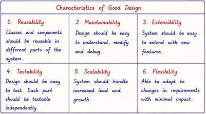

# Low Level Design (LLD)

## Contents

| # | Topic | Notes |
| - | ----- | ----- |
| 1 | [Object Oriented Programming](OOPs/OOPs.md) | Classes, objects, the four pillars, composition |
| 2 | [SOLID Principles](SOLID/SOLID.md) | SRP, OCP, LSP, ISP, DIP and dependency injection |
| 3 | [Design Patterns](DesignPatterns/DesignPatterns.md) | Creational, structural and behavioral patterns with examples |
| 4 | [UML Diagrams](UML/UML.md) | Use case, class, sequence and activity diagrams |
| 5 | [LLD Problems](Problems/Problems.md) | Worked machine coding / design problems |

## Overview

LLD is the detailed design of individual components of a system.

- Describes HOW EACH PART WILL BE **IMPLEMENTED**

**SYSTEM** - Collection of components that work together to achieve a specific goal. Example: E-commerce system, Banking system, etc.
**FLOW** - Requirements -> HLD -> LLD -> Implementation -> Testing -> Deployment

|          | HLD                                          | LLD                                      |
| -------- | -------------------------------------------- | ---------------------------------------- |
| Purpose  | Overall System Design                        | Detailed Design of Individual Components |
| Focus    | Architecture, Modules, Components, Data Flow | Classes, Methods, Data Structures, Logic |
| Abstract | High-level, Conceptual                       | Low-level, Implementation Details        |



## Components of LLD

1. Classes / Interfaces
2. Methods
3. Data Structures and Algorithms
4. Relationships between classes, interfaces, methods, and data structures

| Concept                               | What it is                | Purpose                                                                                                |
| ------------------------------------- | ------------------------- | ------------------------------------------------------------------------------------------------------ |
| **OOP (Object-Oriented Programming)** | Programming paradigm      | Provides the building blocks (classes, objects, inheritance, polymorphism, encapsulation, abstraction) |
| **SOLID Principles**                  | Design principles         | Guide you on how to use OOP effectively to create maintainable, extensible code                        |
| **Design Patterns**                   | Reusable design solutions | Common solutions to recurring software design problems                                                 |

## Design Goals

- **Loose coupling** - Reducing interdependencies between components to allow easier maintenance, testing, and flexibility.
- **High cohesion** - Keeping related functionality together within a module or class to improve maintainability and understandability.
- **Composition over Inheritance** - Favoring composition (using objects of other classes) over inheritance (extending classes) to achieve code reuse and flexibility.
- **SOLID** - A set of design principles that promote maintainable and flexible software design.

> **Goal of LLD:** Clean, maintainable, and scalable code following the principles of OOPs, Design Patterns, and Concurrency.

## Class Modeling

Converting requirements into classes and their relationships.

## Object Oriented Analysis and Design (OOAD)

Structured approach to analyzing and designing a system using object-oriented concepts.

1. Identify objects and classes from requirements.
2. Define relationships between classes (association, aggregation, composition, inheritance).
3. Establish responsibilities for each class and object via interfaces and methods.
4. Model the system's behavior and interactions using state diagrams, sequence diagrams, and activity diagrams. (UML Diagrams)

## Process of LLD

```
Requirements
     ↓
Identify entities
     ↓
Identify responsibilities
     ↓
Identify relationships
     ↓
Define interfaces
     ↓
Identify changing behavior
     ↓
Choose abstractions
     ↓
Apply SOLID
     ↓
Use patterns where appropriate
     ↓
Think about extensibility
     ↓
Handle edge cases / concurrency
```

```
                    LLD
                     |
        ┌────────────┴────────────┐
        |                         |
     MODELING                  DESIGN
        |                         |
   Classes                    SOLID
   Interfaces                Patterns
   Relationships              DI
   Responsibilities           Abstraction
        |                         |
        └────────────┬────────────┘
                     |
                IMPLEMENTATION
                     |
              C# / Collections
              Generics
              Exceptions
              Concurrency
              Testing
                     |
                     v
                EXTENSIBILITY
                     |
              "What if we add X?"
```

---

## Design Techniques

Dependency Injection, extensibility, interfaces, object responsibilities, state management, concurrency

## Concurrency and Thread Safety

Race conditions
Deadlocks
Thread safety
Atomic operations
Critical sections
Producer-consumer
Thread-safe singleton

## Topics to Cover

> Notes to be added.

- [ ] State Modeling
- [ ] Separation of Responsibilities, Dependency Management
- [ ] API Design
- [ ] Extensibility, Maintainability, Testability
- [ ] Mocking and Stubbing
- [ ] C# — Generics, Collections, Equality, Hashing, Immutability, Exception and Error Handling, Delegates, Events, LINQ, Async/Await
- [ ] Worked examples
