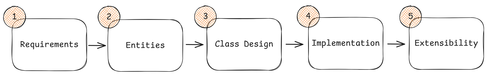

# Low Level Design (LLD)

## Contents

| #   | Topic                                               | Notes                                                        |
| --- | --------------------------------------------------- | ------------------------------------------------------------ |
| 1   | [Object Oriented Programming](OOPs/OOPs.md)         | Classes, objects, the four pillars, composition              |
| 2   | [SOLID Principles](SOLID/SOLID.md)                  | SRP, OCP, LSP, ISP, DIP and dependency injection             |
| 3   | [Design Patterns](DesignPatterns/DesignPatterns.md) | Creational, structural and behavioral patterns with examples |
| 4   | [UML Diagrams](UML/UML.md)                          | Use case, class, sequence and activity diagrams              |
| 5   | [LLD Problems](Problems/Problems.md)                | Worked machine coding / design problems                      |

## Overview

LLD is the detailed design of individual components of a system.

- Describes HOW EACH PART WILL BE **IMPLEMENTED**

**SYSTEM** - Collection of components that work together to achieve a specific goal. Example: E-commerce system, Banking system, etc.
**FLOW** - Requirements -> HLD -> LLD -> Implementation -> Testing -> Deployment

|          | HLD                                          | LLD                                      |
| -------- | -------------------------------------------- | ---------------------------------------- |
| Purpose  | Overall System Design                        | Detailed Design of Individual Components |
| Focus    | Architecture, Modules, Components, Data Flow | Classes, Methods, Data Structures, Logic |
| Abstract | High-level, Conceptual                       | Low-level, Implementation Details        |


## Components of LLD

1. Classes / Interfaces
2. Methods
3. Data Structures and Algorithms
4. Relationships between classes, interfaces, methods, and data structures

| Concept                               | What it is                | Purpose                                                                                                |
| ------------------------------------- | ------------------------- | ------------------------------------------------------------------------------------------------------ |
| **OOP (Object-Oriented Programming)** | Programming paradigm      | Provides the building blocks (classes, objects, inheritance, polymorphism, encapsulation, abstraction) |
| **SOLID Principles**                  | Design principles         | Guide you on how to use OOP effectively to create maintainable, extensible code                        |
| **Design Patterns**                   | Reusable design solutions | Common solutions to recurring software design problems                                                 |

## Design Goals

- **Loose coupling** - Reducing interdependencies between components to allow easier maintenance, testing, and flexibility.
- **High cohesion** - Keeping related functionality together within a module or class to improve maintainability and understandability.
- **Composition over Inheritance** - Favoring composition (using objects of other classes) over inheritance (extending classes) to achieve code reuse and flexibility.
- **SOLID** - A set of design principles that promote maintainable and flexible software design.

> **Goal of LLD:** Clean, maintainable, and scalable code following the principles of OOPs, Design Patterns, and Concurrency.

## Class Modeling

Converting requirements into classes and their relationships.

## Object Oriented Analysis and Design (OOAD)

Structured approach to analyzing and designing a system using object-oriented concepts.

1. Identify objects and classes from requirements.
2. Define relationships between classes (association, aggregation, composition, inheritance).
3. Establish responsibilities for each class and object via interfaces and methods.
4. Model the system's behavior and interactions using state diagrams, sequence diagrams, and activity diagrams. (UML Diagrams)

## Process of LLD

```
Requirements
     ↓
Identify entities
     ↓
Identify responsibilities
     ↓
Identify relationships
     ↓
Define interfaces
     ↓
Identify changing behavior
     ↓
Choose abstractions
     ↓
Apply SOLID
     ↓
Use patterns where appropriate
     ↓
Think about extensibility
     ↓
Handle edge cases / concurrency
```

```
                    LLD
                     |
        ┌────────────┴────────────┐
        |                         |
     MODELING                  DESIGN
        |                         |
   Classes                    SOLID
   Interfaces                Patterns
   Relationships              DI
   Responsibilities           Abstraction
        |                         |
        └────────────┬────────────┘
                     |
                IMPLEMENTATION
                     |
              C# / Collections
              Generics
              Exceptions
              Concurrency
              Testing
                     |
                     v
                EXTENSIBILITY
                     |
              "What if we add X?"
```

---

## Design Techniques

Dependency Injection, extensibility, interfaces, object responsibilities, state management, concurrency

## Topics to Cover

> Notes to be added.

- [ ] State Modeling
- [ ] Separation of Responsibilities, Dependency Management
- [ ] API Design
- [ ] Extensibility, Maintainability, Testability
- [ ] Mocking and Stubbing
- [ ] C# — Generics, Collections, Equality, Hashing, Immutability, Exception and Error Handling, Delegates, Events, LINQ, Async/Await
- [ ] Worked examples

## LLD Evaluation Criteria

- Problem Analysis
  - Understand problem thoroughly
  - Ask clarifying questions
- Class Design
  - Class, Methods, Variables
  - Class responsibility and interactions
- Code Quality
  - Encapsulation
  - Well managed state
  - Clear separation of concern
  - Consistency
  - Dependency direction
  - Composition or Inheritance
- Extensibility and Maintainability
  - Flexible for new features
- Communication
  - Clear naration
  - Thoughtful reasoning
  - Confidence and Maturity
- Feedback and Suggestion

## Delivery Framework



### 1. Requirements (~ 5 Mins)

Make the prompt unambiguous by asking questions based on below:

1. _Primary capabilities_ - What operations supported
2. _Rules and completion_ - What condition define success/failure/transistion
3. _Error Handling_ - How should system respond on invalid input
4. _Scope Boundaries_ - In/Out of Scope - Logic, Rules, UI, Storage, Networking, Concurrency, Extensibility

**Output Example - Tic Tac Toe**

```
Requirements:
1. Two players alternate placing X and O on a 3x3 grid.
2. A player wins by completing a row, column, or diagonal.
3. The game ends in a draw if all nine cells are filled with no winner.
4. Invalid moves should be rejected (placing on an occupied cell, acting after the game is over).
5. The system should provide a way to query current game state and reset the game.

Out of Scope:
- UI/rendering layer
- AI opponent or move suggestions
- Networked multiplayer
- Variable board sizes (NxN grids)
- Undo/redo functionality
```

### 2. Entities and Relationships (~3 minutes)

Components, Flow of ownership and separation of responsibilities

_Identify Entities_

- Find meaningful nouns with their own states and behavior/rules

_Define Relationships_

- How does the identified entities interact
  - Orchestrator Entity
  - Own durable state
  - Dependencies (Has-a, Uses, Contains)
  - Logical location for a rule/function

**Example - Tic Tac Toe**

```
Entities:
- Game
- Board
- Player

Relationships:
- Game -> Board
- Game -> Player (2x)
```

### 3. Class Design (~10-15 minutes)

- Entity by Entity, Top to Bottom
  - STATE
  - BEHAVIOR

> Requirement -> What this class must track -> STATE
> Requirement -> What operation needed to satisfy the requirement -> Which entity it should belong to -> BEHAVIOR

- Keep method with the entity that owns the relevant state
  - Objects should manage their own states
  - Expose behaviors and not getter for caller to update / decide

```
class Game:
  - board: Board
  - playerX: Player
  - playerO: Player
  - currentPlayer: Player
  - state: GameState (IN_PROGRESS, WON, DRAW)
  - winner: Player? (null if no winner)

  + makeMove(player, row, col) -> bool
  + getCurrentPlayer() -> Player
  + getGameState() -> GameState
  + getWinner() -> Player?
  + getBoard() -> Board
```

### 4. Implementation (~10 minutes)

- Ask interviewer if pseudo code (Default) required or exact implementation
- Interviewer can suggest sometime which method they want the details of
- Start with Happy Path
  - What input received
  - Sequence of steps performed
  - What state changed, what returned
- Then move to Edge Cases
  - Invalid Inputs
  - Illegal Operations
  - Out of range values
  - State violation
  - Rejected or Handled Gracefully

```
makeMove(player, row, col)
    if state != IN_PROGRESS
        return false
    if player != currentPlayer
        return false
    if !board.canPlace(row, col)
        return false

    board.placeMark(row, col, player.mark)

    if board.checkWin(row, col, player.mark)
        state = WON
        winner = player
    else if board.isFull()
        state = DRAW
    else
        currentPlayer = (player == playerX) ? playerO : playerX

    return true
```

**Verification**

- Dry run with concrete example, Non Trivial
  - Initial State
  - Operations
  - State changes
  - Edge cases

```
Initial: board empty, currentPlayer = X
makeMove(X, 0, 0) → board[0][0] = X, currentPlayer = O
makeMove(O, 1, 1) → board[1][1] = O, currentPlayer = X
```

### 5. Extensibility (~5 minutes)

Interviewer will introduce some new feature and how it will be added to current design

- Specify where and what will be change to accomodate feature
- No need to update code
