# UML Diagrams

Unified Modeling Language (UML) is a standard way to visualize the design of a system.

**Benefits**

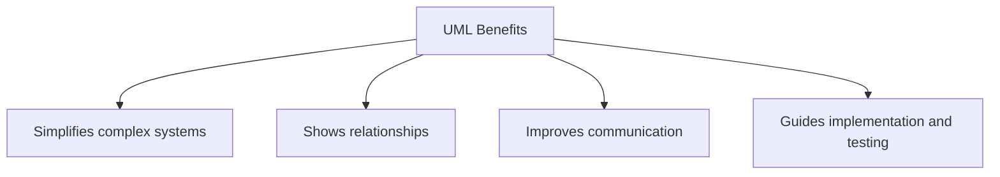

## Types

1. **Structural Diagrams:** Class Diagram, Object Diagram, Component Diagram, Deployment Diagram
2. **Behavioral Diagrams:** Use Case Diagram, Sequence Diagram, Activity Diagram, State Diagram, Communication Diagram

| UML Diagram          | Description                                                       | Example                                |
| -------------------- | ----------------------------------------------------------------- | -------------------------------------- |
| **Class Diagram**    | Shows classes, their attributes, methods, and relationships       | 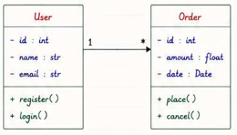{height=120px} |
| **Sequence Diagram** | Shows how objects interact in a particular scenario of a use case | 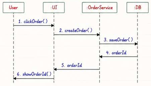{height=120px} |
| **Activity Diagram** | Shows the flow of control or data in a system                     | 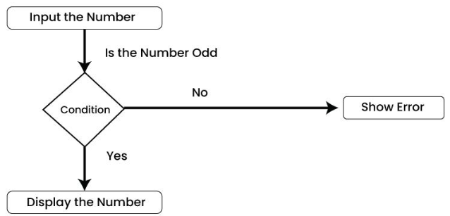{height=120px} |
| **State Diagram**    | Shows the states of an object and transitions between them        | 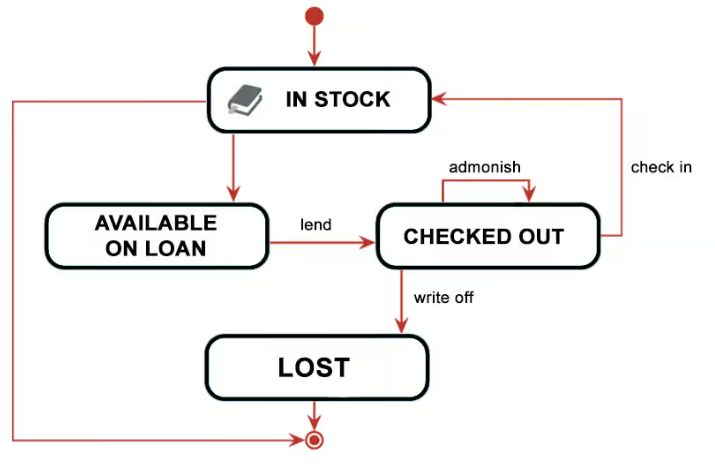{height=120px} |
| **Use Case Diagram** | Shows the interactions between users and the system               | 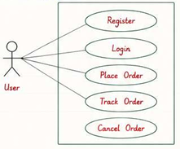{height=120px} |
| **Object Diagram**   | Shows a snapshot of the system at a particular point in time      | 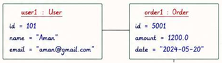{height=120px} |
| **Sequence Diagram** | Shows how objects interact in a particular scenario of a use case | 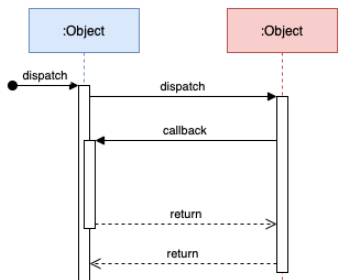{height=120px}   |

### Use Case Diagrams

Describes set of actions (use cases) that a system performs in collaboration with one or more external actors (users or other systems).

- High-level view of system functionality
- What the system does, not how it does it

#### Components of Use Case Diagrams

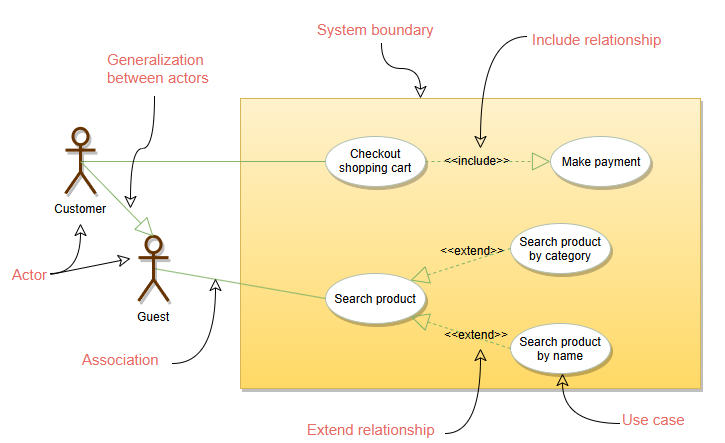

| Component           | Purpose                         | Notation                           |
| ------------------- | ------------------------------- | ---------------------------------- |
| **Actor**           | Interacts with the system       | Stick figure outside the boundary  |
| **Use Case**        | Function provided by the system | Oval inside the boundary           |
| **System Boundary** | Defines the system scope        | Rectangle enclosing use cases      |
| **Include**         | Reuses required behavior        | Dashed arrow labeled `<<include>>` |
| **Extend**          | Adds optional behavior          | Dashed arrow labeled `<<extend>>`  |

### Class Diagrams

A class diagram describes the attributes and operations of a class and also the constraints imposed on the system.

- Represents the static structure of a system
- Shows classes, their attributes, methods, and relationships between classes
- Describes the blueprint and responsibilities of the system

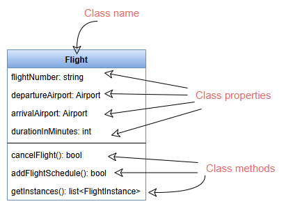

#### Components of Class Diagrams

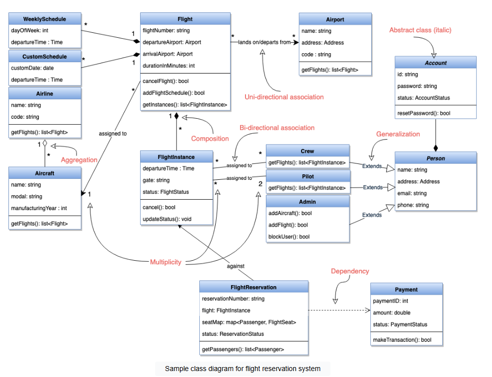
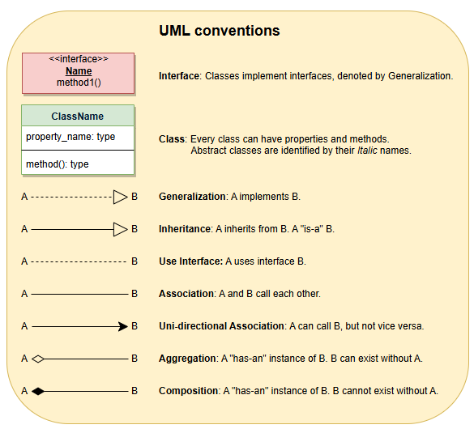

| Component          | Purpose                                              | Notation                                                           |
| ------------------ | ---------------------------------------------------- | ------------------------------------------------------------------ |
| **Class**          | blueprint for objects                                | Rectangle with three compartments                                  |
| **Attribute**      | property of a class                                  | Listed in the second compartment                                   |
| **Method**         | behavior of a class                                  | Listed in the third compartment                                    |
| **Association**    | relationship between classes                         | Solid line connecting classes                                      |
| **Inheritance**    | Represents an "is-a" relationship                    | Solid line with a closed arrowhead pointing to the parent class    |
| **Aggregation**    | "has-a" relationship                                 | Solid line with a hollow diamond at the aggregate side             |
| **Composition**    | strong "has-a" relationship                          | Solid line with a filled diamond at the composite side             |
| **Multiplicity**   | Represents the number of instances in a relationship | Numbers or symbols at the ends of association lines                |
| **Generalization** | parent-child relationship                            | Solid line with a closed arrowhead pointing to the parent class    |
| **Dependency**     | "uses-a" relationship                                | Dashed line with an open arrowhead pointing to the dependent class |
| **Abstract Class** | class that cannot be instantiated                    | Italicized class name                                              |

### Sequence Diagrams

Describes how objects interact in a particular scenario of a use case over time.

- Vertical axis represents time and sequence of messages
- Horizontal axis represents objects

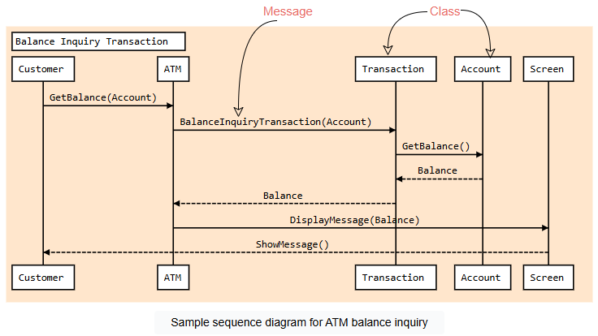

#### Components of Sequence Diagrams

| Component          | Purpose                                               | Notation                                        |
| ------------------ | ----------------------------------------------------- | ----------------------------------------------- |
| **Object**         | Represents an instance of a class                     | Rectangle with the object name                  |
| **Message**        | Communication between objects                         | Arrow from sender to receiver with message name |
| **Return Message** | Response from an object to a message                  | Dashed arrow from receiver to sender            |
| **Activation**     | Period during which an object is performing an action | Thin rectangle on the object's lifeline         |
| **Lifeline**       | Represents the existence of an object over time       | Dotted vertical line extending from the object  |

### Activity Diagrams

Illustrates the flow of control or data in a system, showing the sequence of activities and decisions.

- Represents the dynamic aspects of a system
- Models the workflow of a process or operation

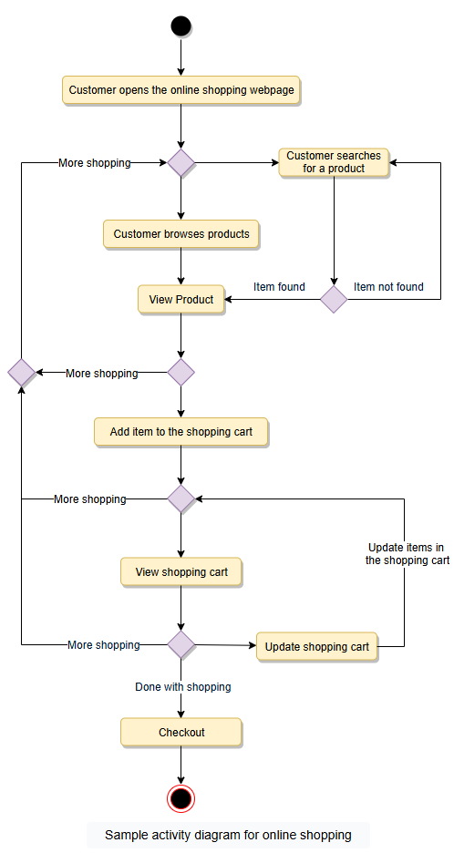

#### Components of Activity Diagrams

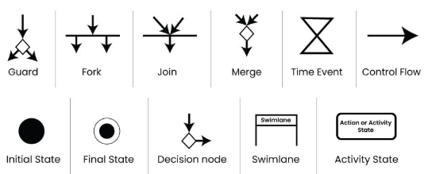

| Component           | Purpose                                                            | Notation                                    |
| ------------------- | ------------------------------------------------------------------ | ------------------------------------------- |
| **Activity**        | Represents a task or action in the workflow                        | Rounded rectangle                           |
| **Decision**        | Represents a branching point in the workflow                       | Diamond shape                               |
| **Merge**           | Combines multiple paths into one                                   | Diamond shape                               |
| **Fork**            | Splits a single flow into multiple concurrent flows                | Thick horizontal or vertical line           |
| **Join**            | Combines multiple concurrent flows into one                        | Thick horizontal or vertical line           |
| **Initial Node**    | Represents the starting point of the workflow                      | Filled circle                               |
| **Final Node**      | Represents the end point of the workflow                           | Filled circle with a border                 |
| **Swimlane**        | Represents a partition for organizing activities by actor or role  | Vertical or horizontal lane with actor name |
| **Object Node**     | Represents an object or data in the workflow                       | Rectangle with the object name              |
| **Control Flow**    | Represents the flow of control between activities                  | Solid arrow                                 |
| **Object Flow**     | Represents the flow of objects or data between activities          | Dashed arrow                                |
| **Guard Condition** | Represents a condition that must be true for a transition to occur | Square brackets with the condition inside   |

| Sequence Diagram                                      | Activity Diagram                                       |
| ----------------------------------------------------- | ------------------------------------------------------ |
| Shows interactions between objects over time          | Shows the flow of control or data in a system          |
| Focuses on the order of messages and events           | Focuses on the sequence of activities and decisions    |
| Depicts the behavior of a single use case or scenario | Depicts the overall workflow of a process or operation |
