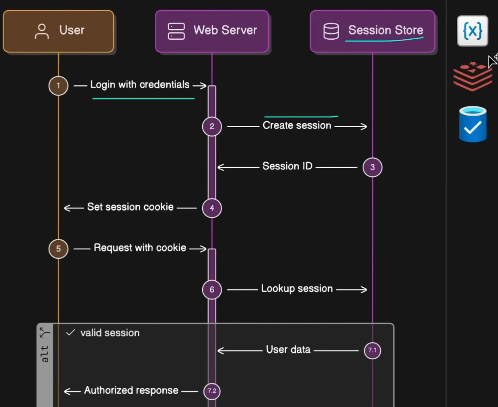
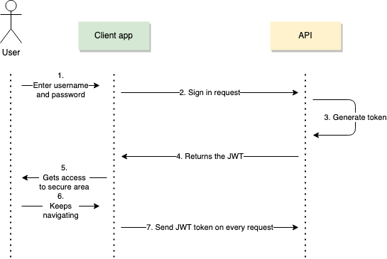
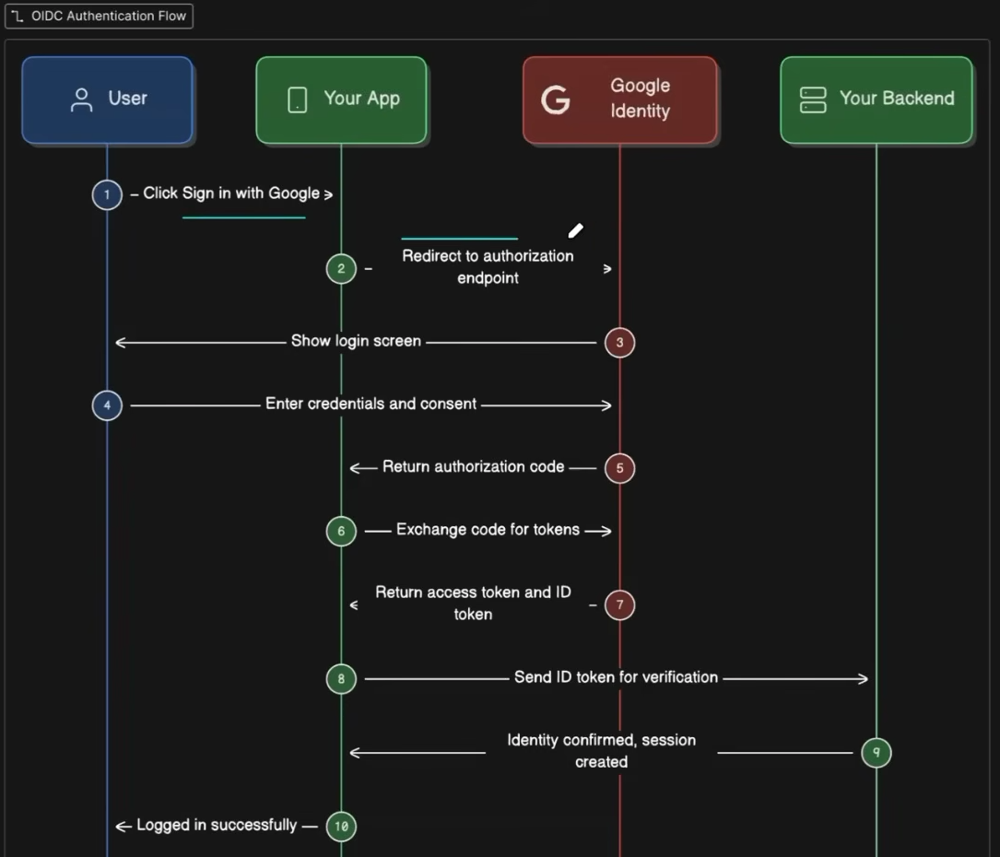
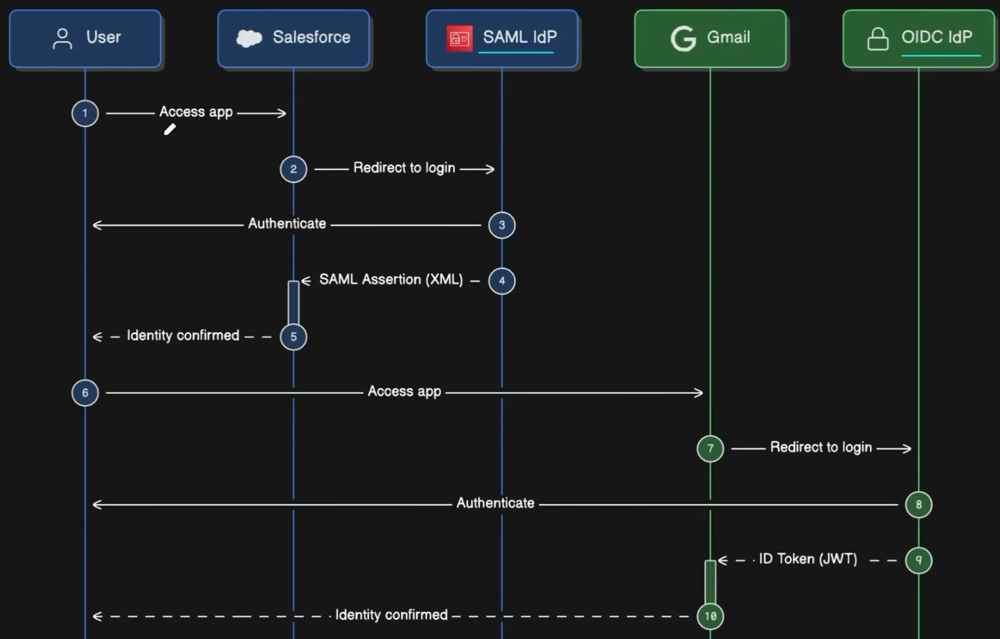
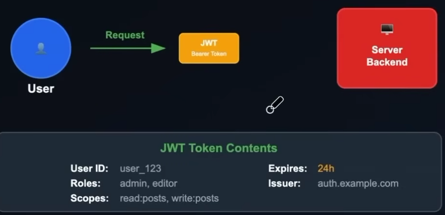

# Authentication and Authorization

> HISTORY: Human Trust > Seals > Shared Phrases > Passwords in Plain Text > Hashed Password > Asym Cryptography RSA > Token Based > MFA [Something you know+have+are] > OAuth, JWT, Zero Trust Auth, Passwordless

| Authentication                              | Authorization                                                                |
| ------------------------------------------- | ---------------------------------------------------------------------------- |
| Verifying the identity of a user or system. | Determining what actions or resources a user or system is allowed to access. |
| WHO YOU ARE                                 | WHAT YOU CAN DO                                                              |
| Confirms identity                           | Checks Permissions                                                           |
| Examples: Basic Auth, OAuth, JWT            | Examples: RBAC                                                               |

## Authentication Methods

- Basic
  - Basic
  - Digest
  - API Keys
  - Session
- Token Based
  - Bearer and JWT
  - Access and Refresh Tokens
- OAuth2 and OIDC
- SSO and Identity Protocol

### Basic

Client sends username and password as Base64 encoded string in the Authorization header. Server decodes and verifies credentials.
Disadvantage

- Base64 encoding not secure, can be easily decoded
- Credentials sent with every request, increasing risk of interception
- Not used in modern applications due to security concerns

### Digest

Uses md5 hashing to create a unique hash of the username, password, and other request data. Server verifies the hash to authenticate the user.
Disadvantage

- More secure than Basic, but still vulnerable to certain attacks
- Requires additional processing on both client and server sides, which can impact performance

### API Key

Server generates a unique key for each client, which is sent with every request in the Authorization header or as a query parameter. Server verifies the key to authenticate the user.

Disadvantage

- API keys can be easily shared or leaked, leading to unauthorized access
- No built-in mechanism for user identity or permissions, requiring additional implementation for access control

### Session-Based Authentication

Server creates a session for the user upon successful login, storing session data on the server and sending a session ID to the client as a cookie. The client includes the session ID in subsequent requests for authentication.

- Usually redis used to store session data
- Advantage: Centralized Control, Secure, Revokation Easy
- Disadvantage: Stateful, requires server-side storage and management of session data
  

---

## Token-Based Authentication

### JWT Based - JSON Web Token

Short Lived Tokens with information about user and permissions. Server verifies the token to authenticate the user.

- Stateless, no server-side storage required
- Usually stored in cookie, Base 64 encoded
- BENEFITS: Stateless, Scalability, Portability
- ISSUES: Theft, Revocation difficult
  

JWT Token = Header + Payload + Sign

### Access Token and Refresh Token

### OAuth 2.0 and OpenID Connect

### SSO - Single Sign-On

User Experience not an authentication protocol. It is a user authentication process that permits a user to enter one name and password in order to access multiple applications. The process authenticates the user for all the applications they have been given rights to and eliminates further prompts when they switch applications during a particular session.

## Authorization Methods

- **RBAC (Role-Based Access Control)**
  - Users are scoped to different roles, which have different set of permissions
  - Used mostly
- **ABAC (Attribute-Based Access Control)**
  - Policies based on attributes of diffent entities
    - User Attributes
    - Resource Attributes
    - Environment
  - More flexible but complex to maintain
- **ACL (Access Control Lists)**
  - Permission List maintained for users
  - Granular and hard to scale

### OAuth 2.0 Based Authorization

Delegated Authorization: One service accesses another service on behalf of user.

### Token Based Authorization

