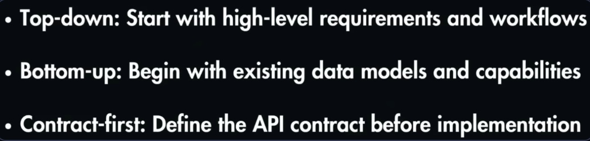
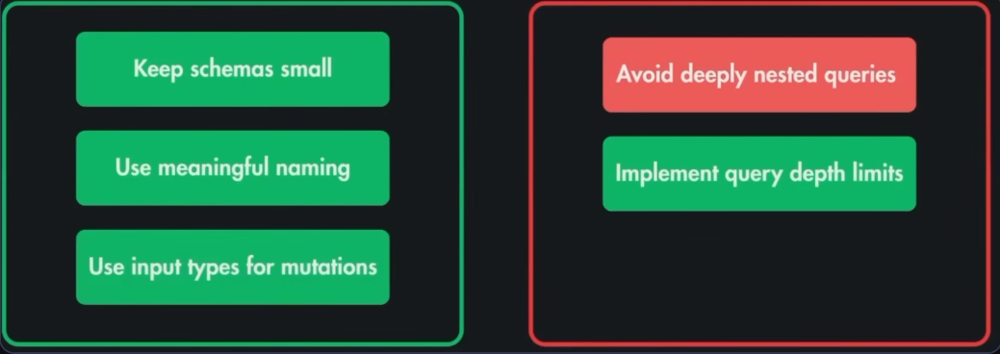

# GraphQL

GraphQL is a query language for APIs and a runtime for executing those queries by allowing clients to request exactly the data they need.

- It provides a more flexible and efficient alternative to RESTful APIs.
- Created by Facebook
- All APIs are POST and result status code is 200 OK

**Concepts**
_Type_ → defines the shape of your data
_Query_ → reads/fetches data
_Mutation_ → creates/updates/deletes data

```
# Types
type User {
  id: ID!
  name: String!
  email: String!
}

# Queries (Read)
type Query {
  user(id: ID!): User
  users: [User!]!
}
# Query example
query {
  user(id: "123") {
    id
    name
    email
  }
}

# Mutations (Create / Update / Delete)
type Mutation {
  createUser(name: String!, email: String!): User!
  updateUser(id: ID!, name: String!): User!
  deleteUser(id: ID!): Boolean!
}
# Mutation example
mutation {
  createUser(
    name: "Abhishek"
    email: "a@example.com"
  ) {
    id
    name
    email
  }
}
```

## Error Handling in GraphQL

Errors are included in response body.

- Clients can receive partial data along with error information, enabling them to handle errors gracefully without losing access to the available data.

```
{
  "data": {
    "user": {
      "id": "123",
      "name": "Abhishek",
      "email": "a@example.com"
    }
  },
  "errors": [
    {
      "message": "User not found",
      "locations": [{ "line": 2, "column": 3 }],
      "path": ["user"]
    }
  ]
}
```

### N++1 Problem

The N+1 problem occurs when an application executes N+1 queries to fetch related data, instead of using a single optimized query.

- This can lead to performance issues

**SOLUTION** - Use JOINs or batch queries to fetch related data in a single query, reducing the number of database round trips and improving performance.

### Schema Resolver

Permissions are field by field in graphql, and the resolver is responsible for fetching the data for each field.

## Design Approaches



## Best Practices


