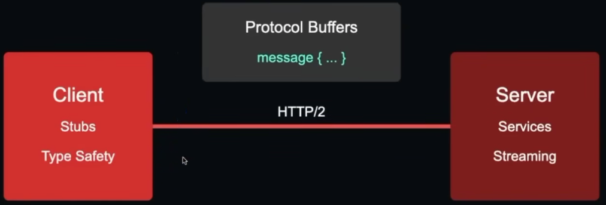
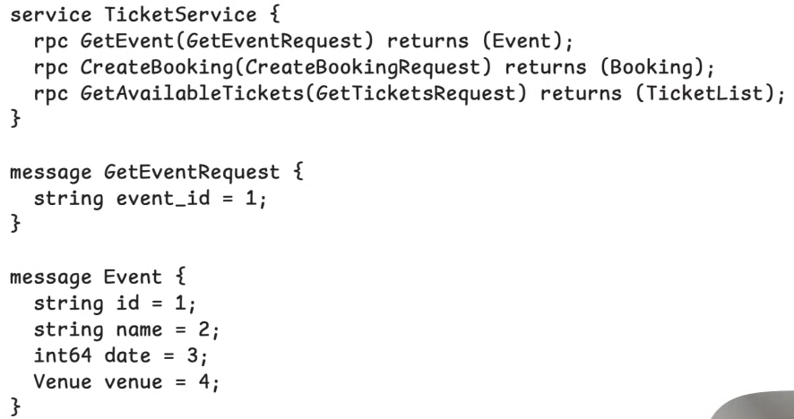
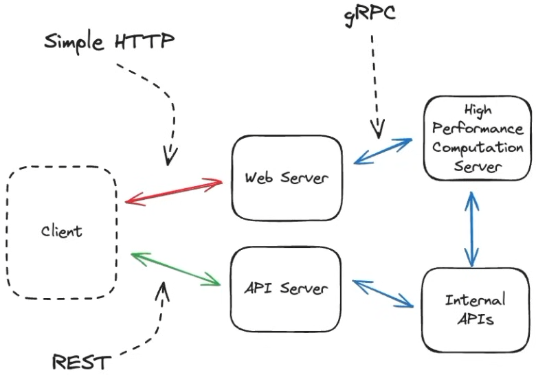
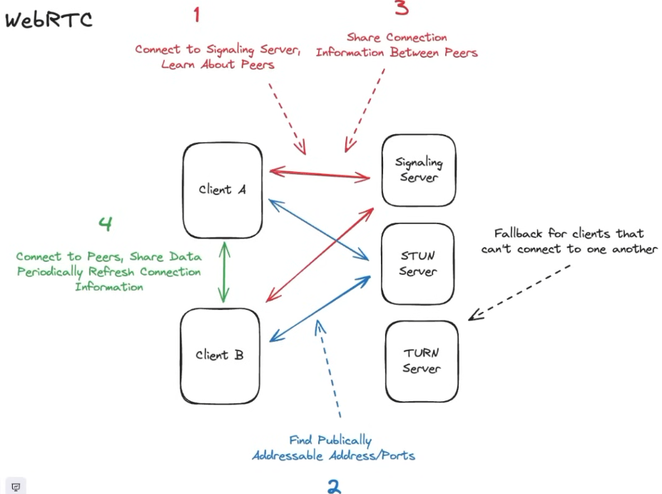
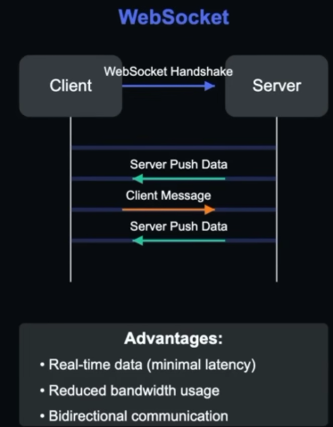

# GraphQL

GraphQL is a query language for APIs and a runtime for executing those queries by allowing clients to request exactly the data they need.

- It provides a more adaptable, flexible and efficient alternative to RESTful APIs.
- Created by Facebook
- All APIs are POST and result status code is 200 OK

Suitable for mobile apps, multiple types of clients and complex UIs for clients to request only for the data that is needed.

- Add complexity : query parsing, schema validation, and often sophisticated caching strategies

**Concepts**
_Type_ → defines the shape of your data
_Query_ → reads/fetches data
_Mutation_ → creates/updates/deletes data

```
# Types
type User {
  id: ID!
  name: String!
  email: String!
}

# Queries (Read)
type Query {
  user(id: ID!): User
  users: [User!]!
}
# Query example
query {
  user(id: "123") {
    id
    name
    email
  }
}

# Mutations (Create / Update / Delete)
type Mutation {
  createUser(name: String!, email: String!): User!
  updateUser(id: ID!, name: String!): User!
  deleteUser(id: ID!): Boolean!
}
# Mutation example
mutation {
  createUser(
    name: "Abhishek"
    email: "a@example.com"
  ) {
    id
    name
    email
  }
}
```

## Error Handling in GraphQL

Errors are included in response body.

- Clients can receive partial data along with error information, enabling them to handle errors gracefully without losing access to the available data.

```
{
  "data": {
    "user": {
      "id": "123",
      "name": "Abhishek",
      "email": "a@example.com"
    }
  },
  "errors": [
    {
      "message": "User not found",
      "locations": [{ "line": 2, "column": 3 }],
      "path": ["user"]
    }
  ]
}
```

### N++1 Problem

The N+1 problem occurs when an application executes N+1 queries to fetch related data, instead of using a single optimized query.

- This can lead to performance issues

**SOLUTION** - Use JOINs or batch queries to fetch related data in a single query, reducing the number of database round trips and improving performance.

### Schema Resolver

API endpoints are not secured in same way as REST, as there is only one API.
Permissions are field by field in graphql, and the resolver is responsible for fetching the data for each field.

## Design Approaches


## Best Practices


# RPC

Paradigm that allows a client to call a procedure on a server without knowing the underlying network details.

- Action Oriented
- Calling function across a network

# gRPC

gRPC is a high-performance Remote Procedure Call (RPC) framework created by Google. It allows services to call methods on other services as if they were local functions.

- **HTTP/2 for Transport:** Supports multiplexing, streaming, and efficient connections.
- **Protocol Buffers for Serialization:** Uses a compact binary format for fast serialization.
- **Strongly typed:** Defines service contracts in `.proto` files, catching many errors at compile time.
- **Language-independent:** Clients and servers can use different programming languages, but same proto contracts.
- **Use cases:** Microservices, real-time applications, and service-to-service communication.

_To Be Used When:_

- Performance is critical
- Type safety matters
- Service-to-service communication
- Streaming is needed







# Server Sent Events (SSE)

Server-Sent Events (SSE) allow a server to continuously push updates to a client over a single, long-lived HTTP connection. Communication is one-way: server to client.

```
id: 1
data: {"id": 1, "timestamp": "2025-01-01T00:00:00Z", "description": "Event 1"}

id: 2
data: {"id": 2, "timestamp": "2025-01-01T00:00:01Z", "description": "Event 2"}
```

- **Streaming:** Events arrive individually as part of one ongoing HTTP response.
- **Reconnection:** Browsers reconnect automatically if the connection drops and can send the last received event ID.
- **Use cases:** Real time updates, Notifications, live feeds, status updates, and AI response streaming.

# WebRTC

- Peer to peer communication between browsers, allowing for low latency and real-time communication.
- It is suitable for real-time applications like video conferencing, audio calling, online gaming, and file sharing, collab document editor
- Uses UDP, unlike other protocols



# WebSockets

WebSockets provide full-duplex, real-time communication between a client and server over a single, persistent TCP connection.

- **Bidirectional:** The client and server can send messages independently at any time.
- **Low latency:** The persistent connection avoids repeated HTTP request-response overhead.
- **Infrastructure:** Proxies, load balancers, and servers must support long-lived WebSocket connections.
- **Use cases:** Chat, multiplayer games, collaborative editing, and live dashboards.



> Can be used for high frequency, persistent, bidirectional communication
