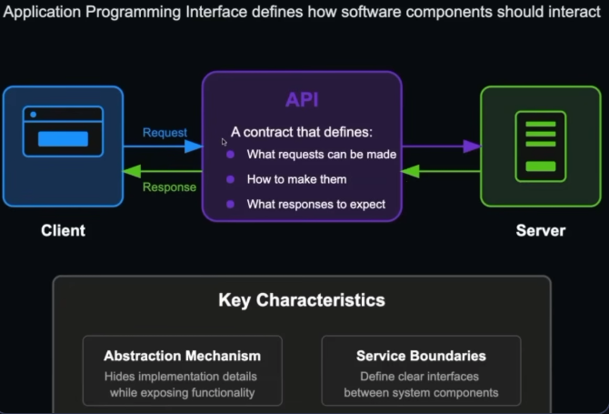
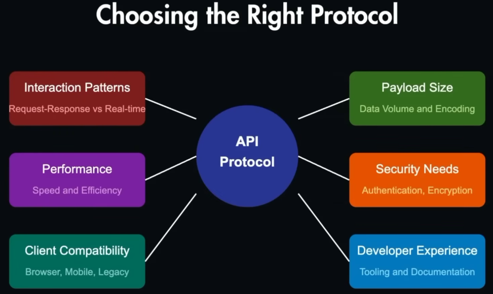

# API Design

## Contents

| # | Topic | Notes |
| - | ----- | ----- |
| 1 | [REST](REST/REST.md) | Resources, HTTP methods, status codes, versioning, pagination, best practices |
| 2 | [GraphQL](GraphQL/GraphQL.md) | Types, queries, mutations, resolvers, N+1 problem |
| 3 | [gRPC](gRPC/gRPC.md) | Protocol buffers, contract-first service-to-service calls |
| 4 | [Authentication and Authorization](Auth/Auth.md) | Basic, session, JWT, OAuth 2.0, OIDC, SSO, RBAC |

## Overview



## Design Principles for API Design

- **Consistency** - Consistent naming conventions, request/response formats, and error handling across the API
- **Simplicity** - Clear and concise documentation, easy-to-understand endpoints, and minimal complexity in request/response structures
- **Security** - Authentication, Authorization, Validation, Rate Limiting, CORS, Encryption, Input Validation, Error Handling
- **Performance** - Caching, Pagination, Compression, Asynchronous Processing, Load Balancing, Monitoring and Logging



## API Paradigm

```
┌─────────────────────────────┐
│       API Paradigm          │ - How the APIs are designed
│   REST / GraphQL / RPC      │
├─────────────────────────────┤
│       API Protocol          │ - How communication happens
│   HTTP / WebSocket / TCP    │
├─────────────────────────────┤
│     Data Serialization      │ - How data is formatted
│   JSON / Protobuf / XML     │
└─────────────────────────────┘
```

> API Protocols influences API Design

### REST vs GraphQL vs gRPC

| Dimension    | REST                     | GraphQL                                   | gRPC                                         |
| ------------ | ------------------------ | ----------------------------------------- | -------------------------------------------- |
| Style        | Resource-based API       | Query language for APIs                   | Contract-based RPC (protobuf)                |
| Data         | JSON, HTTP Methods       | JSON, POST only                           | Data Stream, Proto Buffers                   |
| Endpoints    | Multiple, Stateless      | Single Endpoint                           | Service defined methods                      |
| Data fetched | Fixed per endpoint       | Client picks exact fields                 | Fixed by contract                            |
| Best for     | Public APIs, web, mobile | Complex, data-rich UIs                    | Fast service-to-service calls, Microservices |
| Speed        | Good                     | Good                                      | Fastest                                      |
| Cons         | Over/Under Fetching      | Only POST and 200 Response, Server Impact | HTTP/2 Support, Non Human Readible           |

Example — fetching a user's name:

```text
REST     : GET /users/1          → returns the whole user object

GraphQL  : query { user(id: 1) { name } }   → returns only the name

gRPC     : userService.GetUser({ id: 1 })   → typed call defined in .proto
```

## API Lifecycle


