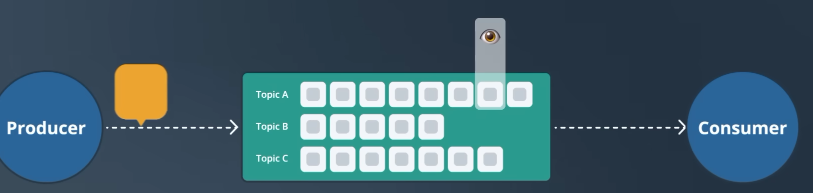
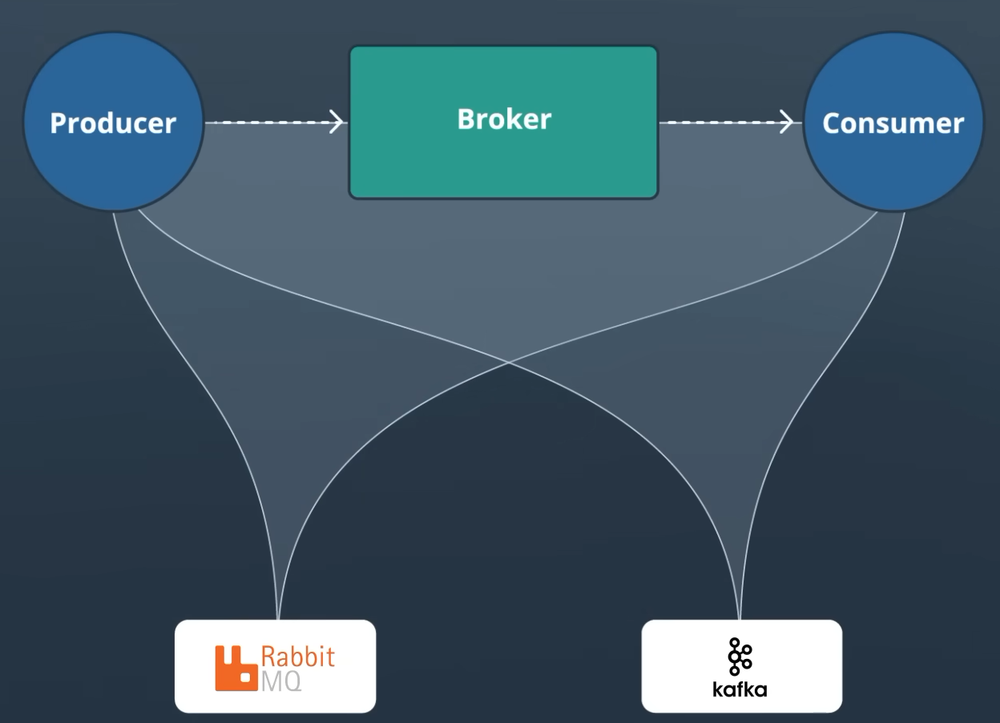
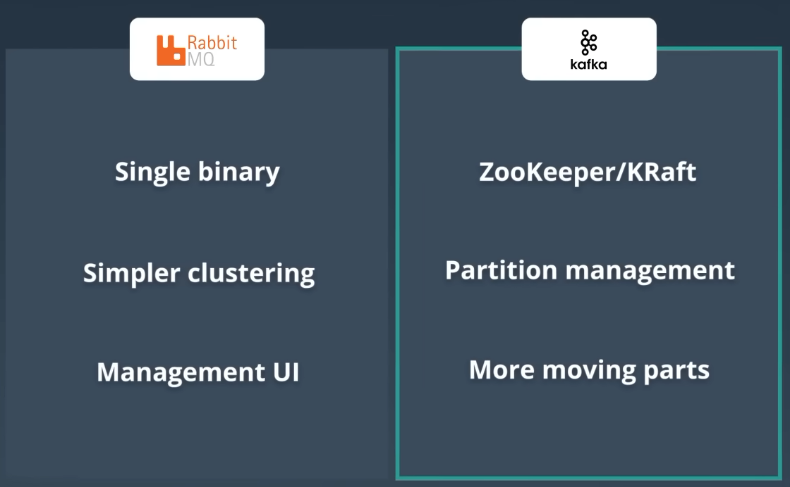

# Asynchronous Systems

Work is handed off to a queue and processed later by a separate worker, instead of the caller waiting for it to finish.

- Decouples sender and receiver
- Better scalability, fault tolerance, responsiveness
- Example - Image upload pipeline, images queued and processed by multiple workers

## Background Tasks

Separate process running outside the main process to handle work asynchronously.

- Improves UX - request returns immediately
- Automatic retry mechanism
- Example - Email processing, image processing

## Task Queues

Holds units of work until a worker is free. Example - RabbitMQ, Service Bus, Redis Pub/Sub

- _Broker_ - Temporarily holds tasks in queue and assigns to proper consumers
- _Visibility Timeout_ - Time for which a message is invisible to other consumers. If ACK not received, message is made visible again

### Task Types

- One-off
- Recurring
- Chained
- Batch

### Best Practices

- Small and focussed tasks
- Error handling and logging
- Monitor queue length and worker health

## Message Queues

Buffer that stores messages until processed by the consumer.

{width=500}

{width=500}

**Benefits**

- Fast response - producer does not wait
- Failures isolated
- Scalable
- Producer and consumer decoupled, scaled independently

> Analogy - Waiter puts the order in the queue, chef picks it up. Waiter can take more orders while chef is busy.

### When to Use

- Async server processing
- Burst traffic
- Decoupling microservices
- Reliability and fault tolerance

> Not for synchronous communication, where the sender needs an immediate response or has strict latency requirements.

### Acknowledgement

Queue holds the message until the consumer ACKs it. No ACK -> message re-queued and sent to another consumer.

#### Preventing Double Processing

Broker must ensure a message is not processed more than once.

- Message still in queue -> can be picked up by another consumer
- Consumer processed but crashed before ACK -> message re-queued -> duplicate processing

#### Delivery Guarantees

| Guarantee         | Behaviour                        | Trade-off                                |
| ----------------- | -------------------------------- | ---------------------------------------- |
| **At most once**  | Fire and forget                  | No duplicates, message can be lost       |
| **At least once** | Delivered one or more times      | No loss, duplicates -> needs idempotency |
| **Exactly once**  | Delivered once, no loss or dupes | Expensive - dedup + transactions         |

> At least once is the practical and most common guarantee.

### Scaling Message Processing

Queue is split into **partitions**, each consumed by a different consumer in a consumer group -> parallel processing.

- Consumers > partitions -> extra consumers stay idle
- Partition = ordered, immutable, append-only commit log
- **Offset** - Sequential id identifying a message within a partition
- **Partition Key** - Decides the target partition. Same key -> same partition -> ordering per key. Should spread evenly to avoid hot partitions. No key -> random partition

### Producers Faster Than Consumers

1. **Autoscaling** - Scale out consumers or the queue
2. **Backpressure** - Bounded queue or rate limiter to block/slow the producer when full
3. **Alerts** - Notify ops when queue depth or consumer lag crosses a threshold

### Processing Failures

- **Retries** - Broker retries delivery N times, with exponential backoff
- **Dead Letter Queue** - Repeatedly failing messages moved to a separate queue for investigation

### Queue Failures

- **Replication** - Queue replicated across nodes; one node down, others keep serving
- **Persistence** - Messages written to disk, recovered on restart

> Kafka does both - persists to disk and replicates across brokers.

## Queue Technologies

### Kafka

Distributed commit log used as a message queue. High throughput, fault tolerant. Messages stored in topics and partitions.

- Messages not removed after consumption - kept until expiry or deletion
- Multiple consumers read the same message at their own pace, or replay it
- Kafka tracks consumer offset -> resume from where it left off

{width=800}

> Kafka - important queue technology to know.

### RabbitMQ

Message broker implementing AMQP. Supports multiple protocols, distributed and federated deployments.

{width=800}

- Broker puts the message in a queue based on routing rules
- Consumer ACKs -> message removed from queue; no ACK -> re-queued

Broker functionality - routing, delivery tracking, retries, dead letter queue

### Amazon SQS

Fully managed message queue service.

- Standard queues - at least once delivery
- FIFO queues - exactly once processing
- **Visibility Timeout** - Message invisible to other consumers for a period after being read. No ACK in that window -> visible again

## Kafka vs RabbitMQ

{width=500}

| Aspect           | RabbitMQ                                                | Kafka                                                                                 |
| ---------------- | ------------------------------------------------------- | ------------------------------------------------------------------------------------- |
| Model            | Broker with queues                                      | Distributed append-only log                                                           |
| Delivery         | Push to consumer                                        | Consumer pulls messages in batches                                                    |
| Broker           | Smart broker - routing, retries, DLQ                    | Simple broker                                                                         |
| Consumer         | Simple consumer                                         | Complex consumer - tracks offsets                                                     |
| Ordering         | Strict ordering per queue                               | Ordering per partition                                                                |
| Throughput       | Lower                                                   | Very high                                                                             |
| Latency          | Low - push, per message                                 | Higher - batching and polling                                                         |
| Retention        | Message removed after ACK                               | Message persists until expiry; supports replay                                        |
| Cloud equivalent | Azure Service Bus                                       | Kafka on Azure Event Hubs                                                             |
| Use when         | Task queues, smart routing, low latency, moderate scale | High throughput, large scale, replay, multiple readers, durable events                |
| Examples         | Instagram post uploads, Reddit comments                 | Netflix recommendations, Uber trip events, LinkedIn activity feed, Spotify song plays |

### Operational Complexity

