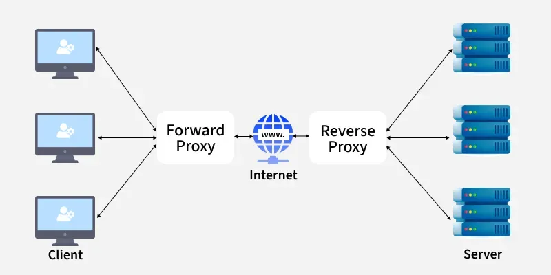
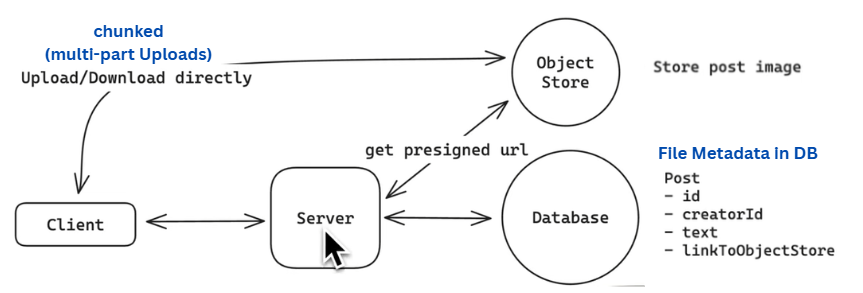

# Building Blocks

## Proxy Servers

- _Forward Proxy:_ Between client and server, forward to internet to reach server
  - Caching, Anonymous Web Access, Instagram Proxies
- _Reverse Proxy:_ Acts as intermediary between internet and backend, forwards to correct server
  - Load Balancers, CDNs, Firewalls, SSL Offloading
  - Example: Nginx

## Load Balancers

Reverse Proxy that Distribute incoming network traffic across multiple servers.

ADVANTAGE: Ensure high availability, reliability, and performance of applications and services

**Functions of Load Balancer**

- _Distribute traffic:_ Divides incomming requests to different nodes
- _Health Checks:_ Monitor server's availability. Does via periodic probes

### Algorithm

- _Round Robin:_ Sends requests to servers one by one in rotation.
- _Least Connections:_ Sends requests to the server handling the fewest requests.
- _IP Hash:_ Sends the same client's requests to the same server.
- _Weighted Round Robin:_ Sends more requests to stronger servers.
- _Weighted Least Connections:_ Considers both server capacity and current connections.
- _Consistent Hashing:_ Keeps requests on the same server even when servers are added or removed.
- _Geo-Location Based:_ Sends requests to the server closest to the user.

### Types of Load Balancers

- **Client Side**: Client decides which server to call. Usually in internal microservices (gRPC build in).
  - Example Redis Cluster (low number of clients), DNS (large clients, slow updates)
- **Server Side**: Reverse Proxy Server, Dedicated Load Balancers. Increases hop count, but have quick updates, fine grain control over routing

| Layer 4 Load Balancer                                   | Layer 7 Load Balancer                                                                       |
| ------------------------------------------------------- | ------------------------------------------------------------------------------------------- |
| Operates at the transport layer (TCP/UDP)               | Operates at the application layer (HTTP/HTTPS)                                              |
| Cannot inspect application layer data                   | Can inspect application layer data                                                          |
| Can perform load balancing based on IP address and port | Can perform load balancing based on URL, headers, cookies, and other application layer data |
| Simple and fast                                         | More complex and slower                                                                     |
| Used for non-HTTP traffic, such as TCP and UDP          | Used for HTTP and HTTPS traffic                                                             |
| Used in web sockets, persistent HTTP connections        | All other use casese                                                                        |

### Real World Implementations

| Type         | Description                  | Examples                |
| ------------ | ---------------------------- | ----------------------- |
| **Hardware** | Physical load balancer       | F5, Citrix ADC, A10     |
| **Software** | Software-based load balancer | Nginx, HAProxy, Traefik |
| **Cloud**    | Managed cloud load balancer  | AWS ELB, GCP, Azure     |

### Preventing SPOF in Load Balancers

1. Redundant Load Balancers
2. Health Checks and Failovers
3. Autoscaling and self-healing
4. DNS failover

## Handler / Controller

Requests Received to Service > Handler / Controller [Handles the particular api]

- Request and Response Object: Provided to controller by framework
- Functions
  - BINDING: Get request data and Deserialize the data into native data format. If fails 400 Bad Request
  - VALIDATION and TRANSFORMATION [Map and set Defaults]
  - CALL SERVICE LAYER: Business Logic [Isolated environment, does not care about http]
  - SEND RESPONSE: 2xx 4xx 5xx

## Repository

Interact with database, its method has single purpose, used by service layer

## Middleware

Optional functions that can be added in between

- M > M > Request Routing > M > M > Controller and Services > M > Response

Gets Request Object, Response Object, Next Function

- Can modify response, return to clients
- To do some shared logic, reduce code duplication
- Next Function passes to next middleware

**Purpose**

1. Security: CORS, Rate Limiting, Security Header, Auth
2. Logging and Monitoring
3. Global Error Handling: Can catch the error from any layer and return properly structured
4. Compression
5. Data Parsing

## Request Context

- Abstract concept, Storage / State that is scoped to a particular request
- Accessible to all middleware and handlers, can be modified. Has metadata for the request
- Can help to extract userid from auth context, extract request id, trace
- Send cancellation tokens or signals

---

# Object Storage

Stores files.

- Flat Namespace
- Immutable Objects
- Redundant and Durable
- Example - Amazon S3, Google Cloud Storage, Azure Blob Storage

> Not stored in DB as it bloats, replication is expensive, and DB is not optimized for storing files. DB are expensive, and files are large and unstructured.

**During Design**

---
