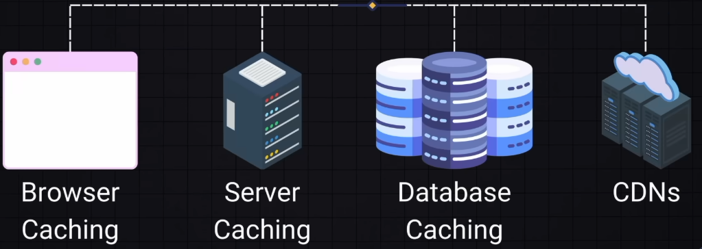
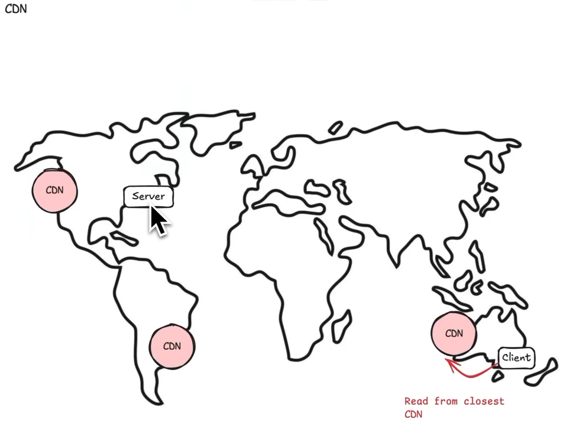
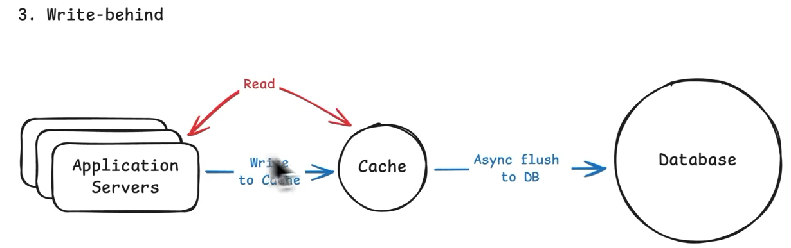
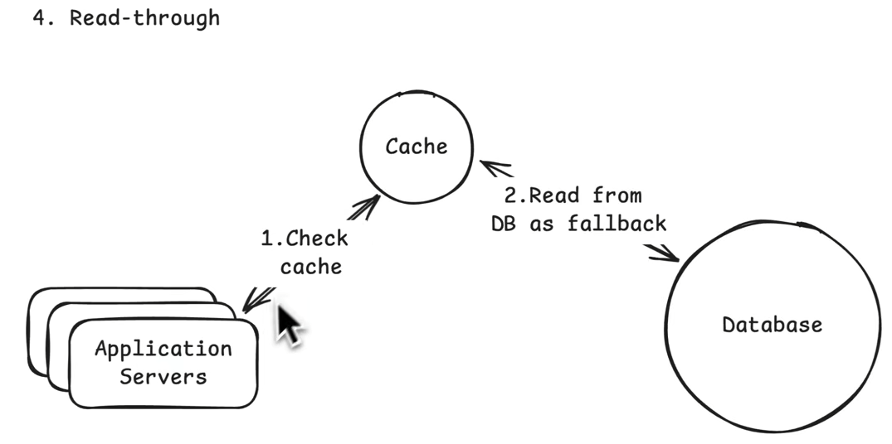
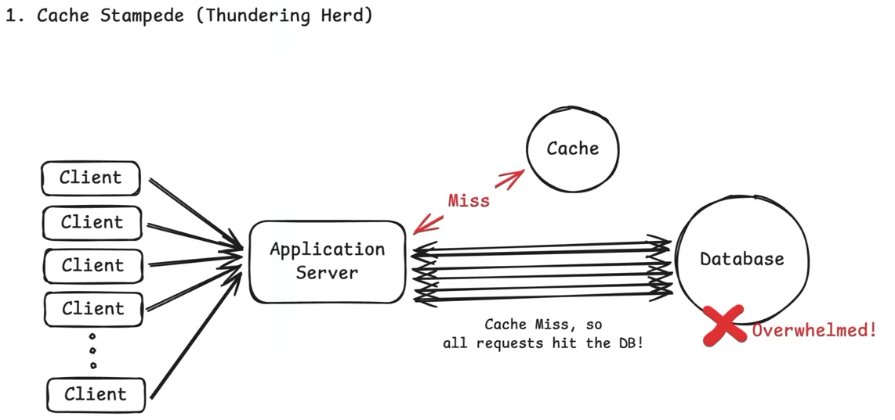
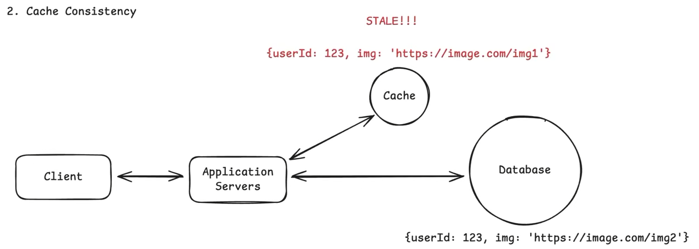
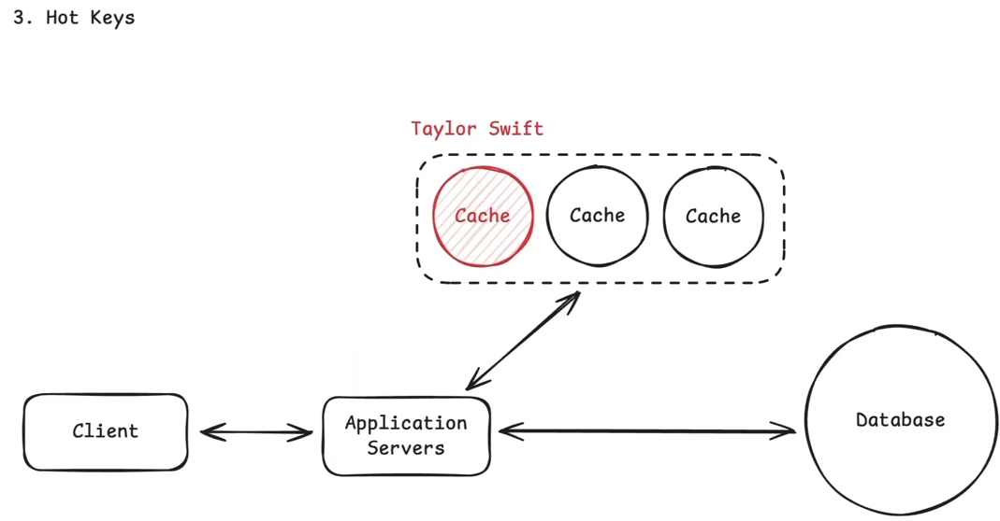
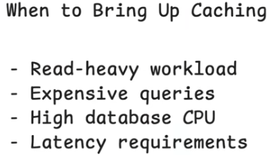
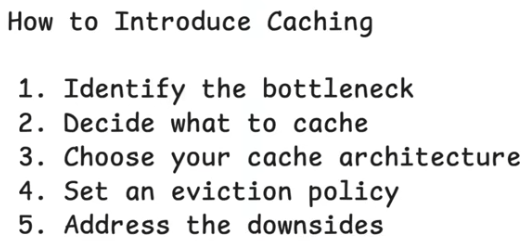

# Caching

Storing frequently accessed data in a temporary storage area to reduce latency and improve performance

- Data Access via Disk - 1ms, Cache - 100ns
- Data that required heavy computation or heavy db operations are cached

**ADVANTAGE** - Reduce Latency, Improve Performance, Availability, Scalability, Reduce Load on Server/DB

- _Cache Hit_ - Data available in cache
- _Cache Miss_ - Data is not available in cache

## Types of Caching

> Also can be treated as level of caching
>
> - Application Level, Server Level, DB Level, Distributed Caching

## Where to cache

| #   | Type                             | Key Points                                                                                                                                      |
| --- | -------------------------------- | ----------------------------------------------------------------------------------------------------------------------------------------------- |
| 1   | **External Cache**               |  Shared and scalable; Redis, Memcached. **Default choice**                                                              |
| 2   | **In-Process / In-Memory Cache** |  Fastest; local to the process, not shared across processes (L1, L2, L3, Ram)                                           |
| 3   | **CDN Cache**                    |  Caches static assets (images, videos, scripts) at edge servers closer to users to reduce latency                      |
| 4   | **Client Side Cache**            |  Cached on client (browser/app) to reduce server requests. Not for sensitive data; not server-controlled; can go stale |

## Caching Policies

Caching policies are the rules that determine what data gets cached, where it is cached, how long it stays cached, and when it should be refreshed or invalidated.

| Strategy                     | Read                             | Write                              | Advantages                           | Disadvantages                                                           | Best For                             |
| ---------------------------- | -------------------------------- | ---------------------------------- | ------------------------------------ | ----------------------------------------------------------------------- | ------------------------------------ |
| **Cache-Aside** Lazy Loading | App → Cache → DB on miss → Cache | App → DB → invalidate/update cache | Simple, cache only needed data       | Cache miss adds latency; app manages cache                              | **Default choice**                   |
| **Write-Through**            | App → Cache                      | App → Cache → DB synchronously     | Cache stays consistent; fast reads   | Higher write latency; cache may become bottleneck; cache can be bloated | Read-heavy + frequently updated data |
| **Write-Back**               | App → Cache                      | App → Cache → DB asynchronously    | Fast writes; handles high write load | Data loss if cache fails before DB write; more complex                  | High-write workloads                 |
| **Read-Through**             | App → Cache → DB on miss → Cache | App → DB → invalidate cache        | Simple app; fast cache hits          | Cache miss adds latency; cache can become bottleneck                    | Read-heavy workloads                 |
| **Write-Around**             | App → Cache → DB on miss → Cache | App → DB directly                  | Avoids cache pollution/churn         | First read after write is slower                                        | Write-heavy, read-rarely data        |

{width=400}

{width=400}

{width=400}

{width=400}

## Cache Invalidation

Invalidate the cache data when the underlying data changes, forcing the application to fetch fresh data from the database.

## Eviction Policies

Strategies used to determine which items should be removed from the cache when it reaches its capacity

---

## Browser Caching

## Server Side Caching

## Database Caching

## CDNs (Content Delivery Network)

A geographically distributed network of servers that work together to deliver web content to users based on their geographic location.

- Usually used for static content like images, videos
- Reduces latency for user located far from origin servers

**Edge Servers**: Individual node of CDN network that cache the data near the users location

### Types of CDNs

- _Pull Based CDNs:_ Cache frequent data when requested
- _Push Based CDNs:_ Origin pushes content to edge servers

> Origin referred when dynamic content or server side processing required

---

## Deep Dives

### 1. Cache Stampede

{width=500}

All requests for the same data miss the cache and go to the database, causing high load on the database.

- On cache expires / invalidation

**Prevention:**

1. _Request Coalescing / Single Flight_ - Only one request goes to the database, others wait
2. _Cache Warming_ - Preload the cache with frequently accessed data

### 2. Cache consistency

{width=500}

Cache consistency ensures that the cache and the database have the same data.

**Prevention:**

1. _Write Through / Write Behind_
2. _Cache Invalidation on write_
3. _Short TTL_
4. _Eventual Consistency_

### 3. Hot Key

{width=500}

Single key that is accessed frequently, causing high load on the cache and the database

**Prevention:**

1. _Sharding_ - Split the hot key into multiple keys, so that requests can be served from multiple keys on different cache nodes.
2. _Fallback Cache_ - In Memory Cache

## Interview Perspective

