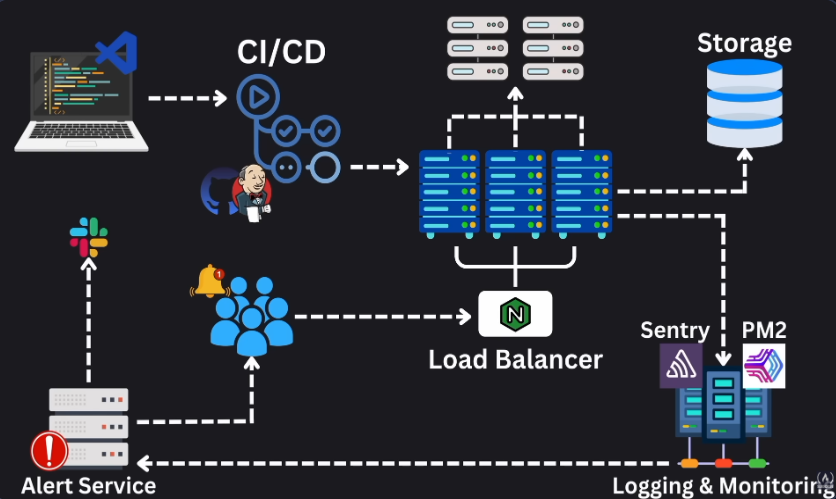
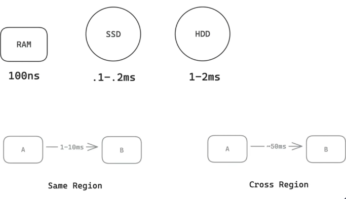
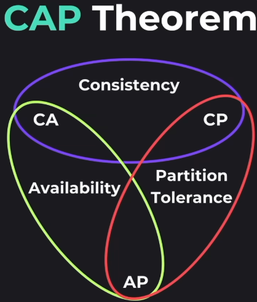
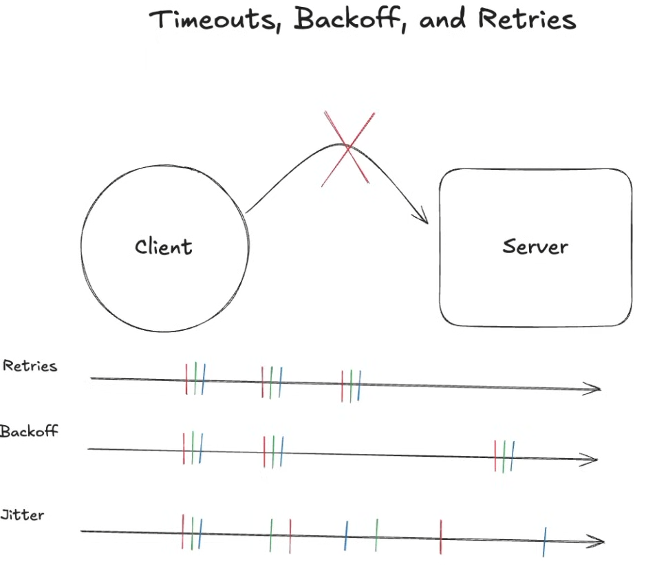

# System Design Concepts

## Backend

System that listening to client request at open port over internet.

- aka Server as it serves some data, content and client requests
- WHY NOT IN FRONTEND DIRECTLY:
  - Less Computing Power - Security Issues - CORS - DB Connection not persistant - Sandbox Environment

> Browser/Client <> DNS <> AWS Network <> Firewall <> EC2 Instances <> Reverse Proxy <> Local Server

## Production Architecture

## Glossary

- **Scalability:** The ability of a system to handle increased load by adding resources, such as servers or storage
- **Maintainability:** The ease with which a system can be modified to fix bugs, add features, or improve performance
- **Efficiency:** The ability of a system to perform its functions with minimal resource usage, such as CPU, memory, and storage
- **Reliability:** The ability of a system to perform its functions correctly and consistently over time, even in the presence of failures or unexpected conditions
- **Redundancy:** Duplication of critical components or functions of a system to increase reliability and availability
- **Fault Tolerance:** System continues to work even if there is some component failure [Partition Tolerance is when there is some network failure]
- **SPOF - Single Point of Failure:** Any component that could cause the entire system to fail if it fails, leading to downtime and potential loss of service for users.
- **CICD:** Continuous Integration and Continuous Deployment, a set of practices that enable teams to deliver code changes more frequently and reliably
- **Staging Environment:** A replica of the production environment used for testing and quality assurance before deploying changes to production

## Storage

| Storage Type | Description                                                           | Speed                    | Cost           | Purpose                             |
| ------------ | --------------------------------------------------------------------- | ------------------------ | -------------- | ----------------------------------- |
| Cache        | Small, fast memory, close to CPU L1, L2, L3                           | Very Fast - Access in ns | Very Expensive | Stores for frequently accessed data |
| RAM          | Volatile memory used for temporary storage while programs are running | Fast - 10 GB/s           | Expensive      | Stores running program and its data |
| SSD          | Non-volatile storage used for long-term storage of data               | Fast - 1 GB/s            | Moderate       | OS, Applications, Files             |
| HDD          | Non-volatile storage used for long-term storage of data               | Slow - 100 MB/s          | Cheap          | Stores user files                   |

## Numbers

## CAP Theorem / Brewer's Theorem

CAP Theorem states that a distributed data store can only provide two out of the following three guarantees simultaneously:

{height=200px}

- _Consistency:_ Every node in the system sees the same data at the same time
- _Availability:_ System is always operational and responsive to requests, even in the presence of failures
- _Partition Tolerance:_ The system continues to operate despite degraded network partitions or communication failures between nodes

> Partition Tolerance : DEFAULT in distributed system

## Consistency

- Eventual Consitency
-

## Availability

System is reliable, fault tolerant and redundant.

99.9% Uptime = 8.76 hours of downtime per year
99.999% Uptime = 5.26 minutes of downtime per year

- _SLO : Service Level Objective:_ A target level of service that a system is expected to meet, often defined in terms of availability, response time, or other performance metrics
- _SLA : Service Level Agreement:_ A formal agreement between a service provider and a customer that defines the level of service expected, including uptime guarantees, response times, and other performance metrics

## Speed

- **Throughput**: Amount of data processed in a given amount of time
  - _Server Throughput:_ Number of requests a server can handle per second, RPS
  - _DB Throughput:_ Number of queries a database can handle per second, QPS
  - _Data Throughput:_ Amount of data transferred over a network in a given amount of time, often measured in bits per second (bPS) or bytes per second (BPS)
- **Latency** : The time it takes for a system to respond to a request, often measured in milliseconds (ms)

## Scaling

|            | Vertical Scaling              | Horizontal Scaling             |
| ---------- | ----------------------------- | ------------------------------ |
| Meaning    | Increasing capacity of server | Adding more servers            |
| Complexity | Simple to setup               | Complex as coordination needed |
| Limits     | Max capacity of system        | Indefinite                     |

### Input/Output Validation

Validate and sanitize user input to prevent injection attacks and ensure data integrity.

- Usually done on both client and server sides (crucial).
- Validate at boundary
- Return error messages on validation errors

**Layered Architecture**

- Repository: DB Layer
- Service Layer: Business Logic
- Controller Layer: API Layer, HTTP Layer
  - Here the validations and transformation are done
- Frontend Validations: Validate before calling the API, gives better user experience

**Types of Validation** [Not Exhaustive]

1. Syntactic: Required / Regex
2. Semantic: Depends on logic. Like negative age, past date
3. Type: Matches data type

## Error Handling

**Types**

- Logic Error
- DB Error
- Validation Error
- Query Error
- External Service Error
- Configuration Error (Start/Runtime)

**Prevention**

- Strong test cases
- Health Checks
  - DB
  - External and Internal Services

**Handling Error Gracefully**

- Immediate Error Response:
  - Retry, Containment, Fallback
- Error Recovery:
  - Restart Service, Backup, Recovery, TSGs
- Error Propagation:
  - Error Boundary
- Global Error Handling
  - Bubble up the error

## Config Management

Settings for the system

**Types**

- App Setting: Log Levels, Timeouts, Connection Pool
- DB Config
- External Service Config
- Feature Flags
- Security
- Infra
- Business Rules
- Performance Tunings

**Storage**

- Environment Variables
- Files - JSON, YAML
- Key Value Stores - Redis, etcd
- Cloud - Key Vaults

## Logging and Monitoring

The process of collecting, analyzing, and visualizing data from applications and infrastructure to ensure they are running smoothly and to identify issues before they become critical

**Logging** Recording every important events with metadata
**Monitoring** Monitor the state of the system via metrics
**Observability** Internal state that gives info about the system
**Traces** Transaction: Interaction of different components

### Logging Levels

- Debug
- Info
- Warn
- Error
- Fatal

### Types of Logging

1. Structured Logging: JSON
2. Unstructured Logging: Text

Examples: OpenTelemetry, Graphana, Prometheus, NewRelic

## Graceful Degradation / Shutdown

1. Stop on the fly requests, stop accepting new connections
2. Clean up resources

OS communicates with processes via IPC (Interprocess Communication) Signals

- SIGTERM: Request for process termination
- SIGINT: Interupt, CTRL+C on terminal
- SIGKILL: Process stop

## Alerting

The process of notifying relevant stakeholders when an issue is detected in the system, often through email, SMS, or other messaging platforms

## Regionalization

Networking across the world

- Regional Servers
- Database and Servers should be close by
- Data Replication and Sharding
- CDNs
- Caching

## Circuit Breaker

Prevents a service from being overwhelmed by requests when it is experiencing high latency or errors.

- It monitors the health of the service, and if the error rate exceeds a certain threshold, it trips the circuit breaker and stops sending requests to the service for a certain period of time.
- This allows the service to recover and prevents cascading failures in the system.

## Timeouts, Backoff, and Retries

Jitter - Randomized delay to avoid thundering herd problem, where multiple clients retry at the same time, causing a spike in traffic and overwhelming the server.
Exponential Backoff Retries with Jitter : Best Choice
