# Database Modeling

Data Modeling defines hoow the data is: Structured, Stored and Related

**Should be done during**
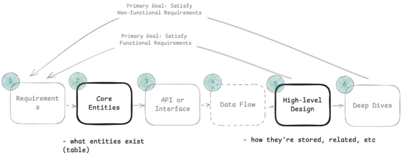

**Data Modeling Options:**

Relational | Document | Key Value | Wide Column | Graph

## Schema Design

**Key Factors**

1. Data Volume - Where data live - Single or Distributed
2. Access Patterns - How data is accessed - Read heavy or Write heavy - Normalized or DeNormalized
3. Consistency Requirements - Strong or Eventual Consistency

**Output**

1. Tables, Columns and Relationships
2. Keys and Constraints
3. Normalized or Denormalized
4. Indexing and Sharding

> Usually data in db are normalized, and data in cache is denormalized.

## In Practice

1. Choose apt data model
   - Relational [Default] - PostGreSQL, MySQL
     - Strong consistency
     - Use when data is structured, ACID requirements
   - Document - MongoDB / CosmosDB
     - Use when unstructured / deeply nested data, evolving schema
     - Denormalized data, less lookup overhead
   - Key Value - Redis, DynamoDB
     - Caching, Session Storage, Feature Flags
     - Simple Query, High Performance, Flat Data
   - Wide Column - Casandra, HBase
     - Massive write heavy, Time Series Data, Analytics
     - Telemetry, Logging, IOT Data
   - Graph DB - Neo4j
     - Not to be chosen for interviews.
2. Design Schema
   1. Tables, Columns and Keys
      1. Core Entities
      2. PK, FK
   2. Relationships
      1. via FKs: 1:1, 1:M, M:N
   3. Constraints
      1. NON NULL, UNIQUE, CHECK
   4. Indexes
      1. Based on access pattern / queries
      2. Use if efficient data access needed, Table size > 10K
         1. Inverted Index - Full Text Search
         2. Geospatial Index - Location Data
         3. Hash Index - Inmemory, exact match
         4. BTree - Everything else
            1. Composite index - Multiple columns queried together
            2. Covering index - Heavy read on few columns
   5. Normalized or Denormalized
      1. Use normalized data by defauly
      2. Denormalize only when needed
         1. like Caching in Redis (DB still Normalized)
         2. Read Optimization, Analytics or Logs data
   6. Sharding
      1. By Primary Access Pattern
      2. Choose apt sharding key: High Cardinality, Even Distribution

OUTPUT

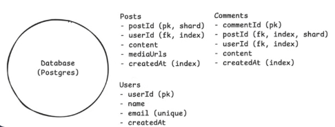

---

## Database Scaling


## Sharding

Sharding is a process of dividing a large database into smaller, more manageable pieces called shards.

- **Shard:** Separate DB that contains subset of data
- Horizontal Scaling technique

{width=300px}

_ADVANTAGE:_ Improve performance, scalability, and availability of the database
_COMPLEXITIES:_ data distribution, query routing, and maintaining consistency across shards.

### Choosing a sharding key

{width=400px}

Good Example - User ID, Product ID, Order ID
Bad Example - Timestamp, Random ID, Auto Increment ID

> Shard by query pattern, not by data volume. Shard only when single db cant handle the load.

### Sharding Strategies

Distributing data across shards

1. What to shard by
2. How to distribute data across shards

#### Range Sharding

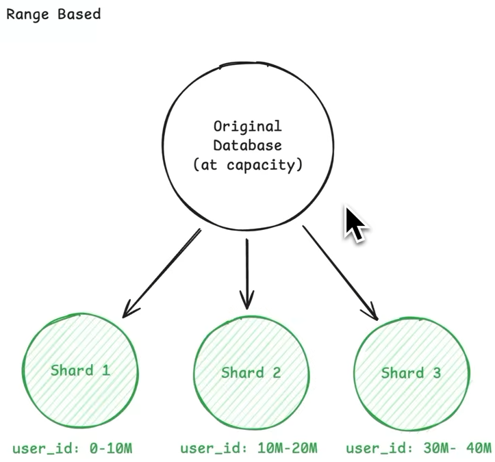{width=400px}

- Divide the data into ranges based on the sharding key and assign each range to a shard. Can cause hot shards if uneven distribution.

#### Hash Sharding

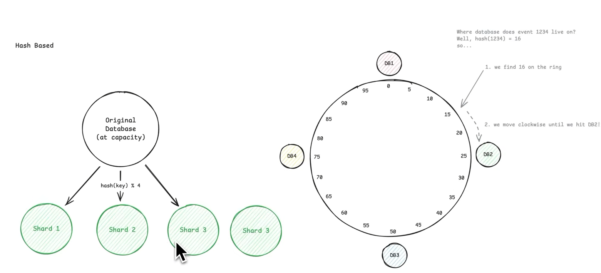{width=400px}

- Distribute the data across shards based on a hash function applied to the sharding key. This can help to evenly distribute the data across shards.
- Example: Hash(User ID) % Number of Shards
- But if the hash function is not good, it may lead to uneven distribution of data across shards.
- On increasing the number of shards, the hash function needs to be changed, which can lead to data migration and downtime.
- _Consistent Hashing_ [Default]
  - Distribute the data across shards based on a hash function applied to the sharding key, and use a hash ring to map the hash values to shards. This allows for dynamic addition and removal of shards without affecting the existing data distribution.
  - Example: Hash(User ID) % Number of Shards, but the number of shards can change dynamically without affecting the existing data distribution.
  - But if the hash function is not good, it may lead to uneven distribution of data across shards.

#### Directory Based Sharding

{width=400px}

- Use a directory service to map the sharding key to the shard that contains the data. This allows for dynamic addition and removal of shards without affecting the existing data distribution.
- Example: Use a directory service to map keys to shards, allowing for dynamic addition and removal of shards without affecting the existing data distribution.
- But if the directory service fails, it can lead to unavailability of the data. Also latency can be introduced due to the extra hop to the directory service.

#### Geographic Based Sharding

- Partitions data based on geographic location, storing data in shards that correspond to specific regions or countries, improving performance and reducing latency for users in those areas.

### Challenges of Sharding

#### 1. Hot Spots


One shard receives a disproportionate amount of traffic, causing it to become a bottleneck and degrade performance. This can happen when the sharding key is not chosen properly, or when the data is not evenly distributed across shards.

Solution

- Dedicated Shard for Hot Key
- Sharding by a different key [Composite Key] to evenly distribute the load across shards.

#### 2. Cross Shard Queries


When data is distributed across multiple shards, queries that need to access data from multiple shards can become complex and inefficient. This can happen when the sharding key is not chosen properly, or when the data is not evenly distributed across shards. Data is not distributed according to the query pattern, which can lead to cross shard queries.

Solution

- Choose a sharding key that aligns with the query patterns, so that most queries can be satisfied by a single shard.
- Cache the results of cross shard queries to reduce the load on the shards and improve performance.
- Denormalize the data to reduce the need for cross shard queries, at the cost of increased storage and complexity.

#### 3. Maintaining Consistency


When data is distributed across multiple shards, maintaining consistency can become challenging. Data can live in multiple shards, and updates to the data may need to be propagated to all relevant shards. This can lead to inconsistencies if the updates are not properly synchronized.

Solution

- 2 Phase Commit - Use a distributed transaction protocol to ensure that updates to the data are atomic and consistent across all relevant shards. This technique can be complex and may introduce latency, but it ensures that the data remains consistent across shards.
- Saga Pattern - Use a series of local transactions that are coordinated to achieve eventual consistency across all relevant shards. This technique can be more flexible and scalable than 2 Phase Commit, but it may require more complex application logic to handle failures and retries.

### Sharding in Practice


Shard only when single db cant handle the load.

---

### Consistent Hashing

Problem with Traditional Hashing

- Redistribution of keys when the number of shards changes, leading to data migration and downtime.
- Removing a shard can cause a large number of keys to be remapped to different shards, leading to data loss and downtime.

1. Create a hash ring
2. Map each shard to a point on the hash ring using a hash function
3. Map each key to a point on the hash ring using the same hash function, Move clockwise on the ring until a shard is found, and assign the key to that shard.

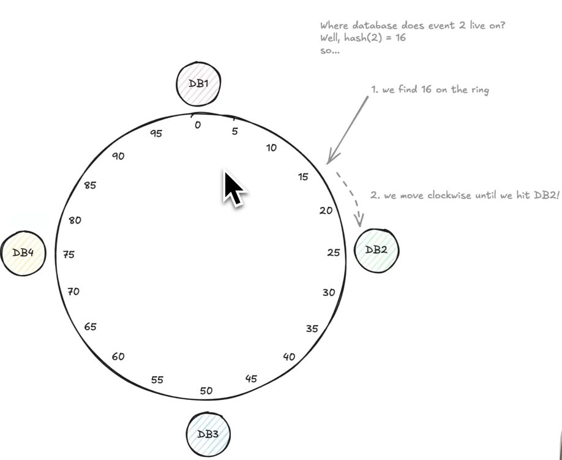

- If new shard is added, only the keys that fall between the new shard and its predecessor on the hash ring need to be remapped to the new shard.
- If a shard is removed, only the keys that were assigned to that shard need to be remapped to its successor on the hash ring.
  - But this can lead to uneven distribution of keys across shards
  - Solution - Use virtual nodes, where each shard is mapped to multiple points on the hash ring. This allows for more even distribution of keys across shards, and reduces the impact of adding or removing shards.
  - 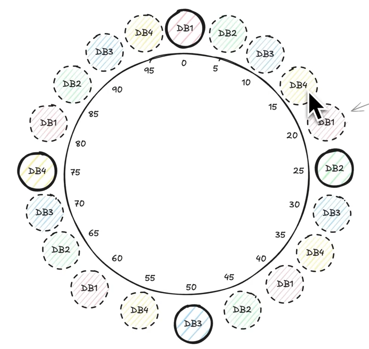

Used by Redis, Cassandra, Amazon DynamoDB, and CDNs

---

## Database Replication

Replication is the process of copying and maintaining database objects, such as tables or entire databases, across multiple database servers.

**Master-Slave Replication:** A replication model where one database server (the master) handles write operations and propagates changes to one or more read-only replica servers (the slaves), allowing for improved read performance and fault tolerance.
**Master-Master Replication:** A replication model where multiple database servers (masters) can handle both read and write operations, synchronizing changes between them to ensure data consistency and availability across the system.

---

## Database Performance Optimization

- Caching
- Indexing
- Query Optimization

## Indexing

Indexing is a technique used to improve the performance of database queries by providing a fast lookup mechanism for data retrieval.

- Maintains a separate data structure optimized for searching - fast lookups
- Modern DBs have caching and prefetching, but for large databases sequencial search is still slow

**Types of Indexes:**

1. _B-Tree Index_ (DEFAULT) - good for range queries and equality searches.
2. _Hash Index_ - Good for equality searches, not suitable for range queries.
3. _Geospatial Index_ - Indexes on 2D data, for proximity based search
4. _Inverted Index_ - Create index on data to row number. Elastic Search
5. _Bitmap Index_ - Efficient for low-cardinality columns, often used in data warehousing.
6. _Full-Text Index_ - Used for text search, supports complex search queries.

**Considerations:**

- Indexes improve read performance but can degrade write performance.
- Requires extra storage space
- Choose indexes based on query patterns and access frequency. If read access is huge and on non key attributes

### B-Tree Indexes

Balanced Tree Structure, Sorted data
Nodes can have multiple children, containing ordered array of keys and pointers, structure to minimize disk reads, usually fits in single page of disk ~8KB

- Leaf Nodes stores the pointers to each disk location
- Best for searching, range queries
- PostgreSQL uses BTree for PK, Unique, Indexes

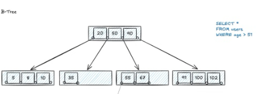

### LSM Trees (Log-Structured Merge Trees)

For large write throughput, Best for time series data like in logging and metrics

- Append only approach
- Buffers changes in memory in batch, sequentially writes to disk in large chunks
- Reads are slow, as data can be in buffer, or in queue or in disk
- Optimzations
  - Bloom Filters: Probabilistic data strucuture that can surely say data is NOT IN THIS FILE. Eliminates definite misses
  - Sparse Index: Range of keys for a file
  - Compaction

- Cassandtra

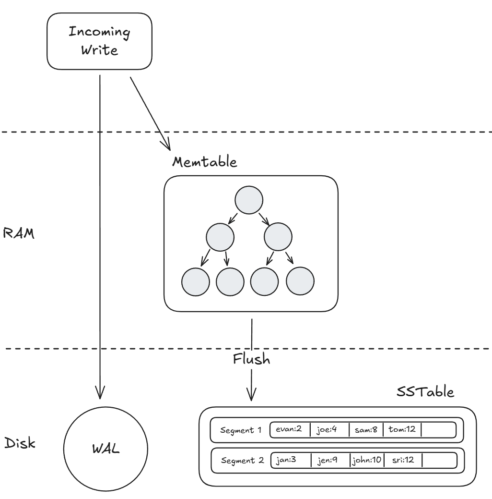

### Hash Index

- Persistent Hash map implementation
  - Hashfunction tells bucket which have pointer to disk page'
- Takes more space than BTrees
- Excel at Exact Match Queries
- Hashing collision solutions:
  - Chaining: Multiple entries in same bucket

- Best to use when exact match needed, no sorting or range queries

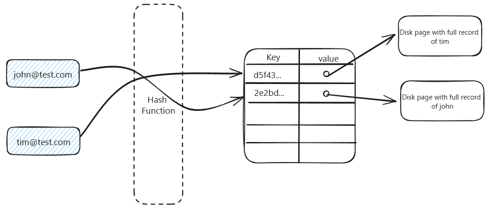

### Geospacial Index

- Proximity Search Optimizations
- Other indexes fails, as 2D data, first search in one dimension, then in another
  - Like seaching for nearby place, seaching in only one dimension gives a thin list spanning across globe, but still large

**Approaches**

1. _Geohash:_ Convert a 2D location into a 1D string in a way that preserves proximity.
   - Area divided into squares, given some number, divided further to extend that number, converted to base62 string
   - Nearby places share same prefix
   - Finally data stored in BTree, which excel at prefix matching
   - But if places are on different grid can have different prefix
   - 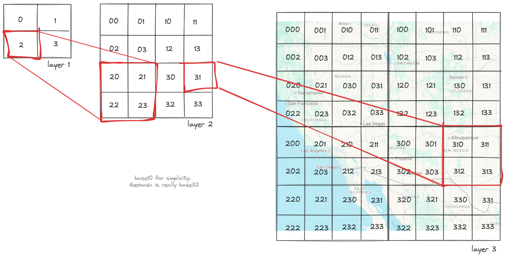
2. _Quadtree:_ Recursively divide space into 4 equal quadrant. Not used nowadays
   - More subdivisions if more datapoints in some quadrant
   - Data stored as specialized tree
   - 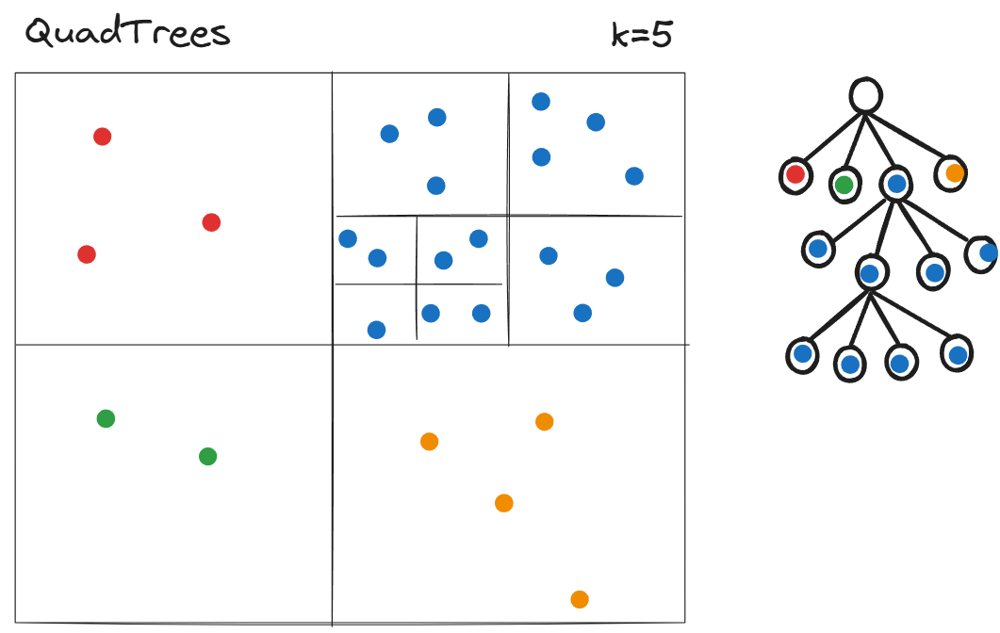
3. _R-Trees:_ Overlapping, flexible rectangles based on the datapoints.
   - Mordern Technique for spacial index, used in PostgreSQL
   - Efficient for both point and range searches
   - 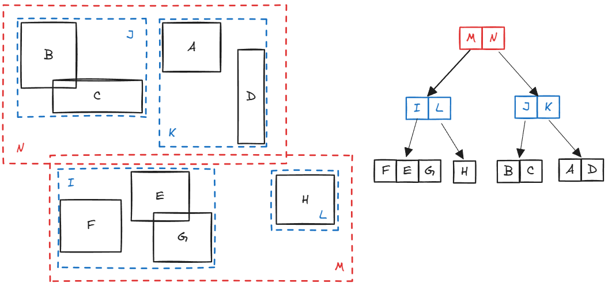
4. _Inverted Indexes_ Indexes words with the document indexes, this word occurs in which documents
   - Best for text content exact searches, Advance text search
   - Storage and update overhead
   - BTree can help in prefix or suffix match, but not for words included in a document
   - Used by Elastic Search
   - 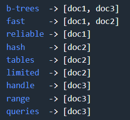

### Composite Index

Single index that combines multiple column in specific order - Matches how we typically query data

- Creates a BTree index
- Order of column matters, should be based on query

```sql
SELECT * FROM posts
WHERE user_id = 123
AND created_at > '2024-01-01'
ORDER BY created_at DESC;

-- Single Index: NOT GOOD, INTERSECTION AND SORTING NEEDED
CREATE INDEX idx_user ON posts(user_id);
CREATE INDEX idx_time ON posts(created_at);

-- Composite Index: Handles filtering, sorting efficiently
CREATE INDEX idx_user_time ON posts(user_id, created_at);
```

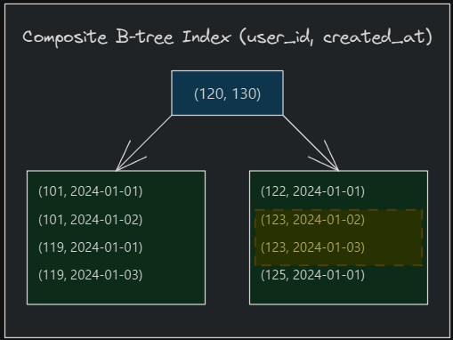

### Convering Index

Covers all columns needed by the query

- Reduces DB lookups, Performance Boost
- Efficient when small subset of columns needed from large table
- Size of index increases

```sql
-- GET LIKES COUNT OF A USER POSTS IN ORDER
-- Covering index includes likes column
CREATE INDEX idx_user_time_likes ON posts(user_id, created_at) INCLUDE (likes);
```
