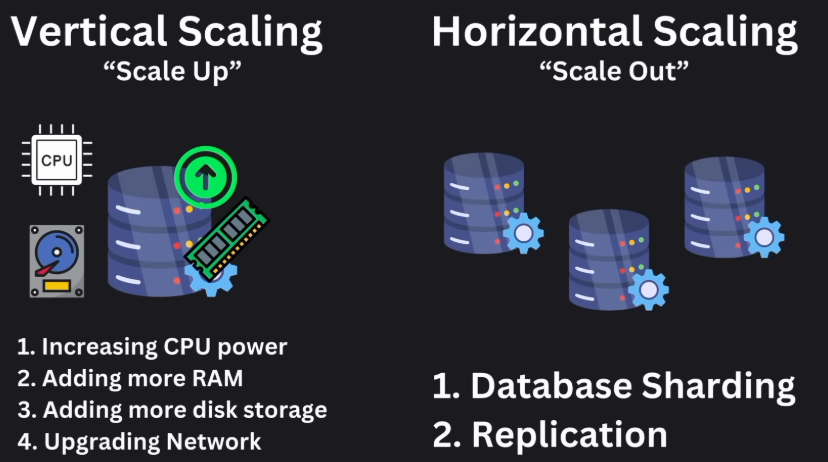
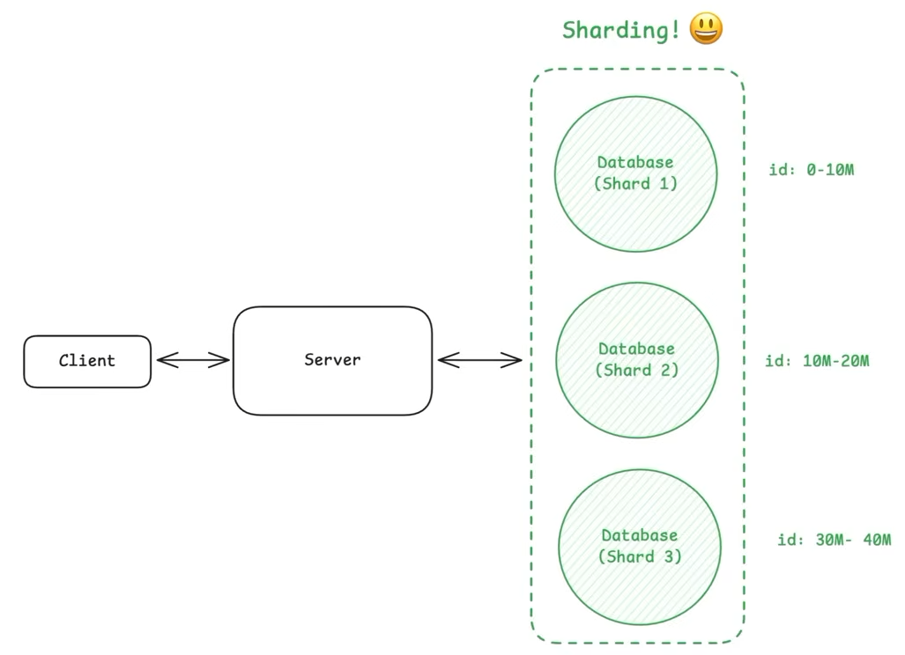
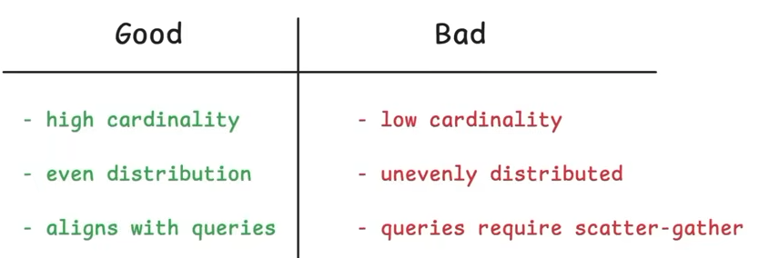
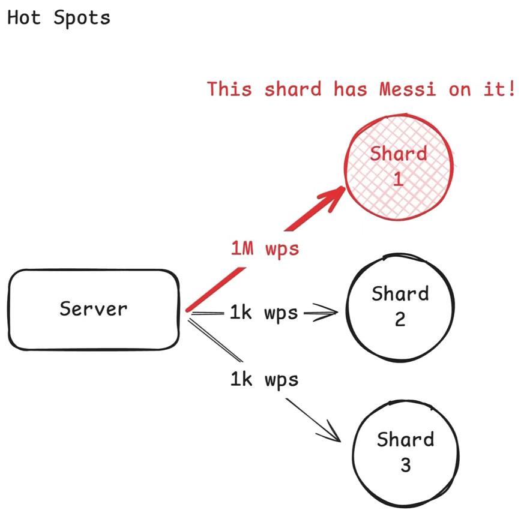
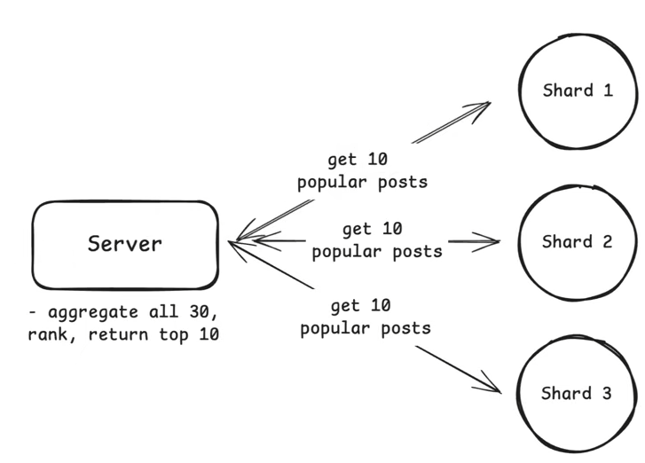

# Database Scaling

# Sharding

Sharding is a process of dividing a large database into smaller, more manageable pieces called shards.

- **Shard:** Separate DB that contains subset of data
- Horizontal Scaline technique

{width=300px}

_ADVANTAGE:_ Improve performance, scalability, and availability of the database
_COMPLEXITIES:_ data distribution, query routing, and maintaining consistency across shards.

## Choosing a sharding key

{width=400px}

Good Example - User ID, Product ID, Order ID
Bad Example - Timestamp, Random ID, Auto Increment ID

## Sharding Strategies

Distributing data across shards

1. What to shard by
2. How to distribute data across shards

### Range Sharding

{width=400px}

- Divide the data into ranges based on the sharding key and assign each range to a shard. Can cause hot shards if uneven distribution.

### Hash Sharding

{width=400px}

- Distribute the data across shards based on a hash function applied to the sharding key. This can help to evenly distribute the data across shards.
- Example: Hash(User ID) % Number of Shards
- But if the hash function is not good, it may lead to uneven distribution of data across shards.
- On increasing the number of shards, the hash function needs to be changed, which can lead to data migration and downtime.
- _Consistent Hashing_ [Default]
  - Distribute the data across shards based on a hash function applied to the sharding key, and use a hash ring to map the hash values to shards. This allows for dynamic addition and removal of shards without affecting the existing data distribution.
  - Example: Hash(User ID) % Number of Shards, but the number of shards can change dynamically without affecting the existing data distribution.
  - But if the hash function is not good, it may lead to uneven distribution of data across shards.

### Directory Based Sharding

{width=400px}

- Use a directory service to map the sharding key to the shard that contains the data. This allows for dynamic addition and removal of shards without affecting the existing data distribution.
- Example: Use a directory service to map keys to shards, allowing for dynamic addition and removal of shards without affecting the existing data distribution.
- But if the directory service fails, it can lead to unavailability of the data. Also latency can be introduced due to the extra hop to the directory service.

### Geographic Based Sharding

- Partitions data based on geographic location, storing data in shards that correspond to specific regions or countries, improving performance and reducing latency for users in those areas.

## Challenges of Sharding

### 1. Hot Spots

One shard receives a disproportionate amount of traffic, causing it to become a bottleneck and degrade performance. This can happen when the sharding key is not chosen properly, or when the data is not evenly distributed across shards.

Solution

- Dedicated Shard for Hot Key
- Sharding by a different key [Composite Key] to evenly distribute the load across shards.

### 2. Cross Shard Queries

When data is distributed across multiple shards, queries that need to access data from multiple shards can become complex and inefficient. This can happen when the sharding key is not chosen properly, or when the data is not evenly distributed across shards. Data is not distributed according to the query pattern, which can lead to cross shard queries.

Solution

- Choose a sharding key that aligns with the query patterns, so that most queries can be satisfied by a single shard.
- Cache the results of cross shard queries to reduce the load on the shards and improve performance.
- Denormalize the data to reduce the need for cross shard queries, at the cost of increased storage and complexity.

### 3. Maintaining Consistency

When data is distributed across multiple shards, maintaining consistency can become challenging. Data can live in multiple shards, and updates to the data may need to be propagated to all relevant shards. This can lead to inconsistencies if the updates are not properly synchronized.

Solution

- 2 Phase Commit - Use a distributed transaction protocol to ensure that updates to the data are atomic and consistent across all relevant shards. This technique can be complex and may introduce latency, but it ensures that the data remains consistent across shards.
- Saga Pattern - Use a series of local transactions that are coordinated to achieve eventual consistency across all relevant shards. This technique can be more flexible and scalable than 2 Phase Commit, but it may require more complex application logic to handle failures and retries.

## Sharding in Practice

Shard only when single db cant handle the load.

---

## Consistent Hashing

Problem with Traditional Hashing

- Redistribution of keys when the number of shards changes, leading to data migration and downtime.
- Removing a shard can cause a large number of keys to be remapped to different shards, leading to data loss and downtime.

1. Create a hash ring
2. Map each shard to a point on the hash ring using a hash function
3. Map each key to a point on the hash ring using the same hash function, Move clockwise on the ring until a shard is found, and assign the key to that shard.

- If new shard is added, only the keys that fall between the new shard and its predecessor on the hash ring need to be remapped to the new shard.
- If a shard is removed, only the keys that were assigned to that shard need to be remapped to its successor on the hash ring.
  - But this can lead to uneven distribution of keys across shards
  - Solution - Use virtual nodes, where each shard is mapped to multiple points on the hash ring. This allows for more even distribution of keys across shards, and reduces the impact of adding or removing shards.
  - 

Used by Redis, Cassandra, Amazon DynamoDB, and CDNs

---

# Database Replication

Replication is the process of copying and maintaining database objects, such as tables or entire databases, across multiple database servers.

**Master-Slave Replication:** A replication model where one database server (the master) handles write operations and propagates changes to one or more read-only replica servers (the slaves), allowing for improved read performance and fault tolerance.
**Master-Master Replication:** A replication model where multiple database servers (masters) can handle both read and write operations, synchronizing changes between them to ensure data consistency and availability across the system.

---

## Database Performance Optimization

- Caching
- Indexing
- Query Optimization
