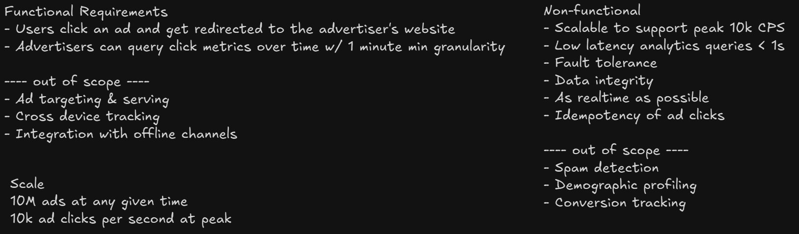
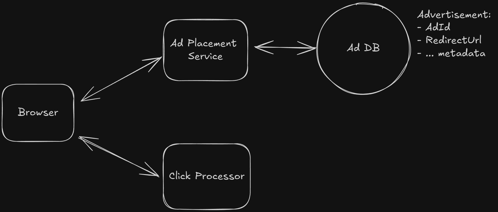
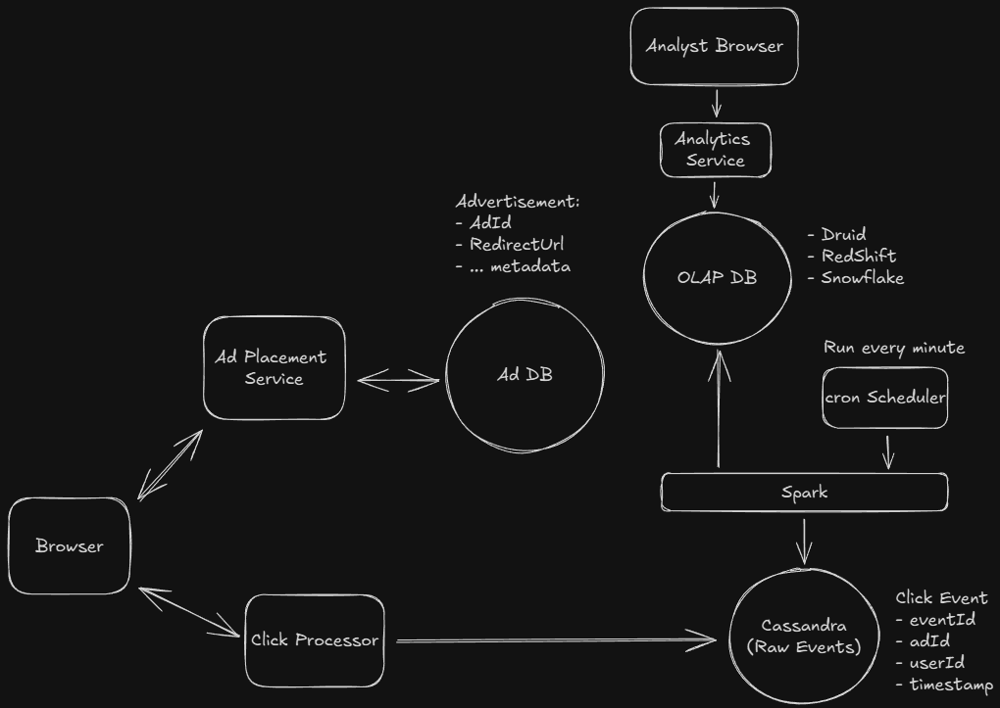
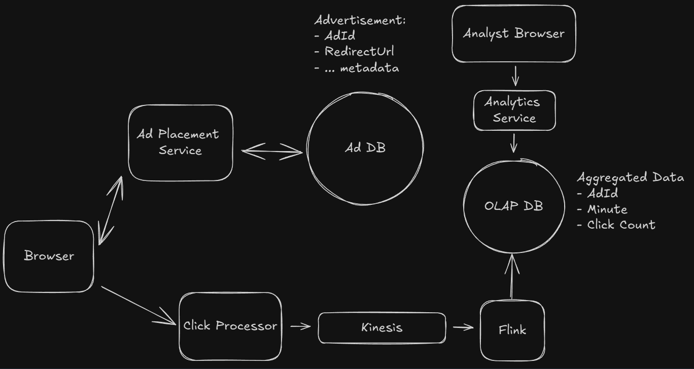
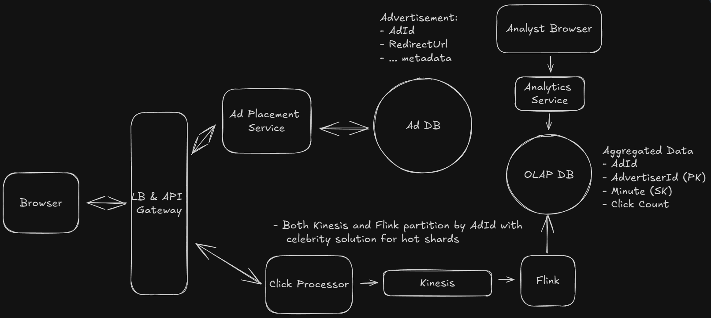
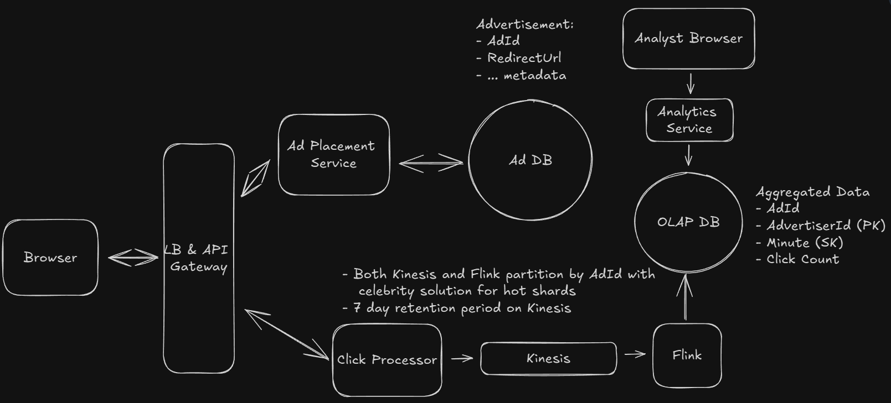
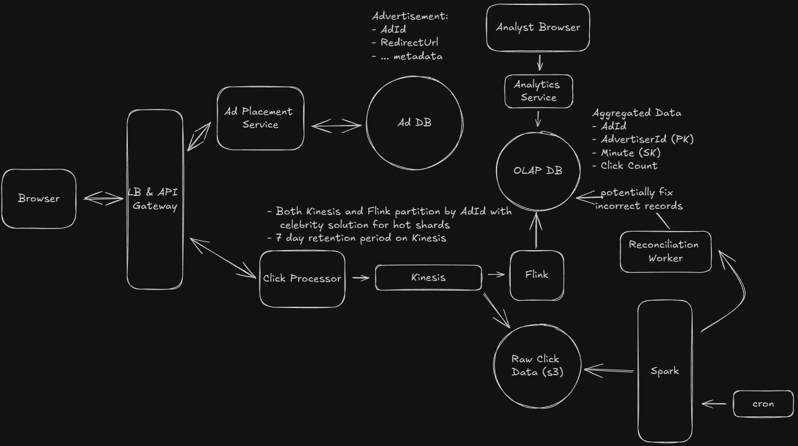
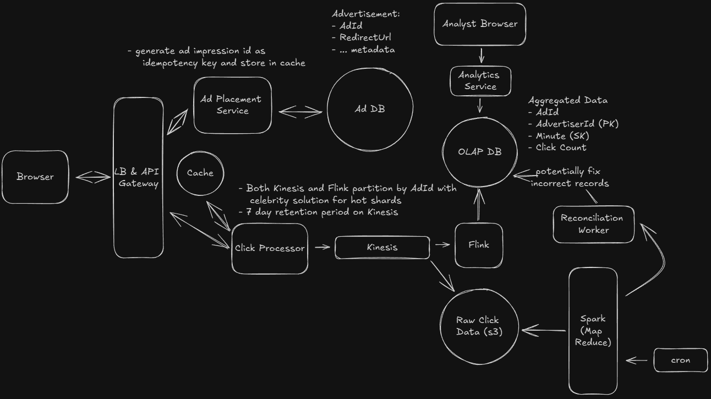

# AdClick Aggregator

An Ad Click Aggregator is a system that collects and aggregates data on ad clicks.

## Requirements



## System Interface

```
Input: Ad click data from users.
Output: Ad click metrics for advertisers.
```

## Data Flow

```
1. User clicks on an ad on a website.
2. The click is tracked and stored in the system.
3. The user is redirected to the advertiser's website.
4. Advertisers query the system for aggregated click metrics.
```

## High Level Design

### User clicks on ad and gets redirected



- Prefer server side redirect to accurately capture the click event

### Advertiser can get aggregated data

#### Batch Processing - Good Solution



**Write Optimized DB to capture events - Cassandra**

- It is based on LSM Tree, write to append only logs on disk, then to in memory sorted structure - MemTables, which are periodically flushed to disk as SSTables
- Good for reading specific row but not for range queries

**Background job to process the data**

- Apache Spark: Distributed computing engine, handles large data processing
- Map Reduce: Spark read large data in parallel chunk, aggregate

**Read Optimized DB to contain aggregated data for query**

- OLAP: Online Analytical Processing:
  - Use columnar storage formats
  - Fast aggregation queries
  - Example - Redshift, Snowflake, BigQuery

Issues:

- Not realtime, depends on spark job frequency
- Increasing frequence can cause overhead
- Does not handle bursty traffic well
- Can have cascading delays

#### Real Time Analytics with Stream Processing - Better Solution



Data written to stream - Kafka or Kinesis

Stream Processor processes the stream - Flink or Spark Streaming

- Gives many inbuilt features instead of regular kafka consumer
  - Fault Tolerance
  - Window aggregation
  - Exactly once processing gaurantee
  - State Recovery
- It aggregates the data for time window, then flushes to DB
- Custom flush intervals can flush the partial data for a window to db

## Deep Dives

### Scale to 10K Clicks Per Second

1. Scale Click Processor Horizontally
2. Shard stream by AdId, as has limit of 1000 record per shard
3. Scale Stream Processor, each job for each shard
4. OLAP databases scales automatically, but can be partitioned on Advertiser Id



### Hot Shards

- Append suffix to hot ads to distribute into different shards
- Combine during aggregation phase before writing to DB

### Ensure no data loss of clicks

- Kafka and Kinesis are itself fault tolerant, distributed and highly available
  - Kafka replicate data across multiple brokers withing cluster
  - Kinesis replicate across multiple availability zones
- Add retension period



- Stream Processor - Flink
  - Checkpointing can help for large window size
    - Data periodically saved to persistant storage
  - Here since window is small, data can be reprocessed

- Periodic Reconciliation - Fix any incorrect data
  - Stream pushes raw data to storage
  - Background job runs periodically to verify and update the aggregated
  - Lambda Architecture
    - Speed Layer - Flink - Low latency results
    - Batch Layer - Spark - Correctness



### Prevent user click abuse - Idempotent

Add User Id to Click Event - BAD SOLUTION

- Require user logins
- It might be intentional that same ad is shown to user at different instance

**Unique Impression Id**

- Used as idempotency key, generated for per ad shown on browser
- Signed impression id send along with click event
- Click processor verifies it and checks cache
- Cache used store already accounted impression id

### Low latency query

- Pre Agregate data at higher levels - daily, weekly using a separate cron job and table

## Final Design



## Expectations

- Drive the discussion
- Go deep into technical details
- Articulate pros and cons of every design decision
- Advance scalability issues and fixes
