# Auction

## Requirements

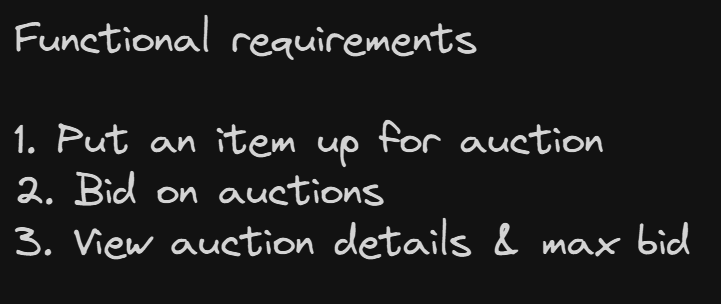

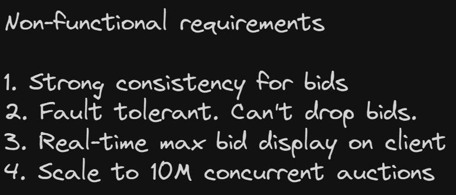

## Core Entities

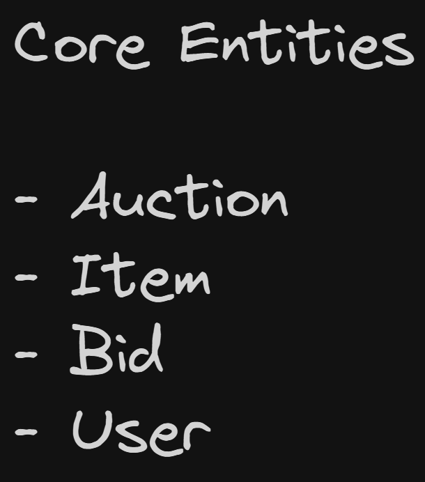

## API

```
POST /auctions -> Auction & Item
{
    item: Item,
    startDate: Date,
    endDate: Date,
    startingPrice: number,
}

POST /auctions/:auctionId/bids -> Bid
{
    Bid
}

GET /auctions/:auctionId -> Auction & Item
```

## HLD

### Users should be able to post an item for auction with a starting price and end date

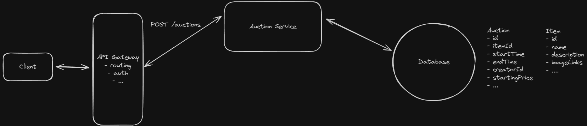

### Users should be able to bid on an item. Where bids are accepted if they are higher than the current highest bid

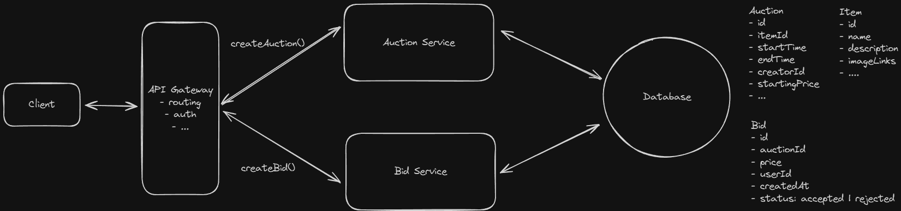

### Users should be able to view an auction, including the current highest bid

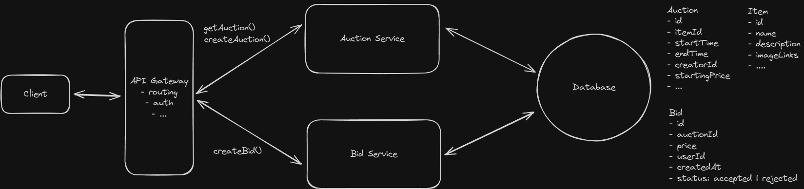

- Simple HTTP polling or refresh

## Deep Dive

### How can we ensure strong consistency for bids?

- Cache max bid in DB
- Pessimistic Locking
  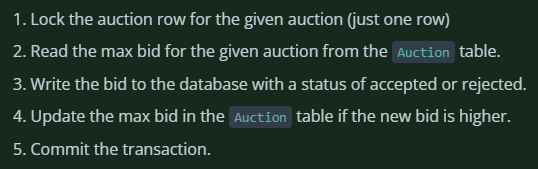
- Or Optimistic Concurrency Control
  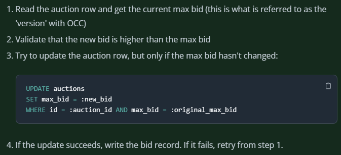

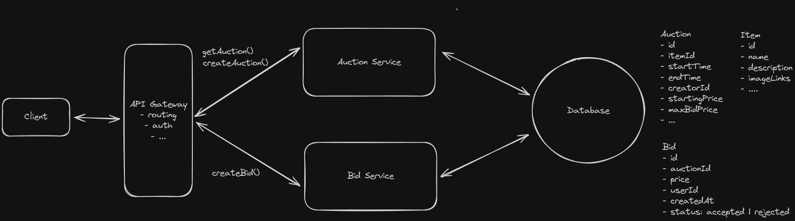

### How can we ensure that the system is fault tolerant and durable?

- Message queue
  - Durable storage
  - Buffer
  - Ordering
  - Kafka best as high troughput, durable and partitioning

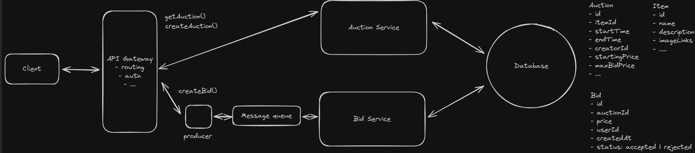

### How can we ensure that the system displays the current highest bid in real-time?

- SSE

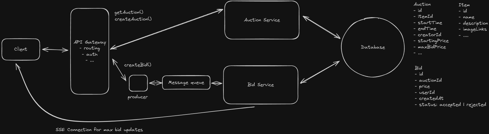

### How can we ensure that the system scales to support 10M concurrent auctions?

- Pub/Sub for coordination between bid service
- If one bid service processes a bid, it can broadcast to pub/sub and the bid service which has to notify user can listen to it

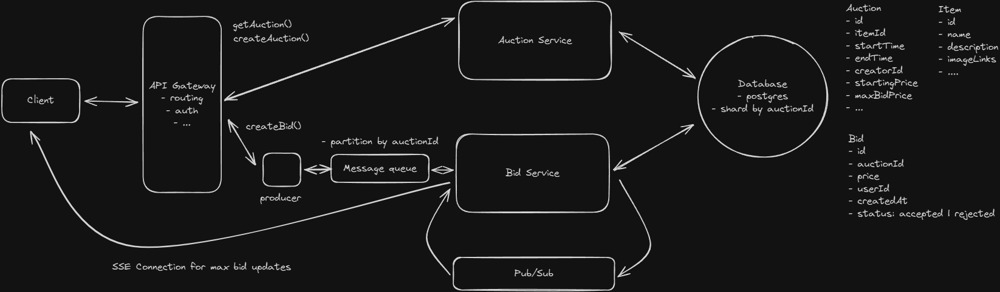
