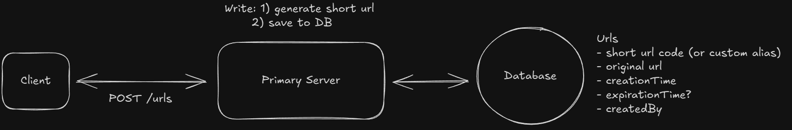
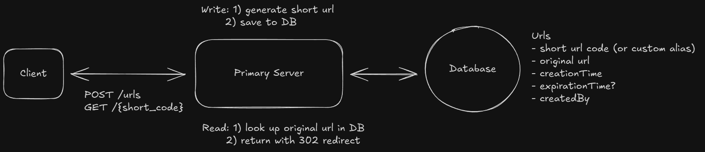
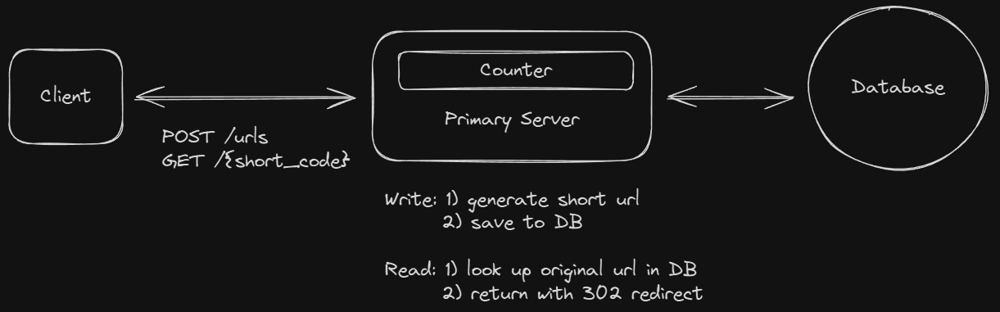
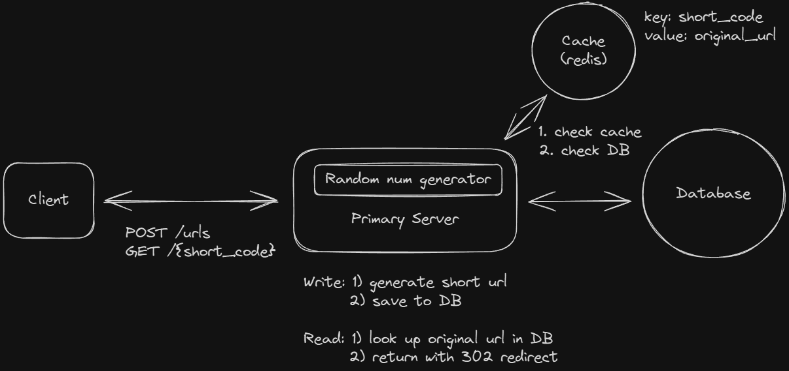
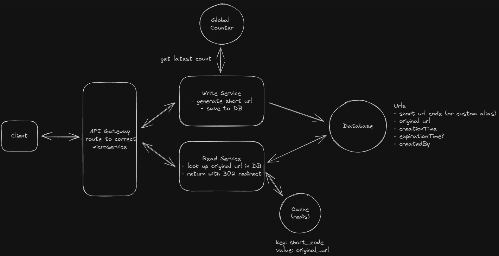

# Bitly - URL Shortner

Bit.ly is a URL shortening service that converts long URLs into shorter, manageable links. It also provides analytics for the shortened URLs.

## Functional Requirements

```
- Users should be able to submit a long URL and receive a shortened version.
- Optionally, users should be able to specify a custom alias for their shortened URL (ie. "www.short.ly/my-custom-alias")
- Optionally, users should be able to specify an expiration date for their shortened URL.
- Users should be able to access the original URL by using the shortened URL.
```

Ask the interviewer:

- User - Url Management requirements
- Authentication and Account Management
- Analytics

## Non Functional Requirements

```
- Unique urls
- Low Latency < 100ms
- Reliable, availability > consistency
- 1B urls, 100M DAU (Daily Active Users)
```

## Core Entities

```
- Original Url
- Short Url
- Expiration
- User
```

## API

```
// Shorten a URL
POST /urls
{
  "long_url": "https://www.example.com/some/very/long/url",
  "custom_alias": "optional_custom_alias",
  "expiration_date": "optional_expiration_date"
}
->
{
  "short_url": "http://short.ly/abc123"
}

// Redirect to Original URL
GET /{short_code}
-> HTTP 302 Redirect to the original long URL
```

## HLD

### Create a short url



1. User requests
2. Server validates valid url
3. Generates short url
4. Stores in DB
5. Returns

## Access short url and get redirected



1. User requrest
2. Server looks in DB
3. If found and hasn't expired, returns 302

> Background job can cleanup expired urls

## Ensuring short urls are unique

- Hash Function Good > But can cause collisions
- Global counter > Base62 Encoded (2^62 ~ 200T)




## Ensuring fast redirects

- Cache - GOOD SOLUTION
  - Cache Invalidatation
  - Cold Start



- CDNs - GOOD SOLUTION
  - Consistency Issues
  - Infra overhead

## Scale to 1B URLs

DB Check

- 500 bytes \* 1B rows = 500GB of data.
- Heavy reads done by cache
- If DB goes down
  - Replication
  - Backups

Scale Services - Horizontally

- Write Service : Global counter to be shared
- Read Service : Stateless, easy replication

## FINAL DESIGN



## Discusion Points

- Drive the conversation
- Identify challenges
  - Key Generation
  - Scaling
  - Caching strategies
  - Separating services
- Failover strategies
- Security Aspects
- System Evolution
