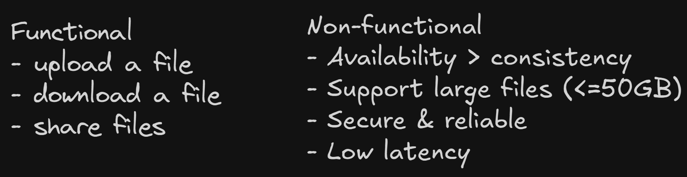
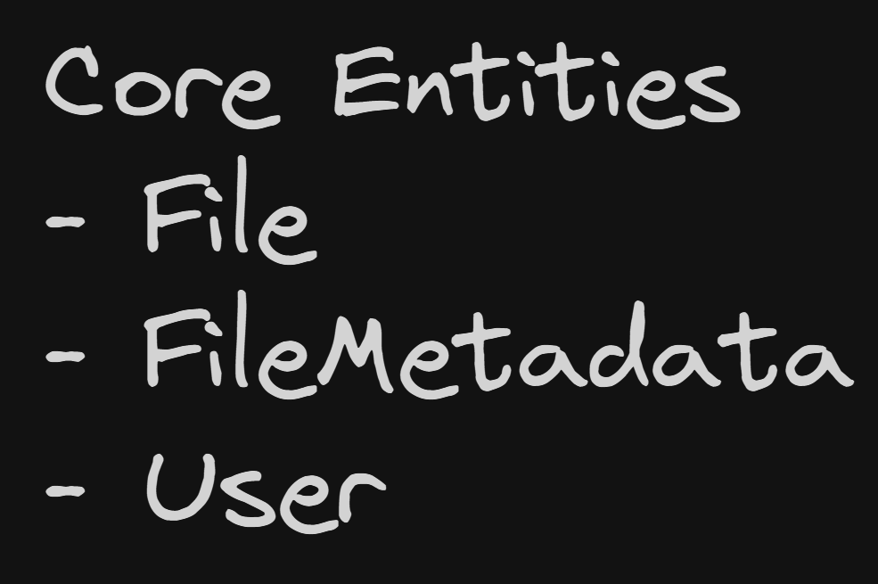
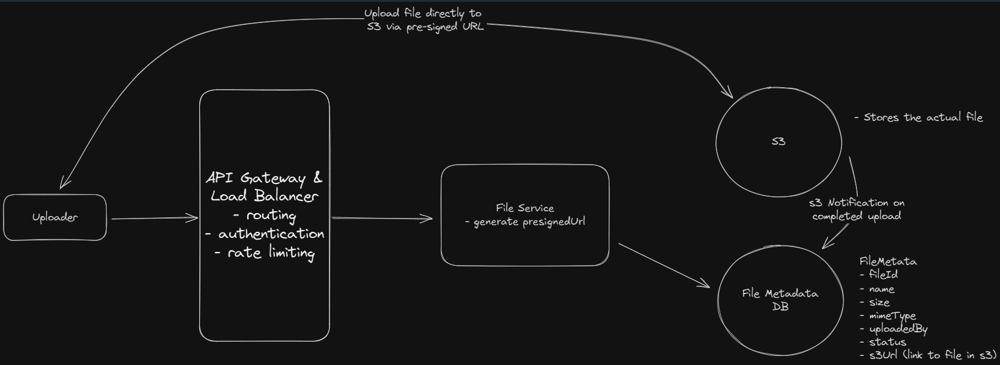
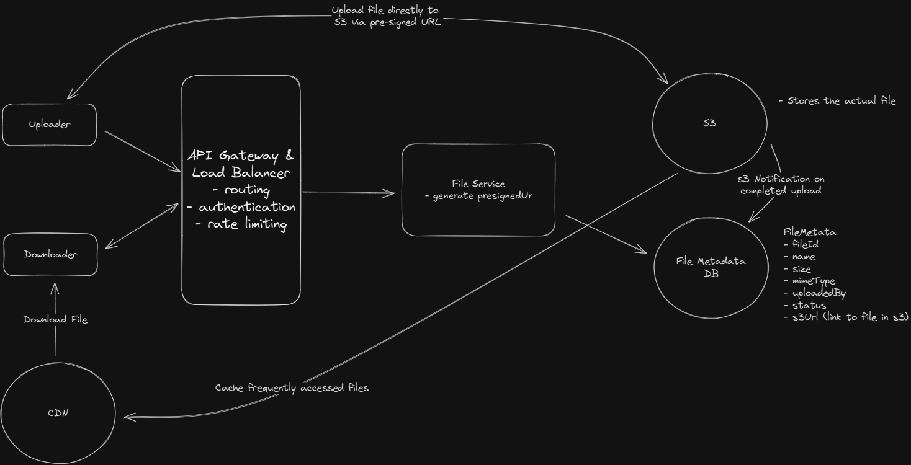
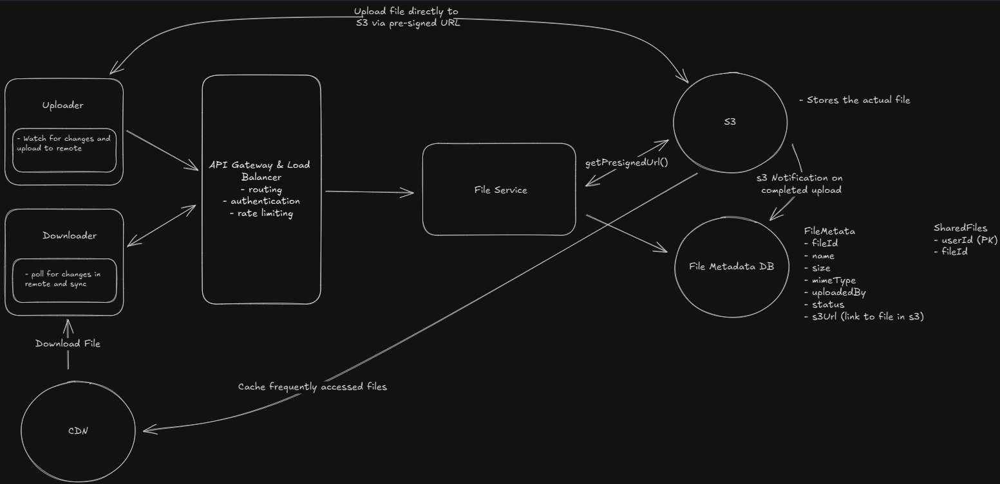
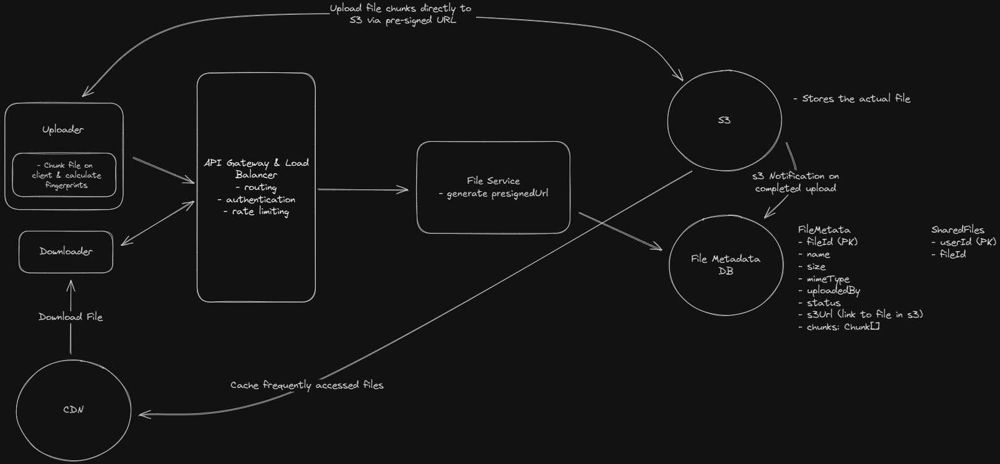
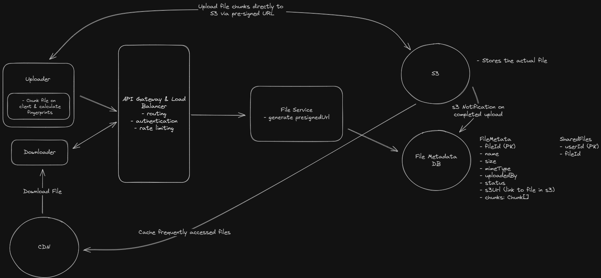

# Dropbox

Dropbox is a cloud-based file storage service that allows users to store and share files. It provides a secure and reliable way to store and access files from anywhere, on any device.

## Requirements



## Core Entities



## API Design

```
POST /files
Request:
{
  File,
  FileMetadata
}

GET /files/{fileId} -> File & FileMetadata

POST /files/{fileId}/share
Request:
{
  User[] // The users to share the file with
}

GET /files/changes?since={timestamp} -> ChangeEvent[]
```

## HLD

### Users should be able to upload a file from any device



### Users should be able to download a file from any device



### Users should be able to share a file with other users

- Separate table to maintain shared file list

### Users can automatically sync files across devices



## Deep Dives

### How can you support large files?

- Chunking on client side
- Save state in DB for resume
- Server side chunk verification - Etag verification with S3
- S3 completes the upload with `ComleteMultipartUpload` to stictch the chunks together
  

### How can we make uploads, downloads, and syncing as fast as possible?

- Compression

### How can you ensure file security?

- Encryption in transit
- Encryption at rest
- Access control

## FINAL DESIGN


