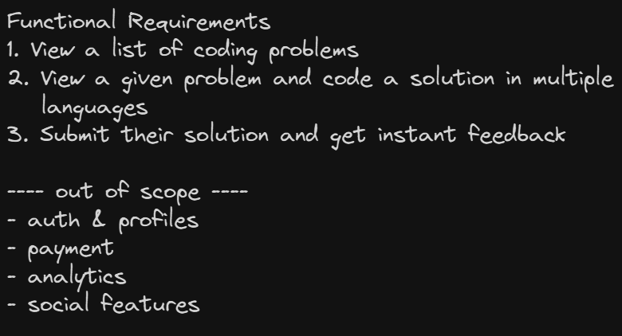
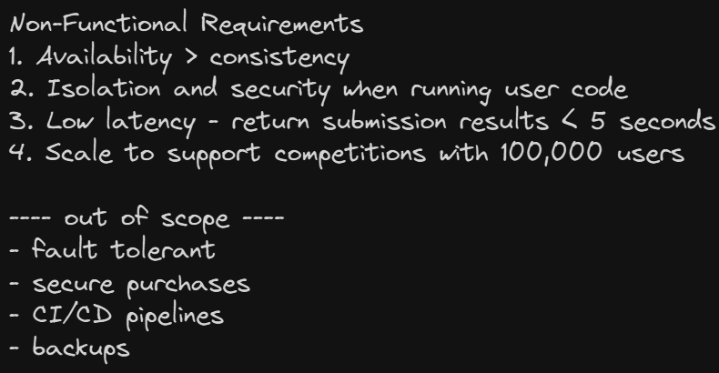
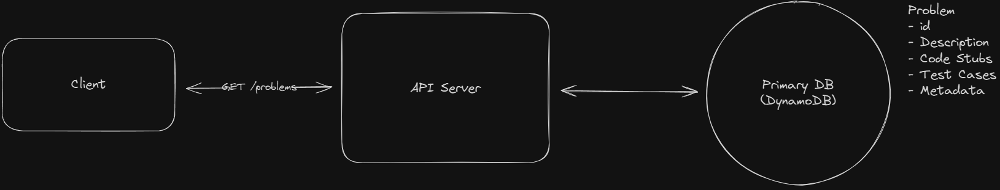
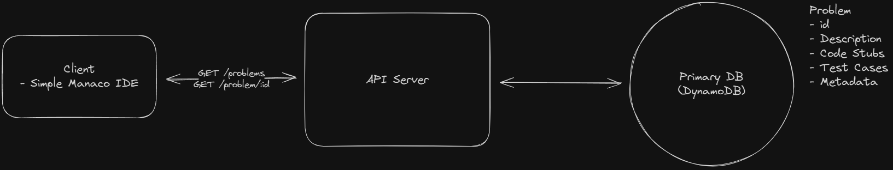
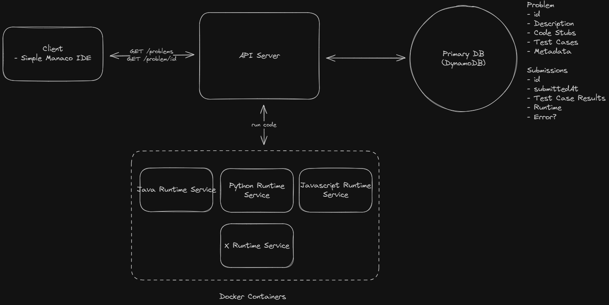
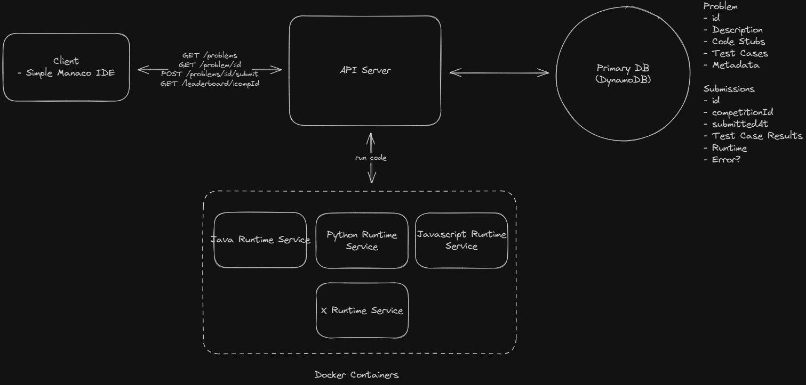
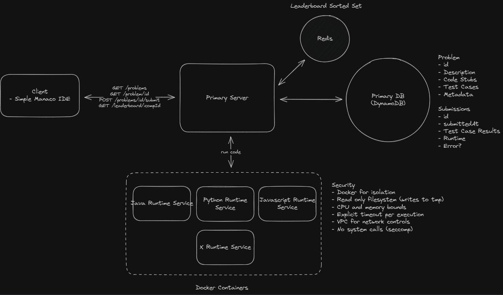
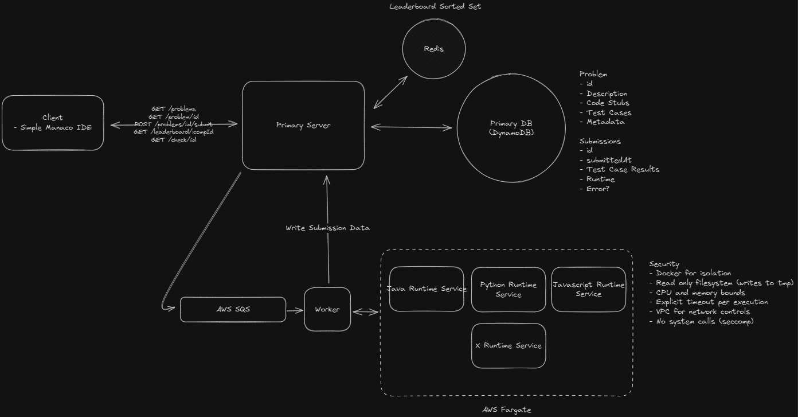
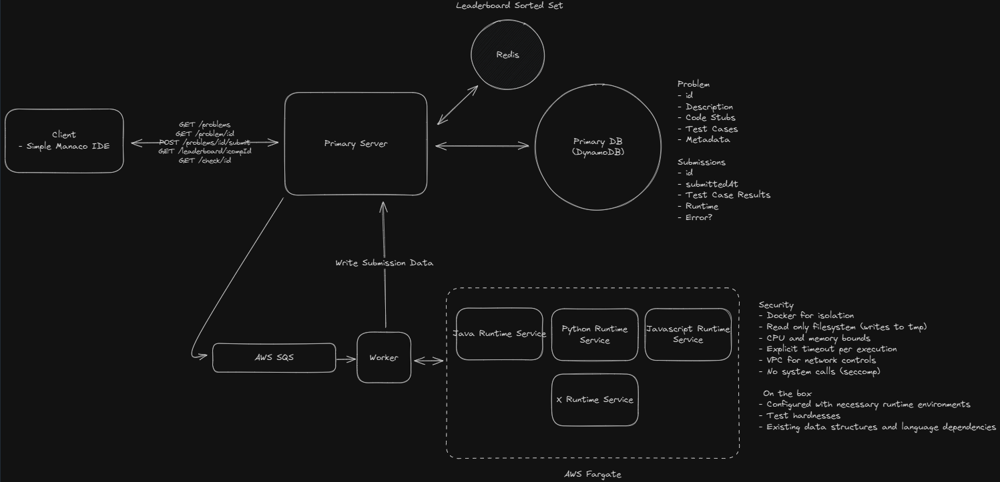

# Leetcode

LeetCode is a platform that helps software engineers prepare for coding interviews. It offers a vast collection of coding problems, ranging from easy to hard, and provides a platform for users to answer questions and get feedback on their solutions. They also run periodic coding competitions.

## Requirements





## Core Entities


## API

```
GET /problems?page=1&limit=100 -> Partial<Problem>[]

GET /problems/:id?language={language} -> Problem

POST /problems/:id/submit -> Submission
{
  code: string,
  language: string
}

- userId not passed into the API, we can assume the user is authenticated and the userId is stored in the session

GET /leaderboard/:competitionId?page=1&limit=100 -> Leaderboard
```

## HLD

### Users should be able to view a list of coding problems



### Users should be able to view a given problem and code a solution



### Users should be able to submit their solution and get instant feedback

- Run in docker containers
  

- Run in serverless functions
  - Small stateless functions, run in response to triggers
  - AWS Lambda, Azure Functions
  - Issue - Cold Start Problem

### Users should be able to view a live leaderboard for competitions

```
SELECT userId, COUNT(DISTINCT problemId) as numSolvedProblems, MIN(submittedAt) as lastSolveTime
FROM submissions
WHERE competitionId = :competitionId AND passed = true
GROUP BY userId
ORDER BY numSolvedProblems DESC, lastSolveTime ASC
```



## Deep Dives

### How will the system support isolation and security when running user code?

Security Measures

- Read only file system
- Limits on CPU and Memory
- Explicit timeouts
- Limit network access
- No system calls

### How would you make fetching the leaderboard more efficient?

- Caching with periodic updates with a cron job : GOOD BUT OVERHEAD
- Redis Sorted Set with Periodic Polling
  - Leaderboard data stored as sorted set
  - Updated on DB writes



### How would the system scale to support competitions with 100,000 users?

- Dynamic horizontal scaling
- With Queues



### How would the system handle running test cases?

- Write test case once
- Serialize and deserialize input output for each runtime

## Final Design


