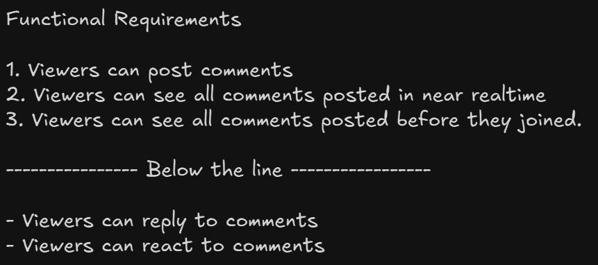
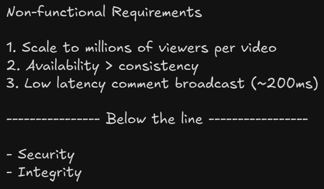
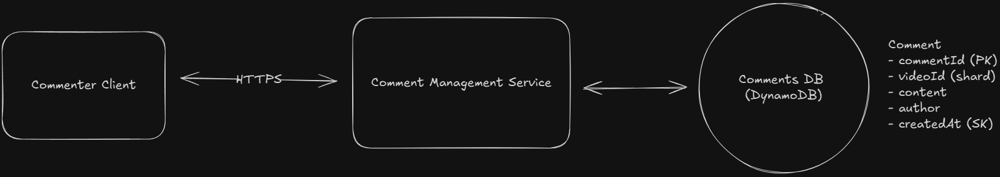
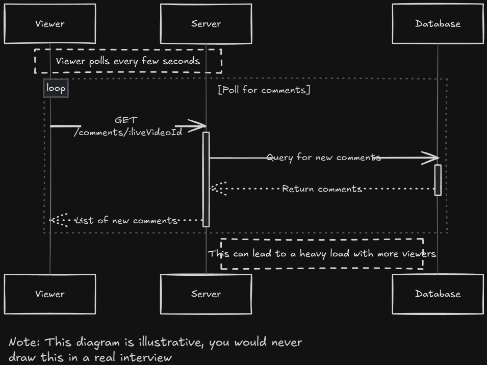
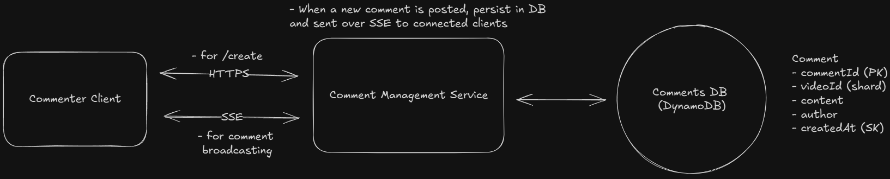
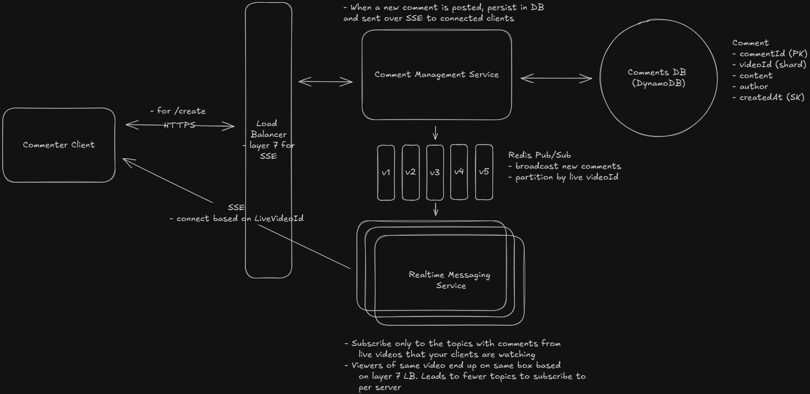
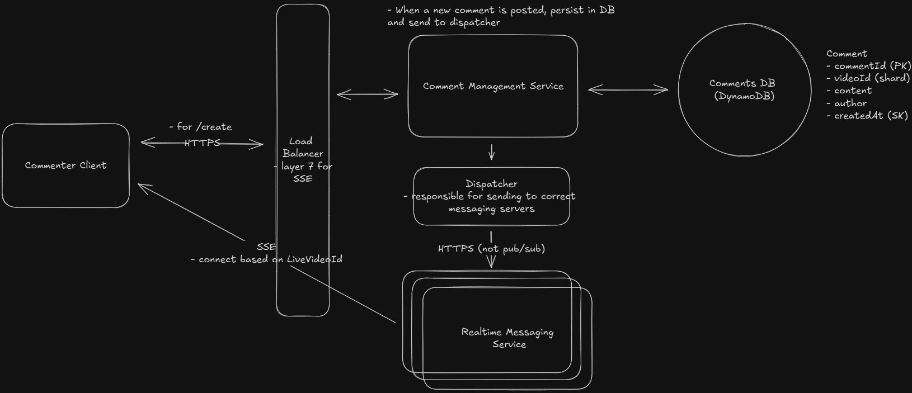

# Live Video Comment Feed

Facebook Live Comments is a feature that enables viewers to post comments on a live video feed. Viewers can see a continuous stream of comments in near-real-time.

## Requirements





## Core Entitites

```
- Comments
- Live Video
- User
```

## API

```
POST /comments/:liveVideoId
Header: JWT | SessionToken
{
    "message": "Cool video!"
}

GET /comments/:liveVideoId?cursor={last_comment_id}&pageSize=10&sort=desc
```

## HLD

### Viewers can post comments on a Live video feed



### Viewers can see new comments being posted while they are watching the live video

- Use POLING to fetch new comments using same GET api



### Viewers can see comments made before they joined the live feed

- Cursor based pagination using GET api
- `GET /comments/:liveVideoId?cursor={last_comment_id}&pageSize=10`

## Deep Dives

### How can we ensure comments are broadcasted to viewers in real-time?

- Web Sockets not used as that is better for full duplex communication
  - It has overhead of connection estabilishment
  - Its over different protocol than HTTP and infrastructure upgrades needed
- SSE Better Choice
  - Server side messages
  - Over HTTP and simple to implement



### How will the system scale to support millions of concurrent viewers

**Partitioned Pub/Sub with Viewer Co-Location**

- Layer 7 LB with consistent hashing
  

**Dispatcher Service**

- Centralized manager - Dispatcher Service
- Multiple Dispatcher instances can run in parallel behind a load balancer, all consulting the same coordination data (Zookeeper or etcd) for consistency.
  

### MegaStream with Million of Vieweres and 5K Comments per second

- User will not be able to read anything

SOLUTION

- CDN Based Delivery with Periodic Snapshot
- Everysecond, snapshot of latest comments pushed to CDNs
- Clients pull it from CDNs, smoothly shows on screen
- See your own comments works

### How do we handle client disconnections and ensure viewers don't miss comments

- SSE has a built-in mechanism for handling reconnections through the `Last-Event-ID header`
- Client locally stores last comment viewed, when reconnected calls the GET to get missed commments

## Final Design


