# Metric Monitoring System

A metrics monitoring platform collects performance data (CPU, memory, throughput, latency) from servers and services, stores it as time-series data, visualizes it on dashboards, and triggers alerts when thresholds are breached. Think Datadog, Prometheus/Grafana, or AWS CloudWatch. This is infrastructure that engineers rely on to understand system health and respond to incidents.

## Requirements

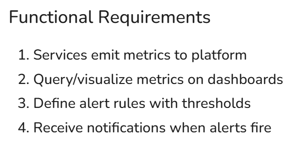

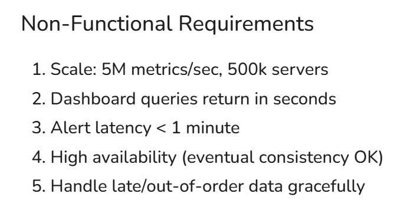

## Core Entities

- Label -> Region, Architecture, Service Name
- Metric -> CPU, RAM
- Series -> Metric and Labels over time
- Alert Rule
- Dashboard

## Data Flow

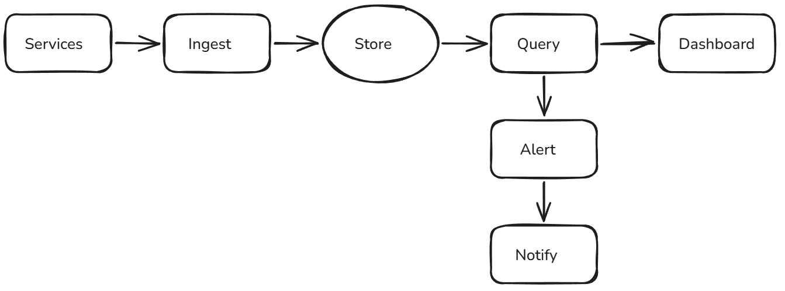

## API or System Interface

```
POST /metrics/ingest
{
  "metrics": [
    { "name": "cpu_usage", "labels": {"host": "server-1"}, "value": 0.75, "timestamp": 1640000000 },
    ...
  ]
}

// Use Protobuf for better efficiency

GET /metrics/query?query=avg(cpu_usage{region="us-east"})&start=A&end=B&step=60 -> { "timestamps": [...], "values": [...] }

POST /alerts/rules
{
  "name": "High CPU Alert",
  "query": "avg(cpu_usage{region='us-east'}) > 0.9",
  "for": "5m",
  "notifications": ["slack:#oncall", "pagerduty:team-infra"]
}
```

## HLD

### The platform can ingest metrics from services

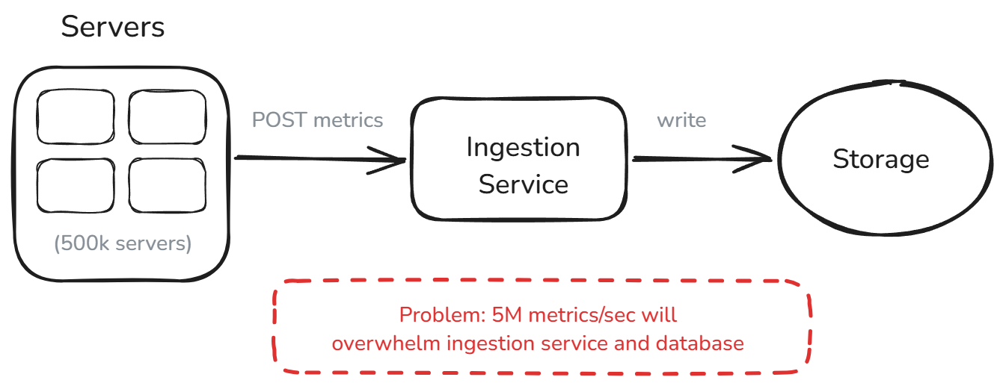

BAD - Horizontal Scaling for Ingestion Service

- Load on Database

GOOD - Message Queue

- Kafka highly scalable
- 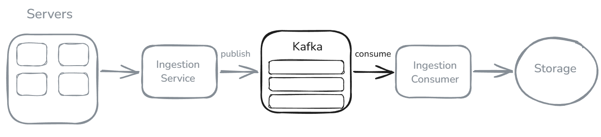

GREAT - Agent Based collection with Local Buffering

- Agent in services, that batch and collect data from services and post data
- Example Datadog Agent
- 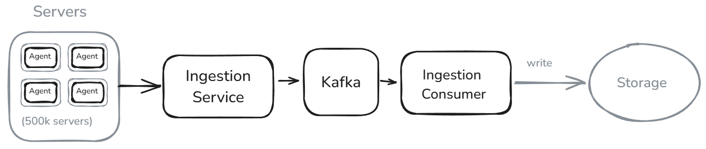

### Users can query and visualize metrics on dashboards

BAD - Relational Database

- Not that scalable for 5M WPS

GREAT - Time-Series Database

- InfluxDB, TimescaleDB, VictoriaMetrics
- Better support, use LSM Trees
  - Append only write
  - Time based partition
  - Columnar compression
  - Built in rollups and aggregation

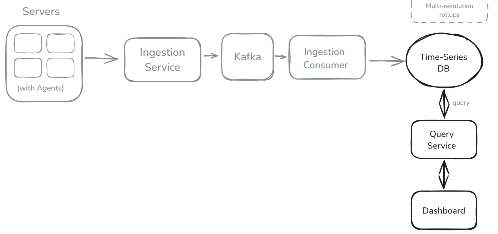

### Users can define alert rules with thresholds

- Polling

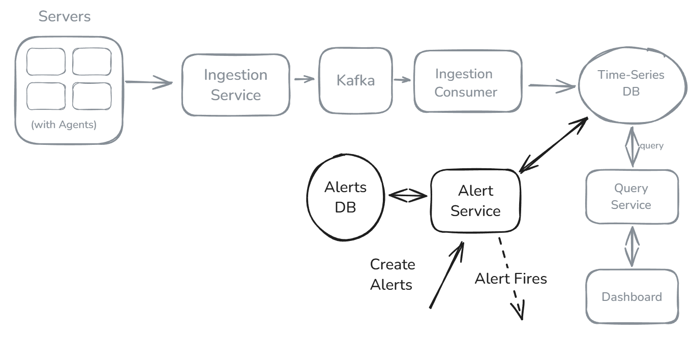

### Users receive notifications when alerts fire

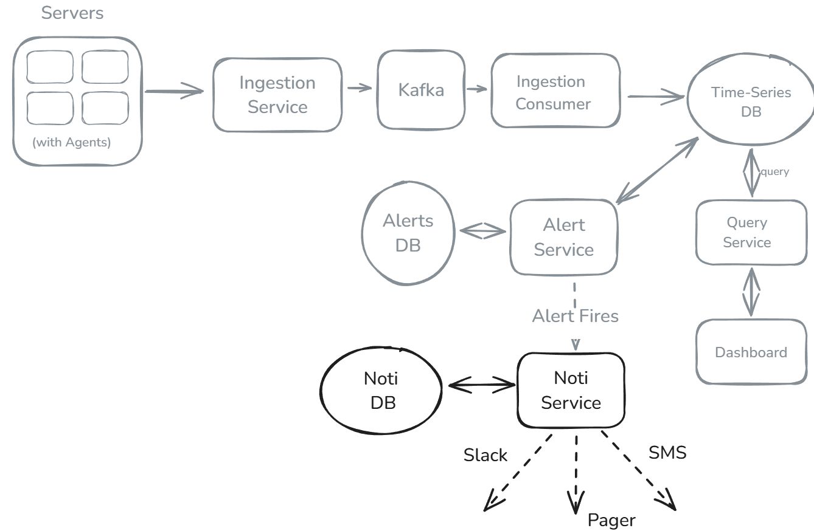

## Deep Dives

### How do we serve low-latency dashboard queries over weeks of data?

BAD - Query raw data

- Too slow

GOOD - Precomputed rollups at multiple resolutions

- Rollups not fixed, preagregated data will not be helpful in all cases
- 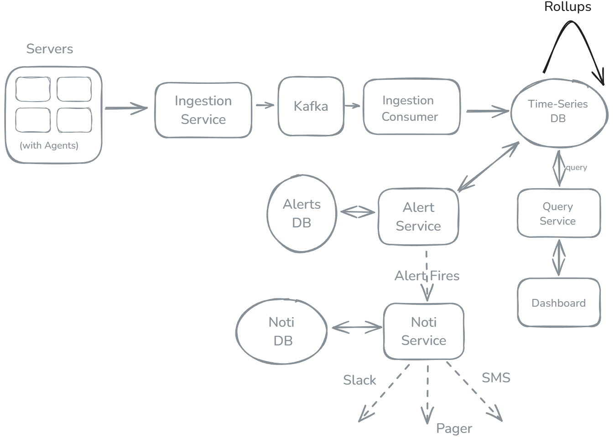

GREAT - Caching Layer and Query Splitting

- Redis Caching Layer
- Sliding window approach, compute only the missing time data, reuse earliar computed data
- Popular queries precomputed
- Recent data queried from DB, past data from cache
- 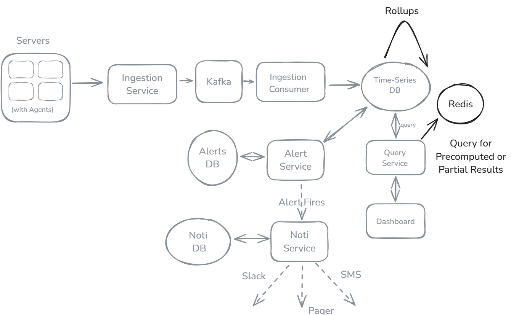

### How do we reduce alert latency below 1 minute?

GOOD - Increase polling frequency

GREAT - Stream processing for real time alert

- Flick - Flick jobs compute on steamed alerts
- In parallel, as it is expensive. So categories alerts
  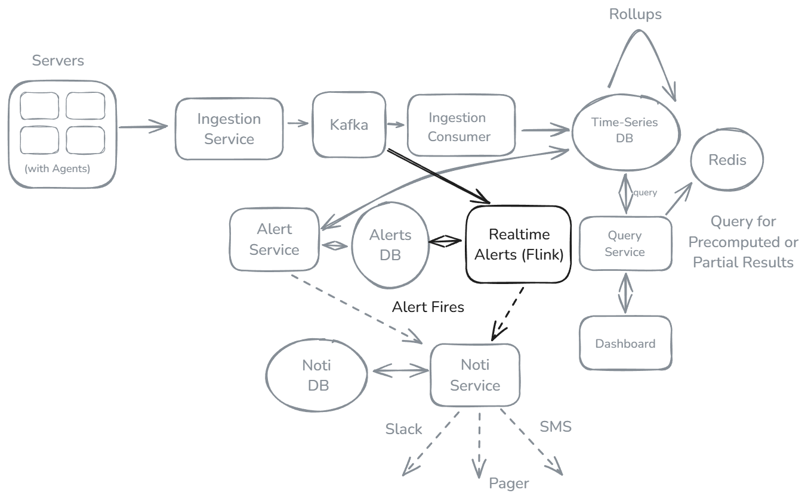

### How do we ensure high availability during spikes and failures?

BAD - Single instance of Ingestion and Alert

- SPOF

GOOD - Redundancy and Durable Buffers

- Redundant Ingestion, Kafka, Storage, Alerting, Notification

GREAT - End to End Resumable Support

- Ingestion Path - Kafka retries on failure
- Alerting - Checkpointing, Kafka

### Monitor the Monitoring System

- 3rd party service to monitor
- Separate system to monitor

### How do we handle cardinality explosion?

- If unique ids added to time series data entry, then agregation becomes complex
- Policy DB
  - Allowed labels, regions, etc
- Cardinality Tracker
  - Redis, to check total cardinality, unique series per metric
    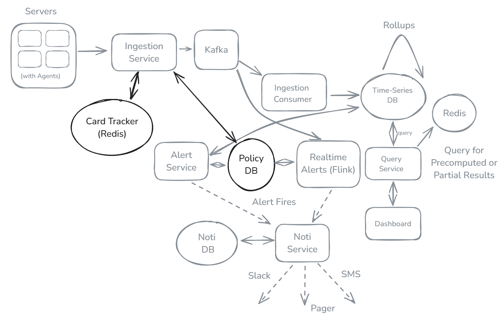

## Final Design

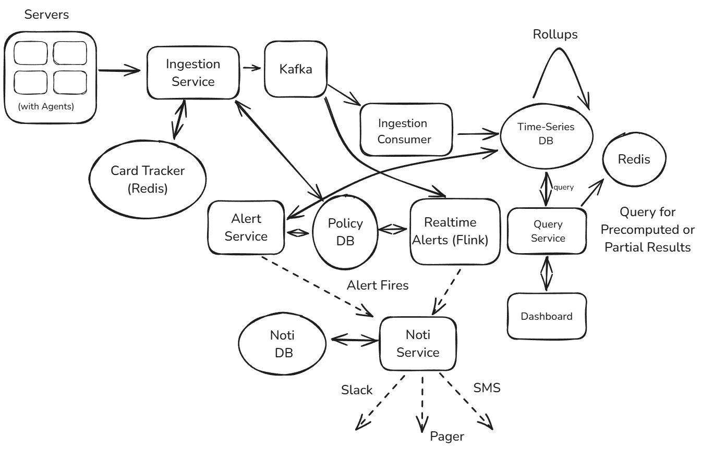
