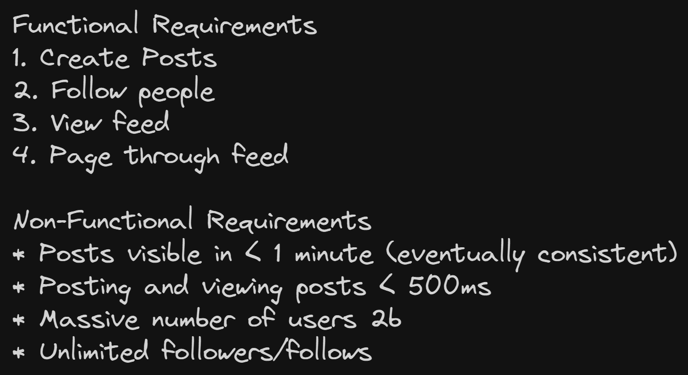
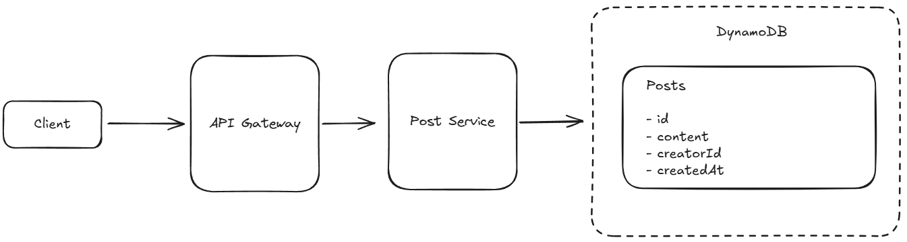
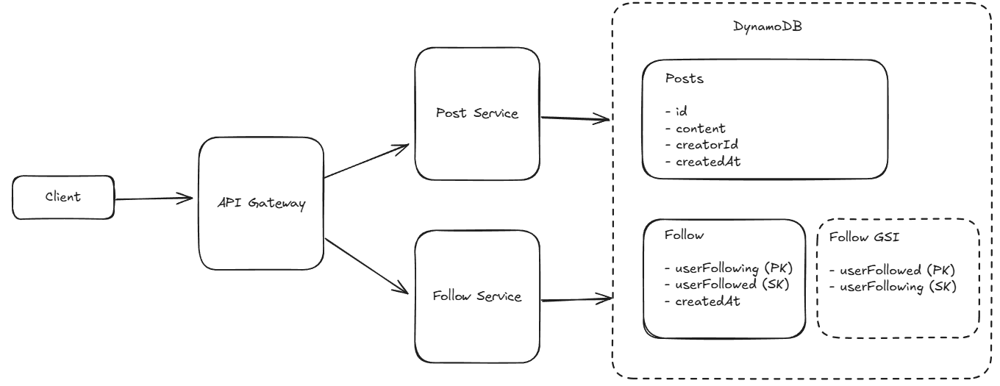
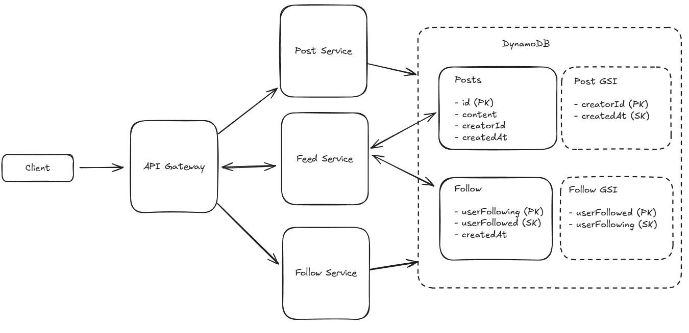
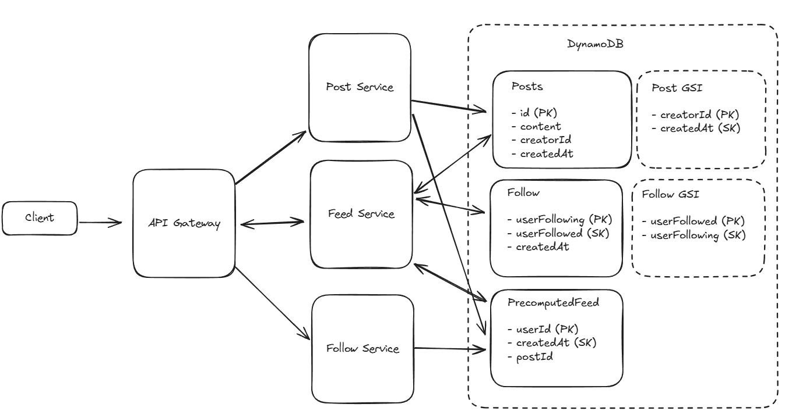
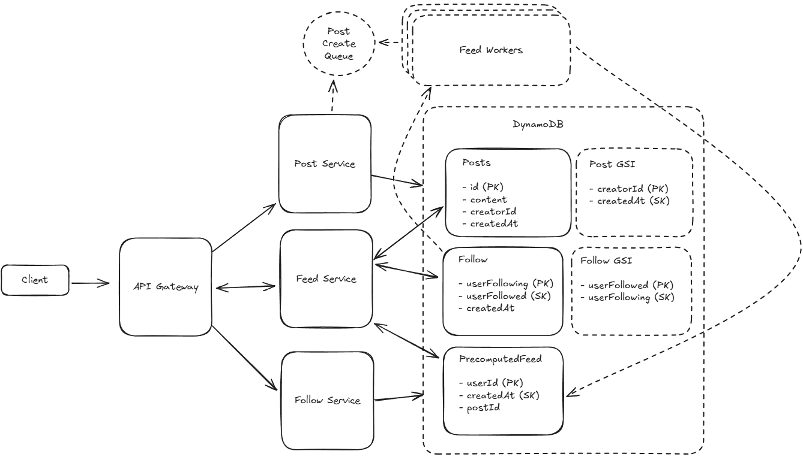
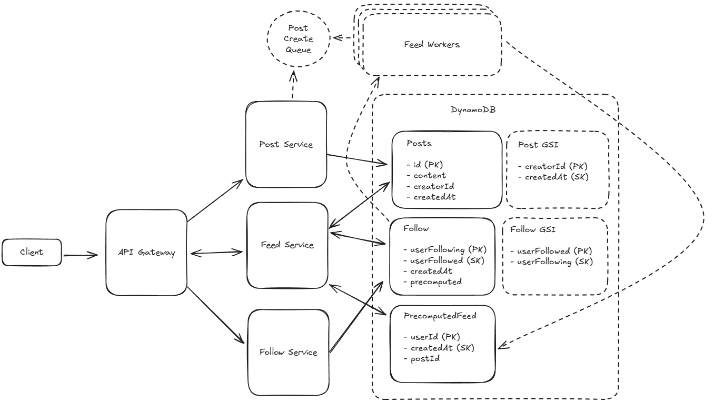
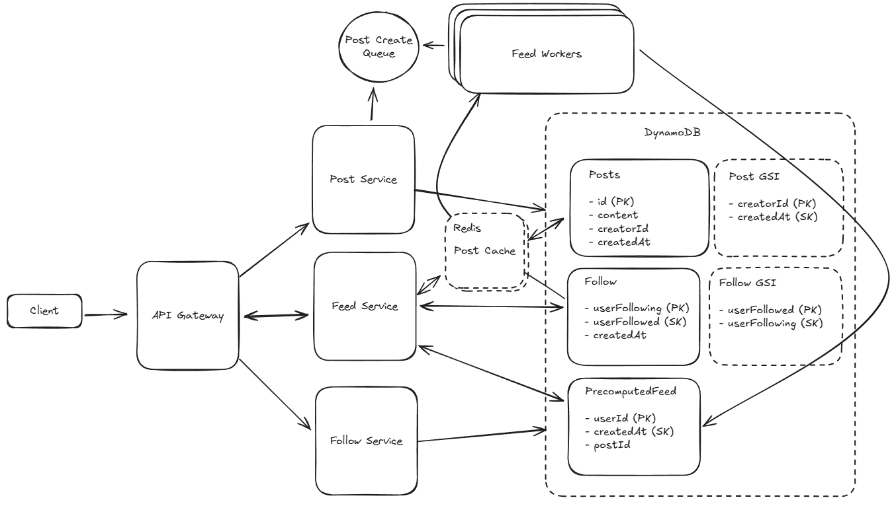
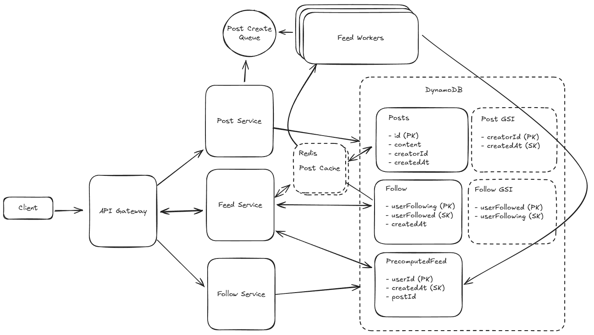

# Newsfeed

Facebook is a social network which pioneered the News Feed, a product which shows recent stories from users in your social graph.

## Requirements



## Core Entities

- User
- Follow
- Post

## API

```
POST /posts
{
    "content": { }
}
// -> 200 OK
{
    "postId": // ...
}

PUT /users/[id]/follow
{ }
// -> 200 OK

GET /feed?pageSize={size}&cursor={timestamp?}
{
    items: Post[],
    nextCursor: string
}
```

## HLD

### Users should be able to create posts



### Users should be able to friend/follow people



- GSI : Globally Secondary Index ~ Auto maintained by DynamoDB

### Users should be able to view a feed of posts from people they follow



### Users should be able to page through their feed

- Cursor based pagination over timestamp

## Deep Dive

### How do we handle users who are following a large number of users?

- Fanout on Write
- On post creation, service precompute the feed and store it in the database



### How do we handle users with a large number of followers?

BAD - Query the DB

GOOD - Async Workers to generate the feed

- Large overhead on workers
- 

GREAT - Async workers with Hybrid Feed

- For celebrity account dont update the precomputed feed, as will require massive write
- Use hybrid feed model, precomputed feed + celebrity posts
  

### How can we handle uneven reads of Posts?

GOOD - Post Cache with Large Keyspace

- Cause hotspot in cache

GREAT - Redundant Post Cache

- Sharded and Replicated Cache Instances
- LRU Eviction Policy
- 

## Final Design


