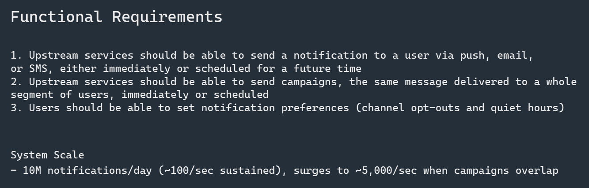
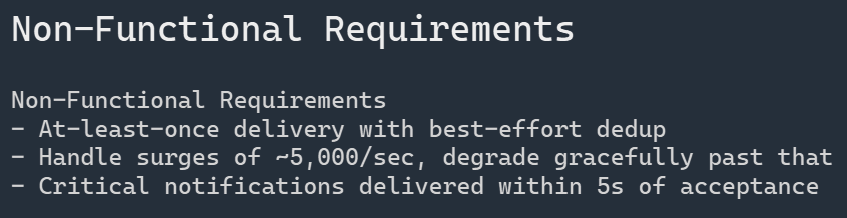
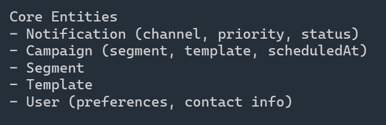
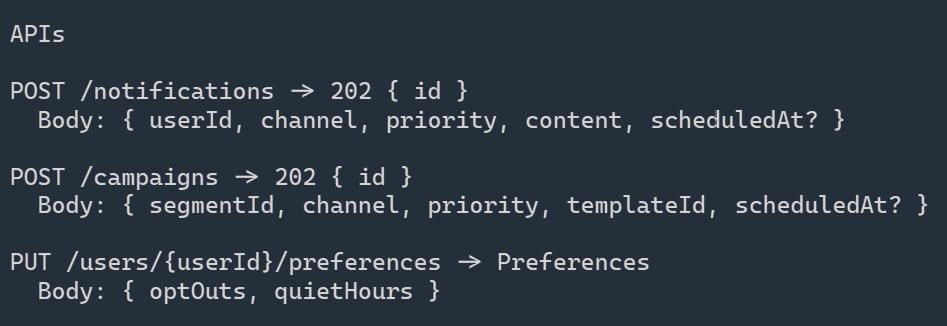
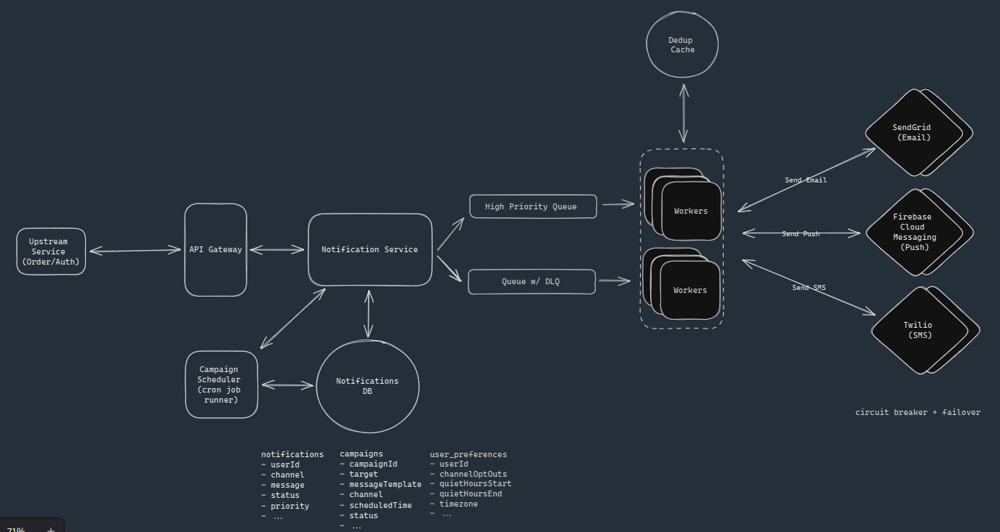

# Notification System

An internal notification platform that other engineering teams use to send messages to users across push, email, and SMS. The\nsame pipeline carries low-volume, latency-sensitive traffic like login codes alongside million-user marketing campaigns, and the design has to keep the\nbulk traffic from trampling the critical traffic.

## Requirements

## Core Entities

## API Routes

## HLD

- For bulk campaign, notification system should fan out message to individual notification message. This reuses the single notification system
- User details and preferences are fetched during sent time not store time of notification
- Suppressed status for user opt out notifications in DB, keep them separate
- Durable queue processing, so that only one worker can claim the work. Another can only pick if 1st did not ack
- Dedupe notification by marking each notification with a stable idempotent key derived deterministically
- Mark notification as sent only AFTER the provider ack success
- Isolate critical traffic flow at each level

