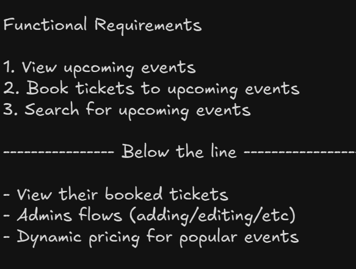
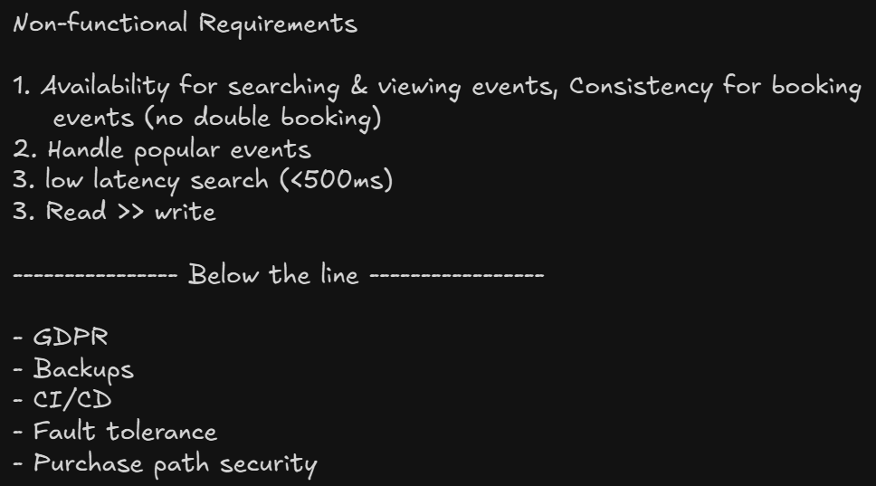
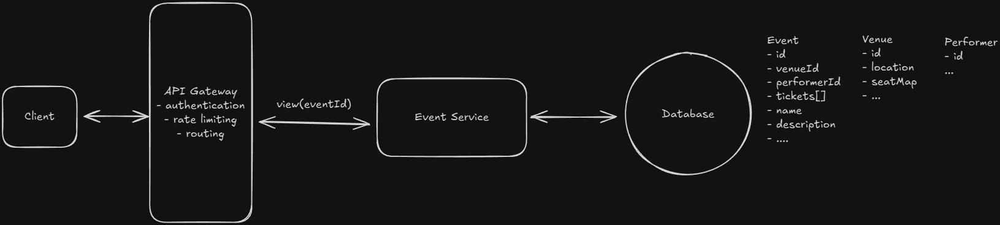
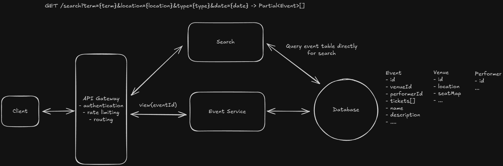
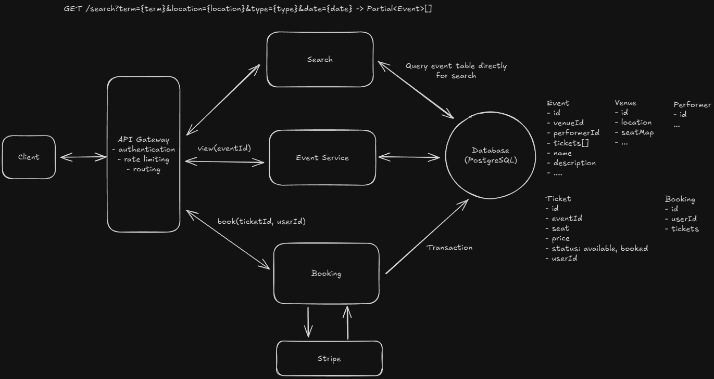
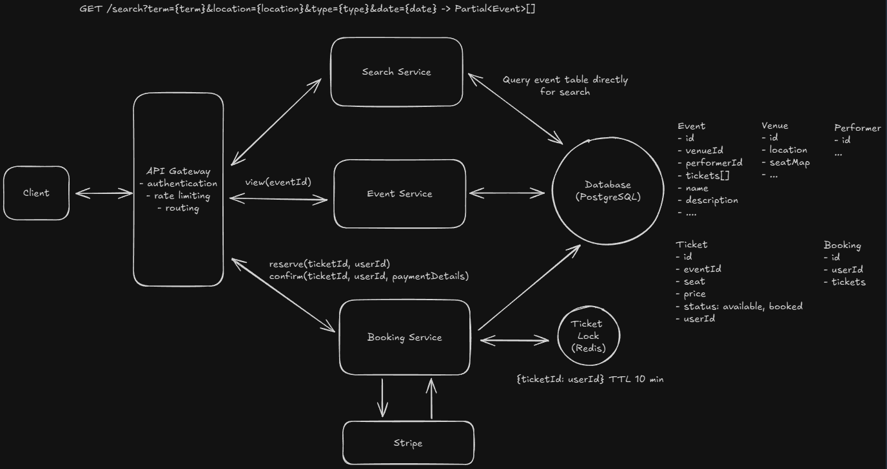
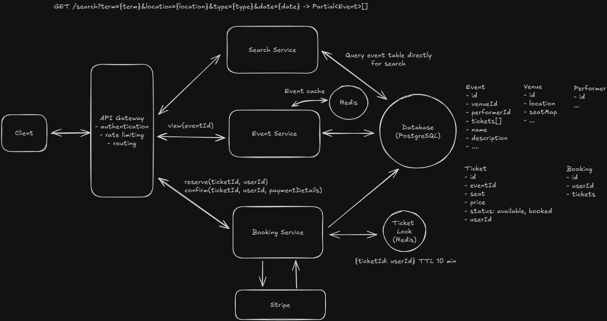
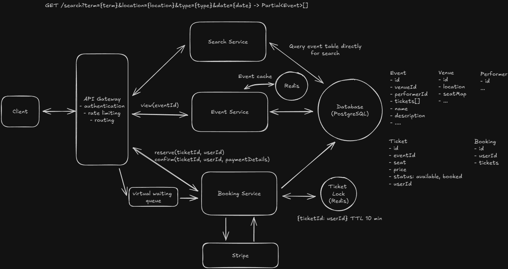
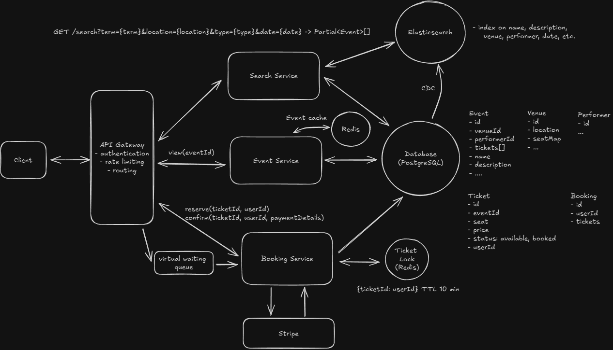
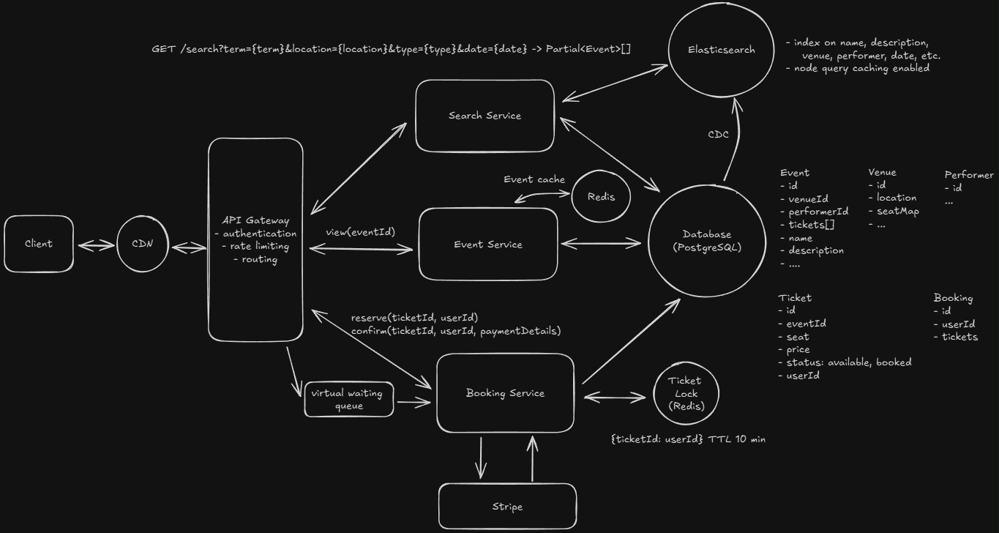

# Ticketmaster

Ticketmaster is an online platform that allows users to purchase tickets for concerts, sports events, theater, and other live entertainment.

## Requirements





## Core Entitities


## API

```
GET /events/:eventId -> Event & Venue & Performer & Ticket[]

- tickets are to render the seat map on the Client

GET /events/search?keyword={keyword}&start={start_date}&end={end_date}&pageSize={page_size}&page={page_number} -> Event[]

POST /bookings/:eventId -> bookingId
 {
   "ticketIds": string[],
   "paymentDetails": ...
 }
```

## HLD

### Users should be able to view events



### Users should be able to search for events



### Users should be able to book tickets to events



## Deep Dives

### How do we improve the booking experience by reserving tickets?

**Implicit Status with Status and Expiration Time**

- Write reservation time in DB
- Query next for available tickets or any tickets with reservation time more than 10 min

But this cause incorrect status in DB

**Distributed Locking using Redis and TTL**
Temporary storage for reserved tickets that automatically expires

- Lock lost on payment page, issue refund



### How is the view API going to scale to support 10s of millions of concurrent requests during popular events

**Caching, Load Balancing and Horizontal Scaling**



### How will the system ensure a good user experience during high-demand events with millions simultaneously booking tickets?

**Virtual Queue**

- Persisitent connection (SSE or Websockets) with Redis backed queue



### How can you improve search to ensure we meet our low latency requirements?

- Full Text Search Engine - Elastic Search



### How can you speed up frequently repeated search queries and reduce load on our search infrastructure?

- Query result caching and Edge Caching


