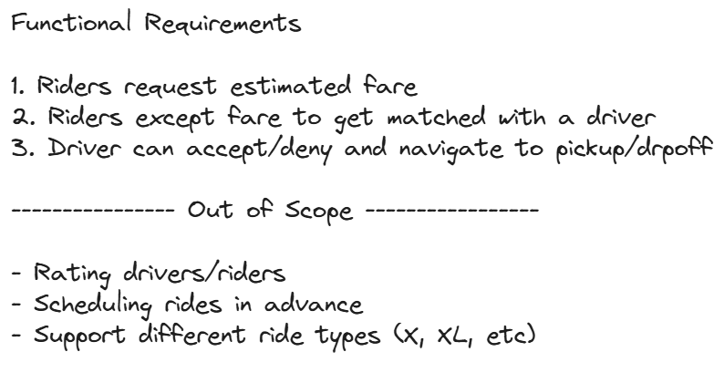
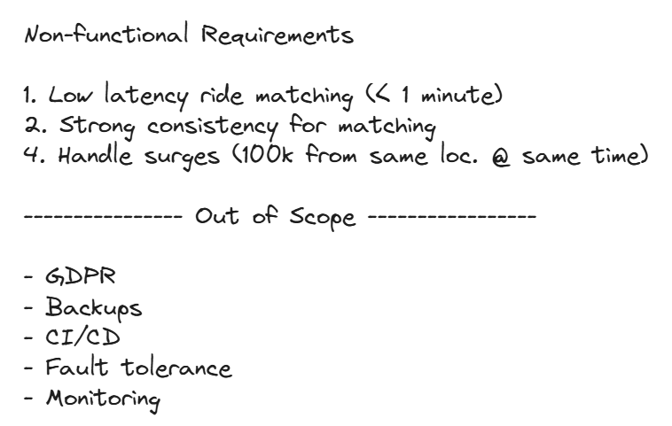
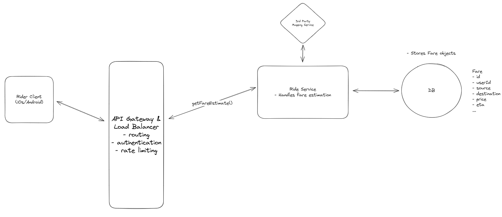
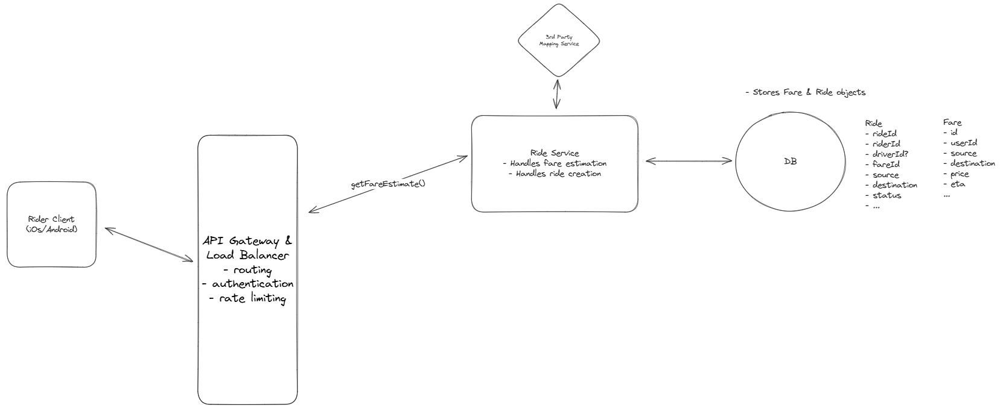
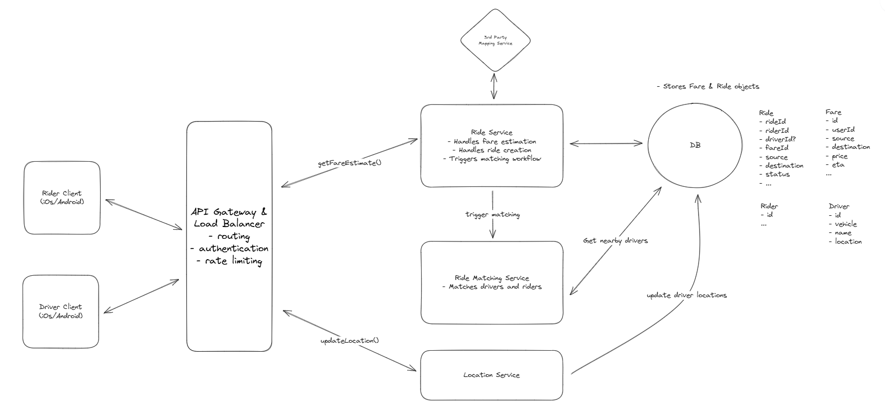
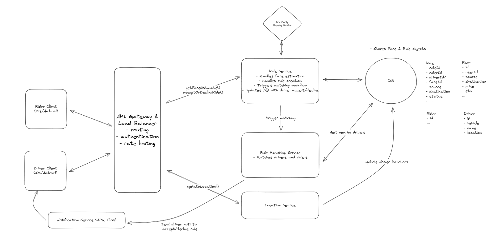
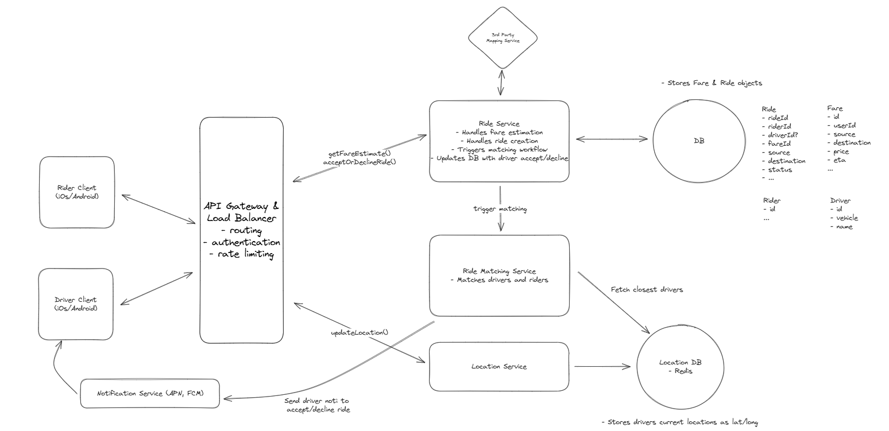
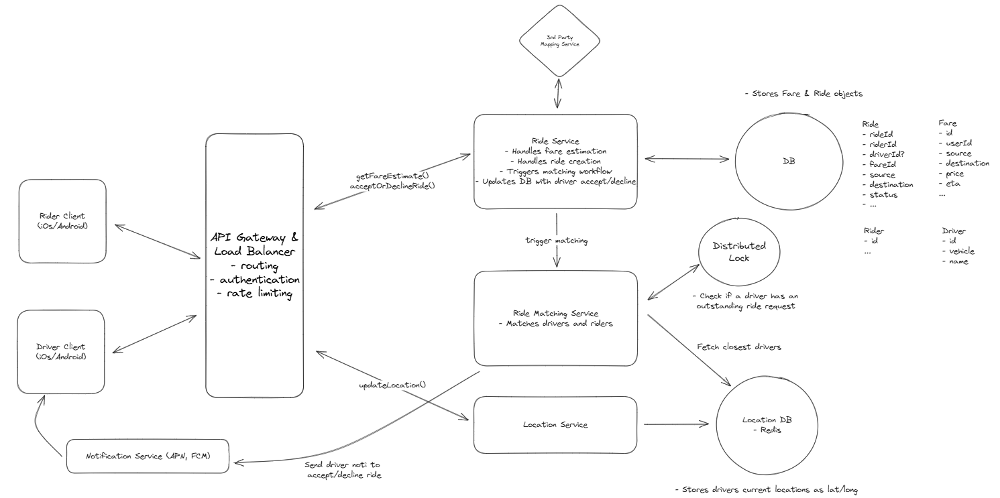
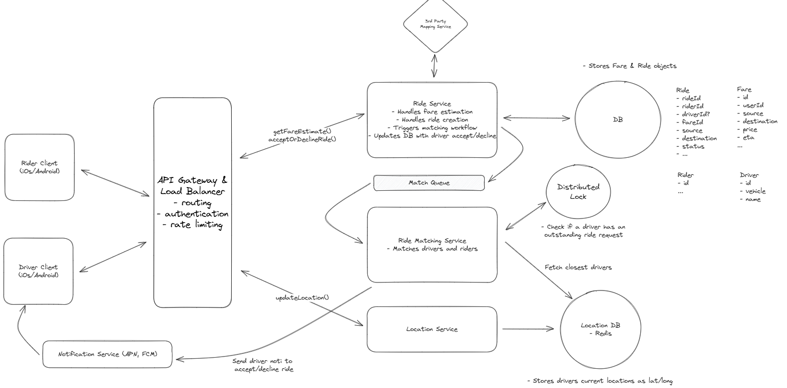
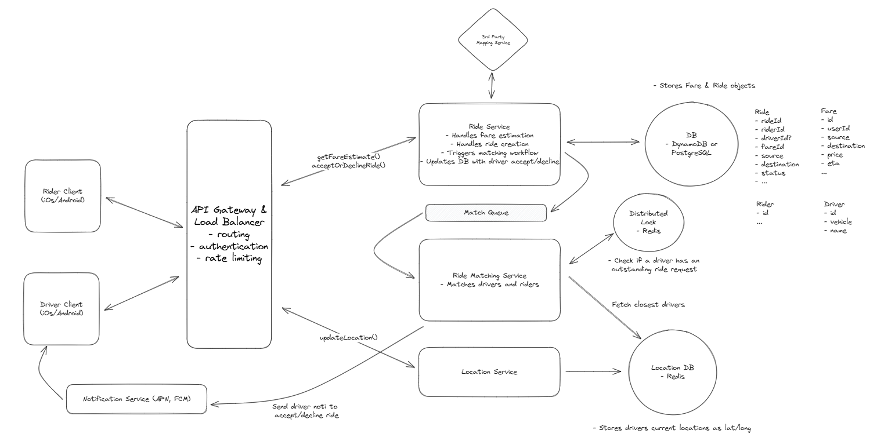

# Uber

Uber is a ride-sharing platform that connects passengers with drivers who offer transportation services in personal vehicles. It allows users to book rides on-demand from their smartphones, matching them with a nearby driver who will take them from their location to their desired destination.

## Requirements





## Core Entities

- Driver
- Rider
- Fare
- Ride
- Location

## API

```
POST /fare -> Fare
Body: {
  pickupLocation,
  destination
}

POST /rides -> Ride
Body: {
  fareId
}

POST /drivers/location -> Success/Error
Body: {
        lat, long
    }

- note the driverId is present in the session cookie or JWT and not in the body or path params

PATCH /rides/:rideId -> Ride
Body: {
  accept/deny
}
```

## HLD

### Riders should be able to input a start location and a destination and get an estimated fare



### Riders should be able to request a ride based on the estimated fare



### Upon request, riders should be matched with a driver who is nearby and available



### Drivers should be able to accept/decline a request and navigate to pickup/drop-off



## Deep Dives

### How do we handle frequent driver location updates and efficient proximity searches on location data?

BAD - DB Writes and Proximity Queries

- Inefficient

GOOD - Batch processing and Geospacial DBs

- PostgreSQL with Quad Trees
- But write heavy, can cause latency

GREAT - Real-Time In Memory Geospacial Data Store

- Redis with Geohashing
- High throughput: 100K to 1M
- CHALLENGE: Persistance issue, resolve by
  - Redis Persistance: Periodic save to disk
  - Redis Sentinel: Automatic failover, Replica
- 

### How can we manage system overload from frequent driver location updates while ensuring location accuracy?

Adaptive Location Update Interval

- Dynamically update the frequency of location update API

### How do we prevent multiple ride requests from being sent to the same driver simultaneously?

BAD - Application level locking

- Can cause lack of coordination, scalability issues, inconsistent locking

GOOD - DB Status Update with Timeout

- DB level transaction support
- In memory timeout can still cause issues of inconsistent state

GREAT - Distributed lock with TTL

- Redis
- 

### How can we ensure no ride requests are dropped during peak demand periods?

BAD - FIFO

GREAT - Queue with Dynamic Scaling


### What happens if a driver fails to respond in a timely manner?

GOOD - Delay Queue

- Retry request if current driver does not via delayed message after timeout
- Complex management and coordination required

GREAT - Durable Execution

- Managed solution like Temporal or AWS Step Function
- Built in support for retries, timeouts, state management

### How can you further scale the system to reduce latency and improve throughput?

BAD - Vertical Scaling

GREAT - Geosharding and Read Replica

- Replicate the system at different geo locations

## Final Design


