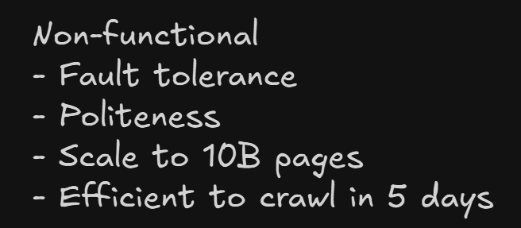
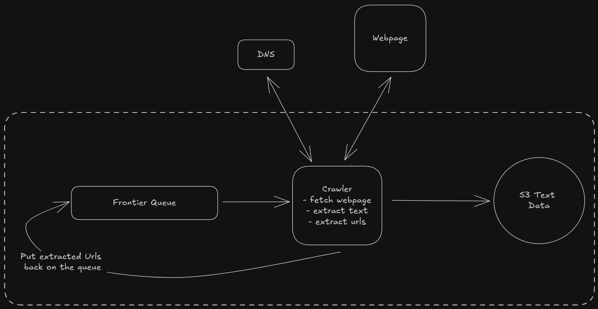
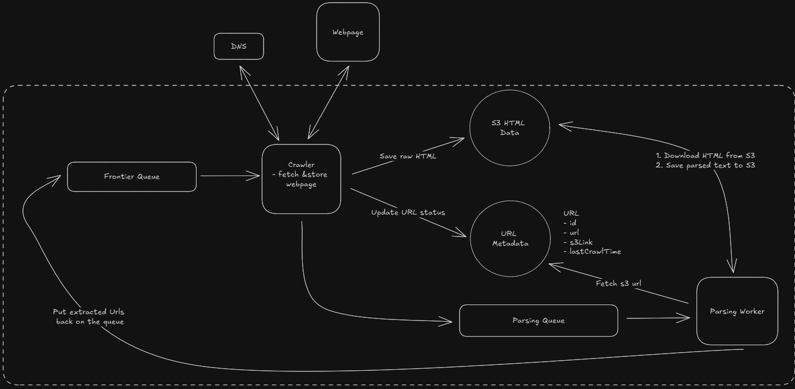
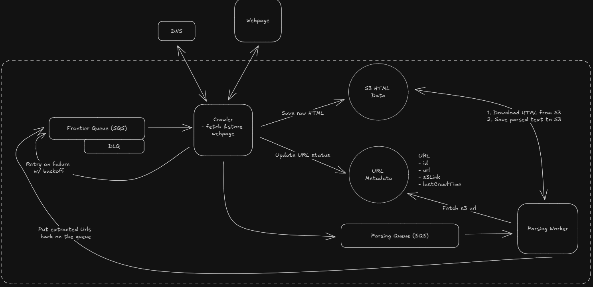
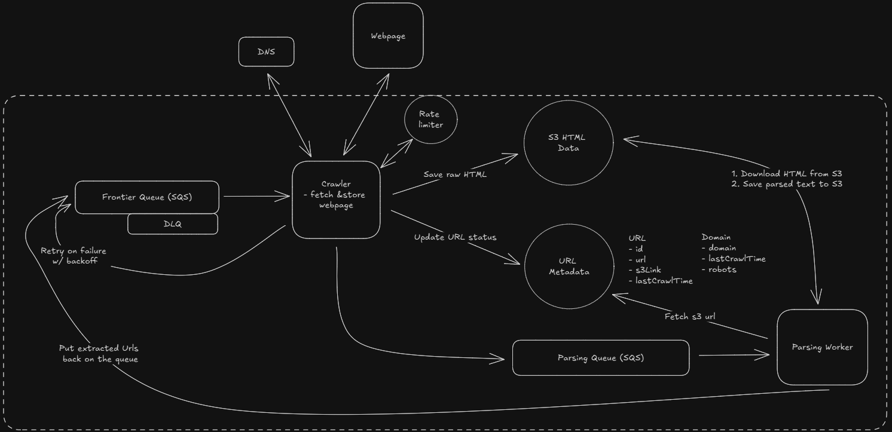
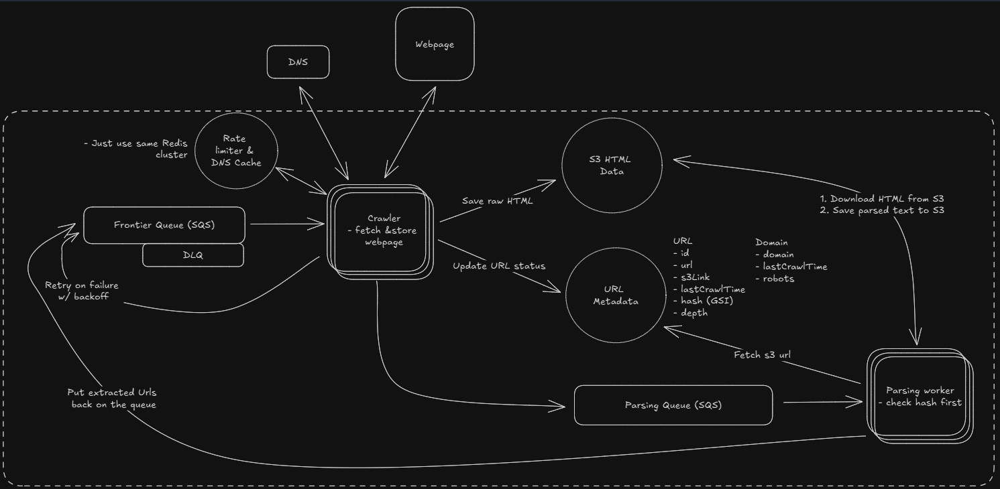

# Web Crawler

A web crawler is a program that automatically traverses the web by downloading web pages and following links from one page to another. It is used to index the web for search engines, collect data for research, or monitor websites for changes.

## Requirements




## Core Entities

## System Interface

Input: Seed URLs to start crawling from.
Output: Text data extracted from web pages.

## Data Flow

1. Take seed URL from frontier and request IP from DNS
1. Fetch HTML from external server using IP
1. Extract text data from the HTML.
1. Store the text data in a database.
1. Extract any linked URLs from the web pages and add them to the list of URLs to crawl.
1. Repeat steps 1-5 until all URLs have been crawled.

## HLD



## Deep Dives

### How can we ensure we are fault tolerant and don't lose progress?

- Separate stage for crawler and html extracter



### What if we fail to fetch URL

- Kafka with manual exponential backoff
  - Kafka does not support retry out of the box. Need manual implementation
  - Separate topic for retry, manually store the retry time
- SQS with inbuild support for exponential backoff - BETTER
  - Visibility Timeout update for exponential backoff
- Dead Letter Queues
  - Messages that fails after multiple retries goes to this queue for manual inspection

### What if crawler goes down

- Kafka
  - Messages are not removed, crawler track progress via offset
- SQS
  - Message remain in queue unless deleted.
  - Visibility timeout hides message from other crawlers



### How can we ensure politeness and adhere to robots.txt

- Robot.txt
  - Website has instructions for crawlers

  - ```
    User-agent: *
    Disallow: /private/
    Crawl-delay: 10
    ```

  - Store info in DB

- Ratelimiting via centralized store - Redis
  - Crawler check this store if rate limit has been reached
  - Can have sync issues with multiple crawlers
  - Solution is to add Jitter in each crawler's request



### How to scale to 10B pages and efficiently crawl them in under 5 days

Crawler - Calculations shows we need 8 crawlers

```
200 Gbps / 8 bits/byte / 2MB/page ≈ 12,500 pages/second
12,500 pages/second * 30% = 3,750 pages/second due to Throughput
10,000,000,000 pages / 3,750 pages/second ≈ 2,666,667 seconds ≈ 30.9 days for a single machine
30.9 days / 8 machines ≈ 3.9 days
```

Parser - Autoscale based on queue size
DNS - Cache for DNS response, Use multiple DNS services in Round Robin

Efficiency

- Url not already crawled
  - Store url in DB and check if already crawled
- Content not crawled
  - Hash the content and store in DB - Indexed
  - Bloom Filters - Probabilistic data store that can tell if data is not part of a set
    - Cons - Gives false positives

Crawler Traps

- Add max depth threshold per domain

### More Deep Dives

- Handle dynamic web pages
  - Need headless browsers to render and then extract
- Monitor health of system
  - Monitoring service like New Relic, Datadog
- Handle large file
  - Skip
- Continual Updates
  - Url Scheduler that can re-push the old crawled urls to queue
- Priority Crawling
  - Use differnt queues with different priority

## Final Design


