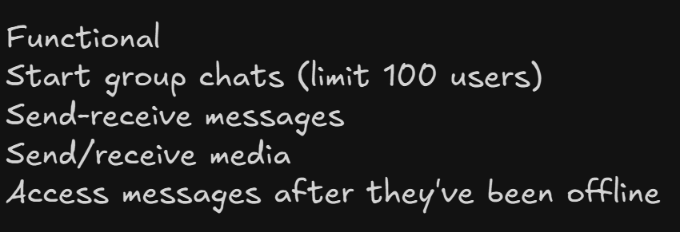
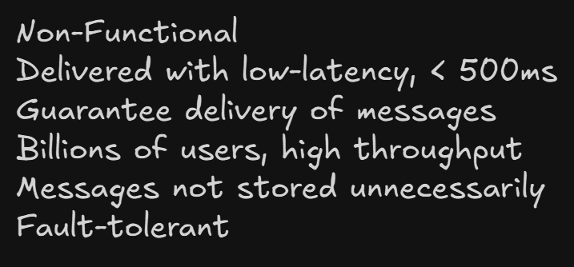
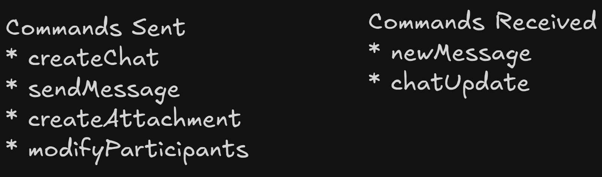
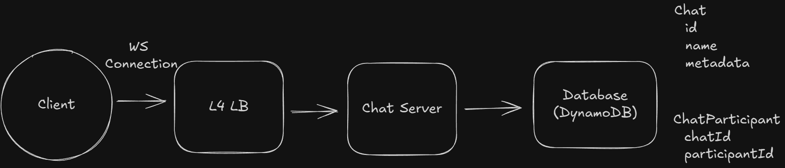
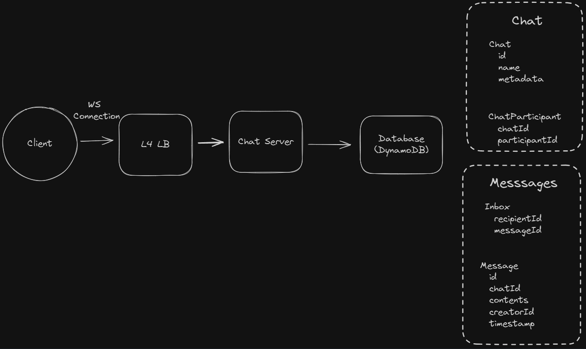
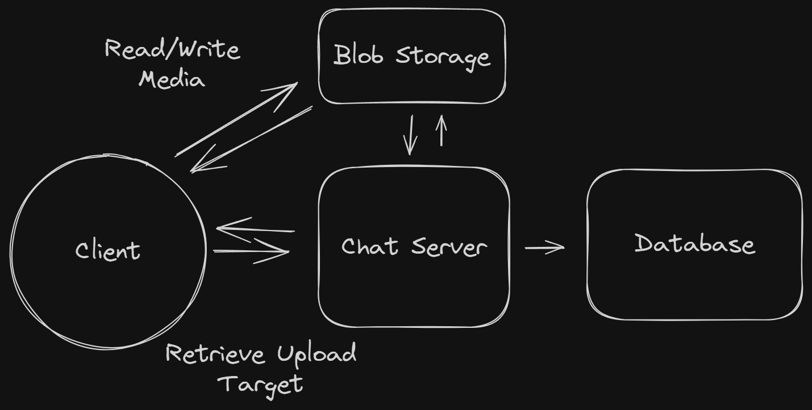
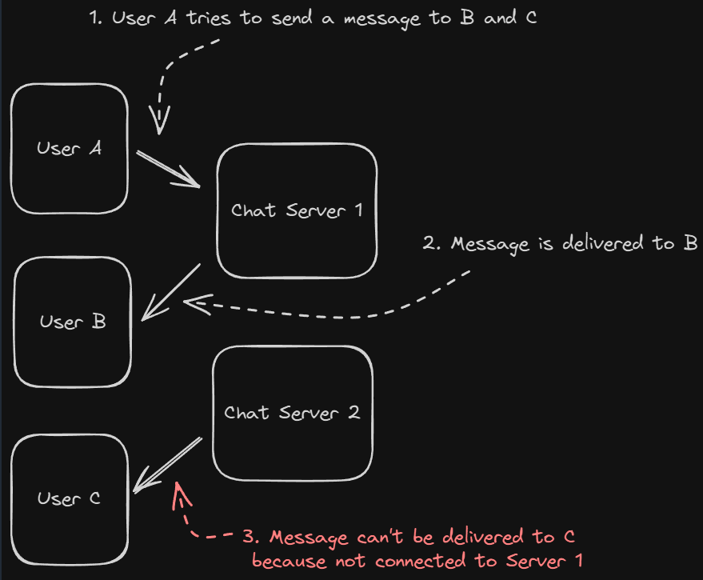
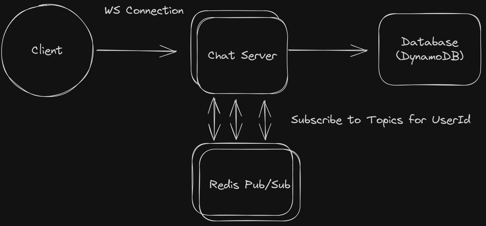
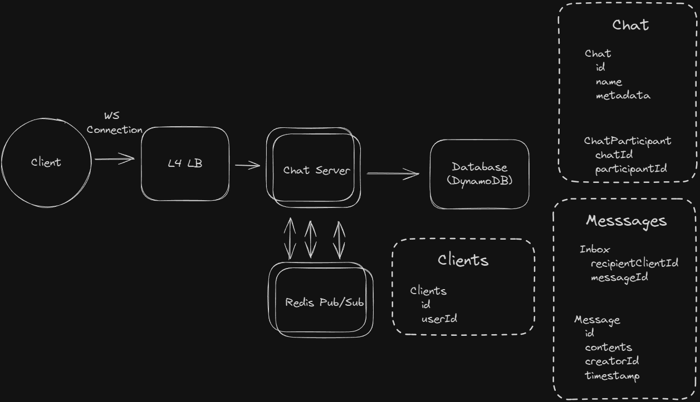

# Whatsapp

## Requirements

## Core Entities

Users
Chats (2-100 users)
Messages
Clients (a user might have multiple devices)

## API

## HLD

### Users should be able to start group chats with multiple participants (limit 100)

## Users should be able to send/receive messages

Websocket connection used to send and receive messages

### Users should be able to receive messages sent while they are not online (up to 30 days)

Separate inbox db used to track undelivered messages

### Users should be able to send/receive media in their messages

Manage storage separately

## Deep Dives

### How can we handle billions of simultaneous users?

Issue

Pub/Sub Model

- Redis Pub/Sub - Subscription to particular user id
- Lightweight and highly scalable
- Partitioned
  - By user - Each user has more 1:1 chats with other users
  - By chat - If group chats
    

### What do we do to handle multiple clients for a given user?

### What happens if the WebSocket connection fails?

- ACK Timeouts with server side retry
- Application level hearbeat - Server periodically checks if client online, otherwise closes websocket connection
- On close, client can reconnect

### What happens if Redis fails to deliver a message?

Heartbeats with sequence numbers:

1. Global sequence per user
2. Include seq in hearbeat
3. Client detects gaps and request sync

### How do we handle out-of-order messages?

Not handled directly.
Server stamps the message when it receives. Clients can update the display of the message accordingly
Minor order defects acceptable

### How can we handle a "last seen" functionality?

Instead of writing to DB on hearbeat, we should utilize active connection
Stores last disconnect time for user in DB
