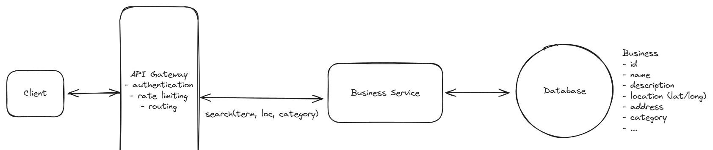
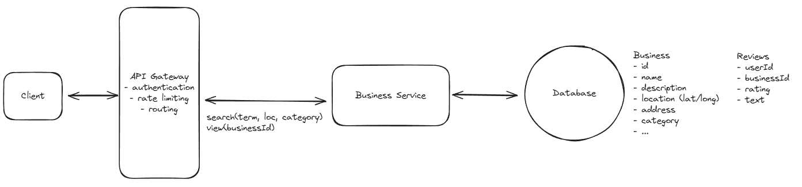
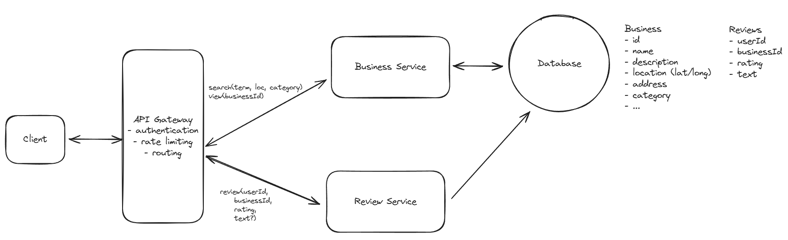
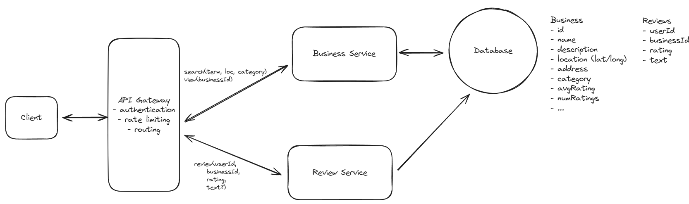
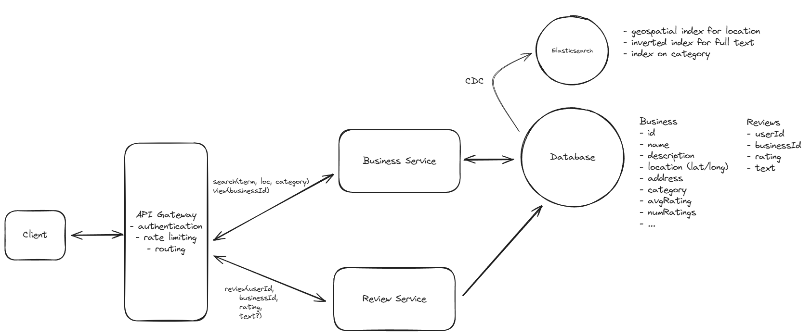
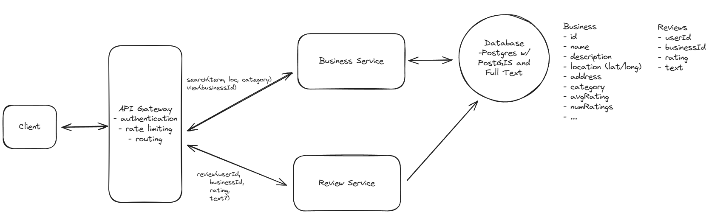
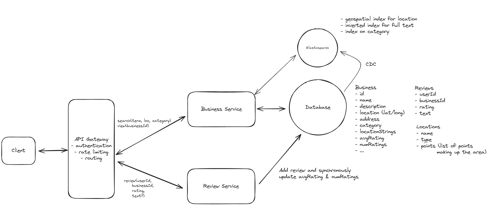

# Yelp

Yelp is an online platform that allows users to search for and review local businesses, restaurants, and services.

## Requirements


## Core Entities

```
- Users
- Business
- Reviews
```

Constraint

- One User, One review per business

## API

```
// Search for businesses
GET /businesses?query&location&category&page -> Business[]

// View business details and reviews
GET /businesses/:businessId -> Business & Review[]

// View business details
GET /businesses/:businessId -> Business

// View reviews for a business
GET /businesses/:businessId/reviews?page= -> Review[]

// Leave a review
POST /businesses/:businessId/reviews
{
  rating: number,
  text?: string
}
```

## HLD

### Users should be able to search for businesses



### Users should be able to view businesses



### Users should be able to leave reviews on businesses



## Deep Dives

### How would you efficiently calculate and update the average rating for businesses to ensure it's readily available in search results

BAD - Aggregate on fly

- Slow

GOOD - Periodic update with cron job

- Not realtime

GREAT - Sync update with optimistic locking

- Update average rating in db while review update
- Optimistic locking for concurrency
- 

> Message queue not required as write throughput is not that much per business

### How would you modify your system to ensure that a user can only leave one review per business?

BAD - Check in application

- Not robust to changes

GREAT - DB Constraint

```
ALTER TABLE reviews
ADD CONSTRAINT unique_user_business UNIQUE (user_id, business_id);
```

> Whenever we have a data constraint we want to enforce that constraint as close the persistence layer as possible. This way we can ensure our business logic is always consistent and avoid having to do extra work in the application layer.

### How can you improve search to handle complex queries more efficiently?

```
// This query sucks. Very very slow.
SELECT *
FROM businesses
WHERE latitude > 10 AND latitude < 20
AND longitude > 10 AND longitude < 20
AND name LIKE '%coffee%';
```

BAD - DB indexing with lat long

- Inefficient as 2D data

GREAT - Elastic Search

- Inverted Index for text
- B-Tree Index for Category
- Geospacial Index for Lat Long
- BUT - Requires sync with DB -> CDC
- 

GREAT - Postgres with Extensions

- Added support for Geospacial Index (PostGIS)
- Full Text Search Support (pg_trgm)
- Scale is not that much here, so elastic search may be overkill.
- 

> Quadtree or R-Tree Index for square data. Then calculate circular distance and filter

### How would you modify your system to allow searching by predefined location names such as cities or neighborhoods?

- Polygon location data - Publicaly available
- DB Table to store location data
- Elastic Search and Postgres both supports search based on polygon data
- Update business data on write, what location it belongs to

### Scaling

- Horizontal scale services
- DB and Search not needed as not that much data
- Cache for reads

## Final Design


