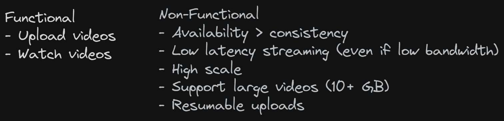
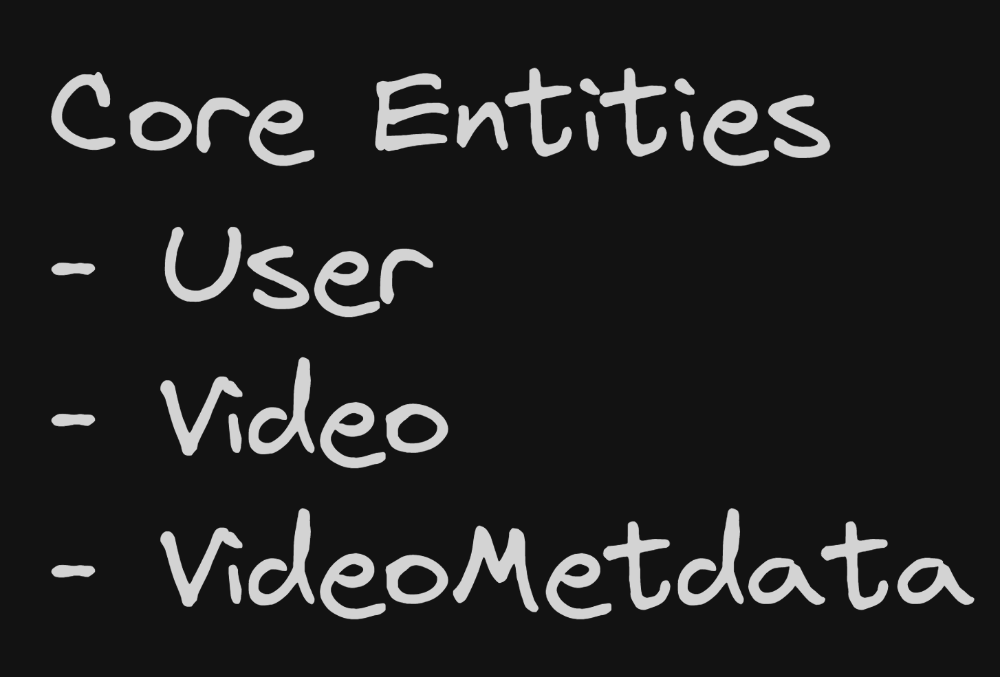
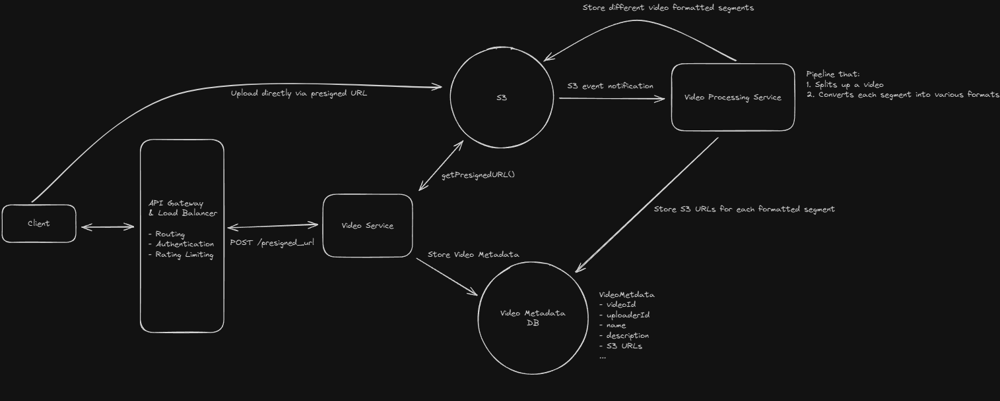
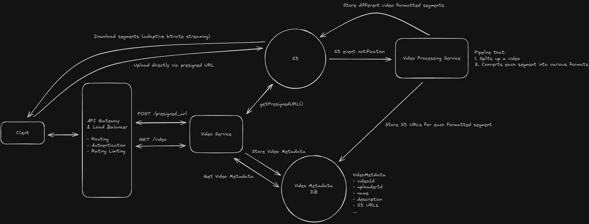
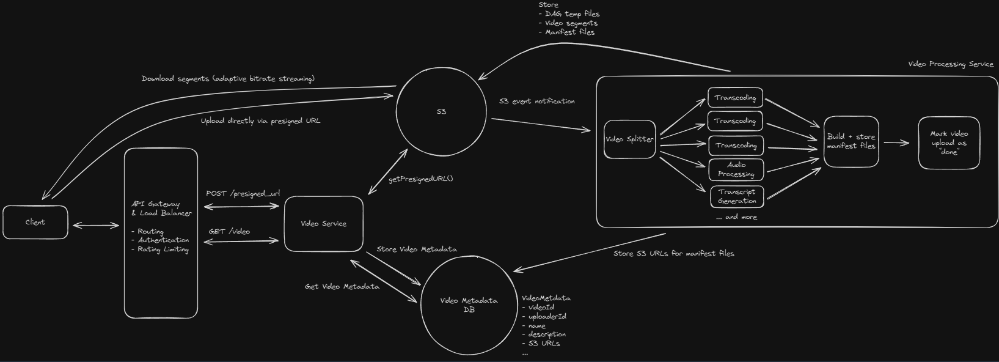
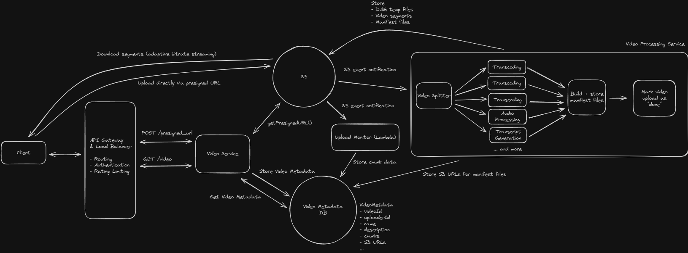
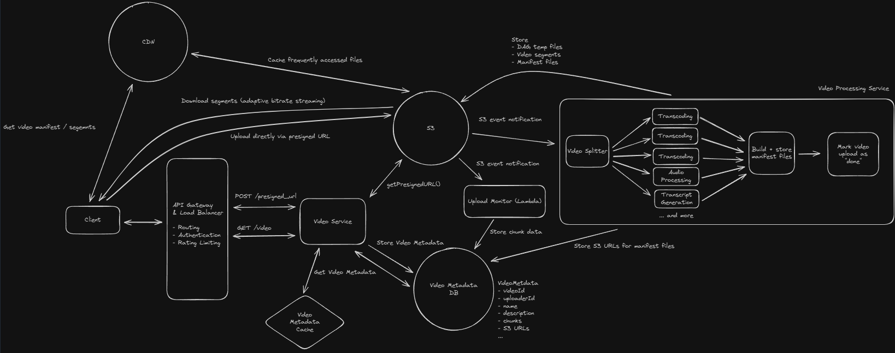

# Youtube

YouTube is a video-sharing platform that allows users to upload, view, and interact with video content. As of this writing, it is the second most visited website in the world

## Requirements



## Core Entities



## API

```
POST /upload
Request:
{
  Video,
  VideoMetadata
}

GET /videos/{videoId} -> Video & VideoMetadata
```

## HLD

- Video Codec: Compresses or decompresses video. Example H.264, H.265
- Video Container: File format that stores video data
- Bitrate: Number of bits transferred per second. Depends on size and quality of videp
- Manifest File: Contains details about video streams

### Users can upload videos

- Post process video after upload
  

### Users can watch videos

- Adaptive bitrate streaming



## Deep Dives

### How can we handle processing a video to support adaptive bitrate streaming?



### How do we support resumable uploads?

- Chunking
- Multipart Upload



### How do we scale to a large number of videos uploaded / watched a day?

- Video Service - Horizontal scaling
- Video Metadata - Replication, Consistent Hashing, Partitioned
- Video Processing Service - Autoscaling, Queueing
- S3 - Elastic scaling, Replication, CDN

### Aditional Features

- Fast Uploads
  - Parallel upload and processing
- Resume streaming
  - Store data per user per video
- View Count
  - DB, Redis

## Final Design


