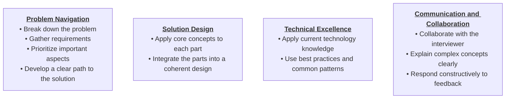
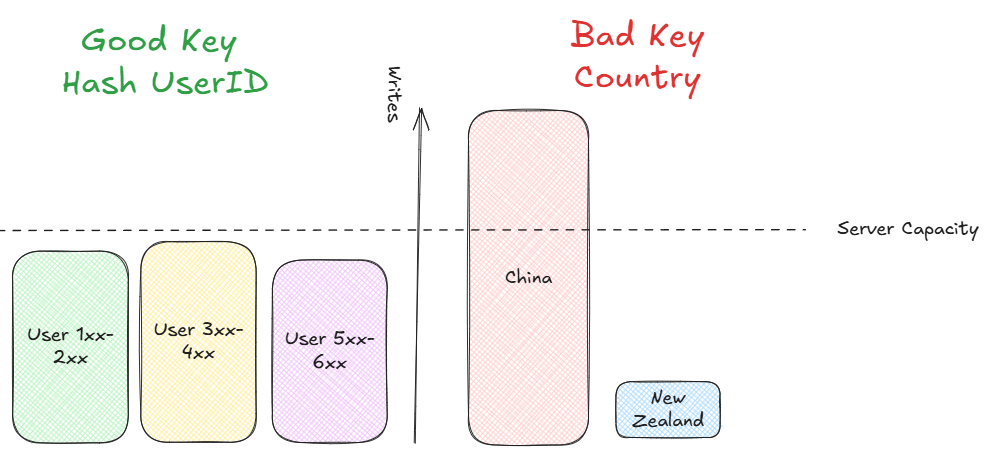

# System Design

Design complex systems that are scalable, reliable, and maintainable and solves a real world problem

- No Single Right Answer


**Types of System Design Interviews**

- _Product Design_ - Uber, Whatsapp, Instagram, Twitter, Netflix
- _Infrastructure Design_ - Load Balancer, Caching, Sharding, Data Modeling, Message Queues

## Assessment Criteria



---

## Delivery Framework


### 1. Requirements (5 Mins)

Get clear understanding of the system

#### Functional Requirements

Core features of the system.

> "Client should be able to..."

- Ask targetted questions as if talking to client / product
  - "Does the system need to do X?"
  - "what would happen if Y?"
- Prioritize the top features for the design

```
TWITTER
- Users should be able to post tweets
- Users should be able to follow other users
- Users should be able to see tweets from users they follow
```

#### Non Functional Requirements

System Qualities

> "System should be able to..." "System should be..."

- Add important non functional requirements
- Quantify non functional requirements when possible

**Identify Non Functional Requirements**

1. _CAP Theorem:_ Prioritize C or A. P is default in distributed system
2. _Environmental Constraints:_ Environment on which system will work or be consumed
3. _Scalability:_ Unique scaling requirements. Read/Write, Bursty Traffic, etc
4. _Latency:_ Quick response requirements
5. _Durability:_ Data loss protection requirements
6. _Security:_ Auth, Data Protection
7. _Fault Tolerance:_ Handling system failures
8. _Compliance:_ Legal and regulatory compliant system

```
TWITTER
- The system should be highly available, prioritizing availability over consistency
- The system should be able to scale to support 100M+ DAU (Daily Active Users)
- The system should be low latency, rendering feeds in under 200ms
```

#### Capacity Estimation

Back of the envelop calculation for the system

- Do this later during design phase

---

### 2. Core Entities (2 Mins)

Identify and list the small list of core entities that defines the data objects that will be exchanged in the system, based on functional requirements.

- Name the entities with good names
- Can be updated later

> Nouns and Resources in the system.
> Actors in the system

```
TWITTER
- User
- Tweet
- Follow
```

---

### 3. API / System Interface Design (5 Mins)

Contract between system and users.

- Just define HTTP Method, Path, Body, Response for each APIs
- Sensitive information like userId, should be part of auth headers

> Resources are mapped to core entities

**API Protocol to use**

- _REST (Default Choice)_ - HTTP verbs for CRUD
- _GraphQL_ - Clients define the data required. Use when diverse clients with different data needs
- _RPC_ - S2S communication. Use for internal API with high performance requirements.
- _Web Sockets / Server Sent Events_ - Real time features

```
TWITTER
POST /v1/tweets
body: {
  "text": string
}

GET /v1/tweets/{tweetId} -> Tweet

POST /v1/follows
body: {
  "followee_id": string
}

GET /v1/feed -> Tweet[]
```

---

### 4. Data Flow (5 Mins) [Optional]

List of actions that system will perform to process input and give output.

- Only required for systems with some data processing (long sequence of actions)

```
WEB CRAWLER
- Fetch seed URLs
- Parse HTML
- Extract URLs
- Store data
- Repeat
```

---

### 5. High Level Design (10-15 Mins)

Represent different component of the system and their interactions

> Ask which software will be used for this beforehand

- Start simple and focus on functional requirements
- Satisfy the APIs requirements one by one
- Talk through the thought process, and data flow in the system
- Document relevant DB entities and their fields (important ones)


### 6. Deep Dives (10 Mins)

Make the HLD efficient and satisfy non functional requirements

- Address edge cases
- Identify and Address issues and bottlenecks
- Improve the design based on interviewer's feedback
- Proactively identify and solve issues.
- Give chance for interviewer to probe

---

## Important Problems


---

## Notes

- Low latency is around 100 ms
- Scalability numbers should be attached with the context
- Read and write service can be separated if the scalability requirements is different
- Always explain why you are choosing anything, why it is better, why it will not cause any issues
  - Like for nodes replication - Say why horizontal scaling is better here, stateless behavior
- DB Hops should be minimized as much as possible
- Dont state vague statements which requires more explainations

--

## Common System Design Patterns

- A system can combine multiple aspect of these patterns for different use cases

### Pushing realtime updates

- Choose protocol to push updates to clients
  - HTTP Polling (Default)
  - Websockets
  - SSE
- Server side updates
  - Pub/Sub
  - Stateful servers


### Managing Long Running Tasks

- Background processing
- Meesage queue for job coordination
- Workers pools for


### Dealing with Contention

- Prevent race condition and ensure data consistency
  - Concurrency control
  - Atomic Transaction and Locking
  - Distributed Locks, 2PC, Queue based serialization


### Scaling Reads

- Within DB optimizations
  - Indexing, denormalization
- Scale horizontally
- Caching

> Considerations: Managing cache, replication lag, hot keys


### Scaling Writes

- Sharding
- Vertical partitioning
- Queues and load shedding
- Batching
- Intelligent load management



### Handling Large Blob

- Direct client to storage transfer

> Considerations: Data sync with DB, Upload failures, lifecycle management


### Multi-Step Process

- Workflows coordination
- Server orchestration, workflow engines
- Event driven systems
- State Management, Retry Logic, Failure recovery


### Proximity Based Services

- Geospacial Indexes
