# System Design

Design complex systems that are scalable, reliable, and maintainable and solves a real world problem

- No Single Right Answer

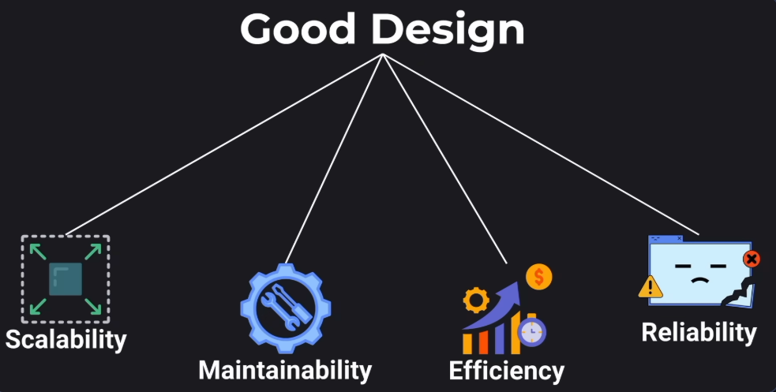

**Types of System Design Interviews**

- _Product Design_ - Uber, Whatsapp, Instagram, Twitter, Netflix
- _Infrastructure Design_ - Load Balancer, Caching, Sharding, Data Modeling, Message Queues

## Assessment Criteria

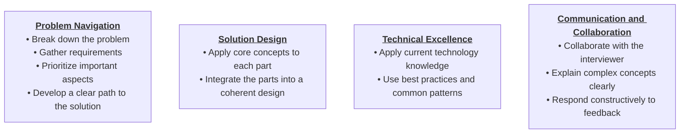
```mermaid
flowchart LR
    B["<b><u>Problem Navigation</u></b><br/>• Break down the problem<br/>• Gather requirements<br/>• Prioritize important aspects<br/>• Develop a clear path to the solution"]
    C["<b><u>Solution Design</u></b><br/>• Apply core concepts to each part<br/>• Integrate the parts into a coherent design"]
    D["<b><u>Technical Excellence</u></b><br/>• Apply current technology knowledge<br/>• Use best practices and common patterns"]
    E["<b><u>Communication and Collaboration</u></b><br/>• Collaborate with the interviewer<br/>• Explain complex concepts clearly<br/>• Respond constructively to feedback"]

    B ~~~ C ~~~ D ~~~ E
```

---

## Delivery Framework

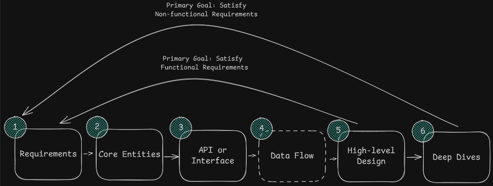

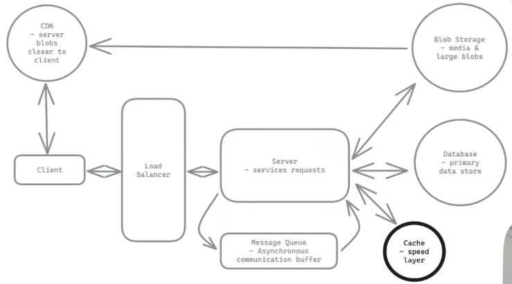

### 1. Requirements (5 Mins)

Get clear understanding of the system

#### Functional Requirements

Core features of the system.

> "Client should be able to..."

- Ask targetted questions as if talking to client / product
  - "Does the system need to do X?"
  - "what would happen if Y?"
- Prioritize the top features for the design

```
TWITTER
- Users should be able to post tweets
- Users should be able to follow other users
- Users should be able to see tweets from users they follow
```

#### Non Functional Requirements

System Qualities

> "System should be able to..." "System should be..."

- Add important non functional requirements
- Quantify non functional requirements when possible

**Identify Non Functional Requirements**

1. _CAP Theorem:_ Prioritize C or A. P is default in distributed system
2. _Environmental Constraints:_ Environment on which system will work or be consumed
3. _Scalability:_ Unique scaling requirements. Read/Write, Bursty Traffic, etc
4. _Latency:_ Quick response requirements
5. _Durability:_ Data loss protection requirements
6. _Security:_ Auth, Data Protection
7. _Fault Tolerance:_ Handling system failures
8. _Compliance:_ Legal and regulatory compliant system

```
TWITTER
- The system should be highly available, prioritizing availability over consistency
- The system should be able to scale to support 100M+ DAU (Daily Active Users)
- The system should be low latency, rendering feeds in under 200ms
```

> Acronym to remember
> "SCALE For Cloud DesignS"

```
S- Scalability
C - Consistency (CAP Theorem)
A - Availability
L - Latency
E - Environment Constraints
F - Fault Tolerance
C - Compliance
D - Durability
S - Security
```

#### Capacity Estimation

Back of the envelop calculation for the system

- Do this later during design phase

---

### 2. Core Entities (2 Mins)

Identify and list the small list of core entities that defines the data objects that will be exchanged in the system, based on functional requirements.

- Name the entities with good names
- Can be updated later

> Nouns and Resources in the system.
> Actors in the system

```
TWITTER
- User
- Tweet
- Follow
```

---

### 3. API / System Interface Design (5 Mins)

Contract between system and users.

- Just define HTTP Method, Path, Body, Response for each APIs
- Sensitive information like userId, should be part of auth headers

> Resources are mapped to core entities

**API Protocol to use**

- _REST (Default Choice)_ - HTTP verbs for CRUD
- _GraphQL_ - Clients define the data required. Use when diverse clients with different data needs
- _RPC_ - S2S communication. Use for internal API with high performance requirements.
- _Web Sockets / Server Sent Events_ - Real time features

```
TWITTER
POST /v1/tweets
body: {
  "text": string
}

GET /v1/tweets/{tweetId} -> Tweet

POST /v1/follows
body: {
  "followee_id": string
}

GET /v1/feed -> Tweet[]
```

---

### 4. Data Flow (5 Mins) [Optional]

List of actions that system will perform to process input and give output.

- Only required for systems with some data processing (long sequence of actions)

```
WEB CRAWLER
- Fetch seed URLs
- Parse HTML
- Extract URLs
- Store data
- Repeat
```

---

### 5. High Level Design (10-15 Mins)

Represent different component of the system and their interactions

> Ask which software will be used for this beforehand

- Start simple and focus on functional requirements
- Satisfy the APIs requirements one by one
- Talk through the thought process, and data flow in the system
- Document relevant DB entities and their fields (important ones)

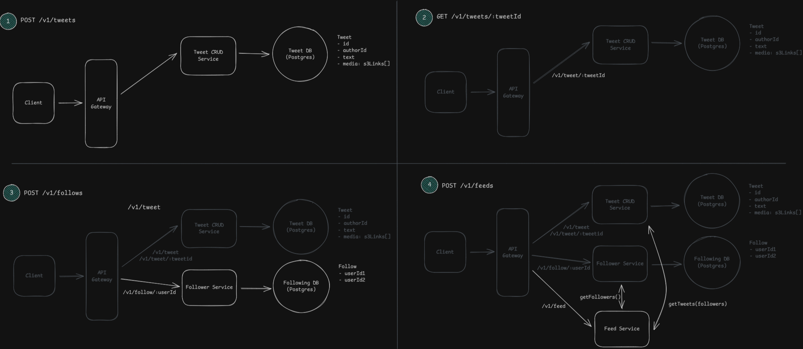

NOTES:

- Add API Gateway to route between different microservices
- Single db for multiple microservices - Simplicity, fault tolerance via replications
- Separate out microservice when there is different read write pattern - Needs separate scaling

### 6. Deep Dives (10 Mins)

Make the HLD efficient and satisfy non functional requirements

- Address edge cases
- Identify and Address issues and bottlenecks
- Improve the design based on interviewer's feedback
- Proactively identify and solve issues.
- Give chance for interviewer to probe

---

## Important Problems

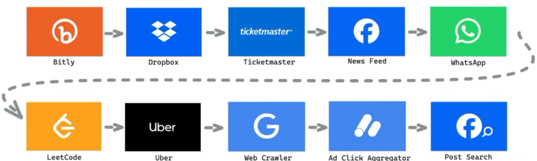

## Delivery Framework for Infrastructure Problems

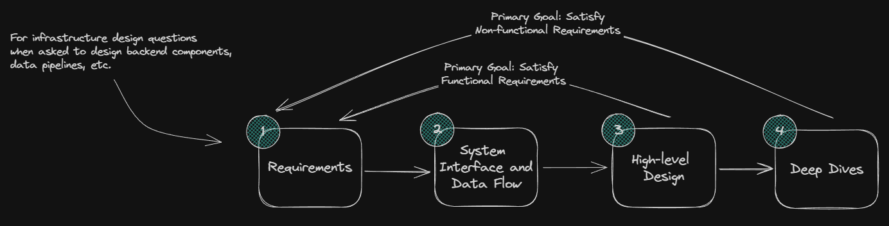

### System Interface

- Identify core entities
- Define the input and output of the system

### Data flow

- Steps data will go through to convert input to output

## Notes

- Low latency is around 100 ms
- Scalability numbers should be attached with the context
- Read and write service can be separated if the scalability requirements is different
- Always explain why you are choosing anything, why it is better, why it will not cause any issues
  - Like for nodes replication - Say why horizontal scaling is better here, stateless behavior
- DB Hops should be minimized as much as possible
- Dont state vague statements which requires more explainations

---

## Common System Design Patterns

- A system can combine multiple aspect of these patterns for different use cases

### Pushing realtime updates

- Choose protocol to push updates to clients
  - HTTP Polling (Default)
  - Websockets
  - SSE
- Server side updates - Pushing updates to correct server
  - Pub/Sub
  - Stateful servers

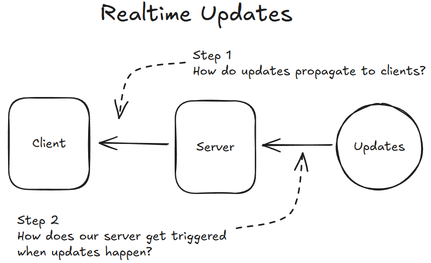

**HTTP Poling**

- Works for few second latency
- Simple to implement, default choice
- Overhead of TCP connection

**Long Poling**

- Poling with long timeouts
- Server response waits till it has some updates to push
- Not suitable for frequent updates

**SSE - Server Sent Events**

- Server can send data anytime, Events
- Browser supports auto reconnection
- Existing HTTP infra and connection

**Web Sockets**

- TCP - Full Duplex
- Stateful connection
- Layer 4 LB Suitable

**WebRTC**

- Peer to Peer connection
- Requires lot of setup
- Video Calling, Multiplayer games

IN PRACTICE - UPDATES TO CLIENT
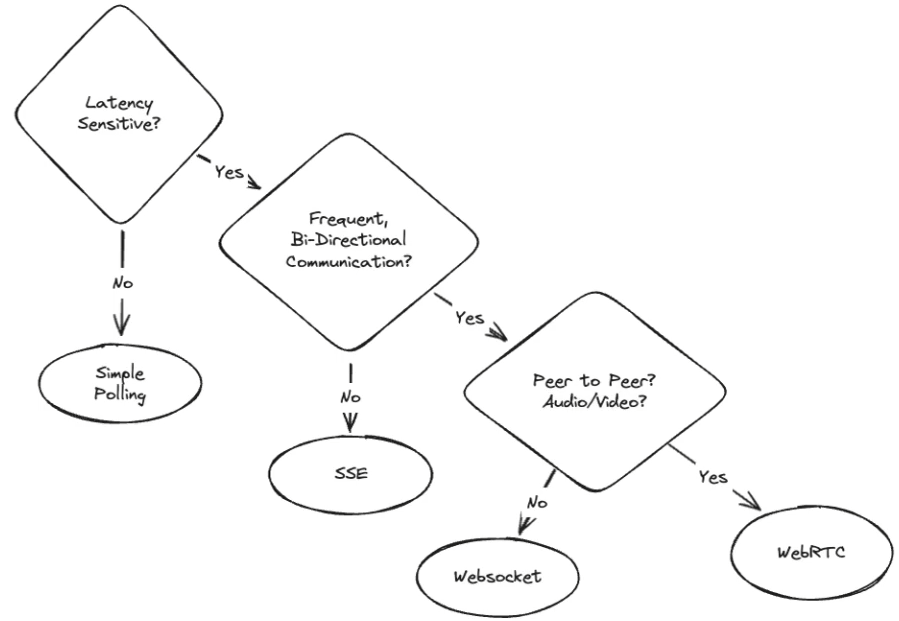

**Server Side Poling**

- Latency High
- DB Needed to save updates
- Not a usual solution
  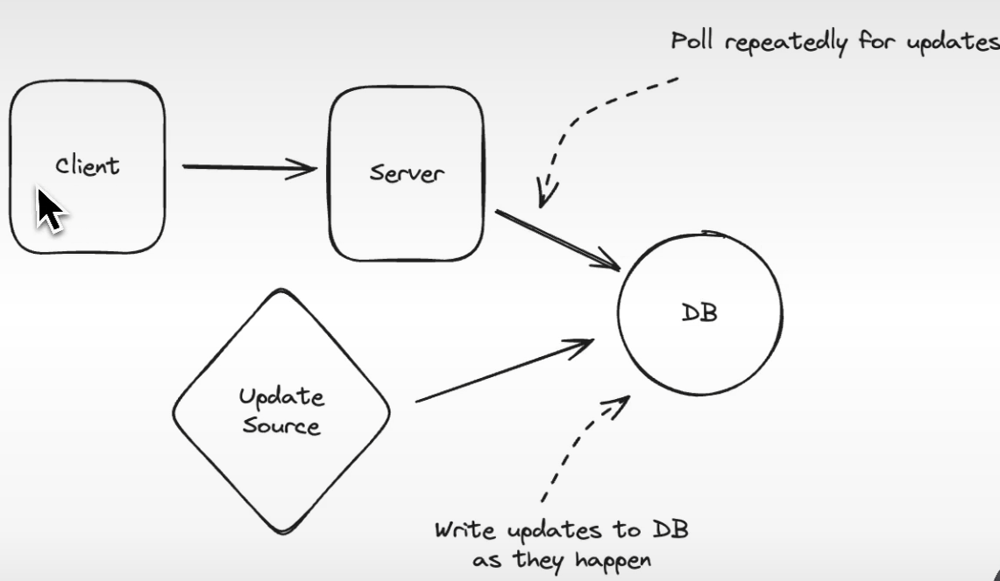

**Consistent Hashing**

- Each server assigned a set of users
- Zookeeper keep track of what users connected to what servers
- Overhead of scaling

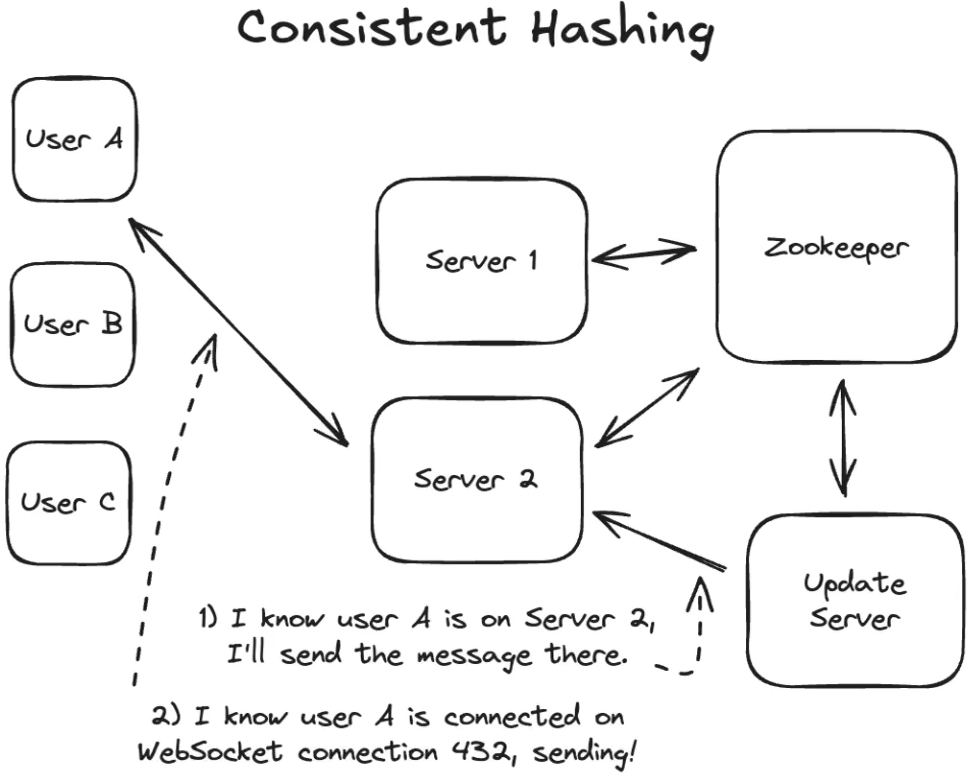

**Pub/Sub**

- Clients can connect to any server, That server subscribe for that users updates
- Redis - Simple, No Durability
- Kafka - Complex, Durable, Replay capability

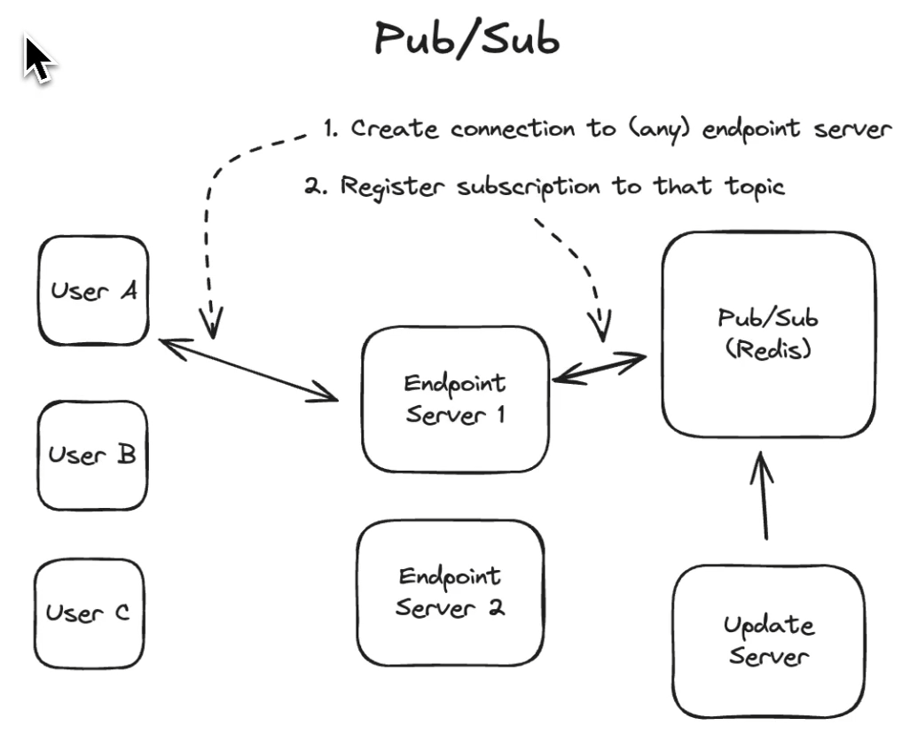

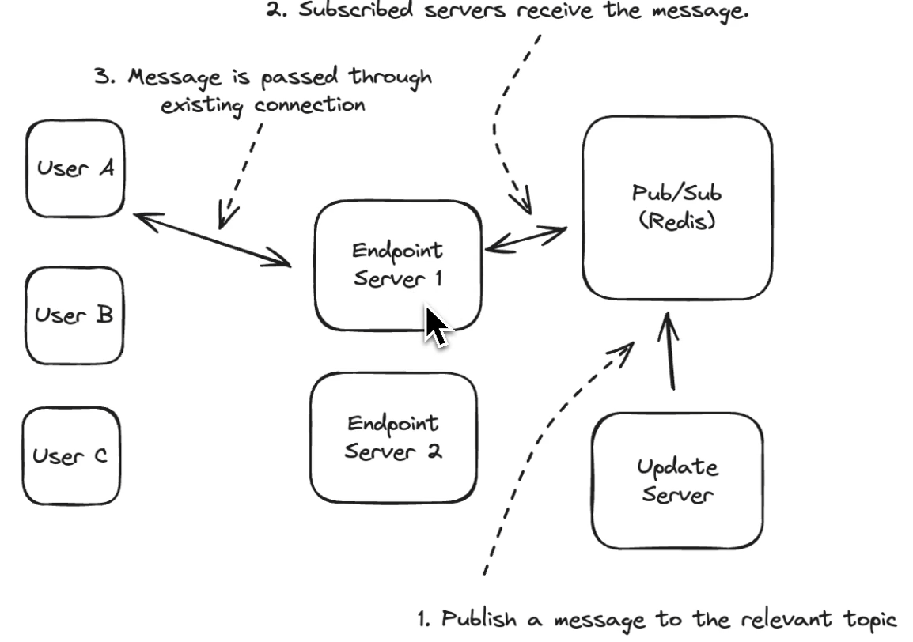

IN PRACTICE - UPDATES TO SERVER
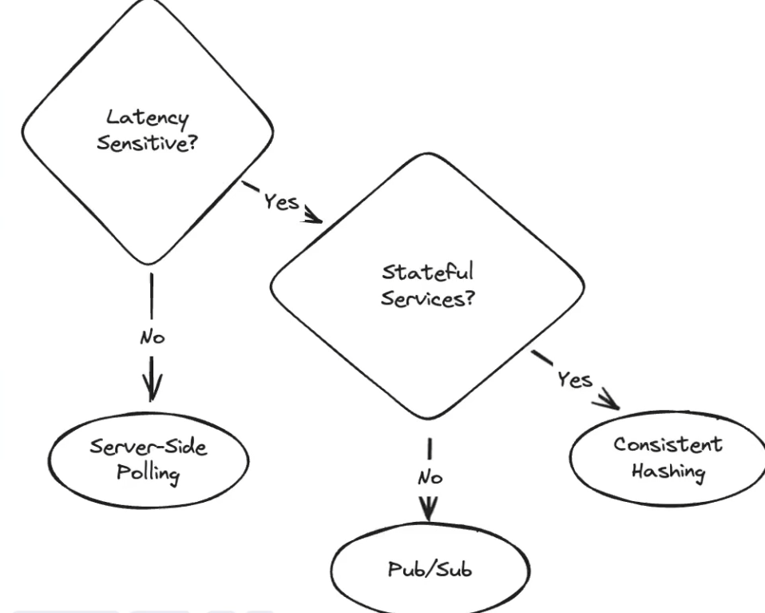

- Live Dashboard
  - Polling
  - SSE + Pub/Sub
- Chat Application
  - Depends
- Collab Editors
  - Websockets + Consistent Hashing

Client → Server / Server → Client Communication

| Technique                    | Pros                                                                                                                                        | Cons                                                                                                                                       | When to Use                                                                                            |
| ---------------------------- | ------------------------------------------------------------------------------------------------------------------------------------------- | ------------------------------------------------------------------------------------------------------------------------------------------ | ------------------------------------------------------------------------------------------------------ |
| **Simple Polling**           | Very simple; stateless; no special infrastructure; works with standard HTTP; easy to explain                                                | Higher latency; limited update frequency; bandwidth/resource waste; many clients create significant overhead                               | When **real-time latency isn't critical** and updates can be delayed by a few seconds                  |
| **Long Polling**             | Near-real-time; standard HTTP; easy to implement; no special infrastructure; stateless server                                               | Higher latency than persistent connections; more HTTP overhead; resource-intensive with many clients; concurrent connection limits         | When you need **near-real-time updates** but want to keep infrastructure simple                        |
| **SSE (Server-Sent Events)** | Built into modern browsers; automatic reconnection; HTTP-based; efficient for frequent **server → client** updates; simpler than WebSockets | One-way communication; browser/connection limits; some infrastructure may not support streaming; long-lived requests complicate monitoring | When updates are **server → client only**, e.g. dashboards, notifications, AI text streaming           |
| **WebSockets**               | Full-duplex communication; low overhead; efficient for frequent messages; wide browser support                                              | More complex; requires persistent/stateful connections; scaling/load balancing is harder; reconnection handling required                   | When you need **frequent, low-latency, bidirectional** communication, e.g. chat, collaborative apps    |
| **WebRTC**                   | Peer-to-peer; very low latency; reduces server bandwidth/load; native audio/video support                                                   | Most complex; requires signaling; NAT/firewall traversal; connection setup delay                                                           | **Video/audio calls, gaming, peer-to-peer communication**, or cases where clients communicate directly |

Server-Side Update Propagation

| Technique              | Pros                                                                                                                                                       | Cons                                                                                                                         | When to Use                                                                                     |
| ---------------------- | ---------------------------------------------------------------------------------------------------------------------------------------------------------- | ---------------------------------------------------------------------------------------------------------------------------- | ----------------------------------------------------------------------------------------------- |
| **Pull / Polling**     | Very simple; state constrained to DB; no special infrastructure; easy to implement                                                                         | High latency; unnecessary DB load when updates are infrequent; doesn't provide truly real-time updates                       | Simple systems where **slight delay is acceptable**                                             |
| **Simple Hashing**     | Predictable user → server assignment; relatively simple; enables routing messages to the correct server                                                    | Changing server count can remap many users; scaling becomes disruptive; requires coordination service                        | When you have **persistent connections** and a relatively stable number of servers              |
| **Consistent Hashing** | Minimal connection movement when scaling; predictable assignment; works well with stateful connections; easy to add/remove servers                         | More complex; requires coordination/service for routing information; connection state can be lost if a server fails          | **WebSocket/SSE systems with persistent connections** that need to scale dynamically            |
| **Pub/Sub**            | Efficient broadcasting to many clients; minimizes state in endpoint servers; easy endpoint-server load balancing; decouples update source from connections | Pub/Sub can become bottleneck/SPOF; extra network hop/latency; many-to-many connections between Pub/Sub and endpoint servers | When **many clients need the same updates** and you want scalable, loosely coupled architecture |

**How do you handle connection failures and reconnection**

- Heartbeat to check if connection still active
- Sequence number for messages to track last received
- Per User Message Queue

**What happens when a single user has millions of followers who all need the same update?**

- Batching and Heirarchichal Distribution
  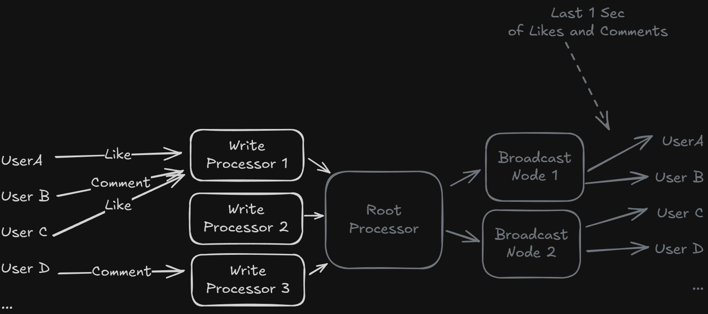

**How do you maintain message ordering across distributed servers**

- Vector clocks and Logical Timestamp helps
- Funnel all message through single system first to be stamped for order

---

### Managing Long Running Tasks

- Background processing
- Meesage queue for job coordination
- Workers pools for

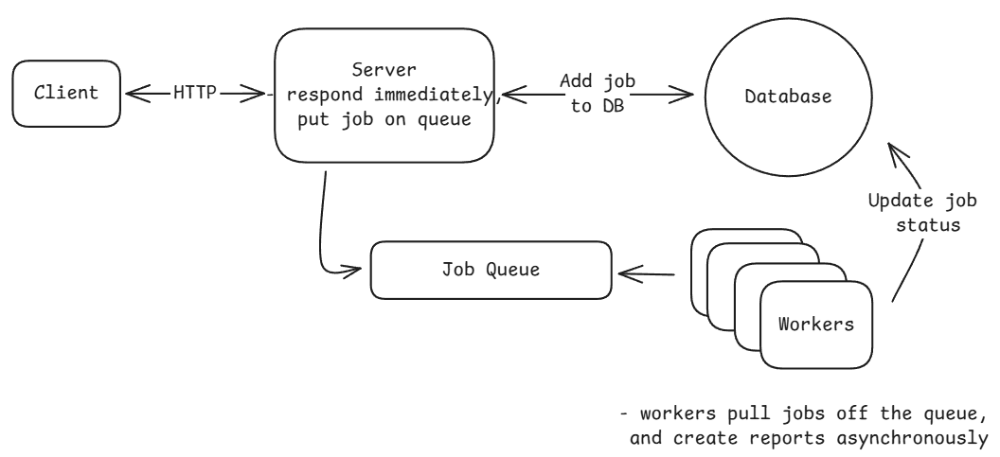

- Split long running task into 2 parts: Return Job Id to user, Add work to queue for async processing
  - Decouple request acceptance with request processing

ADVANTAGES

- Quick user response, better experience
- Independent scaling
- Queue maintain durable jobs
- Fault Isolation
- Better resource utilization

TRADE-OFFS

- System complexity
- Eventual consistency
- Infra for job status tracking
- Monitoring overhead

#### How to implement

**Message Queue**

- Kafka (Default) - Append only log, High throughput, Ordering within partition, Replay message, Fan out
- Redis with BullMQ - Simple and fast. But not durable on crashes
- AWS SQS - Managed, Scalable, 1MB message limit, Gurantees message delivery
- Rebbit MQ- Requires self hosting and management, Enterprise level

**Workers**

- Normal Servers - (Default) - Self managed machines, Simple
- Serverless functions - No server managements, Auto scaling, Pay for use. Azure functions, AWS Lambda
  - Limits - Cold start, limited execution time, less storage
- Container based - Docker containers, k8 handles orchestration, scaling, deployment. Complex than normal server, but more flexible than serverless

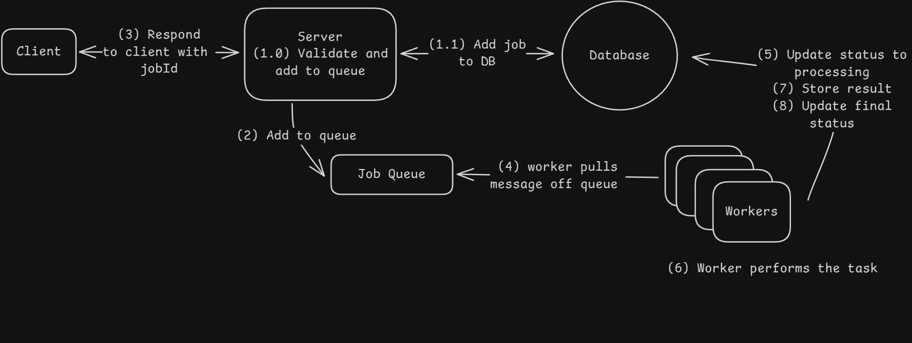

When to use in interviews

- When there is specific slow operation
- Scaling needs or Failure requirements
- Different operation needs different hardware
- Math does not works

Example - Video platform, Photo sharing, Ride sharing, Payment processing, File Sync

**Deep Dives**

- Handling Failures
  - If worker crashes - Job will be picked by another worker
  - How to know worker crash - Heartbeat mechanism
  - SQS: Visibility timeout, Kafka: Session timeout, RabbitMQ: Heartbeat interval
- Handling repeated failures
  - DLQ
- Prevent duplicate work
  - Idempotency Keys
  - 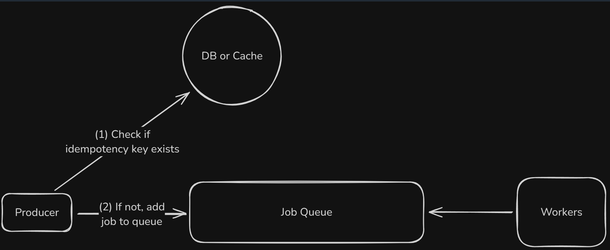
- Bursty Traffic on Queueu
  - Back pressure on queue: Dont accept new jobs if queue close to full
  - Autoscale workers
- Handling mixed workloads
  - Separate queues and workers group
  - Small task - Fast queues, multiple small workers
  - Long Tasks - Slow queue, few big workers
  - 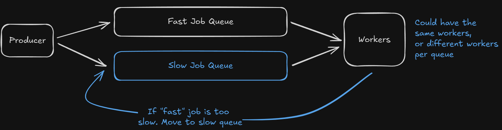
- Orchestration of job dependencies
  - Multi step jobs
  - Simple Jobs - Workers queues next steps
  - Complex Jobs - Workflow Orchestrators - AWS Step Function, Temporal

## 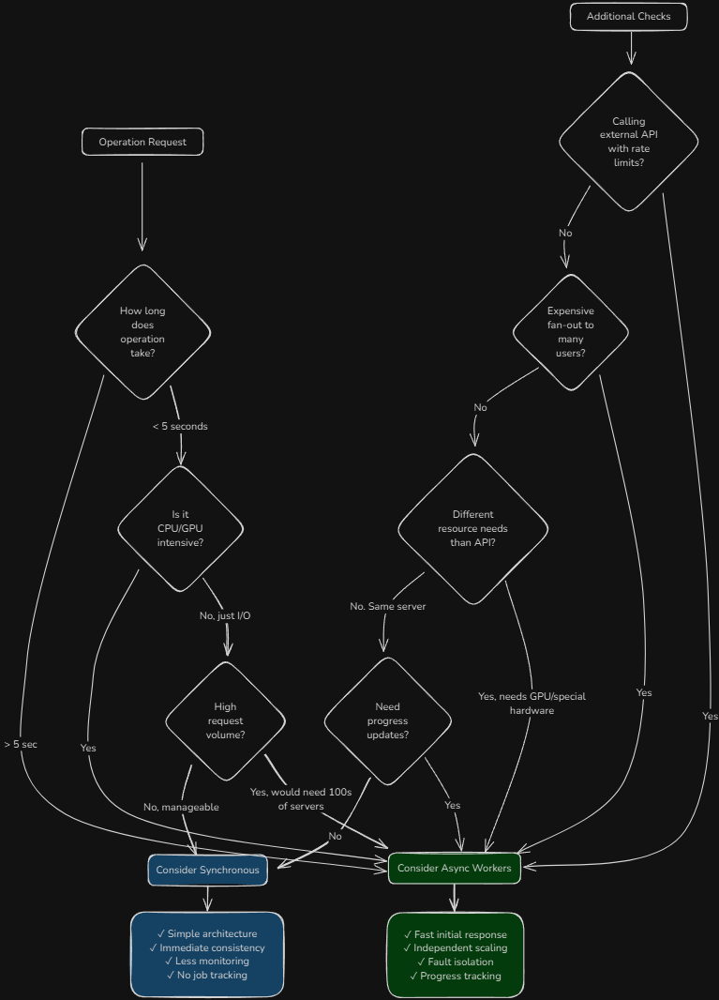

### Dealing with Contention / Race condition

- Prevent race condition and ensure data consistency
  - Concurrency control
  - Atomic Transaction and Locking
  - Distributed Locks, 2PC, Queue based serialization

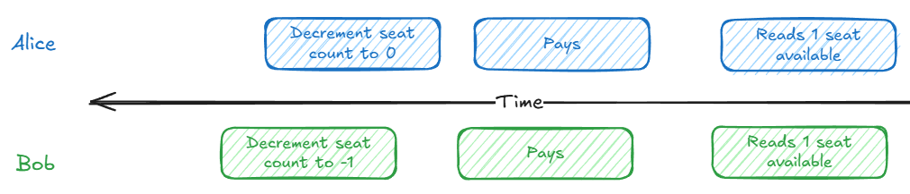

**Solution** 1. Compare and Set 2. Locking

OPERATION ON SAME DB ROW

1. Conditional Write - SIMPLE SOLUTION - Transaction
   1. DB has row level locking by default, so write queries are send with condition (_WHERE CLAUSE_)
   2. Thus compare and set operation do not require 2 db calls, between which another can also call
   3. If transaction needs multiple writes, make one dependent on another's result
   4. 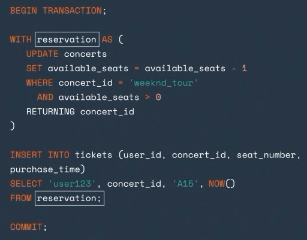
   5. If tickets also has seat number, then implement the locking/ticket counter at seat level
2. Explicit Locking for complex logic
   1. Pessimistic Locking
      1. DB results are locked for everyone unless released after processing
      2. When collision is high
   2. Optimistic concurrency control
      1. Assumes conflicts are rare
      2. Using versioning to control incorrect writes
      3. DB query reads the version of data, and only writes if it still the same version
      4. 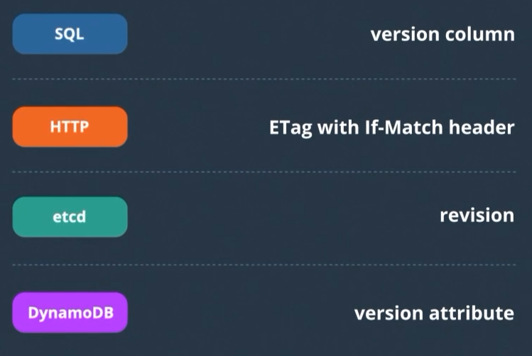
      5. Retry needed

> Transaction + Pessimistic Locking for Serialization

WRITE SKEW: When writes and reads are dependent on each other, even though same row is not read
Example - Delete my row if someone else is already present

Solution - DB Isolation Levels - Serializable
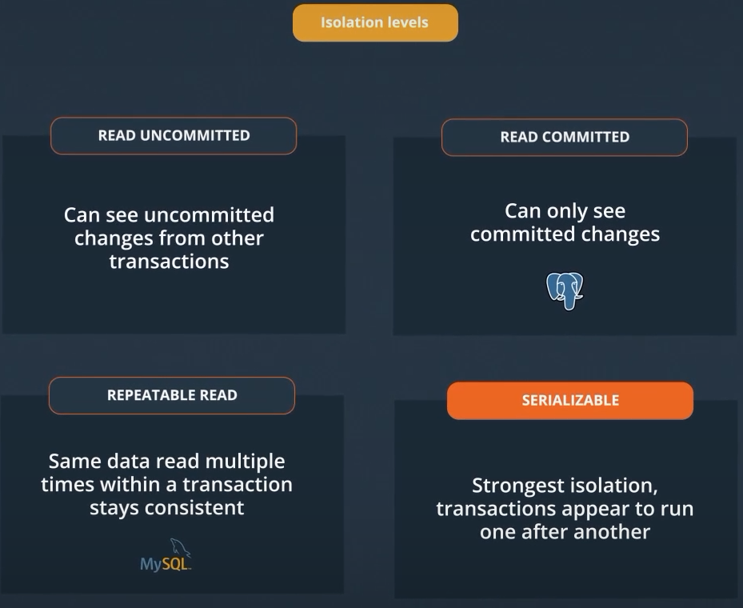

- Serializable is very costly as DB has to check all the transactions.
- Instead convert the 2 row problem into single row problem by doing conditional write or locking

OUTSIDE DB LOCKING

- Hold lock as data instead of locking inside a DB transaction
- Lifetime can be more than a single db transaction
- **Distributed Lock**
  - Redis wih TTL - Lock stored in redis that auto expires after ttl
    - Inmemory and quick
  - Database column to store the person holding the lock
  - Zookeeper
    - Doesnt double grant or corrupt data
    - Managed distributed lock
    - Overhead of maintenance

IN PRACTICE

- Start simple then complex

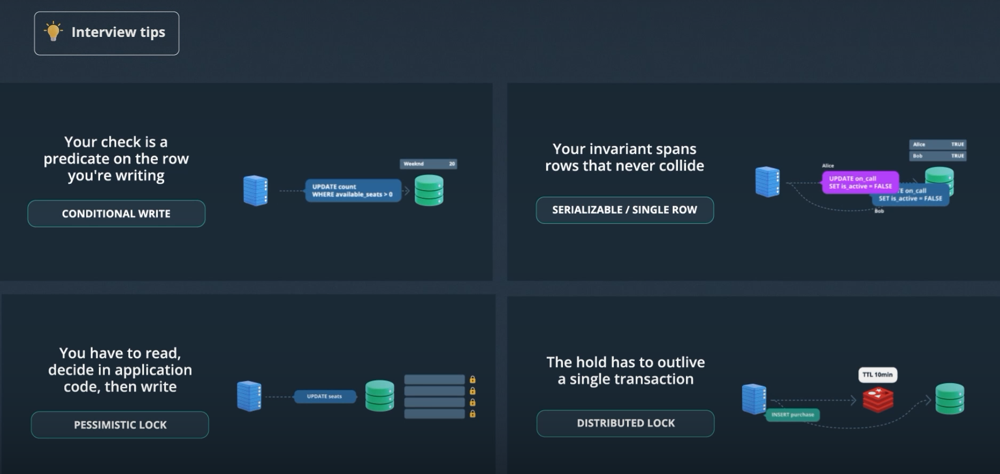

DEEP DIVES
**How do you prevent deadlocks with pessimistic locking?**
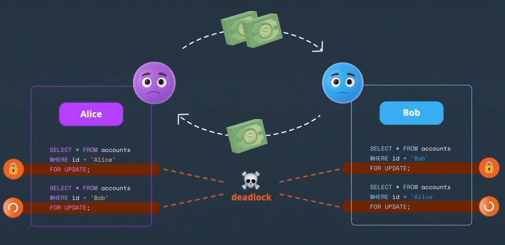

- Grab lock in a prederministic order
- Also modern databases already detects any deadlocks and handle them by retrying

**How to handle ABA problem with optimistic concurrency?**
Read v1 version, then v2 happens and then again version is back to v1 when we are about to write.
So choose the version number that is monotonic
Ex - Based on review count (But if someone deletes)

**What about performance when everyone wants same resource?**
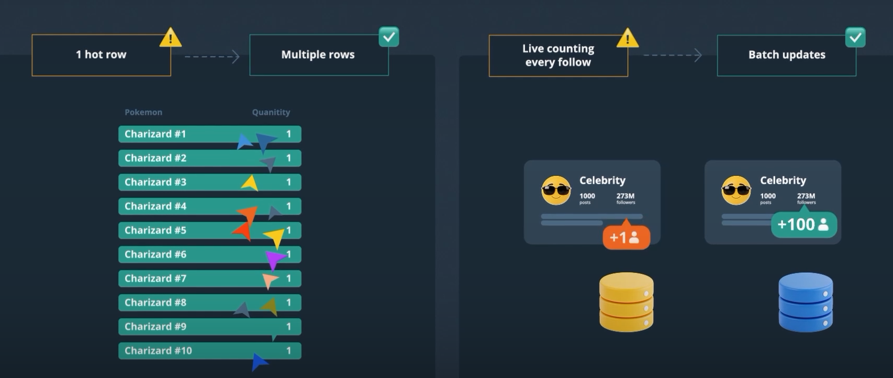

If strong consistency needed on one hot row, use queue. Throughput limited
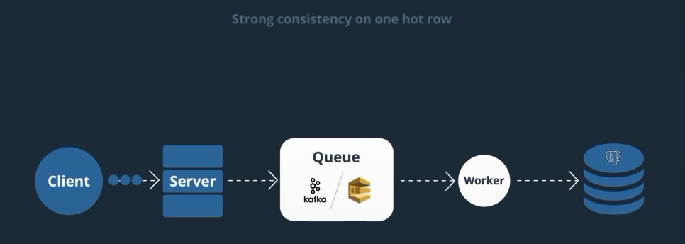

---

### Scaling Reads

- Within DB optimizations
  - Indexing, Denormalization, Vertical Scaling
- Scale horizontally
  - Read Replica, Sharding (Functional or Shard Key Based)
- Caching
  - Application, CDN

> Considerations: Managing cache, replication lag, hot keys

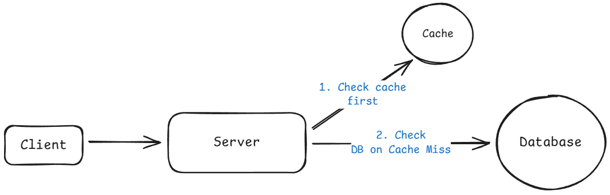

#### Deep Dives on Scaling Reads

- Queries takes longer
  - Indexing
- Still reads need scaling
  - Spinning Disk to SSDs
  - Data Freq access data Skewed > Add Cache
  - Else > Add Replicas
- Hot Cache / Key
  - Request Cohelesense
  - Cache Key Fanout
- Cache Invalidation / Updates immediately
  - On write, delete key from cache > Still cache can read old version from db replica
  - Cache Versioning

### Scaling Writes

In Order

- Vertical Scaling and DB Choice
- Sharding and Vertical partitioning
  - Read Fan Out
- Queues and load shedding
  - Eventual Consistency
- Batching and Aggregation
  - Latency

#### Vertical Scaling

Use better hardware

#### DB Choice

Use cassandra db for write heavy workloads, append-only commit log architecture. Read suffers.
Postgres updates BTree on every insert

#### Sharding

Example Redis

Good Shard Key

#### Vertical Partitioning

Columns are divided into different db - Specialized table in specialized database. Different data on different type of dbs

#### Queue

- For bursty traffic, for short lived
- Buffer / Queue

#### Load Shedding

- Drop updates / writes which are not much important
- Newer update can overwrite

#### Batching

Group write together at application layer / queue, then do batch updates

- Data loss can occur so need some recovery mechanism

#### Intermediate processing layer

- Batches some event and then flushes that to db
- Like Updates Batcher

> DB Layer Batching also possible

#### Aggregation

Aggregate incomming writes into processors, Batch and Update
Create broadcast nodes for reads, where each broadcast node handles set of users feeds
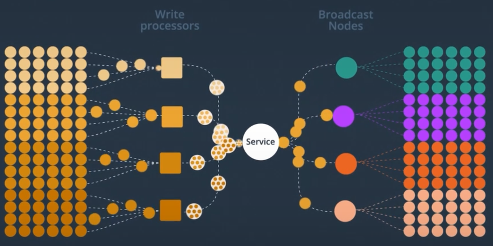

**Deep Dives**

1. Increase shard / db capacity without downtime
   1. Create new db in parallel
   2. Do dual write, copy historical data
   3. Swtch
2. Hot Key
   1. Split into different shard when becomes hot
   2. Read will need to agregated data from all shards

---

### Handling Large Blob

- Direct client to storage transfer

> Considerations: Data sync with DB, Upload failures, lifecycle management

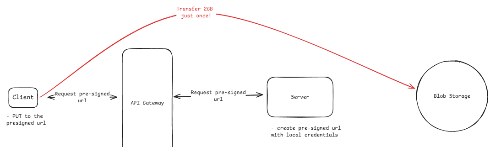

Presigned URL - Temporary upload/download url directly from storage server

- Restrictions on time, file type, file size

Use CDN for frequent downloaded files
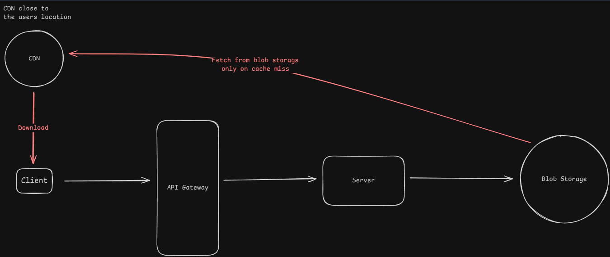

**Resumable uploads/downloads**

- Chunk uploads
- Tracked via checksum/hash of uploaded chunks
- After completion, chunks stiched

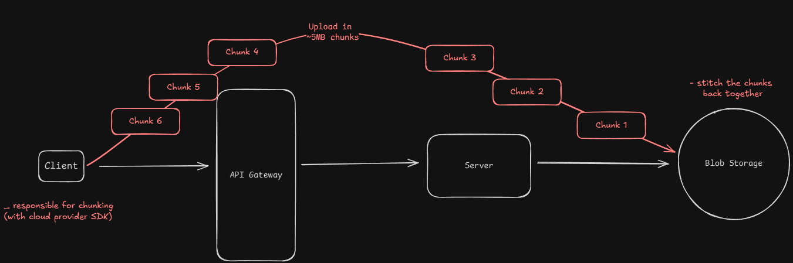

**State Sync Challenges**

- Actual file in storage, while files metadata in db
- Issues
  - Race condition of file status
  - Orphaned Files
  - Malicious clients
  - Network failures
- Solution
  - Event notification from storage to db
  - Periodic reconcillation

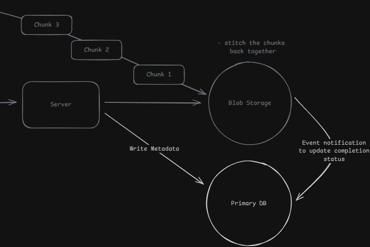

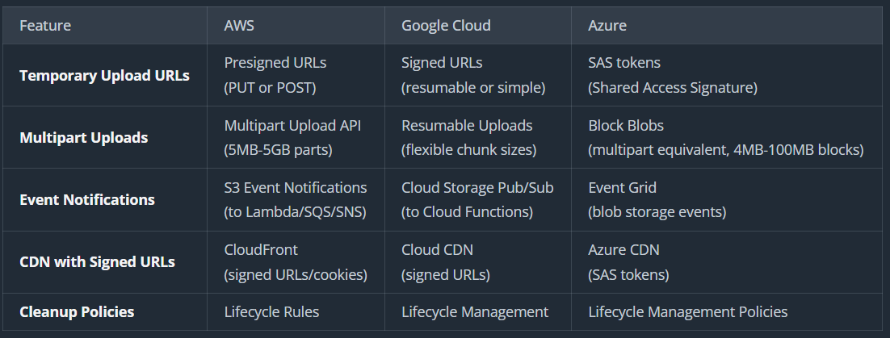

#### When to use

- Video Platform
- Instagram / Photo sharing
- File Sync
- Chat Application for media

#### When not to use

- Small files < 10mb
- Compliance and data inspection
- Immediate response
- Sync validation requirements

#### Deep Dives

- If upload fails at 99 percent
  - Clients track chunks uploaded and upload session identifier
  - Only uploads the failed chunks
- Prevent abuse
  - Implement data processing pipeline before allowing download
  - Automatic content analysis
- Handle Metadata
  - Store and manage in DB
- Fast downloads
  - Direct downloads
  - CDN downloads
  - Range downloads over HTTP for resumable downloads
  - Parallel chunk download

---

### Multi-Step Process

- Workflows coordination
- Server orchestration, workflow engines
- Event driven systems
- State Management, Retry Logic, Failure recovery

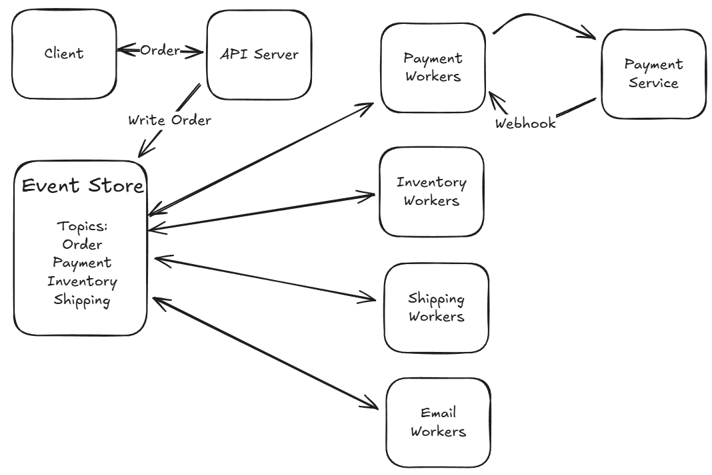

ISSUES WITH SIMPLE FLOW IN SINGLE NODE SYSTEM

- Crashes, Retry

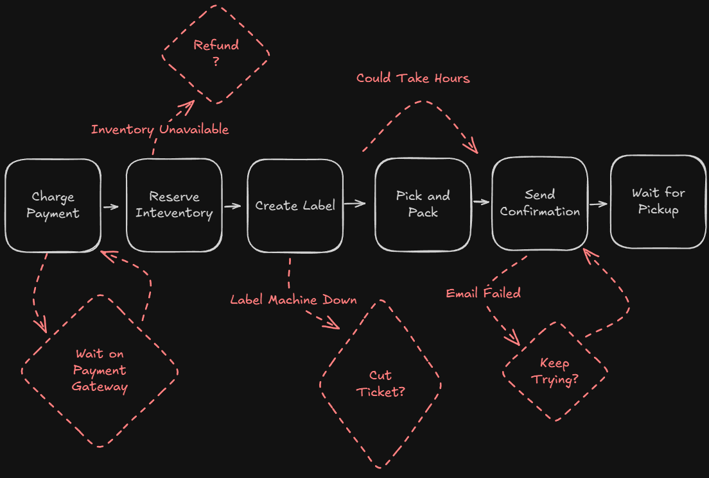

SOLUTION-

- Choreography
- Orchestration

**Sagas and Compensations**

- Sagas are group of sequential steps that gets completed one at a time
- If something fails, compensation actions are also performed in reverse order
- Compensation can also fail, so need their own retry and idempotency logic

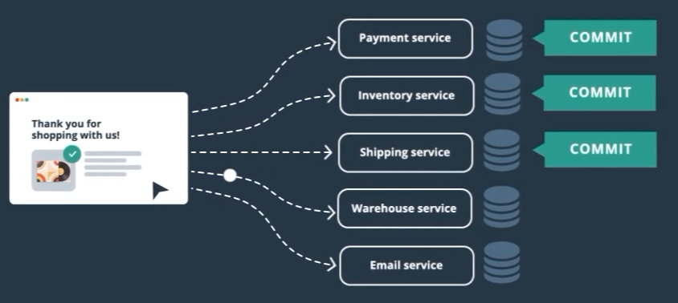

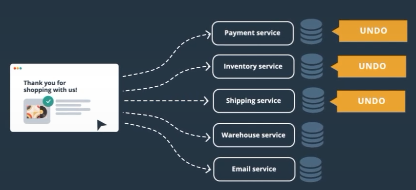

**Choreography**

- Instead of storing the current step, store stream of steps that got here
- Durable Log - Kafka
- Workers are subscribe to it, react based on states, needs to be idempotent
- Workers can scale independently
- IMPLICIT WORKFLOW
- CONS - Adding new step in between requires lot of changes

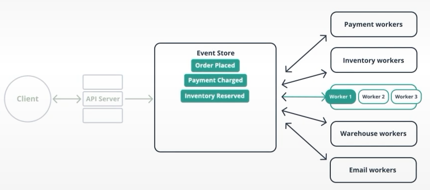

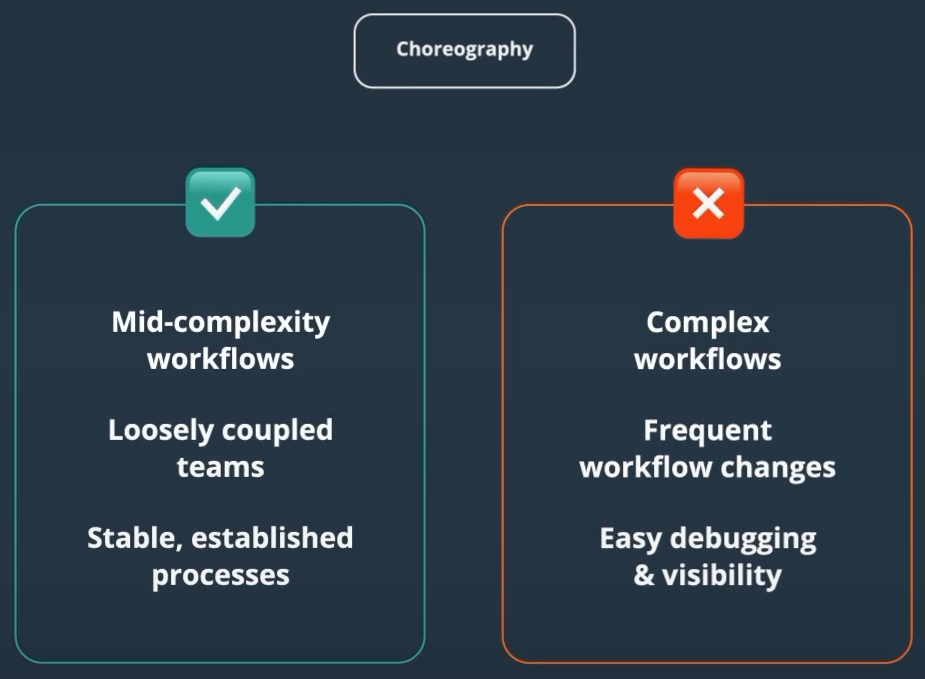

**Orchestration Engines**

- Temporal, AWS Step Function
- **Workflow** - Deterministic code that has the entire flow,
- **Activities** - Idempotent actions
- History stored in db. Replay happens without issues

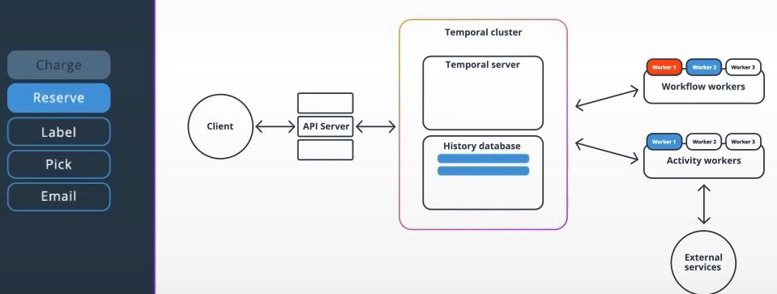

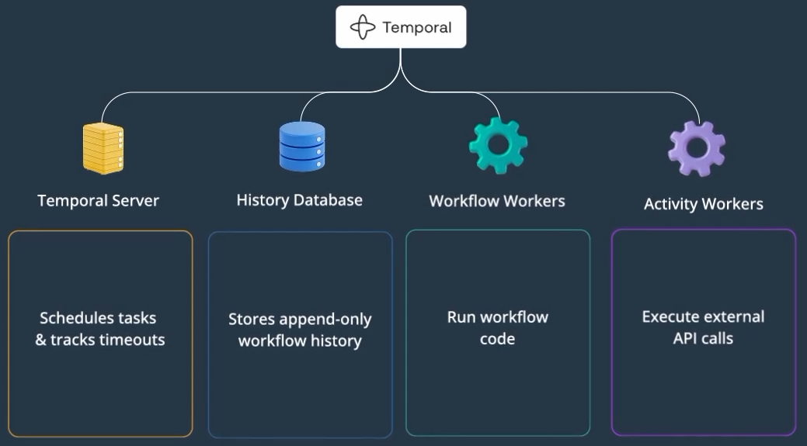

DEEP DIVES
**How do you handle updates to workflow?**

- Versioning
- Patching

**How to make sure a step runs exactly once?**

- Idempotency Key
- Double check before replaying any step

**How do we manage history size**

- Keep activity input output small
- Continue as new - Create a new worflow with current state as start

WHEN TO USE WHEN NOT TO
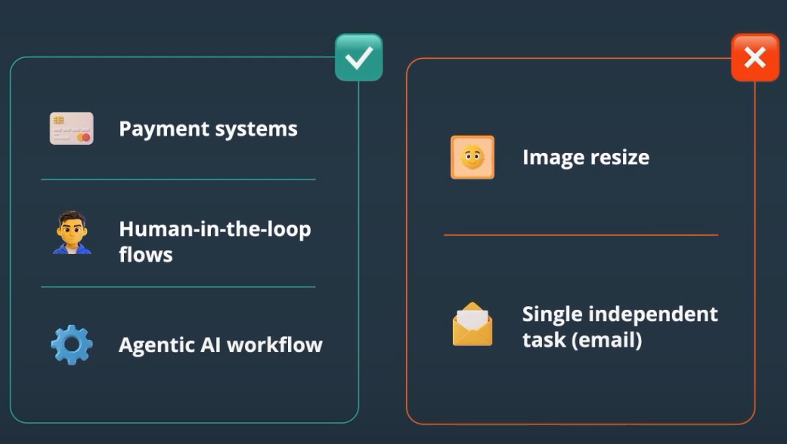

---

### Proximity Based Services

- Geospacial Indexes

1D Data stored in BTree, so indexing easy.
SOLUTION

- _Custom Tree_
  - KD, BKD, R, R-Star, Quadtree
  - Used for polygions, shapes
- _Single Key for Lat/Long - Encoded Keys_
  - Geohash, S2, H3
  - Used for points at scale
  - Used in Redis, MongoDB, Uber

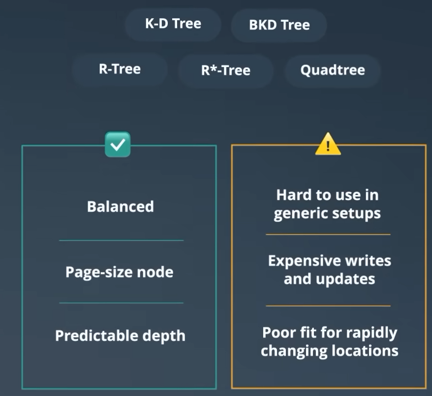

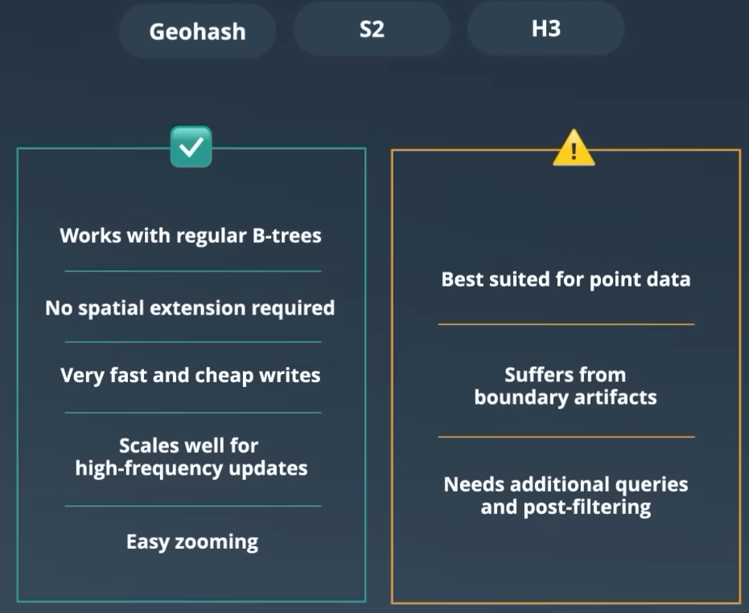

**Quad Tree**

- Every point on map divided into 4 quads
- Sub divided if more points in any quad
- Different number of levels for different location
- Each node can be at different disk location - Random access

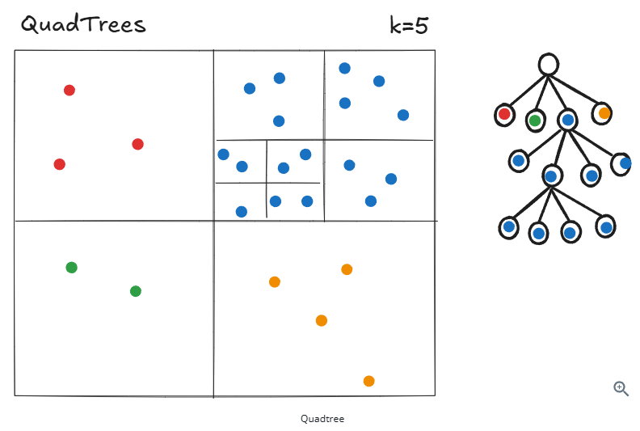

**K-D Tree**

- Divide data either horizontally or vertically, one at a time

**B-K-D Tree (Block K-D Tree)**

- Multiple points in same block of data
- Used by Elastic search

**R-Tree**

- Minimum bounding rectangles
- Nearby rectangles grouped together, Overlapping
- Same levels of depth
- Production Grade
- Indexes lines, polygons and points

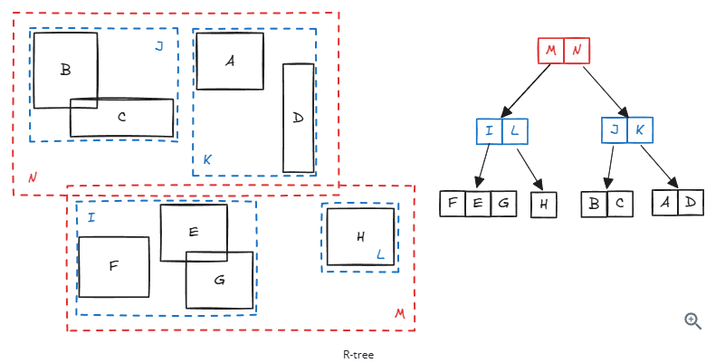

**R(Star)-Tree**

- Less overlapping on insertion

**GeoHash**

- Divide world into 32 blocks ~ Represent one character
- Then again divide each block into 32 ~ Another character
- Final location is a string
- String sharing prefix are near each other
- In Redis
- Edgecase - On boundary, Solution : Search on 3z3

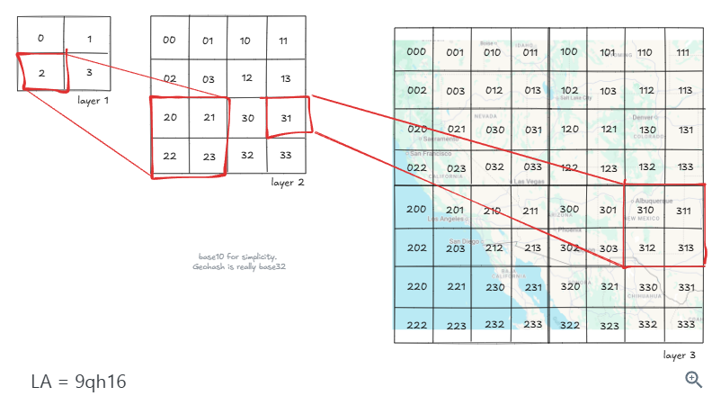

**Google's-S2**

- Earth not flat, thus grid location near pole thin vs location near equator
- S2 - Project earch on cube so that each face of equal size
- Used in MongoDB
- 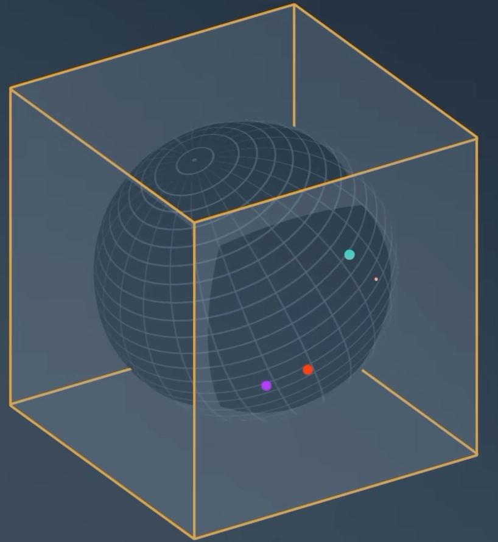

**Uber-H3**

- Uses Hexagon cells
- Makes neighbouring cells equidistance
- 64bit id for each cell
- Prefix same for nearby cells
- 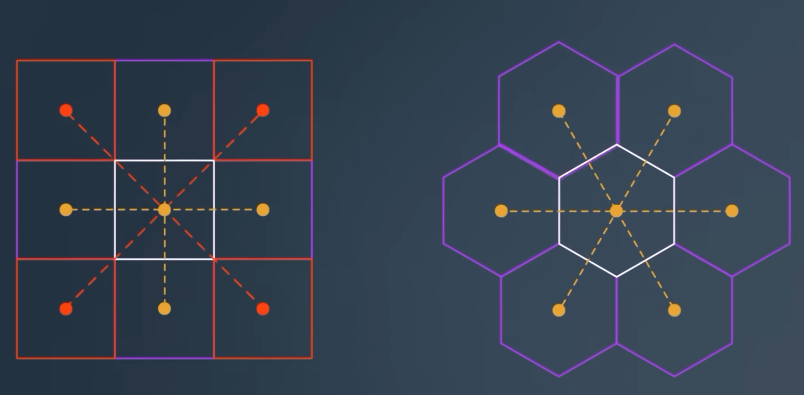
