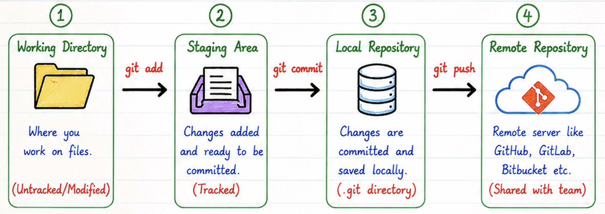
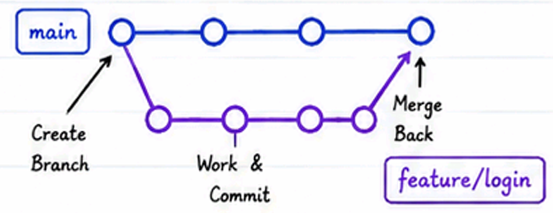
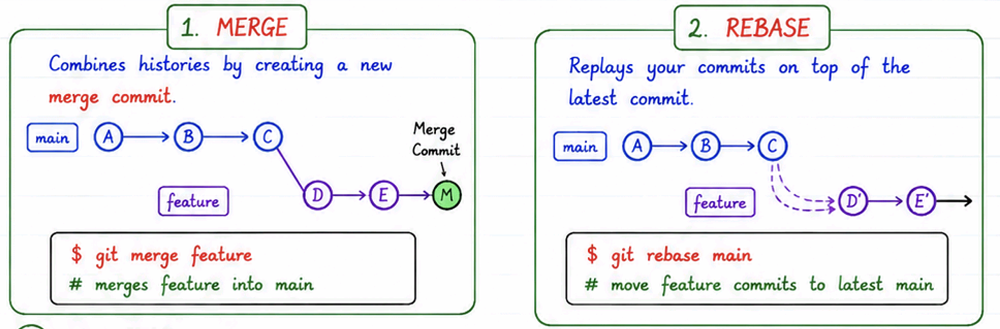
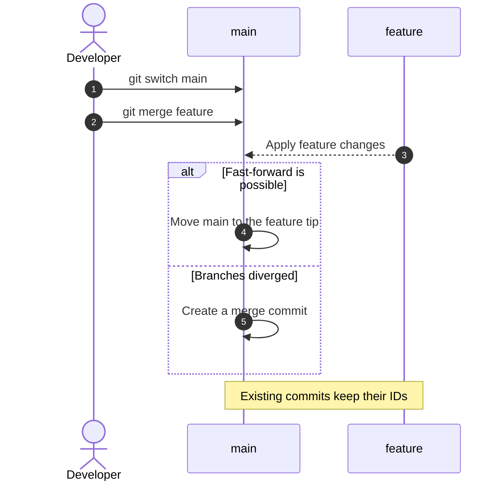
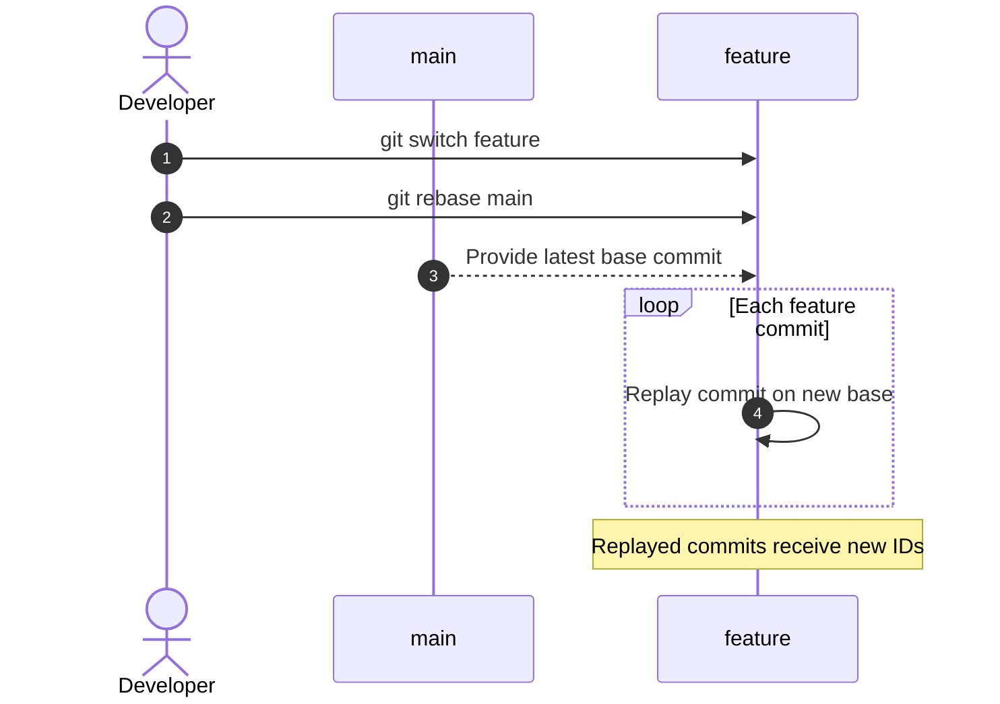
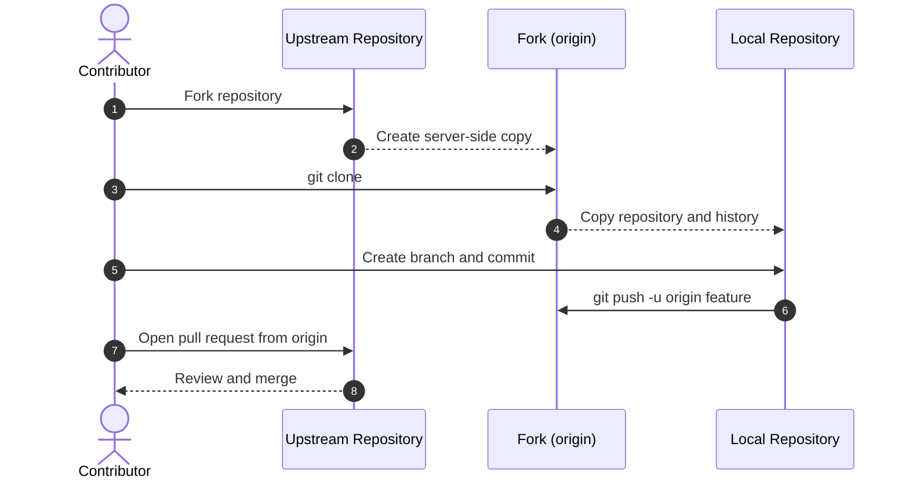
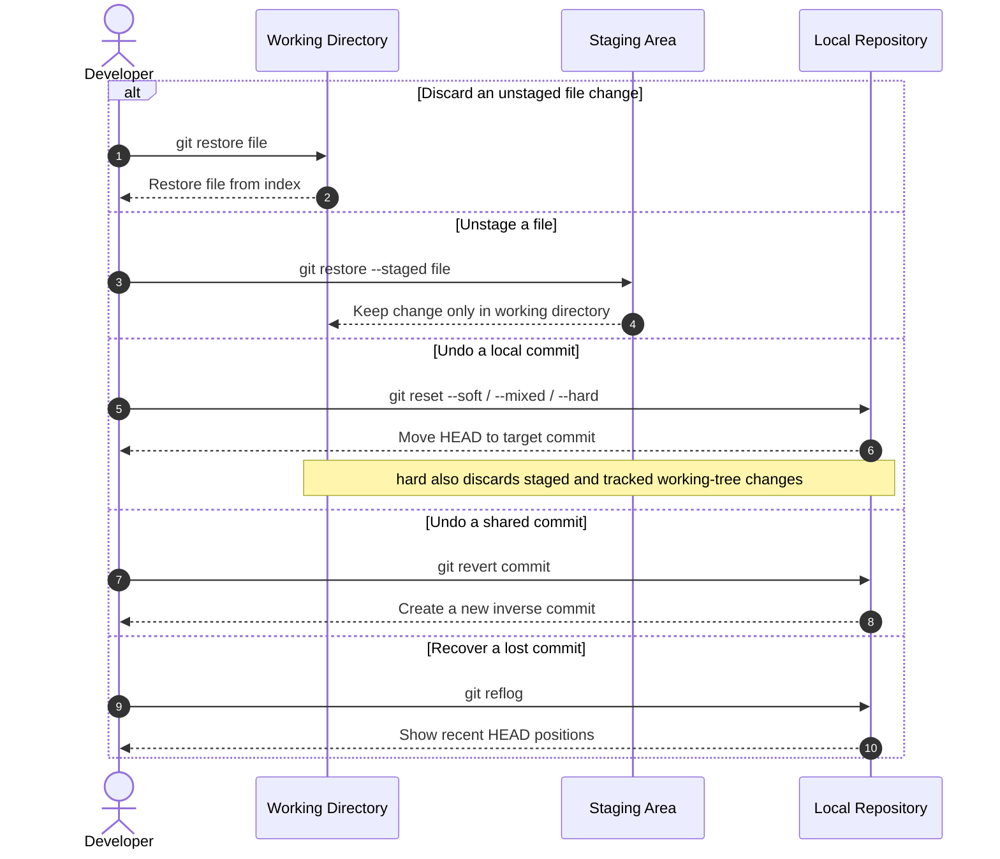

# Git

Git is a **distributed version control system (DVCS)** used to track changes and collaborate on source code during software development.

**Benefits of Git**

- Track changes and history
- Collaboration through branching
- Backup and recovery
- Open source and fast

## Version Control Systems

| Centralized Version Control System (CVCS) | Distributed Version Control System (DVCS)   |
| ----------------------------------------- | ------------------------------------------- |
| Single central repository                 | Each user has a full copy of the repository |
| Requires server access for most operations | Most operations work offline                |
| Examples: SVN, CVS, Perforce              | Examples: Git, Mercurial, Bazaar            |

---

## Glossary

| Term | Meaning |
| ---- | ------- |
| Repository | A project and its complete Git history |
| Working directory | The local project files currently being edited |
| Staging area (index) | Changes selected for the next commit |
| Commit | A saved snapshot identified by a unique hash |
| Branch | An independent line of development |
| `HEAD` | A reference to the currently checked-out commit or branch |
| Detached `HEAD` | A state where `HEAD` points directly to a commit instead of a branch |
| Tag | A named reference to a commit, commonly used for releases |
| Remote | A named reference to a repository hosted elsewhere |
| `origin` | The default name for the remote from which a repository was cloned |
| `upstream` | Conventional name for the original repository behind a fork |
| Clone | A local copy of a remote repository |
| Fork | A personal server-side copy of another repository |
| Pull request (PR) | A request to review and merge changes between branches |
| Conflict | Changes Git cannot integrate automatically |
| Stash | Temporary storage for uncommitted changes |

---

## Git Architecture

Working Directory -> Staging Area -> Local Repository -> Remote Repository

{height=200px}

> **Tracked-file flow:** Unmodified -> Modified -> Staged -> Committed -> Pushed
>
> **New-file flow:** Untracked -> Staged -> Committed -> Pushed

> **Collaboration workflow:** Fork -> Clone -> Sync -> Branch -> Code -> Add -> Commit -> Push -> Pull Request -> Review -> Merge -> Delete Branch -> Deploy

---

## Installation

```powershell
winget install --id Git.Git -e --source winget
git --version
git config --global user.name "Your Name"
git config --global user.email "your.email@example.com"
```

## Core Commands

- `git init` : Initialize a repository
- `git clone <url>` : Clone a remote repository
  - `git clone --depth 1 <url>` : Clone a remote repository with only the latest commit
- `git status` : Show the working tree status
- `git add <path>` : Stage a file or directory
  - `git add .` : Stage all changes in the current directory
- `git commit -m "message"` : Commit staged changes
  - `git commit -am "message"` : Stage and commit tracked files in one step
- `git log` : Display commit history
- `git diff` : Inspect unstaged changes
  - `git diff --staged` : Inspect staged changes
  - `git diff <a> <b>` : Compare two commits, branches, or tags

**`.gitignore`:** Specifies untracked files and directories that Git should ignore, such as `node_modules/`, `dist/`, `.env`, and `.DS_Store`.

### Git Commit Message Guidelines

`<TYPE>(<SCOPE>): <SUBJECT>`

| Type     | Description                                               |
| -------- | --------------------------------------------------------- |
| feat     | A new feature                                             |
| fix      | A bug fix                                                 |
| docs     | Documentation only changes                                |
| style    | Code style changes (formatting, missing semicolons, etc.) |
| refactor | Code changes that neither fix a bug nor add a feature     |
| perf     | Performance improvements                                  |

---

## Branching

A branch provides an independent line of development for features or fixes without affecting the main codebase.

{height=100px}

- `git branch` : List all branches
- `git branch <branch>` : Create a new branch
- `git checkout <branch>` : Switch to a branch
- `git checkout -b <branch>` : Create and switch to a new branch
- `git merge <branch>` : Merge a branch into the current branch
- `git branch -d <branch>` : Delete a branch
  - `git branch -D <branch>` : Force delete a branch
- `git push origin --delete <branch>` : Delete a remote branch

### Naming Conventions

Use short, descriptive names with lowercase letters and hyphens, such as `feature/login-page`.

- `main / master`: The main production branch
- `develop`: The main development branch
- `feature/*`: New features
- `bugfix/*`: Bug fixes
- `hotfix/*`: Critical fixes
- `release/*`: Release preparation

---

## Merge vs Rebase

Both integrate changes from one branch into another but produce different histories.

{height=220px}

| Aspect        | Merge                                     | Rebase                              |
| ------------- | ----------------------------------------- | ----------------------------------- |
| History       | Complete, but may become complex          | Linear, clean, and easy to read     |
| Commits       | Preserves commits; may add a merge commit | Recreates commits with new IDs      |
| Collaboration | Safe for shared branches                  | Avoid on shared or public branches  |
| Conflicts     | Usually resolved once                     | May need resolution for each commit |
| Best for      | Integration and long-running branches     | Updating feature branches           |

### When to Use

- **Merge:** shared/public branches, long-running features, or when preserving full history matters.
- **Rebase:** your own unshared feature branch, especially before opening a pull request.

> Think of **merge** as preserving history and **rebase** as rewriting history. Never rebase shared branches such as `main`.

### Merge Sequence



### Rebase Sequence



- **Cherry-pick:** Apply a specific commit from one branch to another with `git cherry-pick <commit>`.
- **Squash commits:** Combine multiple commits into one with `git rebase -i HEAD~n`, replacing `n` with the number of commits to review.

---

## Remote Repositories

| Git                           | GitHub                   |
| ----------------------------- | ------------------------ |
| Tool (Version Control System) | Platform (Cloud Service) |
| Runs Locally                  | Hosts Git Repositories   |
| CLI Based                     | Web Interface            |

### Remote Operations

| Operation | Effect |
| --------- | ------ |
| Clone | Copy a remote repository to the local machine |
| Fetch | Download remote commits without integrating them |
| Pull | Fetch and integrate remote commits into the current branch |
| Push | Upload local commits to a remote repository |
| Fork | Create a personal server-side copy of a repository |

### Remote Commands

- `git remote add origin <url>` : Add a remote repository
- `git remote -v` : List remote repositories
- `git fetch` : Fetch changes from a remote repository without merging
- `git pull` : Fetch and merge changes from a remote repository
- `git push` : Push changes to a remote repository
  - `git push -u origin <branch>` : Push a branch and configure its upstream

### Fork to Pull Request Sequence



---

## Undo and Recovery

| Command | Primary Target | Rewrites History | Best Use |
| ------- | -------------- | ---------------- | -------- |
| `restore` | Working tree or staging area | No | Discard file changes or unstage files |
| `reset` | Current branch (`HEAD`) | Yes | Undo local commits or change staging state |
| `revert` | Existing commit | No | Safely undo a commit in shared history |

> `restore` changes files, `reset` moves a branch and may change files, and `revert` safely adds an inverse commit.

### Undo and Recovery Sequence



### Remove

- `git rm <file>` : Remove a file from the working directory and stage the removal
- `git rm --cached <file>` : Stop tracking a file and stage its removal without deleting the working copy

### Restore

- `git restore <file>` : Discard changes in the working directory
- `git restore --staged <file>` : Unstage a file
- `git checkout <branch> -- <file>` : Restore a specific file from a branch
- `git checkout <commit> -- <file>` : Restore a specific file from a previous commit

### Reset

- `git reset --soft <commit>` : Move HEAD to the specified commit, keeping changes staged
- `git reset --mixed <commit>` : Move HEAD to the specified commit, keeping changes unstaged
- `git reset --hard <commit>` : Move HEAD to the specified commit, discarding staged and tracked working-tree changes

### Revert

- `git revert <commit>` : Create a new commit that undoes the changes of a previous commit

### Reflog

- `git reflog` : Show a log of all recent HEAD changes, including resets and checkouts
  - `git reset --hard <commit-id>` : Reset to a previous `<commit-id>`
  - `git checkout -b <branch-name> <commit-id>` : Create and check out a branch at a previous commit

### Stash

Temporarily stores uncommitted changes without creating a commit.

- `git stash push -u -m "message"` : Stash tracked and untracked changes with a label
- `git stash list` : List all stashes
- `git stash pop` : Restore and remove the latest stash

> Note:
>
> - Create a backup branch before destructive operations
> - Prefer `git revert` over `git reset` for shared history

---

## Common Git Errors

| Error                                                       | Why It Occurs                                         | Quick Fix                                                                                      |
| ----------------------------------------------------------- | ----------------------------------------------------- | ---------------------------------------------------------------------------------------------- |
| `Your local changes would be overwritten by merge`          | Uncommitted changes conflict with incoming changes    | Commit the changes, or run `git stash`, `git pull`, then `git stash pop`                       |
| `failed to push some refs to 'origin'`                      | The remote branch contains commits missing locally    | Run `git pull --rebase origin <branch>`, resolve any conflicts, then push again                |
| `refusing to merge unrelated histories`                     | The repositories do not share a common commit history | Verify the remotes; if intentional, run `git pull origin <branch> --allow-unrelated-histories` |
| `Please commit your changes or stash them before you merge` | The working directory contains uncommitted changes    | Commit the changes or run `git stash` before merging                                           |
| `not a git repository`                                      | The current directory is outside a Git repository     | Navigate to the repository or initialize one with `git init`                                   |
| `CONFLICT (content): Merge conflict`                        | Both branches changed the same lines                  | Resolve conflict markers, run `git add <file>`, then `git commit`                              |

### Conflict Recovery

- `git status` : Show conflicted files and the current operation
- `git diff` : Inspect unresolved conflicts
- `git merge --abort` : Cancel a merge and restore the pre-merge state
- `git rebase --abort` : Cancel a rebase and restore the pre-rebase state
- `git rebase --continue` : Continue a rebase after resolving and staging conflicts

> Read error messages carefully, check `git status`, and create a backup branch before risky recovery operations.

---

## Best Practices

- Make small, focused commits with clear messages.
- Synchronize with the remote before starting work and before pushing.
- Use focused feature branches and pull requests instead of committing directly to `main`.
- Keep branch names short, descriptive, lowercase, and hyphenated.
- Delete feature branches after they are merged.
- Never commit passwords, API keys, tokens, or other secrets.
- Review changes with `git status` and `git diff` before committing.
- Avoid rebasing shared branches and force-pushing shared history.
- Create a backup branch before destructive reset or recovery operations.
