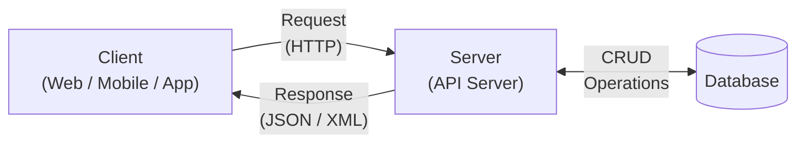

# REST API Design

Representational State Transfer (REST) is an architectural style for designing networked applications.

### Glossary

**Resource**: An object or representation of something that can be accessed and manipulated via a RESTful API.
**RESTful APIs** use HTTP methods to perform operations on resources.
**API (Application Programming Interface)**: A set of rules that allows different software applications to communicate with each other.
**HTTP (Hypertext Transfer Protocol)**: The protocol used for communication between clients and servers in RESTful APIs.

## REST Principles

1. **Stateless**: The server does not store any client context between requests. Helps in scalability and caching.
2. **Client-Server Architecture**: The client and server are separate entities that communicate over a network.
3. **Cacheable**: Responses must define themselves as cacheable or not to prevent clients from reusing stale data.
4. **Uniform Interface**: A standardized and consistent way of interacting with resources
5. **Layered System**: The architecture can be composed of multiple layers, each with its own responsibilities. API Gateways, Load Balancers, and Proxies
6. **Resource-Based**: Resources are identified by URIs (Uniform Resource Identifiers) and can be manipulated using standard HTTP methods.

### Benefits of REST

- Simple | Standardized | Scalable | Flexible | Language-agnostic | Widely adopted

## REST View of Client-Server Architecture



---

## HTTP Methods

Used to perform operations on resources.

- **Idempotent**: An operation that can be performed multiple times without changing the result beyond the initial application.
- **Safe**: An operation that does not modify the resource state (e.g., GET, HEAD).
- **CRUD**: Create, Read, Update, Delete

| Method  | Description                     | Idempotent | Safe | Request Body | Response Body | example         |
| ------- | ------------------------------- | ---------- | ---- | ------------ | ------------- | --------------- |
| GET     | Retrieve a resource             | ✅         | ✅   | ❌           | ✅            | GET /users      |
| POST    | Create a new resource           | ❌         | ❌   | ✅           | ✅            | POST /users     |
| PUT     | Update an existing resource     | ✅         | ❌   | ✅           | ✅            | PUT /users/1    |
| DELETE  | Delete a resource               | ✅         | ❌   | ❌           | ❌            | DELETE /users/1 |
| PATCH   | Partially update a resource     | ❌         | ❌   | ✅           | ✅            | PATCH /users/1  |
| OPTIONS | Describe communication options  | ✅         | ✅   | ❌           | ✅            | OPTIONS /users  |
| HEAD    | Retrieve headers for a resource | ✅         | ✅   | ❌           | ❌            | HEAD /users/1   |

> **NOTE**: For custom operations use post method with a descriptive endpoint (e.g., POST /users/{id}/activate).

## HTTP Request

Message sent by the client to the server which contains information that the server needs to process the request.

### Components

1. _Request Line_: `<HTTP Method> <URL> <HTTP Version>`
2. _Headers_: Key-value pairs providing metadata about the request.
3. _Body_: Optional data sent with the request, typically in JSON or XML format.

```http
POST /users?role=admin HTTP/1.1

Host: api.example.com
Content-Type: application/json
Authorization: Bearer <token>
Accept: application/json

{
  "name": "Jane Doe",
  "email": "jane.doe@example.com",
  "age": 30
}
```

- **URL**: The endpoint to which the request is sent, including the protocol, domain, path, and query parameters.
- **HTTP Version**: The version of the HTTP protocol being used (e.g., HTTP/1.1, HTTP/2).
- **Headers**: Metadata about the request (e.g., Content-Type, Authorization). Key Value Pairs.
- **Path Parameters**: Variables in the URL path (e.g., /users/{id}).
- **Query Parameters**: Key-value pairs in the URL (e.g., /users?age=30). (Optional)
- **Body**: The payload sent with the request, typically in JSON or XML format.

## HTTP Response and Status Codes

HTTP responses contains results of the request made by the client, including a status code and data.

### Components

1. _Status Line_: `<HTTP Version> <Status Code> <Reason Phrase>`
2. _Headers_: Key-value pairs providing metadata about the response.
3. _Body_: Optional data/payload sent with the response

```http
HTTP/1.1 200 OK
Content-Type: application/json

{
  "id": 1,
  "name": "Jane Doe",
  "email": "jane.doe@example.com",
  "age": 30
}
```

- **Status Code**: A three-digit code indicating the result of the request (e.g., 200 OK, 404 Not Found).
- **Reason Phrase**: A brief description of the status code (e.g., OK, Not Found).

### Status Codes

| Code    | Meaning               | When it Occurs                     |
| ------- | --------------------- | ---------------------------------- |
| **1xx** | **Informational**     | Request received, still processing |
| **2xx** | **Success**           | Request understood and accepted    |
| ↳ 200   | OK                    | Request succeeded                  |
| ↳ 201   | Created               | Resource created                   |
| ↳ 204   | No Content            | Succeeded, no data returned        |
| **3xx** | **Redirection**       | Further action needed              |
| ↳ 301   | Moved Permanently     | Resource moved to a new URL        |
| ↳ 304   | Not Modified          | Cached version is still valid      |
| **4xx** | **Client Error**      | Invalid or unfulfillable request   |
| ↳ 400   | Bad Request           | Invalid syntax or data             |
| ↳ 401   | Unauthorized          | Authentication required or failed  |
| ↳ 403   | Forbidden             | Authenticated but no access        |
| ↳ 404   | Not Found             | Resource not found                 |
| ↳ 405   | Method Not Allowed    | HTTP method not supported          |
| ↳ 409   | Conflict              | Conflicts with current state       |
| ↳ 422   | Unprocessable Entity  | Validation failed                  |
| ↳ 429   | Too Many Requests     | Rate limit exceeded                |
| **5xx** | **Server Error**      | Server failed a valid request      |
| ↳ 500   | Internal Server Error | Something went wrong on server     |
| ↳ 502   | Bad Gateway           | Invalid response from upstream     |
| ↳ 503   | Service Unavailable   | Server overloaded or down          |
| ↳ 504   | Gateway Timeout       | Upstream server did not respond    |

---

## Authentication and Authorization

| Authentication                              | Authorization                                                                |
| ------------------------------------------- | ---------------------------------------------------------------------------- |
| Verifying the identity of a user or system. | Determining what actions or resources a user or system is allowed to access. |
| WHO YOU ARE                                 | WHAT YOU CAN DO                                                              |
| Confirms identity                           | Checks Permissions                                                           |
| Examples: Basic Auth, OAuth, JWT            | Examples: RBAC                                                               |

### Authentication Methods

- JWT (JSON Web Token)
- Bearer Token
- OAuth 2.0
- API Key

### Authorization Methods

- RBAC (Role-Based Access Control)
- ABAC (Attribute-Based Access Control)

---

### HTTPS

HTTPS + SSL/TLS ensures secure communication between the client and server by encrypting data in transit.

### CORS (Cross-Origin Resource Sharing)

Allows or restricts resources on a web page to be requested from another domain outside the domain from which the resource originated.

```
Access-Control-Allow-Origin: https://example.com  // Allow specific origin
Access-Control-Allow-Methods: GET, POST  // Allow specific methods
Access-Control-Allow-Headers: Content-Type, Authorization  // Allow specific headers
```

### Rate Limiting

Limits the number of requests a client can make to an API within a specified time frame to prevent abuse and ensure fair usage.

### Input Validation

Validate and sanitize user input to prevent injection attacks and ensure data integrity.

- Usually done on both client and server sides (crucial).
- Validate at boundary

### Common Security Vulnerabilities

| Vulnerability                       | Description                                   | Mitigation                                 |
| ----------------------------------- | --------------------------------------------- | ------------------------------------------ |
| _SQL Injection_                     | Malicious SQL queries are executed            | Use parameterized queries and ORM          |
| _XSS (Cross-Site Scripting)_        | Malicious scripts executed in the browser     | Sanitize and validate input                |
| _CSRF (Cross-Site Request Forgery)_ | Unauthorized commands transmitted from a user | Use anti-CSRF tokens                       |
| _Insecure Direct Object References_ | Unauthorized access to objects                | Implement proper access controls           |
| _Security Misconfiguration_         | Improperly configured security settings       | Regularly review and update configurations |

---

## Caching

## Versioning

| Strategy               | Example                                   | Pros                                 | Cons                                     |
| ---------------------- | ----------------------------------------- | ------------------------------------ | ---------------------------------------- |
| URI versioning         | `/api/v1/users`                           | Explicit, easy to route and document | Version leaks into URL forever           |
| Header versioning      | `Accept-Version: 2`                       | Cleaner URLs                         | Less visible and harder to test manually |
| Media type versioning  | `Accept: application/vnd.company.v2+json` | Flexible for representation changes  | More complex for consumers               |
| Query param versioning | `/users?version=2`                        | Easy to experiment                   | Usually weakest contract signal          |

## Pagination, Filtering, and Sorting

```http
GET /users?status=active&sort=-createdAt&page=1&limit=10

// Cursor-based pagination [Large Dataset]
GET /users?status=active&sort=-createdAt&cursor=eyJpZ
```

---

## Error Handling

Responses to have proper status codes and error messages to help clients understand what went wrong.

> Best Practices
>
> - Consistent error response format
> - Include error codes, messages, and details in the response body
> - Avoid exposing sensitive information in error messages
> - Log errors on the server side for debugging and monitoring purposes

## Testing RESTful APIs

Testing RESTful APIs involves verifying that the API endpoints work as expected and handle various scenarios correctly.

### Tools

- **Postman**: A popular tool for manual API testing.
- **cURL**: Command-line tool for making HTTP requests.
- **Automated Testing Frameworks**: Such as JUnit (Java), pytest (Python), or Mocha (JavaScript) for writing automated tests.

### Types of Tests

1. **Unit Tests**: Test individual components of the API in isolation.
2. **Integration Tests**: Test the interaction between different components of the API.
3. **End-to-End Tests**: Test the entire API workflow from the client's perspective.
4. **Performance Tests**: Test the API's response time and scalability under load.
5. **Security Tests**: Test for vulnerabilities such as authentication, authorization, and data protection.

#### Sample Test Cases

```text
Test Case ID    : TC_GET_USERS_01
Description     : Verify GET /users returns list of users
Preconditions   : User should have valid access
Request         : GET /users
Expected Status : 200 OK
Expected Result : List of users is returned
Test Data       : N/A
Actual Result   : Pass / Fail
```

## API Documentation

API documentation provides information about the available endpoints, request/response formats, and usage examples.
_Tools_ - Swagger/OpenAPI, Postman, Redoc, Slate

### Components of API Documentation

- Endpoint descriptions
- Request and response formats
- Authentication and authorization details
- Error codes and messages
- Usage examples and sample requests/responses
- Versioning information

### Sample API Documentation

```text
Endpoint    : GET /users/{id}
Description : Get user details by ID
Method      : GET
URL         : /users/{id}
Path Param  : id (integer) — User ID
Response    : 200 OK

Response Body (JSON):
{
  "id"    : 1,
  "name"  : "Aman",
  "email" : "aman@example.com"
}
```

---

## RESTful API Design Best Practices

1. Use nouns for resource names (e.g., `/users`, `/products`).
2. Use plural nouns for collections (e.g., `/users`, `/products`).
3. URIs should be hierarchical and reflect resource relationships (e.g., `/users/{userId}/orders`).
4. Use HTTP methods appropriately (GET for retrieval, POST for creation, PUT/PATCH for updates, DELETE for deletion).
5. Use query parameters for filtering, sorting, and pagination (e.g., `/users?age=30&sort=name`).
6. Use consistent and meaningful status codes to indicate the result of operations.
7. Provide clear and descriptive error messages in the response body for client errors.
8. API Versioning: Include versioning in the URI (e.g., `/v1/users`) or in headers to manage changes over time.
9. Stateless API Design for scalability
10. Use JSON as the data format
11. Follow Security best practices - HTTPS | Auth | Validate | Rate Limit | Prevent Injection | CORS | Logging

---

## REST vs SOAP

| REST                               | SOAP                            |
| ---------------------------------- | ------------------------------- |
| Representational State Transfer    | Simple Object Access Protocol   |
| Architectural style                | Protocol                        |
| Uses HTTP                          | Uses XML over various protocols |
| Lightweight                        | Heavyweight                     |
| JSON, XML, etc.                    | Only XML                        |
| Stateless                          | Can be stateful                 |
| Easy to use and scalable           | Complex and less flexible       |
| Widely used in web and mobile apps | Used in enterprise applications |

## REST vs GraphQL vs gRPC

| Dimension    | REST                     | GraphQL                   | gRPC                          |
| ------------ | ------------------------ | ------------------------- | ----------------------------- |
| Style        | Resource-based API       | Query language for APIs   | Contract-based RPC (protobuf) |
| Data fetched | Fixed per endpoint       | Client picks exact fields | Fixed by contract             |
| Best for     | Public APIs, web, mobile | Complex, data-rich UIs    | Fast service-to-service calls |
| Speed        | Good                     | Good                      | Fastest                       |

Example — fetching a user's name:

```text
REST     : GET /users/1          → returns the whole user object

GraphQL  : query { user(id: 1) { name } }   → returns only the name

gRPC     : userService.GetUser({ id: 1 })   → typed call defined in .proto
```
