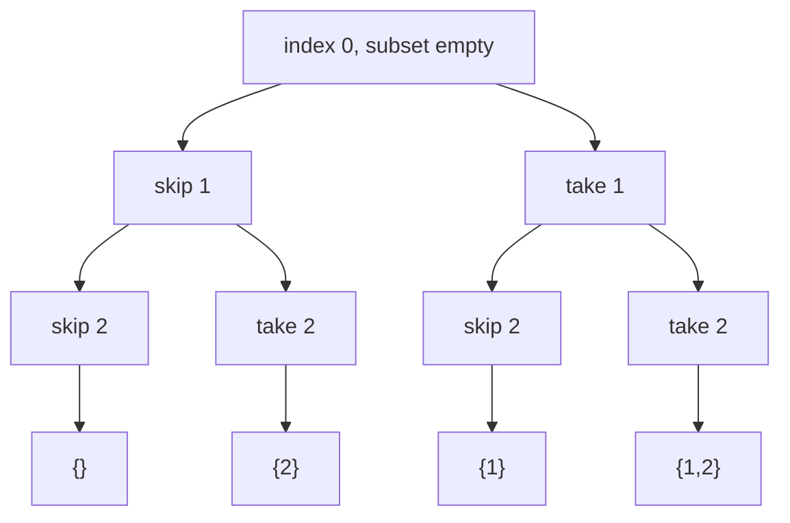

# Recursion and Backtracking

> **Scope** — Recursion mechanics plus backtracking as prune-as-you-go DFS over implicit combinatorial trees: subsets, permutations, combinations, partitioning, grid paths, and constraint satisfaction.

**Contents**
- [1. Core Concepts](#1-core-concepts)
- [2. Complexity Reference](#2-complexity-reference)
- [3. C# Toolbox](#3-c-toolbox)
- [4. Core Patterns / Techniques](#4-core-patterns--techniques)
- [5. Classic Problems & Solutions](#5-classic-problems--solutions)
- [6. Pattern Recognition](#6-pattern-recognition)
- [7. Interview Focus](#7-interview-focus)
- [8. Common Traps & Edge Cases](#8-common-traps--edge-cases)
- [9. Related LeetCode Problems](#9-related-leetcode-problems)
- [10. Cheat Sheet](#10-cheat-sheet)
- [See Also](#see-also)

---

## 1. Core Concepts

### 1.1 Recursion essentials

For interviews, track four things: **contract** (what the call returns), **progress** (input shrinks), **base cases** (all terminal states), and **stack depth** (`O(depth)` extra space). C#/.NET does **not** guarantee tail-call optimization, so deep or unbounded recursion should be converted to a loop or explicit `Stack<T>`.

| Idea | Interview-useful takeaway |
| --- | --- |
| Head recursion | recursive call returns first; combine while unwinding (tree height, divide-and-conquer) |
| Tail recursion | recursive call is last action, but still not safe to rely on for stack savings in C# |
| Explicit stack | simulate recursion when depth is unbounded; each stack frame must own its own mutable-path snapshot |
| Recursion tree | total time = sum of work across levels; backtracking is usually analyzed by state-space tree shape, not Master Theorem |

**Master Theorem sanity check.** For `T(n) = a*T(n/b) + f(n)`, compare `f(n)` with `n^(log_b a)`.

| Case | Condition | Result |
| --- | --- | --- |
| Leaves dominate | `f(n) = O(n^(log_b a - ε))` | `T(n) = Θ(n^(log_b a))` |
| Balanced | `f(n) = Θ(n^(log_b a))` | `T(n) = Θ(n^(log_b a) · log n)` |
| Root dominates | `f(n) = Ω(n^(log_b a + ε))`, regularity holds | `T(n) = Θ(f(n))` |

> Merge sort: `2T(n/2)+O(n)=Θ(n log n)`. Binary search: `T(n/2)+O(1)=Θ(log n)`. Backtracking recurrences such as `T(n)=n*T(n-1)` are factorial/state-space analyses instead.

**Explicit-stack conversion pattern.** Replace each recursive frame with a struct/tuple that contains the next index and either a path snapshot or enough undo metadata. Snapshots allocate more but are safer for interview pseudocode because sibling branches cannot share a mutable `path`.

```csharp
public IList<IList<int>> SubsetsIterative(int[] nums)
{
    var result = new List<IList<int>>();
    var stack = new Stack<(int Start, List<int> Path)>();
    stack.Push((0, new List<int>()));

    while (stack.Count > 0)
    {
        var (start, path) = stack.Pop();
        result.Add(new List<int>(path));
        for (int i = nums.Length - 1; i >= start; i--)
        {
            var next = new List<int>(path) { nums[i] };
            stack.Push((i + 1, next));
        }
    }
    return result;
}
```

### 1.2 Backtracking as a search strategy

Backtracking is DFS over partial solutions. It mutates shared state, tries a legal choice, recurses, then restores the exact prior state before trying the next sibling. It beats brute force only when constraints prune branches early.

```text
Backtrack(state):
    if state is a complete solution:
        record a COPY of state
        return
    for choice in candidate choices:
        if choice violates constraints:
            continue
        apply choice      // choose
        Backtrack(state)  // explore
        undo choice       // un-choose
```

**State / choices / stop** — state = partial path plus constraint summaries; choices = legal next moves; stop = complete solution or provably impossible partial state.



Duplicate pruning is also tree pruning: for sorted `[1,1,2]`, choosing the second `1` as a sibling before the first `1` generates the same subtree, so a guard cuts it before recursion.

---

## 2. Complexity Reference

| Operation | Time | Space | Notes |
| --- | --- | --- | --- |
| Subsets / power set | `O(2^n · n)` | `O(n)` stack | `2^n` subsets; copying each emitted subset costs up to `n` |
| Permutations | `O(n! · n)` | `O(n)` stack/path | `n!` outputs, each length `n` copied |
| Combinations `C(n,k)` | `O(C(n,k) · k)` | `O(k)` stack/path | output-copying factor is `k` |
| Combination Sum, reuse | output-sensitive exponential in `target / minCandidate` | `O(target / minCandidate)` | positive candidates only; path copy per result |
| Combination Sum II, no reuse | `O(2^n · n)` | `O(n)` | subset tree with sorted dedup and early break |
| N-Queens | `O(n!) + O(S·n^2)` output | `O(n)` | `S` boards; columns/diagonals prune raw `n^n` placements |
| Word Search | `O(N·M·3^(L-1))` | `O(L)` recursion + visited | one DFS per start; after first move avoid immediate previous cell |
| Sudoku solver | `O(9^m)` worst case | `O(m)` stack + `O(1)` masks | 9×9 fixed-size board; MRV shrinks practical tree |

> **Do not drop the output-copy factor.** Materializing all answers means subsets are `O(n · 2^n)`, permutations `O(n · n!)`, combinations `O(k · C(n,k))`. Recursion stack is separate from result storage.

| Interview wording | Correct complexity language |
| --- | --- |
| "Return all" | output-sensitive; include copy/materialization cost |
| "Return one / exists" | no output-copy factor; boolean short-circuit can stop early |
| "Count only" | often memoizable; result storage may disappear |
| "Input has duplicates" | sorting cost `O(n log n)` is dominated by exponential search, but enables dedup |

### Recursive shape sanity checks

| Shape | Time | Example |
| --- | --- | --- |
| One call, `n → n - 1` | `O(n)` | factorial, linear recursion |
| One call, `n → n / 2` | `O(log n)` | binary search |
| Two calls, `n → n - 1` | `O(2^n)` | naive Fibonacci, include/exclude subsets |
| Two calls, `n → n / 2` | `O(n)` | balanced tree traversal |
| `n` calls, `n → n - 1` | `O(n!)` | permutations |
| Divide plus `O(n)` merge | `O(n log n)` | merge sort |

---

## 3. C# Toolbox

| Type / API | Use in backtracking | Gotcha |
| --- | --- | --- |
| `List<T>` | mutable path via `Add` / `RemoveAt(Count - 1)` | record with `new List<T>(path)`, never the live reference |
| `StringBuilder` | generate strings | pair `Append` with `Length--`/`Remove` on backtrack |
| `Stack<T>` | explicit DFS frames | each frame needs its own state or undo metadata |
| `HashSet<T>` / `bool[] used` | membership/visited/used checks | arrays/bitsets are faster for small fixed universes |
| `Array.Sort` | enables sorted dedup and early `break` | duplicate guards require sorted input |
| `int` bitmask | small sets: N-Queens, Sudoku, visited masks | document bit layout; `int` handles ≤ 32 flags |
| `yield return` | stream solutions lazily | harder to memoize or peek ahead |
| `Span<T>` / `stackalloc` | small scratch buffers | cannot escape stack frame or cross iterator/async boundaries |

---

## 4. Core Patterns / Techniques

### Subsets / power set

Use for "all subsets" / "all combinations of any length". Record every node; each partial path is already valid.

```csharp
public IList<IList<int>> Subsets(int[] nums)
{
    var result = new List<IList<int>>();
    var path = new List<int>();

    void Backtrack(int start)
    {
        result.Add(new List<int>(path));
        for (int i = start; i < nums.Length; i++)
        {
            path.Add(nums[i]);
            Backtrack(i + 1);
            path.RemoveAt(path.Count - 1);
        }
    }

    Backtrack(0);
    return result;
}

public IList<IList<int>> SubsetsBitmask(int[] nums)
{
    var result = new List<IList<int>>();
    for (int mask = 0; mask < (1 << nums.Length); mask++)
    {
        var subset = new List<int>();
        for (int i = 0; i < nums.Length; i++)
            if ((mask & (1 << i)) != 0) subset.Add(nums[i]);
        result.Add(subset);
    }
    return result;
}
```

**Complexity** — `O(2^n · n)` time, `O(n)` stack for DFS or `O(1)` extra for bitmask, excluding output. For **Subsets II**, sort then skip duplicate siblings with `i > start && nums[i] == nums[i - 1]`.

### Combinations

Use for "choose exactly `k`" where order does not matter. State is `start` + `path.Count`; prune loop bounds so enough numbers remain.

```csharp
public IList<IList<int>> Combine(int n, int k)
{
    var result = new List<IList<int>>();
    if (k < 0 || k > n) return result;
    var path = new List<int>();

    void Backtrack(int start)
    {
        if (path.Count == k) { result.Add(new List<int>(path)); return; }
        for (int i = start; i <= n - (k - path.Count) + 1; i++)
        {
            path.Add(i);
            Backtrack(i + 1);
            path.RemoveAt(path.Count - 1);
        }
    }

    Backtrack(1);
    return result;
}
```

**Complexity** — `O(C(n,k) · k)` time, `O(k)` stack/path.

### Combination Sum — with and without reuse

State is sorted `start` + `remaining` + path. Positive candidates make `remaining` monotonic; sorting enables `candidate > remaining` early stop.

```csharp
public IList<IList<int>> CombinationSum(int[] candidates, int target)
{
    Array.Sort(candidates);
    var result = new List<IList<int>>();
    var path = new List<int>();

    void Backtrack(int start, int remaining)
    {
        if (remaining == 0) { result.Add(new List<int>(path)); return; }
        for (int i = start; i < candidates.Length && candidates[i] <= remaining; i++)
        {
            if (i > start && candidates[i] == candidates[i - 1]) continue;
            path.Add(candidates[i]);
            Backtrack(i, remaining - candidates[i]);      // reuse allowed
            path.RemoveAt(path.Count - 1);
        }
    }

    Backtrack(0, target);
    return result;
}

public IList<IList<int>> CombinationSum2(int[] candidates, int target)
{
    Array.Sort(candidates);
    var result = new List<IList<int>>();
    var path = new List<int>();

    void Backtrack(int start, int remaining)
    {
        if (remaining == 0) { result.Add(new List<int>(path)); return; }
        for (int i = start; i < candidates.Length && candidates[i] <= remaining; i++)
        {
            if (i > start && candidates[i] == candidates[i - 1]) continue;
            path.Add(candidates[i]);
            Backtrack(i + 1, remaining - candidates[i]);  // consume this index
            path.RemoveAt(path.Count - 1);
        }
    }

    Backtrack(0, target);
    return result;
}
```

| Variant | Recurse with | Duplicate / ordering rule | Cue |
| --- | --- | --- | --- |
| LC 39 | `Backtrack(i, remaining - c[i])` | reuse; sort + break; skip `i > start` if input repeats | unlimited use |
| LC 40 | `Backtrack(i + 1, remaining - c[i])` | sort + `i > start` dedup | each element once |
| LC 216 | `Backtrack(i + 1, remaining - i)` | values `1..9`; also bound by `k` | choose `k` numbers |
| LC 377 | DP, not raw backtracking | order matters; count only | ordered count |

**Complexity** — reuse is output-sensitive exponential in `target / minCandidate`; no-reuse is `O(2^n · n)`. Stack is the maximum path length.

### Permutations — swap-based and used[]-based

Use for all orderings (`n!`). Swap fixes a prefix in place; `used[]` keeps a separate path and extends cleanly to duplicate handling.

```csharp
public IList<IList<int>> Permute(int[] nums)
{
    var result = new List<IList<int>>();

    void Backtrack(int start)
    {
        if (start == nums.Length) { result.Add(new List<int>(nums)); return; }
        for (int i = start; i < nums.Length; i++)
        {
            (nums[start], nums[i]) = (nums[i], nums[start]);
            Backtrack(start + 1);
            (nums[start], nums[i]) = (nums[i], nums[start]);
        }
    }

    Backtrack(0);
    return result;
}

public IList<IList<int>> PermuteWithUsed(int[] nums)
{
    var result = new List<IList<int>>();
    var path = new List<int>();
    var used = new bool[nums.Length];

    void Backtrack()
    {
        if (path.Count == nums.Length) { result.Add(new List<int>(path)); return; }
        for (int i = 0; i < nums.Length; i++)
        {
            if (used[i]) continue;
            used[i] = true;
            path.Add(nums[i]);
            Backtrack();
            path.RemoveAt(path.Count - 1);
            used[i] = false;
        }
    }

    Backtrack();
    return result;
}
```

**Complexity** — `O(n! · n)` time to copy outputs, `O(n)` stack/path/used space excluding output.

### Handling duplicates correctly

**Sort first**, then skip duplicate **siblings** only. The correct guard differs by template:

- **Subsets/combinations (`start` loop):** `if (i > start && nums[i] == nums[i - 1]) continue;`
- **Permutations (`used[]`):** `if (i > 0 && nums[i] == nums[i - 1] && !used[i - 1]) continue;`
- **Permutations (swap):** do not rely on sorted-neighbor checks after swaps; use a per-depth `HashSet<int>` of values already fixed at that position.

> Using `i > 0` instead of `i > start` in subsets/combinations deletes valid deeper choices. Using the subset guard for swap permutations breaks once swaps reorder the suffix.

Why the guards differ:

- In a `start` loop, `start` defines the current sibling group. The first equal value at that level explores the whole subtree; later equal siblings are duplicates. Deeper equal values are legal because `start` has advanced.
- In `used[]` permutations, equal values must be placed in original left-to-right order. `!used[i - 1]` means the earlier equal copy has not been placed in this branch, so choosing `i` now would create a permutation already represented by choosing `i - 1` first.
- In swap permutations, swapping destroys sorted suffix order. A per-depth set records values already fixed into `nums[start]`, which is the real sibling identity.

```csharp
public IList<IList<int>> SubsetsWithDup(int[] nums)
{
    Array.Sort(nums);
    var result = new List<IList<int>>();
    var path = new List<int>();

    void Backtrack(int start)
    {
        result.Add(new List<int>(path));
        for (int i = start; i < nums.Length; i++)
        {
            if (i > start && nums[i] == nums[i - 1]) continue;
            path.Add(nums[i]);
            Backtrack(i + 1);
            path.RemoveAt(path.Count - 1);
        }
    }

    Backtrack(0);
    return result;
}

public IList<IList<int>> PermuteUnique(int[] nums)
{
    Array.Sort(nums);
    var result = new List<IList<int>>();
    var path = new List<int>();
    var used = new bool[nums.Length];

    void Backtrack()
    {
        if (path.Count == nums.Length) { result.Add(new List<int>(path)); return; }
        for (int i = 0; i < nums.Length; i++)
        {
            if (used[i]) continue;
            if (i > 0 && nums[i] == nums[i - 1] && !used[i - 1]) continue;
            used[i] = true;
            path.Add(nums[i]);
            Backtrack();
            path.RemoveAt(path.Count - 1);
            used[i] = false;
        }
    }

    Backtrack();
    return result;
}

public IList<IList<int>> PermuteUniqueSwap(int[] nums)
{
    Array.Sort(nums);
    var result = new List<IList<int>>();

    void Backtrack(int start)
    {
        if (start == nums.Length) { result.Add(new List<int>(nums)); return; }
        var seen = new HashSet<int>();
        for (int i = start; i < nums.Length; i++)
        {
            if (!seen.Add(nums[i])) continue;
            (nums[start], nums[i]) = (nums[i], nums[start]);
            Backtrack(start + 1);
            (nums[start], nums[i]) = (nums[i], nums[start]);
        }
    }

    Backtrack(0);
    return result;
}
```

### Partitioning — palindrome partitioning

Use for splitting into valid pieces. State is cut index + chosen substrings; choices are end positions; invalid piece prunes before recursion.

```csharp
public IList<IList<string>> Partition(string s)
{
    var result = new List<IList<string>>();
    var path = new List<string>();

    bool IsPalindrome(int l, int r)
    {
        while (l < r) if (s[l++] != s[r--]) return false;
        return true;
    }

    void Backtrack(int start)
    {
        if (start == s.Length) { result.Add(new List<string>(path)); return; }
        for (int end = start; end < s.Length; end++)
        {
            if (!IsPalindrome(start, end)) continue;
            path.Add(s.Substring(start, end - start + 1));
            Backtrack(end + 1);
            path.RemoveAt(path.Count - 1);
        }
    }

    Backtrack(0);
    return result;
}
```

**Complexity** — on-the-fly checks `O(n^2 · 2^n)` worst case; precompute palindrome DP for `O(1)` checks and `O(n · 2^n)` output-copy time. Stack `O(n)`.

### Grid search — word search / islands via DFS

Use for 2D path existence/region traversal with a visited invariant. State is `(r,c,index)` plus visited marks; restore the mark exactly.

```csharp
public bool Exist(char[][] board, string word)
{
    if (string.IsNullOrEmpty(word)) return true;
    if (board.Length == 0 || board[0].Length == 0) return false;
    int rows = board.Length, cols = board[0].Length;
    var visited = new bool[rows, cols];

    bool Search(int r, int c, int index)
    {
        if (index == word.Length) return true;
        if (r < 0 || c < 0 || r >= rows || c >= cols) return false;
        if (visited[r, c] || board[r][c] != word[index]) return false;

        visited[r, c] = true;
        bool found = Search(r + 1, c, index + 1) ||
                     Search(r - 1, c, index + 1) ||
                     Search(r, c + 1, index + 1) ||
                     Search(r, c - 1, index + 1);
        visited[r, c] = false;
        return found;
    }

    for (int r = 0; r < rows; r++)
        for (int c = 0; c < cols; c++)
            if (board[r][c] == word[0] && Search(r, c, 0)) return true;
    return false;
}
```

**Complexity** — `O(N·M·3^(L-1))`, `O(L)` recursion plus visited storage. In-place sentinel marking saves visited space but must restore. Word Search II adds a Trie and prunes when the path is not a prefix.

### Constraint satisfaction — N-Queens

Place one queen per row; choices are safe columns; `cols`, `diag1(row-col+n-1)`, `diag2(row+col)` make conflict checks `O(1)`.

```csharp
public IList<IList<string>> SolveNQueens(int n)
{
    var result = new List<IList<string>>();
    if (n <= 0) return result;
    var cols = new bool[n];
    var diag1 = new bool[2 * n - 1];
    var diag2 = new bool[2 * n - 1];
    var placement = new int[n];

    void Backtrack(int row)
    {
        if (row == n)
        {
            var board = new List<string>();
            for (int r = 0; r < n; r++)
                board.Add(new string('.', placement[r]) + 'Q' + new string('.', n - placement[r] - 1));
            result.Add(board);
            return;
        }
        for (int c = 0; c < n; c++)
        {
            int d1 = row - c + n - 1, d2 = row + c;
            if (cols[c] || diag1[d1] || diag2[d2]) continue;
            cols[c] = diag1[d1] = diag2[d2] = true;
            placement[row] = c;
            Backtrack(row + 1);
            cols[c] = diag1[d1] = diag2[d2] = false;
        }
    }

    Backtrack(0);
    return result;
}
```

| Approach | Conflict check | Total | Notes |
| --- | --- | --- | --- |
| Scan prior queens | `O(n)` | `O(n! · n)` | easy but slower |
| Boolean arrays | `O(1)` | `O(n!) + O(S·n^2)` | standard boards output |
| Bitmasks | `O(1)` tiny constants | `O(n!)` count + output cost | best for N-Queens II |

### Constraint satisfaction — Sudoku solver

Same template as N-Queens; the long solver is not the lesson. Maintain `rowMask[9]`, `colMask[9]`, `boxMask[9]`, where bit `d` means digit `d+1` is already used. For blank `(r,c)`, candidates are `~(rowMask[r] | colMask[c] | boxMask[box]) & 0x1FF`; choose a digit, set all three bits, recurse, then clear exactly that bit. Worst case `O(9^m)` for `m` blanks, `O(m)` stack, `O(1)` masks. Senior follow-up: use **MRV** (choose the blank with fewest legal digits) and optional constraint propagation; it keeps the bound but collapses practical search.

### Generate Parentheses — counting-based pruning

State is `(open, close)` + current string; append `'('` if `open < n`, append `')'` if `close < open`.

```csharp
public IList<string> GenerateParenthesis(int n)
{
    var result = new List<string>();
    var current = new StringBuilder();

    void Backtrack(int open, int close)
    {
        if (current.Length == 2 * n) { result.Add(current.ToString()); return; }
        if (open < n)
        {
            current.Append('(');
            Backtrack(open + 1, close);
            current.Length--;
        }
        if (close < open)
        {
            current.Append(')');
            Backtrack(open, close + 1);
            current.Length--;
        }
    }

    Backtrack(0, 0);
    return result;
}
```

**Complexity** — Catalan output: `O(C_n · n) = O(4^n / √n)` time including string copy, `O(n)` stack/builder.

### Letter combinations of a phone number

Cartesian product across digit positions; invalid `0/1` can be rejected before recursion.

```csharp
public IList<string> LetterCombinations(string digits)
{
    var result = new List<string>();
    if (string.IsNullOrEmpty(digits)) return result;
    var map = new Dictionary<char, string>
    {
        ['2'] = "abc", ['3'] = "def", ['4'] = "ghi", ['5'] = "jkl",
        ['6'] = "mno", ['7'] = "pqrs", ['8'] = "tuv", ['9'] = "wxyz",
    };
    for (int i = 0; i < digits.Length; i++)
        if (!map.ContainsKey(digits[i])) return result;

    var current = new StringBuilder();
    void Backtrack(int index)
    {
        if (index == digits.Length) { result.Add(current.ToString()); return; }
        foreach (char letter in map[digits[index]])
        {
            current.Append(letter);
            Backtrack(index + 1);
            current.Length--;
        }
    }

    Backtrack(0);
    return result;
}
```

**Complexity** — `O(P · n)` where `P` is the product of letters per digit (worst `4^n`), `O(n)` stack/builder.

### Pruning & Branch and Bound

Pruning is the whole game: cut a branch as soon as a constraint, feasibility bound, or quality bound proves it cannot help. Branch-and-bound adds a `bestSoFar` and an optimistic bound; if even the best possible completion cannot beat `bestSoFar`, cut the branch. Iterative deepening is useful when solution depth is unknown: search depth `0..d`, then increase `d`, keeping memory linear while still finding the shallowest solution.

Candidate ordering matters as much as the validity test: sort descending for bucket-fill problems, try rare letters/cells first, and use MRV to fail large doomed branches near the root instead of near the leaves.

| Lever | What it cuts | Example |
| --- | --- | --- |
| Sort + early break | later choices after monotonic bound fails | `candidates[i] > remaining` |
| Feasibility bound | branches that cannot complete | not enough values left for `k` |
| Constraint sets/bitmasks | repeated validation scans | N-Queens, Sudoku |
| Duplicate skipping | identical sibling subtrees | sorted `i > start` guard |
| Symmetry breaking | mirrored/equivalent branches | first N-Queens queen in half board |
| MRV / ordering | doomed big subtrees early | Sudoku fewest candidates first |
| Memoization | repeated subtrees | `(index, remaining, mask)` states |

| Aspect | Backtracking | Dynamic Programming | Greedy |
| --- | --- | --- | --- |
| Goal | enumerate/find valid assignments | solve overlapping states once | one locally safe choice |
| Explores | pruned tree | state graph/cache | single path |
| Complexity | usually exponential | `states × transition` | usually polynomial |
| Needs undo | yes | no | no |
| Switch when | all solutions or hard constraints | count/optimal value has repeated states | greedy-choice property is provable |

Memoized backtracking is DP; see [Dynamic Programming](../Dynamic%20Programming/Dynamic%20Programming.md).

---

## 5. Classic Problems & Solutions

| Family | Template / twist | Complexity |
| --- | --- | --- |
| **Subsets I/II** (LC 78/90) | §4 subsets; II sorts and skips `i > start && nums[i] == nums[i - 1]`. Bitmask is fine for distinct inputs. | `O(2^n · n)`, `O(n)` stack |
| **Combination Sum I/II/III** (LC 39/40/216) | §4 remaining-target template. I recurses with `i` (reuse); II/III recurse with `i + 1`; III also enforces `path.Count == k` over `1..9`. | exponential/output-sensitive; no-reuse `O(2^n · n)` |
| **Permutations I/II** (LC 46/47) | §4 swap or `used[]`; duplicates require sorted `used[]` guard or per-depth `HashSet` for swap. | `O(n! · n)`, `O(n)` stack/path |
| **Palindrome Partitioning** (LC 131) | §4 cut-position template; precompute palindrome table when repeated checks dominate. | `O(n^2 · 2^n)` on-the-fly, `O(n · 2^n)` with DP checks |
| **Word Search / Word Search II** (LC 79/212) | §4 grid DFS; II adds Trie prefix pruning and clears emitted terminal words to avoid duplicate answers. | `O(N·M·3^(L-1))`; Trie space = total chars |
| **N-Queens / N-Queens II** (LC 51/52) | §4 row-by-row constraints; II counts only and is ideal for bitmasks. Symmetry breaking can halve first-row work. | `O(n!)` search + output cost |
| **Sudoku Solver** (LC 37) | §4 constraint satisfaction with row/col/box masks; add MRV ordering for senior-quality pruning. | `O(9^m)` worst case, `O(m)` stack |
| **Generate Parentheses** (LC 22) | Counting invariant: never more closes than opens, never more than `n` opens. | Catalan `O(C_n · n)` |
| **Phone Letter Combinations** (LC 17) | Cartesian product; no pruning beyond invalid digits. | `O(P · n)`, worst `4^n` |
| **Target Sum / Word Break II** (LC 494/140) | Raw recursion repeats suffix/state; memoize `(index,sum)` or suffix to become DP-backed generation/counting. | exponential without memo; state-count with memo |
| **Restore IP Addresses** (LC 93) | Partitioning variant with fixed 4 segments, length/value bounds, and no leading zero except single `0`. | constant-depth; effectively `O(1)` for IPv4 |
| **Path Sum II / Binary Tree Paths** (LC 113/257) | Tree DFS with path add/remove; copy path only at leaves. No sibling index loop, but same undo discipline. | `O(n·h)` worst with path copies |
| **Remove Invalid Parentheses** (LC 301) | Branch-and-bound: precompute minimum removals, then generate only strings using exactly that budget. BFS also works. | exponential, pruned by removal budget |
| **Maximum Unique Concatenation** (LC 1239) | Subset backtracking with bitmask feasibility; skip strings with internal duplicate chars. | `O(2^n)` states, tiny mask checks |
| **Bucket assignment** (LC 473/698) | Backtracking into buckets; sort descending, skip equal bucket loads, stop after first empty bucket failure for symmetry. | exponential but heavily pruned |
| **Beautiful Arrangement / cryptarithmetic / Knight's Tour** | Low-yield variants of permutation or grid constraint search; remember bitmask feasibility and ordering, not long code. | factorial/exponential |

---

## 6. Pattern Recognition

- **Prompt cues:** "all possible", "generate all", "every combination/permutation/arrangement", "partition into valid pieces", "path exists", "valid assignment".
- **Constraint cues:** small `n` (`≤ 12-20`), fixed boards (`9×9`, N-Queens), or output size itself is exponential.
- **State cues:** partial path/assignment plus local validity checks; choices can be undone cleanly.
- **DP pivot cue:** the ask is count/best value and many branches reach the same `(index, remaining, mask/suffix)` state.
- **Pruning cue:** constraints are hard local rules (row/col/box, no reuse, no duplicate outputs) and partial invalidity can be detected before a full solution.
- **Output cue:** if the output itself can be exponential, exponential time is acceptable; if output is one number and `n` is large, raw enumeration is suspect.

| Phrase | Reach for |
| --- | --- |
| subsets / power set | start-index loop; record every node |
| choose `k` | start-index loop + enough-remaining bound |
| sum to target | sorted candidates, `remaining`, `i` vs `i + 1` |
| permutations / arrangements | swap or `used[]`; duplicate rule differs |
| split / partition | cut-position DFS + validity prune |
| grid path | DFS with visited mark + exact restore |
| place items under constraints | constraint sets/bitmasks, MRV/ordering |
| count/best only | memoized backtracking, DP, or greedy proof |

---

## 7. Interview Focus

- **What is probed:** recursion contract, mutable-state invariants, pruning quality, duplicate correctness, and honest exponential complexity.
- **Say out loud:** state, choices, base cases, validity check, undo step, and why copied output includes an `· n`/`· k` factor.
- **Whiteboard order:** start with brute-force tree, add validity pruning, add sorted/order heuristics, then discuss memoization only if states overlap. This shows correctness first and performance second.
- **Trade-offs:** in-place vs extra visited/used arrays; materialize all vs `yield`/count only; recursion vs explicit stack; sorted ordering vs preserving input order.
- **Senior follow-ups:** top-level parallelism, branch-and-bound best-so-far, MRV/ordering heuristics, symmetry breaking, iterative deepening when depth is unknown, memoizing repeated states into DP.
- **Switch away:** use DP for optimal/counting problems with overlapping states; use greedy only with a proof; if no pruning and `n` is large, backtracking is the wrong tool.

---

## 8. Common Traps & Edge Cases

| Trap | Symptom | Fix |
| --- | --- | --- |
| Forgetting `Undo` | stale state leaks into siblings | pair apply/undo like `try/finally` |
| Recording live path | every result becomes final path | `new List<int>(path)` / `ToString()` copy |
| Missing output-copy factor | understated complexity | include `· n`, `· k`, or string length |
| Unsorted duplicate skip | duplicates or missing answers | `Array.Sort` before index-based guards |
| Wrong dedup guard | valid results deleted | subsets/combinations use `i > start`; used[] permutations use `!used[i - 1]` |
| Start-index dedup on swap permutation | duplicate/missing permutations | use per-depth `HashSet<int>` |
| Wrong `i` vs `i + 1` | accidental reuse/disallow reuse | `i` means candidate can repeat; `i + 1` consumes index |
| Mutating board/string without exact restore | later branches see corrupted state | restore original char/bit/length exactly |
| Boolean search keeps exploring | timeouts or overwritten answer | return `true` and propagate immediately |
| Deep recursion | `StackOverflowException` | bound depth or use explicit stack |
| Repeated states not memoized | exponential timeout | cache by complete state key |
| Empty inputs | missing `[]`, `k=0`, `target=0`, empty digits | define empty-answer semantics first |

---

## 9. Related LeetCode Problems

> The full tiered problem set lives in [Practice Roadmap](../DSAPatterns/Practice-Roadmap.md). The list below is the minimum set for this topic.

| # | Problem | Pattern |
| --- | --- | --- |
| 17 | Letter Combinations of a Phone Number | Cartesian product |
| 22 | Generate Parentheses | counting invariant pruning |
| 37 | Sudoku Solver | constraint masks + MRV |
| 39 | Combination Sum | reuse, sorted early break |
| 40 | Combination Sum II | no reuse, start-index dedup |
| 46 | Permutations | swap or `used[]` |
| 47 | Permutations II | sorted used[] dedup |
| 51 | N-Queens | constraints + diagonals |
| 52 | N-Queens II | count-only bitmask variant |
| 77 | Combinations | fixed-size selection bound |
| 78 | Subsets | record every node |
| 79 | Word Search | grid DFS with restore |
| 90 | Subsets II | sorted sibling dedup |
| 131 | Palindrome Partitioning | cut-position DFS |
| 212 | Word Search II | Trie + grid DFS pruning |

---

## 10. Cheat Sheet

- **Template:** solution? record copy; else for each choice: valid? choose → explore → un-choose.
- **Copy outputs:** `new List<int>(path)` / `current.ToString()`; never store live mutable state.
- **Dedup (sort first):** subsets/combinations `i > start && nums[i] == nums[i - 1]`; used[] permutations `i > 0 && nums[i] == nums[i - 1] && !used[i - 1]`; swap permutations per-depth `HashSet<int>`.
- **Complexity:** subsets `O(2^n·n)`, permutations `O(n!·n)`, combinations `O(C(n,k)·k)`, stack `O(depth)` excluding output.
- **Combination Sum:** `i` = reuse, `i + 1` = no reuse; positive candidates needed for monotonic `remaining`.
- **N-Queens:** `row-col+n-1` and `row+col` diagonals give `O(1)` conflict checks.
- **Sudoku:** row/col/box bitmasks + MRV are the senior answer.
- **Boolean search:** return `true` immediately and propagate success.
- **Pruning ladder:** sort/break → feasibility bound → constraint masks → duplicate skip → symmetry/MRV → memoization.
- **Backtracking + memoization = DP;** pivot to DP for repeated states, greedy only with proof.
- **C#:** no guaranteed TCO; convert very deep recursion to explicit stack.

**Related notes:** [Dynamic Programming](../Dynamic%20Programming/Dynamic%20Programming.md) · [Trees](../Trees/Trees.md) · [Graphs](../Graphs/Graphs.md) · [Bit Manipulation](../Bit%20Manipulation/Bit%20Manipulation.md) · [DSA Patterns](../DSAPatterns/DSAPatterns.md)

---

## See Also

- [Dynamic Programming](../Dynamic%20Programming/Dynamic%20Programming.md) — Memoising an exponential search is the standard optimisation.
- [Bit Manipulation](../Bit%20Manipulation/Bit%20Manipulation.md) — Subset enumeration and visited-state masks.
- [Graphs](../Graphs/Graphs.md) — Grid and word-search backtracking is DFS with undo.
- [Trees](../Trees/Trees.md) — Same recursion contract and the same choose/explore/un-choose shape.
- [DSA Patterns](../DSAPatterns/DSAPatterns.md) — master index: pattern selection flowchart and complexity-from-constraints.
- [Practice Roadmap](../DSAPatterns/Practice-Roadmap.md) — the tiered problem set to drill this topic.
