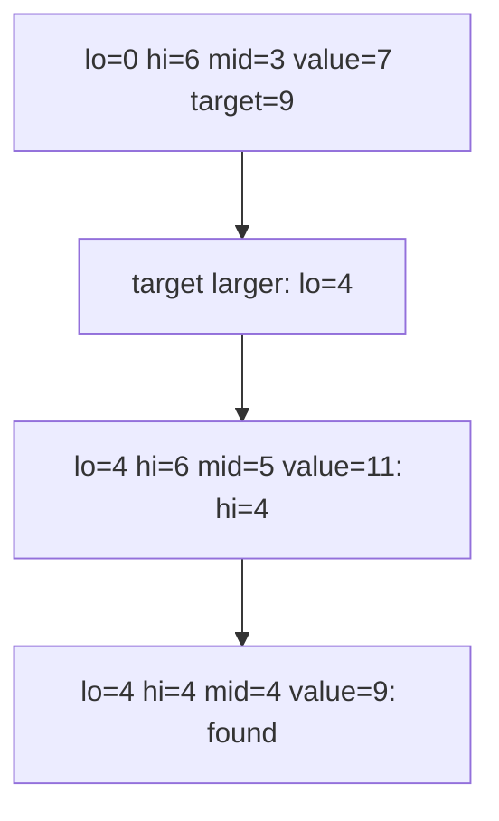

# Binary Search

> **Scope** - exact-match and boundary-search templates, binary search on the answer, rotated/matrix/median variants, exponential search, plus senior sorting/selection trade-offs and correctness discipline.

**Contents**
- [1. Core Concepts](#1-core-concepts)
- [2. Complexity Reference](#2-complexity-reference)
- [3. C# Toolbox](#3-c-toolbox)
- [4. Core Patterns / Techniques](#4-core-patterns--techniques)
- [5. Classic Problems & Solutions](#5-classic-problems--solutions)
- [6. Pattern Recognition](#6-pattern-recognition)
- [7. Interview Focus](#7-interview-focus)
- [8. Common Traps & Edge Cases](#8-common-traps--edge-cases)
- [9. Related LeetCode Problems](#9-related-leetcode-problems)
- [10. Cheat Sheet](#10-cheat-sheet)
- [See Also](#see-also)

---

## 1. Core Concepts

Binary search finds a boundary in an ordered search space: a monotonic predicate is `false...false, true...true` or the reverse. The space can be array indices, answer values, real numbers, partition points, pages in an index, or an unbounded stream after galloping to a finite range.

- **Invariant to hold at all times:** the answer, if it exists, stays inside `[lo, hi]` (closed) or `[lo, hi)` (half-open).
- **Closed interval:** `[lo, hi]`, loop `while (lo <= hi)`, discard `mid` with `lo = mid + 1` or `hi = mid - 1`. Use for exact match because equality returns and non-equality removes `mid`.
- **Half-open interval:** `[lo, hi)`, loop `while (lo < hi)`, shrink with `lo = mid + 1` or `hi = mid`. Use for boundaries because `hi = n` is a legal sentinel and termination returns an insertion point.
- **Termination:** closed search ends with `lo == hi + 1`; half-open search ends with `lo == hi`. Every branch must remove `mid` or move a boundary strictly closer.



> **Quick Note** - Think "find the false/true boundary", not just "find a value".

---

## 2. Complexity Reference

| Operation | Time | Space | Notes |
|---|---|---|---|
| Binary search, iterative | O(log n) | O(1) | halves the range; no call stack |
| Binary search, recursive | O(log n) | O(log n) | recursion depth equals number of halvings |
| Binary search on the answer | O(log(range) * cost(canDo)) | O(1) | range is answer space; endpoints must bracket the answer |
| Exponential / galloping search | O(log i), i = target position or insertion point | O(1) | double probe, then binary search inside the bound |
| Median of two sorted arrays | O(log(min(m, n))) | O(1) | binary search partition in the smaller array |
| 2D matrix, flattened | O(log(rows * cols)) | O(1) | only when rows form one globally sorted order |
| 2D matrix, staircase | O(rows + cols) | O(1) | row/column sorted only; not binary search |
| `Array.Sort` / `List<T>.Sort` | O(n log n) average and worst | O(log n) | .NET introsort; unstable |
| LINQ `OrderBy` / `ThenBy` | O(n log n) | O(n) | stable; buffers on enumeration |
| Merge sort | O(n log n) | O(n) | stable; good for linked lists/external sorting |
| Quicksort | O(n log n) average, O(n^2) worst | O(log n) average | randomize pivots or use introsort |
| Heap sort | O(n log n) | O(1) | unstable; guaranteed time without extra array |
| Quickselect | O(n) average, O(n^2) worst | O(1) | one rank only; randomized pivot expected |
| Counting sort | O(n + k) | O(n + k) | small integer key range `k`; stable if filled right-to-left |

`T(n) = T(n/2) + O(1) = Theta(log n)`. Iterative is the interview default; recursion has identical time but O(log n) stack.

---

## 3. C# Toolbox

| API | Behavior | Gotcha |
|---|---|---|
| `Array.BinarySearch(array, value)` | found index, else `~insertionPoint` | duplicates: found index is not guaranteed first |
| `List<T>.BinarySearch(value)` | same contract as array | same `~index` insertion-point convention |
| `Array.BinarySearch(array, index, length, value)` | searches `[index, index + length)` | avoids slicing |
| `BinarySearch` with `IComparer<T>` | custom ordering | comparer must match the one used for sorting |
| `Array.Sort` / `List<T>.Sort` | in-place .NET introsort | unstable; comparer must be transitive |
| `Enumerable.OrderBy(...).ThenBy(...)` | stable LINQ multi-key sort | allocates/buffers; materialize before indexing |

```csharp
int[] sorted = { 1, 3, 5, 7, 9 };
int idx = Array.BinarySearch(sorted, 6);
int insertAt = idx >= 0 ? idx : ~idx; // 3, before value 7
```

> **Common Trap** - These APIs assume the input is already sorted with the same comparer; they do not validate it.

---

## 4. Core Patterns / Techniques

### Binary Search Template Comparison

| Template | Loop | Mid | Shrink | Invariant / post-condition | Use |
|---|---|---|---|---|---|
| Exact match | `while (lo <= hi)` | floor | `< target`: `lo = mid + 1`; `> target`: `hi = mid - 1`; equal: return | target, if present, stays in closed `[lo, hi]`; miss leaves `lo == hi + 1` insertion point | any matching index or `-1` |
| Lower bound / first true | `while (lo < hi)` | floor | true: `hi = mid`; false: `lo = mid + 1` | `[0, lo)` false, `[hi, n)` true; post `lo == hi` first true or `n` | first occurrence, insertion point |
| Last true / upper-biased | `while (lo < hi)` | `lo + (hi - lo + 1) / 2` | true: `lo = mid`; false: `hi = mid - 1` | answer stays in `[lo, hi]`; post `lo == hi` last true | largest feasible value |
| Answer search | `while (lo < hi)` | floor for first feasible, upper-biased for last feasible | minimize: feasible -> `hi = mid`; maximize: feasible -> `lo = mid` | answer stays inside inclusive `[lo, hi]` | numeric answer plus monotonic feasibility |

### Exact-Match Baseline

```csharp
int BinarySearchExact(int[] nums, int target)
{
    int lo = 0, hi = nums.Length - 1; // closed [lo, hi]
    while (lo <= hi)
    {
        int mid = lo + (hi - lo) / 2;
        if (nums[mid] == target) return mid;
        if (nums[mid] < target) lo = mid + 1;
        else hi = mid - 1;
    }
    return -1;
}
```

**Invariant:** if `target` exists, at least one occurrence remains in closed `[lo, hi]`; indices `< lo` are known too small and indices `> hi` are known too large. **Post-condition:** equality returns immediately; otherwise the range is empty (`lo == hi + 1`) and `lo` is the insertion point. **Termination:** every non-equal branch discards `mid`, so the closed range strictly shrinks.

### Boundary Helpers: LowerBound and UpperBound

```csharp
int LowerBound(int[] nums, int target)
{
    int lo = 0, hi = nums.Length; // half-open [lo, hi)
    while (lo < hi)
    {
        int mid = lo + (hi - lo) / 2;
        if (nums[mid] < target) lo = mid + 1;
        else hi = mid;
    }
    return lo; // first index with nums[i] >= target, or nums.Length
}

int UpperBound(int[] nums, int target)
{
    int lo = 0, hi = nums.Length; // half-open [lo, hi)
    while (lo < hi)
    {
        int mid = lo + (hi - lo) / 2;
        if (nums[mid] <= target) lo = mid + 1;
        else hi = mid;
    }
    return lo; // first index with nums[i] > target, or nums.Length
}
```

**Invariant:** `LowerBound` keeps all indices `< lo` as `< target` and all indices `>= hi` as `>= target`; `UpperBound` keeps all indices `< lo` as `<= target` and all indices `>= hi` as `> target`. **Post-condition:** `lo == hi`, so returning `lo` is safe for empty arrays, all-equal arrays, and absent targets.

| Query | Expression |
|---|---|
| Exists | `int i = LowerBound(nums, target); i < nums.Length && nums[i] == target` |
| Count | `UpperBound(nums, target) - LowerBound(nums, target)` |
| First occurrence | `LowerBound(nums, target)` after existence check |
| Last occurrence | `UpperBound(nums, target) - 1` after existence check |
| Predecessor `< target` | `LowerBound(nums, target) - 1` |
| Successor `> target` | `UpperBound(nums, target)` |

> **Remember** - `UpperBound` here means first index greater than `target`; it is not the upper-biased last-true template.
>
> **Quick Note** - Half-open boundary search is robust because `hi = n` is a legal sentinel and the loop never reads `nums[hi]`.

### Correctness Discipline

1. **Avoid overflow:** use `mid = lo + (hi - lo) / 2`, never `(lo + hi) / 2`.
2. **Do not mix intervals:** closed `[lo, hi]` pairs with `lo <= hi` and `hi = mid - 1`; half-open `[lo, hi)` pairs with `lo < hi` and `hi = mid`.
3. **Guarantee strict shrinkage:** `lo = mid` with floor mid repeats forever when `hi == lo + 1`.
4. **Match mid bias to shrink direction:** `lo = mid` needs upper-biased `mid = lo + (hi - lo + 1) / 2`; `hi = mid` needs plain floor mid.
5. **Prove monotonicity:** binary search on the answer is valid only after you can state the one-way implication.
### Binary Search on the Answer

Recognize phrases such as **minimize the maximum**, **maximize the minimum**, capacity, speed, days, distance, threshold, or any numeric answer range plus a monotonic feasibility check.

```csharp
long MinFeasibleAnswer(long lo, long hi, Func<long, bool> canDo)
{
    // Precondition: hi is feasible and canDo is false...true over inclusive [lo, hi].
    while (lo < hi)
    {
        long mid = lo + (hi - lo) / 2;
        if (canDo(mid))
            hi = mid;       // mid works: keep it and try smaller
        else
            lo = mid + 1;   // mid fails: discard it and everything smaller
    }
    return lo; // smallest x for which canDo(x) is true
}
```

**Invariant:** the smallest feasible answer remains in inclusive `[lo, hi]`, and `hi` is always feasible. **Post-condition:** `lo == hi`, so the returned value is the first feasible boundary. **Termination:** floor `mid` plus `lo = mid + 1` / `hi = mid` strictly shrinks the interval.

```csharp
long MaxFeasibleAnswer(long lo, long hi, Func<long, bool> canDo)
{
    // Precondition: lo is feasible and canDo is true...false over inclusive [lo, hi].
    while (lo < hi)
    {
        long mid = lo + (hi - lo + 1) / 2; // upper-biased because lo may become mid
        if (canDo(mid))
            lo = mid;       // mid works: keep it and try larger
        else
            hi = mid - 1;   // mid fails: discard it and everything larger
    }
    return lo; // largest x for which canDo(x) is true
}
```

**Invariant:** the largest feasible answer remains in inclusive `[lo, hi]`, and `lo` is always feasible. **Post-condition:** `lo == hi`, so the returned value is the last feasible boundary. The upper-biased `mid` is mandatory; otherwise `lo = mid` can repeat forever when two values remain.

Examples: Koko (`speed`), shipping (`capacity`), Split Array (`maxSum`) are minimize-first-feasible; Aggressive Cows / Divide Chocolate maximize-last-feasible `gap`; smallest divisor minimizes `d`; floating-point searches use fixed iterations or epsilon.

For value-space search, the returned answer may not be an existing array element. Use `long` for endpoints and accumulators whenever ranges come from sums, products, capacities, or hours; short-circuit `canDo` once it exceeds the limit. Simulate the two-value range before trusting any custom shrink rule.

```csharp
double Sqrt(double x)
{
    if (x < 0 || double.IsNaN(x))
        throw new ArgumentOutOfRangeException(nameof(x));
    if (double.IsPositiveInfinity(x)) return double.PositiveInfinity;

    double lo = 0, hi = Math.Max(1, x);
    for (int i = 0; i < 100; i++) // fixed iterations avoid eps-related infinite loops
    {
        double mid = lo + (hi - lo) / 2;
        if (mid * mid > x) hi = mid;
        else lo = mid;
    }
    return lo;
}
```

**Invariant:** for finite non-negative `x`, `lo` is a lower approximation and `hi` is an upper approximation of `sqrt(x)`. **Post-condition:** after 100 halvings, `lo` is within double-precision error for interview inputs. **Pitfall:** the hard part is proving monotonicity and feasible endpoints; a non-monotonic predicate returns plausible garbage.

### Rotated Sorted Array

```csharp
int SearchRotated(int[] nums, int target)
{
    int lo = 0, hi = nums.Length - 1;
    while (lo <= hi)
    {
        int mid = lo + (hi - lo) / 2;
        if (nums[mid] == target) return mid;

        if (nums[lo] <= nums[mid]) // left half is sorted
        {
            if (nums[lo] <= target && target < nums[mid]) hi = mid - 1;
            else lo = mid + 1;
        }
        else // right half is sorted
        {
            if (nums[mid] < target && target <= nums[hi]) lo = mid + 1;
            else hi = mid - 1;
        }
    }
    return -1;
}
```

**Invariant:** if `target` exists in the distinct rotated array, it remains inside closed `[lo, hi]`; one of `[lo, mid]` or `[mid, hi]` is sorted, and the range check discards only a half that cannot contain `target`. **Post-condition:** return a found index, or `-1` once the range is empty.

```csharp
bool SearchRotatedWithDuplicates(int[] nums, int target)
{
    int lo = 0, hi = nums.Length - 1;
    while (lo <= hi)
    {
        int mid = lo + (hi - lo) / 2;
        if (nums[mid] == target) return true;

        if (nums[lo] == nums[mid] && nums[mid] == nums[hi])
        {
            lo++;
            hi--;
            continue;
        }

        if (nums[lo] <= nums[mid])
        {
            if (nums[lo] <= target && target < nums[mid]) hi = mid - 1;
            else lo = mid + 1;
        }
        else
        {
            if (nums[mid] < target && target <= nums[hi]) lo = mid + 1;
            else hi = mid - 1;
        }
    }
    return false;
}
```

**Post-condition:** the duplicate-safe version is correct, but `lo++` / `hi--` may remove only one value per iteration. Worst case is O(n), e.g., `[1,1,1,1,1,0,1]` searching for `0`.

```csharp
int FindMinRotated(int[] nums)
{
    if (nums.Length == 0)
        throw new ArgumentException("Array must be non-empty.", nameof(nums));

    int lo = 0, hi = nums.Length - 1;
    while (lo < hi)
    {
        int mid = lo + (hi - lo) / 2;
        if (nums[mid] > nums[hi]) lo = mid + 1; // min is strictly right of mid
        else hi = mid;                          // min is at mid or to the left
    }
    return nums[lo];
}
```

**Invariant:** the minimum element remains inside `[lo, hi]`; comparing `nums[mid]` with `nums[hi]` tells whether the pivot is to the right. **Post-condition:** `lo == hi`, pointing at the minimum. Empty input is invalid for a minimum query.

```csharp
int FindMinRotatedWithDuplicates(int[] nums)
{
    if (nums.Length == 0)
        throw new ArgumentException("Array must be non-empty.", nameof(nums));

    int lo = 0, hi = nums.Length - 1;
    while (lo < hi)
    {
        int mid = lo + (hi - lo) / 2;
        if (nums[mid] > nums[hi]) lo = mid + 1;
        else if (nums[mid] < nums[hi]) hi = mid;
        else hi--; // cannot decide; discard one duplicate copy of nums[hi]
    }
    return nums[lo];
}
```

**Complexity:** distinct variants are O(log n) time, O(1) space. Duplicate variants are O(log n) on informative inputs but O(n) worst case because equality can destroy the sorted-half signal.

### First / Last Occurrence (Boundary Search)

```csharp
int FindFirst(int[] nums, int target)
{
    int lo = 0, hi = nums.Length; // half-open [0, n)
    while (lo < hi)
    {
        int mid = lo + (hi - lo) / 2;
        if (nums[mid] < target) lo = mid + 1;
        else hi = mid;
    }
    return lo < nums.Length && nums[lo] == target ? lo : -1;
}

int FindLast(int[] nums, int target)
{
    int lo = 0, hi = nums.Length; // first index with nums[i] > target
    while (lo < hi)
    {
        int mid = lo + (hi - lo) / 2;
        if (nums[mid] <= target) lo = mid + 1;
        else hi = mid;
    }
    return lo > 0 && nums[lo - 1] == target ? lo - 1 : -1;
}
```

**Invariant:** `FindFirst` is `LowerBound(target)`; `FindLast` first computes `UpperBound(target)` without using `target + 1`, so `int.MaxValue` is safe. **Post-condition:** each helper returns a valid index only after checking equality; absent targets return `-1` for empty, one-element, and all-duplicate inputs. **Complexity:** O(log n) time, O(1) space each.

### Peak Element (Unimodal / Bitonic Search)

```csharp
int FindPeak(int[] nums)
{
    if (nums.Length == 0)
        throw new ArgumentException("Array must be non-empty.", nameof(nums));

    int lo = 0, hi = nums.Length - 1;
    while (lo < hi)
    {
        int mid = lo + (hi - lo) / 2;
        if (nums[mid] < nums[mid + 1]) lo = mid + 1; // climbing: peak is right
        else hi = mid;                                // descending or peak: keep mid/left
    }
    return lo;
}
```

**Invariant:** at least one peak exists in `[lo, hi]`; if the slope rises at `mid`, the right half contains a peak, otherwise the left half including `mid` contains one. **Post-condition:** `lo == hi`, a valid peak index. For plateaus, define peak as `>=` neighbors or handle duplicates separately; the strict LeetCode version assumes adjacent values differ.

### Search in 2D Sorted Matrix

Use flattening only when each row's first element exceeds the previous row's last.

```csharp
bool SearchMatrix(int[][] matrix, int target)
{
    if (matrix.Length == 0 || matrix[0].Length == 0) return false;

    int rows = matrix.Length, cols = matrix[0].Length;
    long lo = 0, hi = (long)rows * cols - 1;
    while (lo <= hi)
    {
        long mid = lo + (hi - lo) / 2;
        int r = (int)(mid / cols);
        int c = (int)(mid % cols);
        int val = matrix[r][c];

        if (val == target) return true;
        if (val < target) lo = mid + 1;
        else hi = mid - 1;
    }
    return false;
}
```

**Invariant:** the target, if present, is inside the remaining flat-index interval `[lo, hi]`; `r = mid / cols` and `c = mid % cols` map the 1-D index back to the rectangular matrix. **Post-condition:** return `true` on equality, otherwise the flat interval is empty.

For rows sorted and columns sorted but no row-to-row global order, use the top-right staircase:

```csharp
bool SearchMatrixStaircase(int[][] matrix, int target)
{
    if (matrix.Length == 0 || matrix[0].Length == 0) return false;

    int rows = matrix.Length, cols = matrix[0].Length;
    int r = 0, c = cols - 1;
    while (r < rows && c >= 0)
    {
        int val = matrix[r][c];
        if (val == target) return true;
        if (val > target) c--; // current column below is even larger
        else r++;              // current row to the left is even smaller
    }
    return false;
}
```

**Invariant:** the remaining candidate rectangle is rows `[r, rows)` and columns `[0, c]`; moving left discards a too-large column, moving down discards a too-small row. **Post-condition:** falling off the matrix means no candidate remains. Complexity: flattened O(log(rows * cols)); staircase O(rows + cols), both O(1) space.
### Median of Two Sorted Arrays (Partition Method)

```csharp
double FindMedianSortedArrays(int[] a, int[] b)
{
    if (a.Length > b.Length) return FindMedianSortedArrays(b, a);

    int m = a.Length, n = b.Length;
    long total = (long)m + n;
    if (total == 0)
        throw new ArgumentException("At least one array must be non-empty.");

    int lo = 0, hi = m;
    int half = (int)((total + 1) / 2);

    while (lo <= hi)
    {
        int x = lo + (hi - lo) / 2;
        int y = half - x;

        int leftA = x == 0 ? int.MinValue : a[x - 1];
        int rightA = x == m ? int.MaxValue : a[x];
        int leftB = y == 0 ? int.MinValue : b[y - 1];
        int rightB = y == n ? int.MaxValue : b[y];

        if (leftA <= rightB && leftB <= rightA)
        {
            return total % 2 == 0
                ? ((long)Math.Max(leftA, leftB) + Math.Min(rightA, rightB)) / 2.0
                : Math.Max(leftA, leftB);
        }
        else if (leftA > rightB) hi = x - 1; // x too far right
        else lo = x + 1;                     // x too far left
    }
    throw new ArgumentException("Input arrays are not sorted.");
}
```

**Invariant:** the correct partition has `x` in `[lo, hi]`; because `a` is the smaller array, `y` stays within `[0, n]`. Sentinels (`int.MinValue` / `int.MaxValue`) stand in for empty partitions and are safe even when real data equals them because comparisons are non-strict. **Post-condition:** valid partition means `max(leftA, leftB)` is the left median; for even total length, average it with `min(rightA, rightB)` using `long` addition to avoid overflow.

### Exponential / Galloping Search (Unbounded or Streaming Input)

```csharp
int ExponentialSearch(IReadOnlyList<int> arr, int target)
{
    if (arr.Count == 0) return -1;
    if (arr[0] == target) return 0;

    long bound = 1;
    while (bound < arr.Count && arr[(int)bound] < target)
        bound *= 2;

    int lo = (int)(bound / 2);
    int hi = (int)Math.Min(bound, arr.Count - 1L);
    while (lo <= hi)
    {
        int mid = lo + (hi - lo) / 2;
        if (arr[mid] == target) return mid;
        if (arr[mid] < target) lo = mid + 1;
        else hi = mid - 1;
    }
    return -1;
}
```

**Invariant:** after probing, if `target` exists, it lies in `[bound / 2, min(bound, n - 1)]`; the inner search is the closed exact-match template. **Post-condition:** found index or `-1` after the bounded interval is empty. Empty input is handled before reading `arr[0]`, and `long bound` avoids probe overflow. **Complexity:** O(log i), where `i` is the target position or insertion point.

### Sorting Algorithms - Comparison

| Algorithm | Best | Average | Worst | Space | Stable | In-place | When to use |
|---|---|---|---|---|---|---|---|
| Bubble sort | O(n) with early exit | O(n^2) | O(n^2) | O(1) | Yes | Yes | Teaching only |
| Selection sort | O(n^2) | O(n^2) | O(n^2) | O(1) | No | Yes | Minimize writes |
| Insertion sort | O(n) | O(n^2) | O(n^2) | O(1) | Yes | Yes | Tiny or nearly sorted arrays |
| Shell sort | gap-dependent | gap-dependent | O(n^2) | O(1) | No | Yes | Gap-based insertion sort |
| Merge sort | O(n log n) | O(n log n) | O(n log n) | O(n) | Yes | No | Stability, linked lists, external sort |
| Quicksort | O(n log n) | O(n log n) | O(n^2) | O(log n) avg; O(n) naive stack | No | Yes | Fast in-memory partition sort |
| Heap sort | O(n log n) | O(n log n) | O(n log n) | O(1) | No | Yes | Guaranteed bound, no extra array |
| Counting sort | O(n + k) | O(n + k) | O(n + k) | O(n + k) | Yes if filled right-to-left | No | Small integer range `k` |
| Radix sort | O(d(n + b)) | O(d(n + b)) | O(d(n + b)) | O(n + b) | Yes with stable digit sort | No | Fixed-width integers/strings |
| Bucket sort | O(n + k) | O(n + k) uniform | O(n^2) | O(n + k) | Depends | No | Roughly uniform numeric data |

Any comparison sort has an Omega(n log n) lower bound; counting/radix/bucket beat it only by exploiting key structure. Shell sort bounds depend on the gap sequence. .NET `Array.Sort` and `List<T>.Sort` use **introsort** (quicksort, heapsort fallback, insertion sort for tiny partitions) and are **unstable**; LINQ `OrderBy` / `ThenBy` is **stable** and buffers on enumeration.

| Need | Choose |
|---|---|
| General in-memory sort | `Array.Sort` / `List<T>.Sort` / introsort |
| Stable multi-key sort | `OrderBy(...).ThenBy(...)` or merge sort |
| Guaranteed O(n log n), O(1) extra array | Heap sort |
| Nearly sorted or tiny partition | Insertion sort |
| Linked list or external sort | Merge sort |
| Small integer key range | Counting sort / radix sort |
| Only the k-th element | Quickselect or heap |
| Streaming top-k | Heap of size `k` |

### Stability and Multi-Key Sorting

Stable sorting preserves equal-key order; required for multi-key sorts and FIFO ties.

```csharp
var sorted = people
    .OrderBy(p => p.LastName)
    .ThenBy(p => p.FirstName)
    .ToList();

Array.Sort(scores, (a, b) => b.CompareTo(a)); // descending, in-place, unstable
```

### Quickselect (K-th Element Without Full Sort)

```csharp
int KthSmallest(int[] nums, int k) // k is 1-based
{
    if (k < 1 || k > nums.Length)
        throw new ArgumentOutOfRangeException(nameof(k));

    int target = k - 1;
    int lo = 0, hi = nums.Length - 1;
    while (lo <= hi)
    {
        int pivot = Partition(nums, lo, hi);
        if (pivot == target) return nums[pivot];
        if (pivot < target) lo = pivot + 1;
        else hi = pivot - 1;
    }
    throw new InvalidOperationException("Partition failed.");
}

int KthLargest(int[] nums, int k) => KthSmallest(nums, nums.Length - k + 1);

int Partition(int[] a, int lo, int hi)
{
    int pivotIndex = Random.Shared.Next(lo, hi + 1);
    Swap(a, pivotIndex, hi);
    int pivotValue = a[hi], store = lo;
    for (int i = lo; i < hi; i++)
        if (a[i] <= pivotValue) Swap(a, store++, i);
    Swap(a, store, hi);
    return store;
}

void Swap(int[] a, int i, int j)
{
    if (i != j) (a[i], a[j]) = (a[j], a[i]);
}
```

| Approach | Time | Space | Notes |
|---|---|---|---|
| Sort then index | O(n log n) | O(1) to O(n) | simplest, over-sorts |
| Min-heap of size `k` | O(n log k) | O(k) | streaming-friendly |
| Quickselect | O(n) average, O(n^2) worst | O(1) | default; randomize pivot; mutates array |
| Median of medians | O(n) worst | O(log n) | theoretical follow-up |

Counting sort is only attractive when `k = max - min + 1` is near O(n); huge sparse ranges are memory traps.

---
## 5. Classic Problems & Solutions

| Problem | Template / twist | Complexity |
|---|---|---|
| 704 Binary Search | Section 4 exact-match closed interval | O(log n), O(1) |
| 35 Search Insert Position | Section 4 `LowerBound`; returned `lo` is the insertion point | O(log n), O(1) |
| 34 First and Last Position | `FindFirst` + `FindLast`; count is `last - first + 1` after existence | O(log n), O(1) |
| 33 / 81 Search in Rotated Sorted Array I/II | sorted-half check; duplicates need ambiguity shrink and can degrade | O(log n) distinct, O(n) duplicate worst |
| 153 / 154 Find Minimum in Rotated Sorted Array I/II | compare `nums[mid]` with `nums[hi]`; duplicates use `hi--` | O(log n) distinct, O(n) duplicate worst |
| 162 Find Peak Element | slope test `nums[mid] < nums[mid + 1]` | O(log n), O(1) |
| 74 / 240 Matrix Search | flatten only for global row order; otherwise staircase | O(log(mn)) or O(m + n) |
| 4 Median of Two Sorted Arrays | partition smaller array; sentinels for empty sides | O(log(min(m, n))), O(1) |
| 540 Single Element in Sorted Array | parity-aware boundary; pair starts before singleton are even | O(log n), O(1) |
| 981 Time Based Key-Value Store | per-key sorted timestamp list + upper bound by time | `set` O(1), `get` O(log k) |
| 378 Kth Smallest in Sorted Matrix | binary search value; `canDo(x)` counts elements `<= x` | O(n log valueRange), O(1) |
| 215 Kth Largest Element | quickselect or heap; avoid full sort for one rank | O(n) average quickselect |
| 912 Sort an Array | choose merge/quick/heap/counting by stability, memory, key range | see Section 4 sorting table |
| 75 Sort Colors | counting pass or Dutch national flag | O(n), O(1) |

### Capacity / Rate Family Worked Example

Koko, Ship Packages, Split Array, Smallest Divisor, Divide Chocolate, gas stations, and similar prompts all replace linear enumeration of answers with monotonic feasibility.

```csharp
int MinEatingSpeed(int[] piles, int h)
{
    long lo = 1, hi = piles.Max();
    while (lo < hi)
    {
        long speed = lo + (hi - lo) / 2;
        if (CanFinish(piles, h, speed)) hi = speed;
        else lo = speed + 1;
    }
    return (int)lo;
}

bool CanFinish(int[] piles, int h, long speed)
{
    long hours = 0;
    foreach (int pile in piles)
    {
        hours += (pile + speed - 1) / speed;
        if (hours > h) return false;
    }
    return true;
}
```

| Problem | Range | Predicate | Boundary |
|---|---|---|---|
| 875 Koko Eating Bananas | `[1, max(piles)]` | total ceil hours `<= h` | minimum speed |
| 1011 Ship Packages | `[max(weights), sum(weights)]` | greedy days needed `<= D` | minimum capacity |
| 410 Split Array Largest Sum | `[max(nums), sum(nums)]` | subarrays needed with sum cap `<= k` | minimum largest sum |
| Smallest Divisor | `[1, max(nums)]` | sum of ceil divisions `<= threshold` | minimum divisor |
| Aggressive Cows / 1231 Divide Chocolate | `[0, maxDistance]` | can place/take enough pieces with gap/sweetness | maximum minimum |
| 774 Gas Station | real-valued distance | stations needed `<= k`; fixed iterations | minimum max gap |

---

## 6. Pattern Recognition

- Sorted array or "must be O(log n)" -> exact match, boundary, rotated, peak, or matrix shape.
- "first/last/leftmost/rightmost/insertion/first bad" -> lower or upper bound, not plain exact match.
- "minimize the maximum" / "maximize the minimum" -> answer search after proving monotonicity.
- "capacity/speed/days/divisor/threshold/distance" -> numeric range plus greedy `canDo`.
- "kth across sorted structures" -> often binary search on value with a counting helper; unsorted one-rank -> quickselect or heap.
- "mountain/bitonic/peak" -> slope-based binary search.
- Sorting cues: stability, multi-key, linked list, external sort -> stable sort/merge sort; small bounded keys -> counting/radix; guaranteed O(n log n) with O(1) extra array -> heap sort.

---

## 7. Interview Focus

- Probed skill: invariants, off-by-one discipline, termination, and monotonicity proof.
- Follow-ups: duplicates, streams/no known length, integer overflow, O(1) extra space, stable vs unstable sort, full sort vs quickselect/heap.

**Proof checklist:** define the predicate, name the invariant, justify each discard, show strict shrinkage, state the post-condition, and test the two-element case. For answer search, also prove endpoint feasibility and the one-way implication (`works(x) -> works(x + 1)` for minimize, reverse for maximize).
- Scale-up: in-memory arrays are cache-friendly; disk data uses B-trees/B+trees because high fanout cuts random I/O; sharded indexes route by key range before local search, with network/consistency dominating CPU.
- Interpolation search: O(log log n) average on uniform numeric keys, O(n) worst on skewed/adversarial data.
- Do not use binary search on unsorted/non-monotonic data, tiny inputs where linear scan is clearer, or when a hash map already gives O(1) lookup.

---
## 8. Common Traps & Edge Cases

| Trap | Symptom | Fix |
|---|---|---|
| Unsorted input | wrong answer, no error | verify sortedness; library binary search will not warn |
| `mid = (lo + hi) / 2` | integer overflow | use `lo + (hi - lo) / 2` |
| `lo = mid` with floor mid | infinite loop at two elements | use upper-biased mid |
| Mixing closed and half-open conventions | skipped element or infinite loop | pair `lo <= hi` with `hi = mid - 1`, or `lo < hi` with `hi = mid` |
| Calling `UpperBound` last occurrence | one index too far right | last is `UpperBound(target) - 1` after equality check |
| `FindLast` via `target + 1` | overflow at `int.MaxValue` | search first `> target` directly |
| Boundary off-by-one | first/last wrong | test empty, one, two, all duplicates, ends, absent low/high |
| Unproven monotonic predicate | plausible wrong boundary | state false/true or true/false regions first |
| Rotated duplicates | O(n) worst case | shrink ambiguous ties with `lo++` / `hi--` and document degradation |
| Empty array / empty range | index out of range | guard before reading `nums[0]`; return or throw by semantics |
| Matrix not globally sorted | flattened search misses values | flatten only LeetCode 74 shape; use staircase for 240 shape |
| Median average with `int` addition | overflow | cast one endpoint to `long` before adding |
| Floating-point equality | non-termination | fixed iterations, usually about 100 |
| Fixed quicksort pivot | O(n^2), stack blow-up | randomize, median-of-three, 3-way partition, or introsort |
| Assuming `Array.Sort` is stable | equal keys reorder | use `OrderBy` / `ThenBy` or stable merge sort |
| Counting sort on sparse huge range | memory blow-up | require `k = max - min + 1` near O(n) |
| Full sort for one rank | O(n log n) overwork | quickselect or size-`k` heap |

---

## 9. Related LeetCode Problems

> The full tiered problem set lives in [Practice Roadmap](../DSAPatterns/Practice-Roadmap.md). The list below is the minimum set for this topic.

| # | Problem | Difficulty | Pattern |
|---|---|---|---|
| 704 | Binary Search | Easy | exact match |
| 35 | Search Insert Position | Easy | lower bound |
| 278 | First Bad Version | Easy | API first true |
| 34 | Find First and Last Position | Medium | lower + upper bound |
| 33 | Search in Rotated Sorted Array | Medium | rotated distinct |
| 81 | Search in Rotated Sorted Array II | Medium | rotated duplicates |
| 153 | Find Minimum in Rotated Sorted Array | Medium | pivot/min search |
| 162 | Find Peak Element | Medium | slope/peak |
| 74 | Search a 2D Matrix | Medium | flattened matrix |
| 875 | Koko Eating Bananas | Medium | answer search, minimize |
| 1011 | Capacity To Ship Packages Within D Days | Medium | answer search + greedy |
| 4 | Median of Two Sorted Arrays | Hard | partition search |
| 410 | Split Array Largest Sum | Hard | answer search + greedy |
| 378 | Kth Smallest Element in a Sorted Matrix | Medium | value search + count |
| 981 | Time Based Key-Value Store | Medium | timestamp upper bound |

---

## 10. Cheat Sheet

- **Overflow-safe mid:** `lo + (hi - lo) / 2`; upper-biased when using `lo = mid`: `lo + (hi - lo + 1) / 2`.
- **Exact match:** closed `[lo, hi]`, `while (lo <= hi)`, discard `mid`; miss ends with `lo == hi + 1`.
- **Lower bound:** half-open `[lo, hi)`, `hi = mid` on true, `lo = mid + 1` on false; first `>= target` or `n`.
- **Upper bound:** first `> target`; last occurrence is one less after existence check.
- **Last true / maximize:** inclusive `[lo, hi]`, upper-biased mid, feasible -> `lo = mid`, infeasible -> `hi = mid - 1`; `lo` starts feasible.
- **Answer search:** choose endpoints that contain the answer, prove monotonicity, return first feasible or last feasible.
- **Rotated search:** identify sorted half with `nums[lo] <= nums[mid]`, range-check target; duplicates can force O(n).
- **Rotated minimum:** compare `nums[mid]` with `nums[hi]`; `>` right, `<` at/left, `==` with duplicates means `hi--`.
- **C# binary search APIs:** not found returns negative; `~result` is insertion index; comparer must match sort order.
- **Median of two arrays:** partition smaller array; valid when `leftA <= rightB && leftB <= rightA`; cast to `long` before averaging.
- **2D Matrix I:** flatten with `r = mid / cols`, `c = mid % cols`; **2D Matrix II:** top-right staircase.
- **Recurrence:** `T(n) = T(n/2) + O(1) = Theta(log n)`; iterative O(1), recursive O(log n) stack.
- **Sanity tests:** empty, one, two, all duplicates, absent low/high, target at both ends.
- **Ceiling division:** `(a + b - 1) / b` for positive integers; promote sums/products/ranges to `long`.
- **Comparison-sort lower bound:** arbitrary comparison sorting cannot beat O(n log n); counting/radix/bucket need key structure.
- **Sorting selector:** `Array.Sort` / `List<T>.Sort` for unstable in-memory sort; `OrderBy` / merge sort for stability; heap sort for O(1) extra array; counting/radix for small keys.
- **Quickselect:** use for one k-th element; randomize pivot, mutation is expected, heap for streaming top-k.
- **Counting sort:** O(n + k), stable when filling output right-to-left, useful only when `k` is near O(n).
- **Large-scale search:** arrays in memory; B-trees/B+trees on disk; sharded indexes add routing/network cost.

---

## See Also

- [Arrays and Strings](../Arrays%20and%20Strings/Arrays%20and%20Strings.md) - Supplies the sorted input that binary search needs.
- [Trees](../Trees/Trees.md) - A BST is binary search expressed as a data structure.
- [Greedy](../Greedy/Greedy.md) - Feasibility predicates for binary search on the answer are usually greedy checks.
- [Heaps](../Heaps/Heaps.md) - Quickselect and heaps are alternatives for selection problems.
- [DSA Patterns](../DSAPatterns/DSAPatterns.md) - Master index for pattern selection and complexity-from-constraints.
- [Practice Roadmap](../DSAPatterns/Practice-Roadmap.md) - Tiered problem set to drill this topic.
